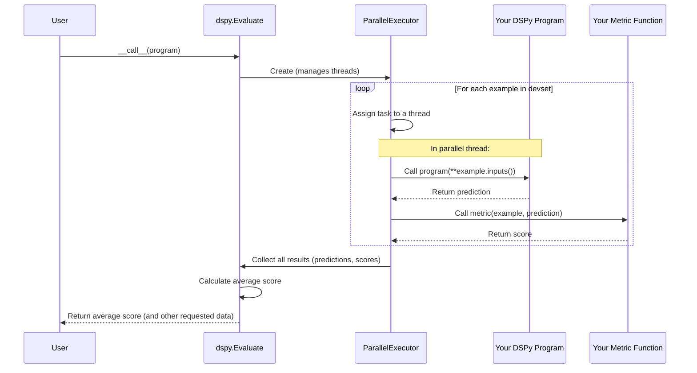

# Chapter 7: Evaluate - Grading Your Program

In the previous chapter, [Chapter 6: RM (Retrieval Model Client)](06_rm__retrieval_model_client_.md), we learned how to connect our DSPy program to external knowledge sources using Retrieval Models (RMs). We saw how combining RMs with Language Models (LMs) allows us to build sophisticated programs like Retrieval-Augmented Generation (RAG) systems.

Now that we can build these powerful programs, a crucial question arises: **How good are they?** If we build a RAG system to answer questions, how often does it get the answer right? How do we measure its performance objectively?

This is where **`dspy.Evaluate`** comes in! It's DSPy's built-in tool for testing and grading your programs.

Think of `dspy.Evaluate` as:

*   **An Automated Grader:** Like a teacher grading a batch of homework assignments based on an answer key.
*   **A Test Suite Runner:** Similar to how software developers use test suites to check if their code works correctly.
*   **Your Program's Report Card:** It gives you a score that tells you how well your DSPy program is performing on a specific set of tasks.

In this chapter, you'll learn:

*   What you need to evaluate a DSPy program.
*   How to define a metric (a grading rule).
*   How to use `dspy.Evaluate` to run the evaluation and get a score.
*   How it works behind the scenes.

Let's learn how to grade our DSPy creations!

## The Ingredients for Evaluation

To grade your program using `dspy.Evaluate`, you need three main ingredients:

1.  **Your DSPy `Program`:** The program you want to test. This could be a simple `dspy.Predict` module or a complex multi-step program like the `SimpleRAG` we sketched out in the last chapter.
2.  **A Dataset (`devset`):** A list of `dspy.Example` objects ([Chapter 3: Example](03_example.md)). Crucially, these examples must contain not only the **inputs** your program expects but also the **gold standard outputs** (the correct answers or desired results) that you want to compare against. This dataset is often called a "development set" or "dev set".
3.  **A Metric Function (`metric`):** A Python function you define. This function takes one gold standard `Example` and the `Prediction` generated by your program for that example's inputs. It then compares them and returns a score indicating how well the prediction matched the gold standard. The score is often `1.0` for a perfect match and `0.0` for a mismatch, but it can also be a fractional score (e.g., for F1 score).

`dspy.Evaluate` takes these three ingredients, runs your program on all examples in the dataset, uses your metric function to score each prediction against the gold standard, and finally reports the average score across the entire dataset.

## Evaluating a Simple Question Answering Program

Let's illustrate this with a simple example. Suppose we have a basic DSPy program that's supposed to answer simple questions.

```python
import dspy

# Assume we have configured an LM client (Chapter 5)
# gpt3_turbo = dspy.LM(model='openai/gpt-3.5-turbo')
# dspy.settings.configure(lm=gpt3_turbo)

# A simple program using dspy.Predict (Chapter 4)
class BasicQA(dspy.Module):
    def __init__(self):
        super().__init__()
        # Use a simple signature: question -> answer
        self.predictor = dspy.Predict('question -> answer')

    def forward(self, question):
        return self.predictor(question=question)

# Create an instance of our program
qa_program = BasicQA()
```

Now, let's prepare the other ingredients for evaluation.

**1. Prepare the Dataset (`devset`)**

We need a list of `dspy.Example` objects, each containing a `question` (input) and the correct `answer` (gold standard output).

```python
# Create example data points with questions and gold answers
dev_example1 = dspy.Example(question="What color is the sky?", answer="blue")
dev_example2 = dspy.Example(question="What is 2 + 2?", answer="4")
dev_example3 = dspy.Example(question="What is the capital of France?", answer="Paris")
dev_example_wrong = dspy.Example(question="Who wrote Hamlet?", answer="Shakespeare") # Let's assume our QA program might get this wrong

# Create the development set (list of examples)
devset = [dev_example1, dev_example2, dev_example3, dev_example_wrong]

# We need to tell DSPy which fields are inputs vs outputs for evaluation
# The .with_inputs() method marks the input keys.
# The remaining keys ('answer' in this case) are treated as labels.
devset = [d.with_inputs('question') for d in devset]
```
Here, we've created a small dataset `devset` with four question-answer pairs. We used `.with_inputs('question')` to mark the `question` field as the input; `dspy.Evaluate` will automatically treat the remaining field (`answer`) as the gold label to compare against.

**2. Define a Metric Function (`metric`)**

We need a function that compares the program's predicted answer to the gold answer in an example. Let's create a simple "exact match" metric.

```python
def simple_exact_match_metric(gold_example, prediction, trace=None):
    # Does the predicted 'answer' EXACTLY match the gold 'answer'?
    # '.answer' field comes from our Predict signature 'question -> answer'
    # 'gold_example.answer' is the gold label from the devset example
    return prediction.answer == gold_example.answer

# Note: DSPy often provides common metrics too, like dspy.evaluate.answer_exact_match
# import dspy.evaluate
# metric = dspy.evaluate.answer_exact_match
```
Our `simple_exact_match_metric` function takes the gold `dspy.Example` (`gold_example`) and the program's output `dspy.Prediction` (`prediction`). It returns `True` (which Python treats as `1.0`) if the predicted `answer` matches the gold `answer`, and `False` (`0.0`) otherwise. The `trace` argument is optional and can be ignored for basic metrics; it sometimes contains information about the program's execution steps.

**3. Create and Run `dspy.Evaluate`**

Now we have all the ingredients: `qa_program`, `devset`, and `simple_exact_match_metric`. Let's use `dspy.Evaluate`.

```python
from dspy.evaluate import Evaluate

# 1. Create the Evaluator instance
evaluator = Evaluate(
    devset=devset,            # The dataset to evaluate on
    metric=simple_exact_match_metric, # The function to score predictions
    num_threads=4,            # Run 4 evaluations in parallel (optional)
    display_progress=True,    # Show a progress bar (optional)
    display_table=True        # Display results in a table (optional)
)

# 2. Run the evaluation by calling the evaluator with the program
# This will run qa_program on each example in devset,
# score it using simple_exact_match_metric, and return the average score.
average_score = evaluator(qa_program)

print(f"Average Score: {average_score}%")
```

**What happens here?**

1.  We create an `Evaluate` object, providing our dataset and metric. We also request parallel execution (`num_threads=4`) for speed and ask for progress/table display.
2.  We call the `evaluator` instance with our `qa_program`.
3.  `Evaluate` iterates through `devset`:
    *   For `dev_example1`, it calls `qa_program(question="What color is the sky?")`. Let's assume the program predicts `answer="blue"`.
    *   It calls `simple_exact_match_metric(dev_example1, predicted_output)`. Since `"blue" == "blue"`, the score is `1.0`.
    *   It does the same for `dev_example2` (input: "What is 2 + 2?"). Assume prediction is `answer="4"`. Score: `1.0`.
    *   It does the same for `dev_example3` (input: "What is the capital of France?"). Assume prediction is `answer="Paris"`. Score: `1.0`.
    *   It does the same for `dev_example_wrong` (input: "Who wrote Hamlet?"). Maybe the simple LM messes up and predicts `answer="William Shakespeare"`. Since `"William Shakespeare" != "Shakespeare"`, the score is `0.0`.
4.  `Evaluate` calculates the average score: `(1.0 + 1.0 + 1.0 + 0.0) / 4 = 0.75`.
5.  It prints the average score as a percentage.

**Expected Output:**

A progress bar will be shown (if `tqdm` is installed), followed by a table like this (requires `pandas`):

```text
Average Metric: 3 / 4  (75.0%)
  question                           answer      simple_exact_match_metric
0 What color is the sky?           blue        ✔️ [True]
1 What is 2 + 2?                   4           ✔️ [True]
2 What is the capital of France?   Paris       ✔️ [True]
3 Who wrote Hamlet?                Shakespeare 
```
*(Note: The table shows the predicted answer if different, otherwise just the metric outcome. The exact table format might vary slightly).*

And finally:
```text
Average Score: 75.0%
```

This tells us our simple QA program achieved 75% accuracy on our small development set using the exact match criterion.

## Getting More Details (Optional Flags)

Sometimes, just the average score isn't enough. You might want to see the score for each individual example or the actual predictions made by the program. `Evaluate` provides flags for this:

*   `return_all_scores=True`: Returns the average score *and* a list containing the individual score for each example.
*   `return_outputs=True`: Returns the average score *and* a list of tuples, where each tuple contains `(example, prediction, score)`.

```python
# Re-run evaluation asking for more details
evaluator_detailed = Evaluate(devset=devset, metric=simple_exact_match_metric)

# Get individual scores
avg_score, individual_scores = evaluator_detailed(qa_program, return_all_scores=True)
print(f"Individual Scores: {individual_scores}") # Output: [True, True, True, False]

# Get full outputs
avg_score, outputs_list = evaluator_detailed(qa_program, return_outputs=True)
# outputs_list[0] would be roughly: (dev_example1, Prediction(answer='blue'), True)
# outputs_list[3] would be roughly: (dev_example_wrong, Prediction(answer='William Shakespeare'), False)
print(f"Number of outputs returned: {len(outputs_list)}") # Output: 4
```

These flags are useful for more detailed error analysis to understand *where* your program is failing.

## How It Works Under the Hood

What happens internally when you call `evaluator(program)`?

1.  **Initialization:** The `Evaluate` instance stores the `devset`, `metric`, `num_threads`, and other settings.
2.  **Parallel Executor:** It creates a `ParallelExecutor` (if `num_threads > 1`) to manage running the evaluations concurrently.
3.  **Iteration:** It iterates through each `example` in the `devset`.
4.  **Program Execution:** For each `example`, it calls `program(**example.inputs())` (e.g., `qa_program(question=example.question)`). This runs your DSPy program's `forward` method to get a `prediction`.
5.  **Metric Calculation:** It calls the provided `metric` function, passing it the original `example` (which contains the gold labels) and the `prediction` object returned by the program (e.g., `metric(example, prediction)`). This yields a `score`.
6.  **Error Handling:** If running the program or the metric causes an error for a specific example, `Evaluate` catches it (up to `max_errors`), records a default `failure_score` (usually 0.0), and continues with the rest of the dataset.
7.  **Aggregation:** It collects all the individual scores (including failure scores).
8.  **Calculate Average:** It computes the average score by summing all scores and dividing by the total number of examples in the `devset`.
9.  **Return Results:** It returns the average score (and optionally the individual scores or full output tuples based on the flags).

Here's a simplified sequence diagram:



**Relevant Code Files:**

*   `dspy/evaluate/evaluate.py`: Defines the `Evaluate` class.
    *   The `__init__` method stores the configuration.
    *   The `__call__` method orchestrates the evaluation: sets up the `ParallelExecutor`, defines the `process_item` function (which runs the program and metric for one example), executes it over the `devset`, aggregates results, and handles display/return logic.
*   `dspy/utils/parallelizer.py`: Contains the `ParallelExecutor` class used for running tasks concurrently across multiple threads or processes.
*   `dspy/evaluate/metrics.py`: Contains implementations of common metrics like `answer_exact_match`.

```python
# Simplified view from dspy/evaluate/evaluate.py

# ... imports ...
from dspy.utils.parallelizer import ParallelExecutor

class Evaluate:
    def __init__(self, devset, metric, num_threads=1, ..., failure_score=0.0):
        self.devset = devset
        self.metric = metric
        self.num_threads = num_threads
        self.display_progress = ...
        self.display_table = ...
        # ... store other flags ...
        self.failure_score = failure_score

    # @with_callbacks # Decorator handles optional logging/callbacks
    def __call__(self, program, metric=None, devset=None, ...):
        # Use provided args or fall back to instance attributes
        metric = metric if metric is not None else self.metric
        devset = devset if devset is not None else self.devset
        num_threads = ... # Similar logic for other args

        # Create executor for parallelism
        executor = ParallelExecutor(num_threads=num_threads, ...)

        # Define the work to be done for each example
        def process_item(example):
            try:
                # Run the program with the example's inputs
                prediction = program(**example.inputs())
                # Call the metric function with the gold example and prediction
                score = metric(example, prediction)
                return prediction, score
            except Exception as e:
                # Handle errors during program/metric execution
                # Log error, return None or failure score
                print(f"Error processing example: {e}")
                return None # Executor will handle None later

        # Execute process_item for all examples in devset using the executor
        raw_results = executor.execute(process_item, devset)

        # Process results, handle failures (replace None with failure score)
        results = []
        for i, r in enumerate(raw_results):
            example = devset[i]
            if r is None: # Execution failed for this example
                prediction, score = dspy.Prediction(), self.failure_score
            else:
                prediction, score = r
            results.append((example, prediction, score))

        # Calculate the average score
        total_score = sum(score for *_, score in results)
        num_examples = len(devset)
        average_score = round(100 * total_score / num_examples, 2) if num_examples > 0 else 0

        # Display table if requested
        if self.display_table:
             self._display_result_table(...) # Internal helper function

        # Return results based on flags (return_all_scores, return_outputs)
        # ... logic to construct return tuple ...
        return average_score # Base return value
```

The core logic involves running the program and the metric function for each data point, handling potential errors, and averaging the results, with parallel processing to speed things up.

## Conclusion

You've now learned about `dspy.Evaluate`, the standard way to measure the performance of your DSPy programs!

*   `Evaluate` acts as an **automated grader** for your DSPy modules.
*   It requires three ingredients: your **program**, a **dataset (`devset`)** with gold labels, and a **metric function** to compare predictions against labels.
*   It runs the program on the dataset, applies the metric, and reports the **average score**.
*   It supports **parallel execution** for speed and offers options to display progress, show results tables, and return detailed outputs.

Knowing how well your program performs is essential. But what if the score isn't good enough? How can we *improve* the program, perhaps by automatically finding better prompts or few-shot examples?

That's precisely what **Teleprompters** (Optimizers) are designed for! Let's dive into how DSPy can help automatically optimize your programs next.

**Next:** [Chapter 8: Teleprompter / Optimizer](08_teleprompter___optimizer.md)

---

Generated by [AI Codebase Knowledge Builder](https://github.com/The-Pocket/Tutorial-Codebase-Knowledge)