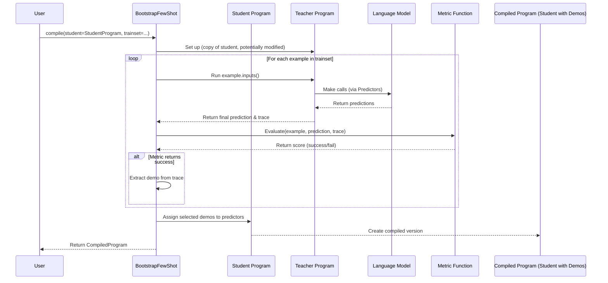

# Chapter 8: Teleprompter / Optimizer - Your Program's Coach

Welcome to Chapter 8! In [Chapter 7: Evaluate](07_evaluate.md), we learned how to grade our DSPy programs using metrics and datasets to see how well they perform. That's great for knowing our score, but what if the score isn't high enough?

Think about building our `BasicQA` program from the last chapter. Maybe we tried running it and found it only got 75% accuracy. How do we improve it?

Traditionally, we might start **manually tweaking prompts**:
*   "Maybe I should rephrase the instructions?"
*   "Should I add some examples (few-shot demonstrations)?"
*   "Which examples work best?"

This manual process, often called "prompt engineering," can be slow, tedious, and requires a lot of guesswork. Wouldn't it be amazing if DSPy could **automatically figure out the best prompts and examples** for us?

That's exactly what **Teleprompters** (also called Optimizers) do! They are DSPy's built-in automated prompt engineers and program tuners.

Think of a Teleprompter as a **coach** for your DSPy program (the 'student'):
*   The coach observes how the student performs on practice drills (a dataset).
*   It uses feedback (a metric) to figure out weaknesses.
*   It suggests new strategies (better instructions, better examples) to improve performance.
*   It repeats this until the student performs much better!

In this chapter, we'll learn:

*   What a Teleprompter is and the problem it solves.
*   The key ingredients needed to use a Teleprompter.
*   How to use a simple Teleprompter (`BootstrapFewShot`) to automatically find good few-shot examples.
*   The basic idea behind how Teleprompters optimize programs.

Let's automate the improvement process!

## What is a Teleprompter / Optimizer?

A `Teleprompter` in DSPy is an algorithm that takes your DSPy [Program](01_module___program.md) (the 'student') and automatically tunes its internal parameters to maximize performance on a given task. These parameters are most often:

1.  **Instructions:** The natural language guidance given to the Language Models ([LM](05_lm__language_model_client_.md)) within your program's modules (like `dspy.Predict`).
2.  **Few-Shot Examples (Demos):** The `dspy.Example` objects provided in prompts to show the LM how to perform the task.

Some advanced Teleprompters can even fine-tune the weights of the LM itself!

To work its magic, a Teleprompter needs three things (sound familiar? They're similar to evaluation!):

1.  **The Student Program:** The DSPy program you want to improve.
2.  **A Training Dataset (`trainset`):** A list of `dspy.Example` objects ([Chapter 3: Example](03_example.md)) representing the task. The Teleprompter will use this data to practice and learn.
3.  **A Metric Function (`metric`):** The same kind of function we used in [Chapter 7: Evaluate](07_evaluate.md). It tells the Teleprompter how well the student program is doing on each example in the `trainset`.

The Teleprompter uses the `metric` to guide its search for better instructions or demos, trying different combinations and keeping the ones that yield the highest score on the `trainset`. The output is an **optimized version of your student program**.

## Use Case: Automatically Finding Good Few-Shot Examples with `BootstrapFewShot`

Let's revisit our `BasicQA` program and the evaluation setup from Chapter 7.

```python
import dspy
from dspy.evaluate import Evaluate
# Assume LM is configured (e.g., dspy.settings.configure(lm=...))

# Our simple program
class BasicQA(dspy.Module):
    def __init__(self):
        super().__init__()
        self.predictor = dspy.Predict('question -> answer')

    def forward(self, question):
        return self.predictor(question=question)

# Our metric from Chapter 7
def simple_exact_match_metric(gold, prediction, trace=None):
    return prediction.answer.lower() == gold.answer.lower()

# Our dataset from Chapter 7 (let's use it as a trainset now)
dev_example1 = dspy.Example(question="What color is the sky?", answer="blue")
dev_example2 = dspy.Example(question="What is 2 + 2?", answer="4")
dev_example3 = dspy.Example(question="What is the capital of France?", answer="Paris")
# Example our program might struggle with initially
dev_example_hard = dspy.Example(question="Who painted the Mona Lisa?", answer="Leonardo da Vinci")

trainset = [dev_example1, dev_example2, dev_example3, dev_example_hard]
trainset = [d.with_inputs('question') for d in trainset]

# Let's evaluate the initial program (likely imperfect)
initial_program = BasicQA()
evaluator = Evaluate(devset=trainset, metric=simple_exact_match_metric, display_progress=False)
initial_score = evaluator(initial_program)
print(f"Initial Score (on trainset): {initial_score}%")
# Might output: Initial Score (on trainset): 75.0% (assuming it fails the last one)
```

Our initial program gets 75%. We could try adding few-shot examples manually, but which ones? And how many?

Let's use `dspy.teleprompt.BootstrapFewShot`. This Teleprompter automatically creates and selects few-shot demonstrations for the predictors in your program.

**1. Import the Teleprompter:**

```python
from dspy.teleprompt import BootstrapFewShot
```

**2. Instantiate the Teleprompter:**
We need to give it the `metric` function it should use to judge success. We can also specify how many candidate demos (`max_bootstrapped_demos`) it should try to find for each predictor.

```python
# Configure the BootstrapFewShot optimizer
# It will use the metric to find successful demonstrations
# max_bootstrapped_demos=4 means it will try to find up to 4 good examples for EACH predictor
config = dict(max_bootstrapped_demos=4, metric=simple_exact_match_metric)
teleprompter = BootstrapFewShot(**config)
```

**3. Compile the Program:**
This is the main step. We call the Teleprompter's `compile` method, giving it our initial `student` program and the `trainset`. It returns a *new*, optimized program.

```python
# Compile the program!
# This runs the optimization process using the trainset.
# It uses a 'teacher' model (often the student itself or a copy)
# to generate traces, finds successful ones via the metric,
# and adds them as demos to the student's predictors.
compiled_program = teleprompter.compile(student=initial_program, trainset=trainset)

# The 'compiled_program' is a new instance of BasicQA,
# but its internal predictor now has few-shot examples added!
```

**What just happened?**

Behind the scenes, `BootstrapFewShot` (conceptually):
*   Used a "teacher" program (often a copy of the student or another specified LM configuration) to run each example in the `trainset`.
*   For each example, it checked if the teacher's output was correct using our `simple_exact_match_metric`.
*   If an example was processed correctly, the Teleprompter saved the input/output pair as a potential "demonstration" (a good example).
*   It collected these successful demonstrations.
*   It assigned a selection of these good demonstrations (`max_bootstrapped_demos`) to the `demos` attribute of the corresponding predictor inside our `compiled_program`.

**4. Evaluate the Compiled Program:**
Now, let's see if the optimized program performs better on the same `trainset`.

```python
# Evaluate the compiled program
compiled_score = evaluator(compiled_program)
print(f"Compiled Score (on trainset): {compiled_score}%")

# If the optimization worked, the score should be higher!
# Might output: Compiled Score (on trainset): 100.0%
```

If `BootstrapFewShot` found good examples (like the "Mona Lisa" one after the teacher model successfully answered it), the `compiled_program` now has these examples embedded in its prompts, helping the LM perform better on similar questions. We automated the process of finding effective few-shot examples!

## How Optimization Works (Conceptual)

Different Teleprompters use different strategies, but the core idea is usually:

1.  **Goal:** Find program parameters (instructions, demos) that maximize the `metric` score on the `trainset`.
2.  **Search Space:** The "space" of all possible instructions or combinations of demos.
3.  **Search Strategy:** How the Teleprompter explores this space.
    *   `BootstrapFewShot`: Generates candidate demos based on successful teacher executions.
    *   Other optimizers (like `COPRO` or `MIPROv2` mentioned in the code snippets) might use an LM to *propose* new instructions, evaluate them, and iterate. Some use sophisticated search algorithms like Bayesian Optimization or random search.
4.  **Evaluation:** Use the `metric` and `trainset` to score each candidate configuration (e.g., a program with specific demos or instructions).
5.  **Selection:** Keep the configuration that resulted in the best score.

**Analogy Revisited:**

*   **Coach:** The Teleprompter algorithm (`BootstrapFewShot`).
*   **Student:** Your DSPy `Program` (`initial_program`).
*   **Practice Drills:** The `trainset`.
*   **Scoring:** The `metric` function (`simple_exact_match_metric`).
*   **Trying Techniques:** Generating/selecting different demos or instructions.
*   **Adopting Best Techniques:** Creating the `compiled_program` with the highest-scoring demos/instructions found.

## How It Works Under the Hood (`BootstrapFewShot` Peek)

Let's briefly look at the internal flow for `BootstrapFewShot.compile()`:

1.  **Prepare Teacher:** It sets up a 'teacher' program. This is often a copy of the student program, sometimes configured with specific settings (like a higher temperature for more exploration) or potentially using labeled examples if provided (`LabeledFewShot` within `BootstrapFewShot`).
2.  **Iterate Trainset:** It goes through each `example` in the `trainset`.
3.  **Teacher Execution:** For each `example`, it runs the `teacher` program (`teacher(**example.inputs())`). This happens within a `dspy.settings.context` block to capture the execution `trace`.
4.  **Metric Check:** It uses the provided `metric` to compare the `teacher`'s prediction against the `example`'s gold label (`metric(example, prediction, trace)`).
5.  **Collect Demos:** If the `metric` returns success (e.g., `True` or a score above a threshold), the Teleprompter extracts the input/output steps from the execution `trace`. Each successful trace step can become a candidate `dspy.Example` demonstration.
6.  **Assign Demos:** After iterating through the `trainset`, it takes the collected successful demonstrations (up to `max_bootstrapped_demos`) and assigns them to the `demos` attribute of the corresponding predictors in the `student` program instance.
7.  **Return Compiled Student:** It returns the modified `student` program, which now contains the bootstrapped few-shot examples.



**Relevant Code Files:**

*   `dspy/teleprompt/teleprompt.py`: Defines the base `Teleprompter` class.
*   `dspy/teleprompt/bootstrap.py`: Contains the implementation for `BootstrapFewShot`. Key methods include `compile` (orchestrates the process) and `_bootstrap_one_example` (handles running the teacher and checking the metric for a single training example).

```python
# Simplified view from dspy/teleprompt/bootstrap.py

# ... imports ...
from .teleprompt import Teleprompter
from .vanilla import LabeledFewShot # Used for teacher setup if labeled demos are needed
import dspy

class BootstrapFewShot(Teleprompter):
    def __init__(self, metric=None, max_bootstrapped_demos=4, ...):
        self.metric = metric
        self.max_bootstrapped_demos = max_bootstrapped_demos
        # ... other initializations ...

    def compile(self, student, *, teacher=None, trainset):
        self.trainset = trainset
        self._prepare_student_and_teacher(student, teacher) # Sets up self.student and self.teacher
        self._prepare_predictor_mappings() # Links student predictors to teacher predictors
        self._bootstrap() # Runs the core bootstrapping logic

        self.student = self._train() # Assigns collected demos to the student
        self.student._compiled = True
        return self.student

    def _bootstrap(self):
        # ... setup ...
        self.name2traces = {name: [] for name in self.name2predictor} # Store successful traces per predictor

        for example_idx, example in enumerate(tqdm.tqdm(self.trainset)):
            # ... logic to stop early if enough demos found ...
            success = self._bootstrap_one_example(example, round_idx=0) # Try to get a demo from this example
            # ... potentially multiple rounds ...

        # ... logging ...

    def _bootstrap_one_example(self, example, round_idx=0):
        # ... setup teacher context (e.g., temperature) ...
        try:
            with dspy.settings.context(trace=[], **self.teacher_settings):
                # Optionally modify teacher LM settings for exploration
                # ...
                # Run the teacher program
                prediction = self.teacher(**example.inputs())
                trace = dspy.settings.trace # Get the execution trace

                # Evaluate the prediction using the metric
                if self.metric:
                    metric_val = self.metric(example, prediction, trace)
                    # Determine success based on metric value/threshold
                    success = bool(metric_val) # Simplified
                else:
                    success = True # Assume success if no metric provided
        except Exception:
            success = False
            # ... error handling ...

        if success:
            # If successful, extract demos from the trace
            for step in trace:
                predictor, inputs, outputs = step
                demo = dspy.Example(augmented=True, **inputs, **outputs)
                try:
                    predictor_name = self.predictor2name[id(predictor)]
                    # Store the successful demo example
                    self.name2traces[predictor_name].append(demo)
                except KeyError:
                    continue # Handle potential issues finding the predictor

        return success

    def _train(self):
        # Assign the collected demos to the student's predictors
        for name, predictor in self.student.named_predictors():
            demos_for_predictor = self.name2traces[name][:self.max_bootstrapped_demos]
            # Potentially mix with labeled demos if configured
            # ...
            predictor.demos = demos_for_predictor # Assign the demos!
        return self.student

```

This simplified view shows the core loop: run the teacher, check the metric, collect successful traces as demos, and finally assign those demos to the student program.

## Conclusion

You've now learned about DSPy's **Teleprompters / Optimizers**, the powerful tools for automating prompt engineering!

*   Teleprompters act like **coaches**, automatically tuning your DSPy programs (students).
*   They optimize parameters like **instructions** and **few-shot examples (demos)**.
*   They require a **student program**, a **training dataset**, and a **metric** function.
*   We saw how `BootstrapFewShot` automatically finds effective few-shot examples by running a teacher model and collecting successful execution traces.
*   The result of `teleprompter.compile()` is an **optimized program** instance, ready to be used or evaluated further.

Teleprompters save you from the tedious process of manual tuning, allowing you to build high-performing LM-based programs more efficiently.

Now that we understand how to build, evaluate, and automatically optimize DSPy programs, how can we make them interact smoothly with different data formats or models, especially when integrating with other systems? That's where **Adapters** come in.

**Next:** [Chapter 9: Adapter](09_adapter.md)

---

Generated by [AI Codebase Knowledge Builder](https://github.com/The-Pocket/Tutorial-Codebase-Knowledge)