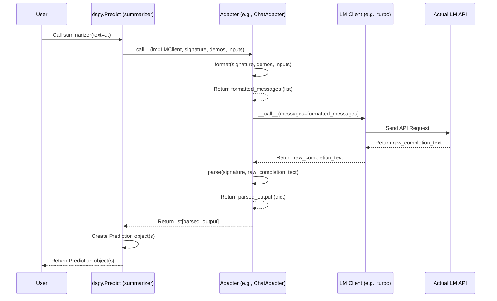

# Chapter 9: Adapter - The Universal Translator

Welcome to Chapter 9! In [Chapter 8: Teleprompter / Optimizer](08_teleprompter___optimizer.md), we saw how DSPy can automatically optimize our programs by finding better prompts or few-shot examples. We ended up with a `compiled_program` that should perform better.

Now, this optimized program needs to communicate with a Language Model ([LM](05_lm__language_model_client_.md)) to actually do its work. But here's a potential challenge: different types of LMs expect different kinds of input!
*   Older **Completion Models** (like GPT-3 `davinci`) expect a single, long text prompt.
*   Newer **Chat Models** (like GPT-4, Claude 3, Llama 3 Chat) expect a structured list of messages, each with a role (like "system", "user", or "assistant").

Our DSPy program, using its [Signature](02_signature.md), defines the task in an abstract way (inputs, outputs, instructions). How does this abstract definition get translated into the specific format required by the LM we're using, especially these modern chat models?

That's where the **`Adapter`** comes in! It acts like a universal translator.

Think of it like this:
*   Your DSPy program (using a `Signature`) has a message it wants to send to the LM.
*   The LM speaks a specific language (e.g., "chat message list" language).
*   The `Adapter` translates your program's message into the LM's language, handles the conversation, and translates the LM's reply back into a format your DSPy program understands.

In this chapter, you'll learn:

*   What problem Adapters solve.
*   What an `Adapter` does (formatting and parsing).
*   How they allow your DSPy code to work with different LMs seamlessly.
*   How they work behind the scenes (mostly automatically!).

Let's meet the translator!

## The Problem: Different LMs, Different Languages

Imagine you have a DSPy Signature for summarizing text:

```python
import dspy

class Summarize(dspy.Signature):
  """Summarize the given text."""
  text = dspy.InputField(desc="The text to summarize.")
  summary = dspy.OutputField(desc="A concise summary.")
```

And you use it in a `dspy.Predict` module:

```python
# Assume LM is configured (Chapter 5)
summarizer = dspy.Predict(Summarize)
long_text = "DSPy is a framework for programming foundation models..." # (imagine longer text)
result = summarizer(text=long_text)
# We expect result.summary to contain the summary
```

Now, if the configured LM is a **completion model**, the `summarizer` needs to create a single prompt like:

```text
Summarize the given text.

---

Follow the following format.

Text: ${text}
Summary: ${summary}

---

Text: DSPy is a framework for programming foundation models...
Summary: 
```

But if the configured LM is a **chat model**, it needs a structured list of messages, perhaps like this:

```python
[
  {"role": "system", "content": "Summarize the given text.\n\nFollow the following format.\n\nText: ${text}\nSummary: ${summary}"},
  {"role": "user", "content": "Text: DSPy is a framework for programming foundation models...\nSummary:"}
]
```
*(Simplified - actual chat formatting can be more complex)*

How does `dspy.Predict` know which format to use? And how does it extract the `summary` from the potentially differently formatted responses? It doesn't! That's the job of the **Adapter**.

## What Does an Adapter Do?

An `Adapter` is a component that sits between your DSPy module (like `dspy.Predict`) and the [LM Client](05_lm__language_model_client_.md). Its main tasks are:

1.  **Formatting:** It takes the abstract information from DSPy – the [Signature](02_signature.md) (instructions, input/output fields), any few-shot `demos` ([Example](03_example.md)), and the current `inputs` – and **formats** it into the specific structure the target LM expects (either a single string or a list of chat messages).
2.  **Parsing:** After the LM generates its response (which is usually just raw text), the `Adapter` **parses** this text to extract the values for the output fields defined in the `Signature` (like extracting the generated `summary` text).

The most common adapter is the `dspy.adapters.ChatAdapter`, which is specifically designed to translate between the DSPy format and the message list format expected by chat models.

## Why Use Adapters? Flexibility!

The main benefit of using Adapters is **flexibility**.

*   **Write Once, Run Anywhere:** Your core DSPy program logic (your `Module`s, `Program`s, and `Signature`s) remains the same regardless of whether you're using a completion LM or a chat LM.
*   **Easy Switching:** You can switch the underlying [LM Client](05_lm__language_model_client_.md) (e.g., from OpenAI GPT-3 to Anthropic Claude 3) in `dspy.settings`, and the appropriate Adapter (usually the default `ChatAdapter`) handles the communication differences automatically.
*   **Standard Interface:** Adapters ensure that modules like `dspy.Predict` have a consistent way to interact with LMs, hiding the complexities of different API formats.

## How Adapters Work: Format and Parse

Let's look conceptually at what the `ChatAdapter` does:

**1. Formatting (`format` method):**

Imagine calling our `summarizer` with one demo example:

```python
# Demo example
demo = dspy.Example(
    text="Long article about cats.",
    summary="Cats are popular pets."
).with_inputs("text")

# Call the summarizer with the demo
result = summarizer(text=long_text, demos=[demo])
```

The `ChatAdapter`'s `format` method might take the `Summarize` signature, the `demo`, and the `long_text` input and produce a list of messages like this:

```python
# Conceptual Output of ChatAdapter.format()
[
  # 1. System message from Signature instructions
  {"role": "system", "content": "Summarize the given text.\n\n---\n\nFollow the following format.\n\nText: ${text}\nSummary: ${summary}\n\n---\n\n"},

  # 2. User turn for the demo input
  {"role": "user", "content": "Text: Long article about cats.\nSummary:"},

  # 3. Assistant turn for the demo output
  {"role": "assistant", "content": "Summary: Cats are popular pets."}, # (Might use special markers like [[ ## Summary ## ]])

  # 4. User turn for the actual input
  {"role": "user", "content": "Text: DSPy is a framework for programming foundation models...\nSummary:"}
]
```
*(Note: `ChatAdapter` uses specific markers like `[[ ## field_name ## ]]` to clearly separate fields in the content, making parsing easier)*

This message list is then passed to the chat-based LM Client.

**2. Parsing (`parse` method):**

The chat LM responds, likely mimicking the format. Its response might be a string like:

```text
[[ ## summary ## ]]
DSPy helps build and optimize language model pipelines.
```

The `ChatAdapter`'s `parse` method takes this string. It looks for the markers (`[[ ## summary ## ]]`) defined by the `Summarize` signature's output fields. It extracts the content associated with each marker and returns a dictionary:

```python
# Conceptual Output of ChatAdapter.parse()
{
  "summary": "DSPy helps build and optimize language model pipelines."
}
```
This dictionary is then packaged into the `dspy.Prediction` object (as `result.summary`) that your `summarizer` module returns.

## Using Adapters (It's Often Automatic!)

The good news is that you usually don't interact with Adapters directly. Modules like `dspy.Predict` are designed to use the currently configured adapter automatically.

DSPy sets a default adapter (usually `ChatAdapter`) in its global `dspy.settings`. When you configure your [LM Client](05_lm__language_model_client_.md) like this:

```python
import dspy

# Configure LM (Chapter 5)
# turbo = dspy.LM(model='openai/gpt-3.5-turbo')
# dspy.settings.configure(lm=turbo)

# Default Adapter (ChatAdapter) is usually active automatically!
# You typically DON'T need to configure it unless you want a different one.
# dspy.settings.configure(adapter=dspy.adapters.ChatAdapter())
```

Now, when you use `dspy.Predict` or other modules that call LMs, they will internally use `dspy.settings.adapter` (the `ChatAdapter` in this case) to handle the formatting and parsing needed to talk to the configured `dspy.settings.lm` (`turbo`).

```python
# The summarizer automatically uses the configured LM and Adapter
summarizer = dspy.Predict(Summarize)
result = summarizer(text=long_text) # Adapter works its magic here!
print(result.summary)
```

You write your DSPy code at a higher level of abstraction, and the Adapter handles the translation details for you.

## How It Works Under the Hood

Let's trace the flow when `summarizer(text=long_text)` is called, assuming a chat LM and the `ChatAdapter` are configured:

1.  **`Predict.__call__`:** The `summarizer` (`dspy.Predict`) instance is called.
2.  **Get Components:** It retrieves the `Signature` (`Summarize`), `demos`, `inputs` (`text`), the configured `LM` client, and the configured `Adapter` (e.g., `ChatAdapter`) from `dspy.settings`.
3.  **`Adapter.__call__`:** `Predict` calls the `Adapter` instance, passing it the LM, signature, demos, and inputs.
4.  **`Adapter.format`:** The `Adapter`'s `__call__` method first calls its own `format` method. `ChatAdapter.format` generates the list of chat messages (system prompt, demo turns, final user turn).
5.  **`LM.__call__`:** The `Adapter`'s `__call__` method then passes the formatted messages to the `LM` client instance (e.g., `turbo(messages=...)`).
6.  **API Call:** The `LM` client sends the messages to the actual LM API (e.g., OpenAI API).
7.  **API Response:** The LM API returns the generated completion text (e.g., `[[ ## summary ## ]]\nDSPy helps...`).
8.  **`LM.__call__` Returns:** The `LM` client returns the raw completion string(s) back to the `Adapter`.
9.  **`Adapter.parse`:** The `Adapter`'s `__call__` method calls its own `parse` method with the completion string. `ChatAdapter.parse` extracts the content based on the `[[ ## ... ## ]]` markers and the `Signature`'s output fields.
10. **`Adapter.__call__` Returns:** The `Adapter` returns a list of dictionaries, each representing a parsed completion (e.g., `[{'summary': 'DSPy helps...'}]`).
11. **`Predict.__call__` Returns:** `Predict` packages these parsed dictionaries into `dspy.Prediction` objects and returns the result.

Here's a simplified sequence diagram:



**Relevant Code Files:**

*   `dspy/adapters/base.py`: Defines the abstract `Adapter` class.
    *   Requires subclasses to implement `format` and `parse`.
    *   The `__call__` method orchestrates the format -> LM call -> parse sequence.
*   `dspy/adapters/chat_adapter.py`: Defines `ChatAdapter`, the default implementation.
    *   `format`: Implements logic to create the system/user/assistant message list, using `[[ ## ... ## ]]` markers. Includes helper functions like `format_turn` and `prepare_instructions`.
    *   `parse`: Implements logic to find the `[[ ## ... ## ]]` markers in the LM's output string and extract the corresponding values.
*   `dspy/predict/predict.py`: The `Predict` module's `forward` method retrieves the adapter from `dspy.settings` and calls it.

```python
# Simplified view from dspy/adapters/base.py
from abc import ABC, abstractmethod
# ... other imports ...

class Adapter(ABC):
    # ... init ...

    # The main orchestration method
    def __call__(
        self,
        lm: "LM",
        lm_kwargs: dict[str, Any],
        signature: Type[Signature],
        demos: list[dict[str, Any]],
        inputs: dict[str, Any],
    ) -> list[dict[str, Any]]:
        # 1. Format the inputs for the LM
        #    Returns either a string or list[dict] (for chat)
        formatted_input = self.format(signature, demos, inputs)

        # Prepare arguments for the LM call
        lm_call_args = dict(prompt=formatted_input) if isinstance(formatted_input, str) else dict(messages=formatted_input)

        # 2. Call the Language Model Client
        outputs = lm(**lm_call_args, **lm_kwargs) # Returns list of strings or dicts

        # 3. Parse the LM outputs
        parsed_values = []
        for output in outputs:
            # Extract raw text (simplified)
            raw_text = output if isinstance(output, str) else output["text"]
            # Parse the raw text based on the signature
            value = self.parse(signature, raw_text)
            # Validate fields (simplified)
            # ...
            parsed_values.append(value)

        return parsed_values

    @abstractmethod
    def format(self, signature, demos, inputs) -> list[dict[str, Any]] | str:
        # Subclasses must implement this to format input for the LM
        raise NotImplementedError

    @abstractmethod
    def parse(self, signature: Type[Signature], completion: str) -> dict[str, Any]:
        # Subclasses must implement this to parse the LM's output string
        raise NotImplementedError

    # ... other helper methods (format_fields, format_turn, etc.) ...


# Simplified view from dspy/adapters/chat_adapter.py
# ... imports ...
import re

field_header_pattern = re.compile(r"\[\[ ## (\w+) ## \]\]") # Matches [[ ## field_name ## ]]

class ChatAdapter(Adapter):
    # ... init ...

    def format(self, signature, demos, inputs) -> list[dict[str, Any]]:
        messages = []
        # 1. Create system message from signature instructions
        #    (Uses helper `prepare_instructions`)
        prepared_instructions = prepare_instructions(signature)
        messages.append({"role": "system", "content": prepared_instructions})

        # 2. Format demos into user/assistant turns
        #    (Uses helper `format_turn`)
        for demo in demos:
            messages.append(self.format_turn(signature, demo, role="user"))
            messages.append(self.format_turn(signature, demo, role="assistant"))

        # 3. Format final input into a user turn
        #    (Handles chat history if present, uses `format_turn`)
        # ... logic for chat history or simple input ...
        messages.append(self.format_turn(signature, inputs, role="user"))

        # Expand image tags if needed
        messages = try_expand_image_tags(messages)
        return messages

    def parse(self, signature: Type[Signature], completion: str) -> dict[str, Any]:
        # Logic to split completion string by [[ ## field_name ## ]] markers
        # Finds matches using `field_header_pattern`
        sections = self._split_completion_by_markers(completion)

        fields = {}
        for field_name, field_content in sections:
            if field_name in signature.output_fields:
                try:
                    # Use helper `parse_value` to cast string to correct type
                    fields[field_name] = parse_value(field_content, signature.output_fields[field_name].annotation)
                except Exception as e:
                    # Handle parsing errors
                    # ...
                    pass

        # Check if all expected output fields were found
        # ...

        return fields

    # ... helper methods: format_turn, format_fields, _split_completion_by_markers ...
```

The key takeaway is that `Adapter` subclasses provide concrete implementations for `format` (DSPy -> LM format) and `parse` (LM output -> DSPy format), enabling smooth communication.

## Conclusion

You've now met the **`Adapter`**, DSPy's universal translator!

*   Adapters solve the problem of **different LMs expecting different input formats** (e.g., completion prompts vs. chat messages).
*   They act as a bridge, **formatting** DSPy's abstract [Signature](02_signature.md), demos, and inputs into the LM-specific format, and **parsing** the LM's raw output back into structured DSPy data.
*   The primary benefit is **flexibility**, allowing you to use the same DSPy program with various LM types without changing your core logic.
*   Adapters like `ChatAdapter` usually work **automatically** behind the scenes, configured via `dspy.settings`.

With Adapters handling the translation, LM Clients providing the connection, and RMs fetching knowledge, we have a powerful toolkit. But how do we manage all these configurations globally? That's the role of `dspy.settings`.

**Next:** [Chapter 10: Settings](10_settings.md)

---

Generated by [AI Codebase Knowledge Builder](https://github.com/The-Pocket/Tutorial-Codebase-Knowledge)