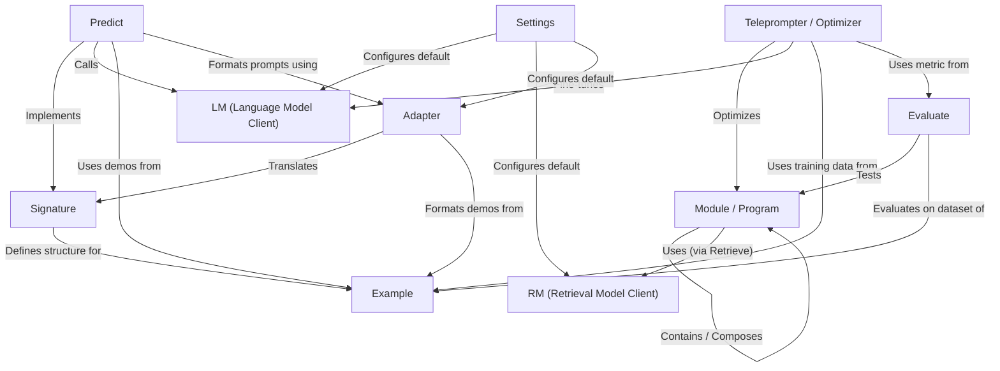

# Tutorial: DSPy

> This tutorial is AI-generated! To learn more, check out [AI Codebase Knowledge Builder](https://github.com/The-Pocket/Tutorial-Codebase-Knowledge)

DSPy[View Repo](https://github.com/stanfordnlp/dspy/tree/7cdfe988e6404289b896d946d957f17bb4d9129b/dspy) helps you build and optimize *programs* that use **Language Models (LMs)** and **Retrieval Models (RMs)**.
Think of it like composing Lego bricks (**Modules**) where each brick performs a specific task (like generating text or retrieving information).
**Signatures** define what each Module does (its inputs and outputs), and **Teleprompters** automatically tune these modules (like optimizing prompts or examples) to get the best performance on your data.

