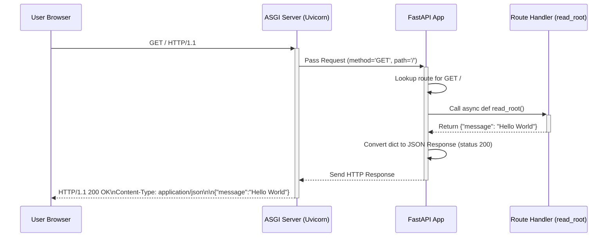

# Chapter 1: FastAPI Application & Routing

Welcome to your first adventure with FastAPI! 👋

Imagine you want to build a small website or an API (Application Programming Interface) - a way for computers to talk to each other. How do you tell your program, "When someone visits this specific web address, run this specific piece of Python code"? That's where FastAPI comes in!

**Our Goal Today:** We'll build the simplest possible web application. When you visit the main page in your web browser, it will just say "Hello, World!". This tiny example will teach us the absolute basics of FastAPI.

## What Problem Does This Solve?

Think about a big airport. There's a central control tower that manages all the planes landing and taking off. It knows which runway corresponds to which flight number.

In the world of web applications, the `FastAPI` application object is like that **control tower**. It's the central piece of your project. You need a way to tell this control tower: "Hey, if a request comes in for the main web address (`/`) using the `GET` method (which browsers use when you just visit a page), please run *this* specific Python function."

This process of connecting URLs (web addresses) and HTTP methods (like `GET`, `POST`) to your Python functions is called **Routing**. FastAPI makes this super easy and efficient.

## Your First FastAPI Application

Let's start with the absolute minimum code needed.

1.  **Create a file:** Make a file named `main.py`.
2.  **Write the code:**

```python
# main.py
from fastapi import FastAPI

# Create the main FastAPI application object
# Think of this as initializing the 'control tower'
app = FastAPI()

# Define a 'route'
# This tells FastAPI: If someone sends a GET request to '/', run the function below
@app.get("/")
async def read_root():
  # This function will be executed for requests to '/'
  # It returns a simple Python dictionary
  return {"message": "Hello World"}

```

**Explanation:**

*   `from fastapi import FastAPI`: We import the main `FastAPI` class. This class provides all the core functionality.
*   `app = FastAPI()`: We create an *instance* of the `FastAPI` class. By convention, we call this instance `app`. This `app` variable is our central control tower.
*   `@app.get("/")`: This is a Python **decorator**. It modifies the function defined right below it. Specifically, `@app.get(...)` tells FastAPI that the function `read_root` should handle incoming web requests that:
    *   Use the `GET` HTTP method. This is the most common method, used by your browser when you type a URL.
    *   Are for the path `/`. This is the "root" path, the main address of your site (like `http://www.example.com/`).
*   `async def read_root(): ...`: This is the Python function that will actually run when someone accesses `/`.
    *   `async def`: This declares an "asynchronous" function. FastAPI is built for high performance using `asyncio`. Don't worry too much about `async` right now; just know that you'll often use `async def` for your route functions.
    *   `return {"message": "Hello World"}`: The function returns a standard Python dictionary. FastAPI is smart enough to automatically convert this dictionary into JSON format, which is the standard way APIs send data over the web.

## Running Your Application

Okay, we have the code, but how do we actually *run* it so we can see "Hello, World!" in our browser? We need a web server. FastAPI applications are served by ASGI servers like **Uvicorn**.

1.  **Install necessary libraries:**
    Open your terminal or command prompt and run:
    ```bash
    pip install fastapi uvicorn[standard]
    ```
    This installs FastAPI itself and Uvicorn with helpful extras.

2.  **Run the server:**
    In the same directory where you saved `main.py`, run this command in your terminal:
    ```bash
    uvicorn main:app --reload
    ```

**Explanation of the command:**

*   `uvicorn`: This calls the Uvicorn server program.
*   `main:app`: This tells Uvicorn where to find your FastAPI application.
    *   `main`: Refers to the Python file `main.py`.
    *   `app`: Refers to the object named `app` you created inside `main.py` (`app = FastAPI()`).
*   `--reload`: This is super helpful during development! It tells Uvicorn to automatically restart your server whenever you save changes to your `main.py` file.

You should see output similar to this in your terminal:

```bash
INFO:     Uvicorn running on http://127.0.0.1:8000 (Press CTRL+C to quit)
INFO:     Started reloader process [xxxxx] using StatReload
INFO:     Started server process [xxxxx]
INFO:     Waiting for application startup.
INFO:     Application startup complete.
```

Now, open your web browser and go to `http://127.0.0.1:8000`.

**Result:** You should see this JSON response in your browser:

```json
{"message":"Hello World"}
```

Congratulations! You've just created and run your first FastAPI application! 🎉

## Organizing Your Routes with `APIRouter`

Our "Hello World" example is tiny. Real applications have many different routes (like `/users/`, `/items/`, `/orders/`, etc.). Putting *all* of them in the single `main.py` file using `@app.get(...)`, `@app.post(...)` would quickly become messy and hard to manage.

Imagine our airport analogy again. Instead of one giant control tower managing *everything*, large airports have different terminals (Terminal A for domestic flights, Terminal B for international, etc.) to organize things.

FastAPI provides `APIRouter` for this exact purpose. Think of `APIRouter` as creating a **mini-application** or a **chapter** for your routes. You can group related routes together in separate files using `APIRouter`, and then "include" these routers into your main `app`.

**Let's organize!**

1.  **Create a new file:** Let's say we want to manage routes related to "items". Create a file named `routers/items.py`. (You might need to create the `routers` directory first).

2.  **Write the router code:**

    ```python
    # routers/items.py
    from fastapi import APIRouter

    # Create an APIRouter instance
    # This is like a mini-FastAPI app for item-related routes
    router = APIRouter()

    # Define a route on the router, not the main app
    @router.get("/items/")
    async def read_items():
      # A simple example returning a list of items
      return [{"name": "Item Foo"}, {"name": "Item Bar"}]

    @router.get("/items/{item_id}")
    async def read_item(item_id: str):
      # We'll learn about path parameters like {item_id} later!
      # See [Path Operations & Parameter Declaration](02_path_operations___parameter_declaration.md)
      return {"item_id": item_id, "name": f"Item {item_id}"}
    ```

    **Explanation:**
    *   `from fastapi import APIRouter`: We import `APIRouter`.
    *   `router = APIRouter()`: We create an instance of `APIRouter`.
    *   `@router.get("/items/")`: Notice we use `@router.get` instead of `@app.get`. We are defining this route *on the router*.

3.  **Modify `main.py` to include the router:**

    ```python
    # main.py
    from fastapi import FastAPI
    from routers import items  # Import the items router

    # Create the main FastAPI application
    app = FastAPI()

    # Include the router from the items module
    # All routes defined in items.router will now be part of the main app
    app.include_router(items.router)

    # You can still define routes directly on the app if needed
    @app.get("/")
    async def read_root():
      return {"message": "Hello Main App!"}

    ```

    **Explanation:**
    *   `from routers import items`: We import the `items` module (which contains our `items.py` file).
    *   `app.include_router(items.router)`: This is the crucial line! It tells the main `app` to incorporate all the routes defined in `items.router`. Now, requests to `/items/` and `/items/{item_id}` will be handled correctly.

Now, if you run `uvicorn main:app --reload` again:

*   Visiting `http://127.0.0.1:8000/` still shows `{"message":"Hello Main App!"}`.
*   Visiting `http://127.0.0.1:8000/items/` will show `[{"name":"Item Foo"},{"name":"Item Bar"}]`.
*   Visiting `http://127.0.0.1:8000/items/abc` will show `{"item_id":"abc","name":"Item abc"}`. (We'll cover `{item_id}` properly in the [next chapter](02_path_operations___parameter_declaration.md)).

Using `APIRouter` helps keep your project organized as it grows!

## How it Works Under the Hood (Simplified)

What actually happens when you visit `http://127.0.0.1:8000/`?

1.  **Browser Request:** Your browser sends an HTTP `GET` request to the address `127.0.0.1` on port `8000`, asking for the path `/`.
2.  **Uvicorn Receives:** The Uvicorn server is listening on that address and port. It receives the raw request.
3.  **Uvicorn to FastAPI:** Uvicorn understands the ASGI standard, which is how it communicates with FastAPI. It passes the request details (method=`GET`, path=`/`, headers, etc.) to your `FastAPI` `app` instance.
4.  **FastAPI Routing:** Your `FastAPI` application (`app`) looks at its internal list of routes. This list was built when you used decorators like `@app.get("/")` or included routers like `app.include_router(items.router)`.
5.  **Match Found:** FastAPI finds a route that matches:
    *   HTTP Method: `GET`
    *   Path: `/`
    It sees that this route is connected to your `read_root` function.
6.  **Function Execution:** FastAPI calls your `async def read_root()` function.
7.  **Function Returns:** Your function runs and returns the Python dictionary `{"message": "Hello World"}`.
8.  **Response Processing:** FastAPI takes the returned dictionary. Because the route didn't specify a different response type, FastAPI automatically converts the dictionary into a JSON string. It also creates the necessary HTTP headers (like `Content-Type: application/json`).
9.  **FastAPI to Uvicorn:** FastAPI sends the complete HTTP response (status code 200 OK, headers, JSON body) back to Uvicorn.
10. **Uvicorn to Browser:** Uvicorn sends the response over the network back to your browser.
11. **Browser Displays:** Your browser receives the response, sees it's JSON, and displays it.

Here's a diagram showing the flow:



Internally, FastAPI uses (and builds upon) the routing capabilities of the Starlette framework. When you use `@app.get()` or `@router.get()`, these functions register the path, method, and your handler function into a list of `Route` objects (defined conceptually in `fastapi/routing.py` and `starlette/routing.py`). When `app.include_router()` is called, the routes from the router are added to the main app's list, often with a path prefix if specified. When a request arrives, FastAPI iterates through this list, performs pattern matching on the path, checks the method, and calls the first matching handler.

## Conclusion

You've taken your first steps into the world of FastAPI!

*   You learned that the `FastAPI` class is the core of your application, like a central control tower.
*   You saw how to define **routes** using decorators like `@app.get("/")` to connect URL paths and HTTP methods to your Python functions.
*   You wrote and ran your first simple "Hello World" API using `uvicorn`.
*   You discovered `APIRouter` as a way to organize your routes into logical groups (like chapters or terminals), making your code cleaner as your project grows.

You now have the fundamental building blocks to create web APIs. In the next chapter, we'll dive deeper into defining routes, specifically how to handle data that comes *in* the URL path itself.

Ready to learn more? Let's move on to [Chapter 2: Path Operations & Parameter Declaration](02_path_operations___parameter_declaration.md)!

---

Generated by [AI Codebase Knowledge Builder](https://github.com/The-Pocket/Tutorial-Codebase-Knowledge)