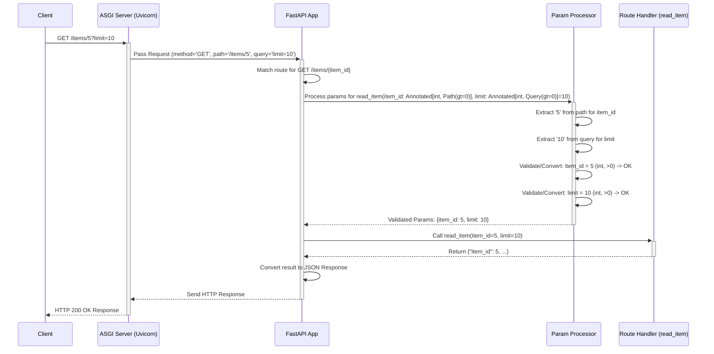

# Chapter 2: Path Operations & Parameter Declaration

Welcome back! In [Chapter 1: FastAPI Application & Routing](01_fastapi_application___routing.md), we learned how to set up a basic FastAPI application and organize our code using `APIRouter`. We saw how to connect a URL like `/` to a Python function using `@app.get("/")`.

But what if we need more information from the user? Imagine you're building an API for an online store. You don't just want a single "hello" page; you want users to be able to:

1.  Get information about a *specific* item, like `/items/5` (where 5 is the item ID).
2.  Search or filter items, like `/items/?query=socks` (search for "socks").
3.  Add a *new* item by sending its details (name, price, etc.).

How do we tell FastAPI to expect this extra information (like the item ID `5`, the search query `"socks"`, or the new item's details) and make it available inside our Python function?

That's exactly what **Path Operations** and **Parameter Declaration** are for!

**Our Goal Today:** Learn how FastAPI uses function parameters and type hints to automatically handle data coming from different parts of the web request (URL path, query string, request body) and even validate it!

## What Problem Does This Solve?

Think of your API endpoint (like `/items/`) as a specific room in a building. To get into the room or ask for something specific within it, you often need to provide information:

*   Maybe the room number is part of the address (`/items/10` - room number 10). This is like a **Path Parameter**.
*   Maybe you need to fill out a small form asking optional questions ("Any specific colour?", "Sort by price?"). This is like **Query Parameters**.
*   Maybe you need to hand over a detailed document with instructions or data (like the specs for a new item). This is like the **Request Body**.

FastAPI needs a way to understand these different types of information, extract them from the incoming request, check if they are the correct type (e.g., is the item ID *really* a number?), and give them to your Python function in a clean, easy-to-use way. It does this magic using standard Python type hints and special functions we'll learn about.

## Path Operations: More Than Just GET

In Chapter 1, we used `@app.get("/")`. The `get` part refers to the HTTP **method**. Browsers use `GET` when you simply visit a URL. But there are other common methods for different actions:

*   `GET`: Retrieve data.
*   `POST`: Create new data.
*   `PUT`: Update existing data completely.
*   `PATCH`: Partially update existing data.
*   `DELETE`: Remove data.

FastAPI provides decorators for all these: `@app.post()`, `@app.put()`, `@app.patch()`, `@app.delete()`. You use them just like `@app.get()` to link a path and an HTTP method to your function.

```python
# main.py (continuing from Chapter 1, maybe add this to routers/items.py)
from fastapi import FastAPI

app = FastAPI()

# A GET operation (read)
@app.get("/items/")
async def read_items():
    return [{"item_id": 1, "name": "Thingamajig"}]

# A POST operation (create)
@app.post("/items/")
async def create_item():
    # We'll see how to get data *into* here later
    return {"message": "Item received!"} # Placeholder

# We'll focus on GET for now, but others work similarly!
```

**Explanation:**

*   We define different functions for different *actions* on the same path (`/items/`).
*   `@app.get("/items/")` handles requests to *get* the list of items.
*   `@app.post("/items/")` handles requests to *create* a new item. FastAPI knows which function to call based on the HTTP method used in the request.

## Path Parameters: Getting Data from the URL Path

Let's say you want an endpoint to get a *single* item by its ID. The URL might look like `http://127.0.0.1:8000/items/5`. Here, `5` is the ID we want to capture.

You define this in FastAPI by putting the variable name in curly braces `{}` within the path string:

```python
# main.py or routers/items.py
from fastapi import FastAPI

app = FastAPI() # Or use your APIRouter

@app.get("/items/{item_id}")  # Path parameter defined here
async def read_item(item_id: int): # Parameter name MUST match! Type hint is key!
    # FastAPI automatically converts the 'item_id' from the path (which is a string)
    # into an integer because of the 'int' type hint.
    # It also validates if it *can* be converted to an int.
    return {"item_id": item_id, "name": f"Item {item_id} Name"}

```

**Explanation:**

*   `@app.get("/items/{item_id}")`: The `{item_id}` part tells FastAPI: "Expect some value here in the URL path, and call it `item_id`."
*   `async def read_item(item_id: int)`:
    *   We declare a function parameter named **exactly** `item_id`. FastAPI connects the path variable to this function argument.
    *   We use the Python type hint `: int`. This is crucial! FastAPI uses this to:
        1.  **Convert:** The value from the URL (`"5"`) is automatically converted to an integer (`5`).
        2.  **Validate:** If you visit `/items/foo`, FastAPI knows `"foo"` cannot be converted to an `int`, and it automatically returns a helpful error response *before* your function even runs!

**Try it:**

1.  Run `uvicorn main:app --reload`.
2.  Visit `http://127.0.0.1:8000/items/5`. You should see:
    ```json
    {"item_id":5,"name":"Item 5 Name"}
    ```
3.  Visit `http://127.0.0.1:8000/items/abc`. You should see an error like:
    ```json
    {
      "detail": [
        {
          "type": "int_parsing",
          "loc": [
            "path",
            "item_id"
          ],
          "msg": "Input should be a valid integer, unable to parse string as an integer",
          "input": "abc",
          "url": "..."
        }
      ]
    }
    ```
    See? Automatic validation!

Path parameters are *required* parts of the path. The URL simply won't match the route if that part is missing.

## Query Parameters: Optional Info After "?"

What if you want to provide optional filtering or configuration in the URL? Like getting items, but maybe skipping the first 10 and limiting the results to 5: `http://127.0.0.1:8000/items/?skip=10&limit=5`.

These `key=value` pairs after the `?` are called **Query Parameters**.

In FastAPI, you declare them as function parameters that are *not* part of the path string. You can provide default values to make them optional.

```python
# main.py or routers/items.py
from fastapi import FastAPI

app = FastAPI() # Or use your APIRouter

# A simple fake database of items
fake_items_db = [{"item_name": "Foo"}, {"item_name": "Bar"}, {"item_name": "Baz"}]

@app.get("/items/")
# 'skip' and 'limit' are NOT in the path "/items/"
# They have default values, making them optional query parameters
async def read_items(skip: int = 0, limit: int = 10):
    # FastAPI automatically gets 'skip' and 'limit' from the query string.
    # If they are not provided in the URL, it uses the defaults (0 and 10).
    # It also converts them to integers and validates them!
    return fake_items_db[skip : skip + limit]

```

**Explanation:**

*   `async def read_items(skip: int = 0, limit: int = 10)`:
    *   `skip` and `limit` are *not* mentioned in `@app.get("/items/")`. FastAPI knows they must be query parameters.
    *   They have default values (`= 0`, `= 10`). This makes them optional. If the user doesn't provide them in the URL, these defaults are used.
    *   The type hints `: int` ensure automatic conversion and validation, just like with path parameters.

**Try it:**

1.  Make sure `uvicorn` is running.
2.  Visit `http://127.0.0.1:8000/items/`. Result (uses defaults `skip=0`, `limit=10`):
    ```json
    [{"item_name":"Foo"},{"item_name":"Bar"},{"item_name":"Baz"}]
    ```
3.  Visit `http://127.0.0.1:8000/items/?skip=1&limit=1`. Result:
    ```json
    [{"item_name":"Bar"}]
    ```
4.  Visit `http://127.0.0.1:8000/items/?limit=abc`. Result: Automatic validation error because `abc` is not an integer.

You can also declare query parameters without default values. In that case, they become *required* query parameters.

```python
# Example: Required query parameter 'query_str'
@app.get("/search/")
async def search_items(query_str: str): # No default value means it's required
    return {"search_query": query_str}

# Visiting /search/ will cause an error
# Visiting /search/?query_str=hello will work
```

You can also use other types like `bool` or `float`, and even optional types like `str | None = None` (or `Optional[str] = None` in older Python).

```python
@app.get("/users/{user_id}/items")
async def read_user_items(
    user_id: int,                 # Path parameter
    show_details: bool = False,   # Optional query parameter (e.g., ?show_details=true)
    category: str | None = None # Optional query parameter (e.g., ?category=books)
):
    # ... function logic ...
    return {"user_id": user_id, "show_details": show_details, "category": category}
```

## Request Body: Sending Complex Data

Sometimes, the data you need to send is too complex for the URL path or query string (like the name, description, price, tax, and tags for a new item). For `POST`, `PUT`, and `PATCH` requests, data is usually sent in the **Request Body**, often as JSON.

FastAPI uses **Pydantic models** to define the structure of the data you expect in the request body. We'll dive deep into Pydantic in [Chapter 3: Data Validation & Serialization (Pydantic)](03_data_validation___serialization__pydantic_.md), but here's a sneak peek:

```python
# main.py or a new models.py file
from pydantic import BaseModel

# Define the structure of an Item using Pydantic
class Item(BaseModel):
    name: str
    description: str | None = None # Optional field
    price: float
    tax: float | None = None       # Optional field

# Now use it in a path operation
# main.py or routers/items.py
from fastapi import FastAPI
# Assume Item is defined as above (maybe import it)

app = FastAPI() # Or use your APIRouter

@app.post("/items/")
async def create_item(item: Item): # Declare the body parameter using the Pydantic model
    # FastAPI automatically:
    # 1. Reads the request body.
    # 2. Parses the JSON data.
    # 3. Validates the data against the 'Item' model (Are 'name' and 'price' present? Are types correct?).
    # 4. If valid, provides the data as the 'item' argument (an instance of the Item class).
    # 5. If invalid, returns an automatic validation error.
    print(f"Received item: {item.name}, Price: {item.price}")
    item_dict = item.model_dump() # Convert Pydantic model back to dict if needed
    if item.tax:
        price_with_tax = item.price + item.tax
        item_dict["price_with_tax"] = price_with_tax
    return item_dict
```

**Explanation:**

*   `class Item(BaseModel): ...`: We define a class `Item` that inherits from Pydantic's `BaseModel`. We declare the expected fields (`name`, `description`, `price`, `tax`) and their types.
*   `async def create_item(item: Item)`: We declare a *single* parameter `item` with the type hint `Item`. Because `Item` is a Pydantic model, FastAPI knows it should expect this data in the **request body** as JSON.
*   FastAPI handles all the parsing and validation. If the incoming JSON doesn't match the `Item` structure, the client gets an error. If it matches, your function receives a ready-to-use `item` object.

You typically use request bodies for `POST`, `PUT`, and `PATCH` requests. You can only declare *one* body parameter per function (though that body can contain nested structures, as defined by your Pydantic model).

## Fine-tuning Parameters with `Path`, `Query`, `Body`, etc.

Type hints are great for basic validation (like `int`, `str`, `bool`). But what if you need more specific rules?

*   The `item_id` must be greater than 0.
*   A query parameter `q` should have a maximum length of 50 characters.
*   A `description` in the request body should have a minimum length.

FastAPI provides functions like `Path`, `Query`, `Body`, `Header`, `Cookie`, and `File` (imported directly from `fastapi`) that you can use alongside type hints (using `typing.Annotated`) to add these extra validation rules and metadata.

Let's enhance our previous examples:

```python
# main.py or routers/items.py
from typing import Annotated # Use Annotated for extra metadata
from fastapi import FastAPI, Path, Query
# Assume Item Pydantic model is defined/imported

app = FastAPI() # Or use your APIRouter

# Fake DB
fake_items_db = [{"item_name": "Foo"}, {"item_name": "Bar"}, {"item_name": "Baz"}]

@app.get("/items/{item_id}")
async def read_item(
    # Use Annotated[type, Path(...)] for path parameters
    item_id: Annotated[int, Path(
        title="The ID of the item to get",
        description="The item ID must be a positive integer.",
        gt=0,  # gt = Greater Than 0
        le=1000 # le = Less Than or Equal to 1000
    )]
):
    return {"item_id": item_id, "name": f"Item {item_id} Name"}


@app.get("/items/")
async def read_items(
    # Use Annotated[type | None, Query(...)] for optional query parameters
    q: Annotated[str | None, Query(
        title="Query string",
        description="Optional query string to search items.",
        min_length=3,
        max_length=50
    )] = None, # Default value still makes it optional
    skip: Annotated[int, Query(ge=0)] = 0, # ge = Greater Than or Equal to 0
    limit: Annotated[int, Query(gt=0, le=100)] = 10
):
    results = fake_items_db[skip : skip + limit]
    if q:
        results = [item for item in results if q.lower() in item["item_name"].lower()]
    return results

# Using Body works similarly, often used inside Pydantic models (Chapter 3)
# or if you need to embed a single body parameter
@app.post("/items/")
async def create_item(item: Item): # Pydantic model handles body structure
    # Validation for item fields is defined within the Item model itself (See Chapter 3)
    # For simple body params without Pydantic, you might use:
    # importance: Annotated[int, Body(gt=0)]
    return item
```

**Explanation:**

*   **`Annotated`**: This is the standard Python way (Python 3.9+) to add extra context to type hints. FastAPI uses this to associate `Path`, `Query`, etc., with your parameters.
*   **`Path(...)`**: Used for path parameters.
    *   `title`, `description`: Add metadata that will appear in the automatic documentation (see [Chapter 4](04_openapi___automatic_docs.md)).
    *   `gt`, `ge`, `lt`, `le`: Numeric validation (greater than, greater than or equal, less than, less than or equal).
*   **`Query(...)`**: Used for query parameters.
    *   Takes similar arguments to `Path` for metadata and numeric validation.
    *   `min_length`, `max_length`: String length validation.
    *   The default value (`= None`, `= 0`, `= 10`) still determines if the parameter is optional or required.
*   **`Body(...)`**: Used for request body parameters (often implicitly handled by Pydantic models). Can add metadata or validation similar to `Query`.
*   **Others**: `Header()`, `Cookie()`, `File()` work similarly for data from request headers, cookies, or uploaded files.

Using `Path`, `Query`, etc., gives you fine-grained control over data validation and adds useful information to your API documentation automatically.

## How it Works Under the Hood (Simplified)

How does FastAPI magically connect URL parts and request data to your function arguments and validate them?

1.  **App Startup:** When you run your app, FastAPI (using Starlette's routing) inspects all the functions decorated with `@app.get`, `@app.post`, etc.
2.  **Function Signature Inspection:** For each function, FastAPI looks at its parameters (`item_id`, `skip`, `limit`, `item`, `q`).
3.  **Parameter Type Analysis:** It checks the type hints (`int`, `str`, `bool`, `Item`, `Annotated[...]`).
4.  **Location Determination:**
    *   If a parameter name matches a variable in the path string (`{item_id}`), it's a **Path Parameter**.
    *   If a parameter has a type hint that's a Pydantic model (`item: Item`), it's a **Body Parameter**.
    *   Otherwise, it's a **Query Parameter** (`skip`, `limit`, `q`).
    *   If `Annotated` is used with `Path`, `Query`, `Body`, `Header`, `Cookie`, or `File`, that explicitly defines the location and adds extra validation rules.
5.  **Request Arrives:** A request comes in (e.g., `GET /items/5?q=search`).
6.  **Routing:** Uvicorn passes the request to FastAPI. FastAPI/Starlette matches the path (`/items/5`) and method (`GET`) to the `read_item` function (or `read_items` if the path was `/items/`). Let's assume it matches `read_item` for `/items/{item_id}`.
7.  **Data Extraction:** FastAPI extracts data from the request based on the parameter definitions found in step 4:
    *   Path: Extracts `"5"` for `item_id`.
    *   Query: Extracts `"search"` for `q` (if the route was `/items/` and the function `read_items`).
    *   Body: Reads and parses JSON (if it was a POST/PUT request with a body parameter).
8.  **Validation & Conversion:** FastAPI uses the type hints and any extra rules from `Path`, `Query`, `Body` (often leveraging Pydantic internally):
    *   Converts `"5"` to the integer `5` for `item_id`. Checks `gt=0`.
    *   Converts `"search"` to a string for `q`. Checks `max_length`.
    *   Validates the JSON body against the `Item` model.
9.  **Error Handling:** If any validation or conversion fails, FastAPI *immediately* stops and sends back a 422 "Unprocessable Entity" error response with details about what went wrong. Your function is *not* called.
10. **Function Call:** If everything is valid, FastAPI calls your function (`read_item` or `read_items`) with the extracted, converted, and validated data as arguments (`read_item(item_id=5)` or `read_items(q="search", skip=0, limit=10)`).
11. **Response:** Your function runs and returns a result. FastAPI processes the result into an HTTP response.

Here's a simplified diagram for a `GET /items/5?limit=10` request:



FastAPI cleverly uses Python's type hinting system, Pydantic, and Starlette's request handling to automate the tedious tasks of parsing, validation, and documentation.

## Conclusion

You've now learned the core mechanics of defining API endpoints (Path Operations) and extracting data from requests in FastAPI!

*   You know how to use decorators like `@app.get`, `@app.post` for different HTTP methods.
*   You can define **Path Parameters** using `{}` in the path string and matching function arguments with type hints (`item_id: int`).
*   You can define **Query Parameters** using function arguments *not* in the path, making them optional with default values (`skip: int = 0`).
*   You understand the basics of receiving JSON **Request Bodies** using Pydantic models (`item: Item`).
*   You saw how to add extra validation and metadata using `Annotated` with `Path()`, `Query()`, and `Body()`.
*   You got a glimpse of how FastAPI uses type hints and these tools to automatically parse, validate, and document your API parameters.

This powerful parameter declaration system is a cornerstone of FastAPI's ease of use and robustness. In the next chapter, we'll explore Pydantic models in much more detail, unlocking even more powerful data validation and serialization capabilities for your request bodies and responses.

Ready to master data shapes? Let's move on to [Chapter 3: Data Validation & Serialization (Pydantic)](03_data_validation___serialization__pydantic_.md)!

---

Generated by [AI Codebase Knowledge Builder](https://github.com/The-Pocket/Tutorial-Codebase-Knowledge)