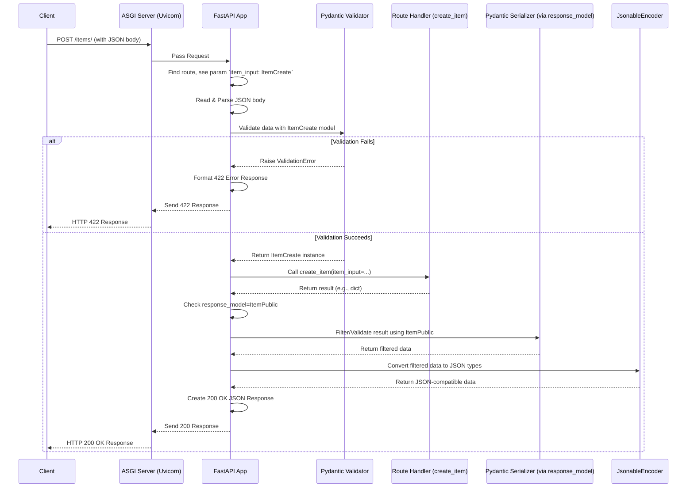

# Chapter 3: Data Validation & Serialization (Pydantic)

Welcome back! In [Chapter 2: Path Operations & Parameter Declaration](02_path_operations___parameter_declaration.md), we learned how FastAPI uses type hints to understand path parameters (like `/items/{item_id}`) and query parameters (like `/?skip=0&limit=10`). We even saw a sneak peek of how Pydantic models can define the structure of a JSON request body.

Now, let's dive deep into that magic! How does FastAPI *really* handle complex data coming into your API and the data you send back?

**Our Goal Today:** Understand how FastAPI uses the powerful **Pydantic** library to automatically validate incoming data (making sure it's correct) and serialize outgoing data (converting it to JSON).

## What Problem Does This Solve?

Imagine you're building the API for an online store, specifically the part where a user can add a new product. They need to send you information like the product's name, price, and maybe an optional description. This information usually comes as JSON in the request body.

You need to make sure:

1.  **The data arrived:** Did the user actually send the product details?
2.  **It has the right shape:** Does the JSON contain a `name` and a `price`? Is the `description` there, or is it okay if it's missing?
3.  **It has the right types:** Is the `name` a string? Is the `price` a number (like a float or decimal)?
4.  **It meets certain rules (optional):** Maybe the price must be positive? Maybe the name can't be empty?

Doing these checks manually for every API endpoint would be tedious and error-prone.

Similarly, when you send data *back* (like the details of the newly created product), you need to convert your internal Python objects (like dictionaries or custom class instances) into standard JSON that the user's browser or application can understand. You might also want to control *which* information gets sent back (e.g., maybe hide internal cost fields).

**FastAPI solves both problems using Pydantic:**

*   **Validation (Gatekeeper):** Pydantic models act like strict blueprints or forms. You define the expected structure and types of incoming data using a Pydantic model. FastAPI uses this model to automatically parse the incoming JSON, check if it matches the blueprint (validate it), and provide you with a clean Python object. If the data doesn't match, FastAPI automatically sends back a clear error message saying exactly what's wrong. Think of it as a meticulous gatekeeper checking IDs and forms at the entrance.
*   **Serialization (Translator):** When you return data from your API function, FastAPI can use a Pydantic model (specified as a `response_model`) or its built-in `jsonable_encoder` to convert your Python objects (Pydantic models, database objects, dictionaries, etc.) into JSON format. Think of it as a helpful translator converting your application's internal language into the common language of JSON for the outside world.

## Your First Pydantic Model

Pydantic models are simply Python classes that inherit from `pydantic.BaseModel`. You define the "fields" of your data as class attributes with type hints.

Let's define a model for our product item:

1.  **Create a file (optional but good practice):** You could put this in a file like `models.py`.
2.  **Write the model:**

```python
# models.py (or within your main.py/routers/items.py)
from pydantic import BaseModel

class Item(BaseModel):
    name: str
    description: str | None = None  # Optional field with a default of None
    price: float
    tax: float | None = None        # Optional field with a default of None
```

**Explanation:**

*   `from pydantic import BaseModel`: We import the necessary `BaseModel` from Pydantic.
*   `class Item(BaseModel):`: We define our model class `Item`, inheriting from `BaseModel`.
*   `name: str`: We declare a field named `name`. The type hint `: str` tells Pydantic that this field is **required** and must be a string.
*   `description: str | None = None`:
    *   `str | None`: This type hint (using the pipe `|` operator for Union) means `description` can be either a string OR `None`.
    *   `= None`: This sets the **default value** to `None`. Because it has a default value, this field is **optional**. If the incoming data doesn't include `description`, Pydantic will automatically set it to `None`.
*   `price: float`: A required field that must be a floating-point number.
*   `tax: float | None = None`: An optional field that can be a float or `None`, defaulting to `None`.

This simple class definition now acts as our data blueprint!

## Using Pydantic for Request Body Validation

Now, let's use this `Item` model in a `POST` request to create a new item. We saw this briefly in Chapter 2.

```python
# main.py (or routers/items.py)
from fastapi import FastAPI
# Assume 'Item' model is defined above or imported: from models import Item

app = FastAPI() # Or use your APIRouter

@app.post("/items/")
# Declare 'item' parameter with type hint 'Item'
async def create_item(item: Item):
    # If the code reaches here, FastAPI + Pydantic already did:
    # 1. Read the request body (as JSON bytes).
    # 2. Parsed the JSON into a Python dict.
    # 3. Validated the dict against the 'Item' model.
    #    - Checked required fields ('name', 'price').
    #    - Checked types (name is str, price is float, etc.).
    #    - Assigned default values for optional fields if missing.
    # 4. Created an 'Item' instance from the valid data.

    # 'item' is now a Pydantic 'Item' object with validated data!
    print(f"Received item name: {item.name}")
    print(f"Received item price: {item.price}")
    if item.description:
        print(f"Received item description: {item.description}")
    if item.tax:
        print(f"Received item tax: {item.tax}")

    # You can easily convert the Pydantic model back to a dict if needed
    item_dict = item.model_dump() # Pydantic v2 method

    # ... here you would typically save the item to a database ...

    # Return the created item's data
    return item_dict
```

**Explanation:**

*   `async def create_item(item: Item)`: By declaring the function parameter `item` with the type hint `Item` (our Pydantic model), FastAPI automatically knows it should:
    *   Expect JSON in the request body.
    *   Validate that JSON against the `Item` model.
*   **Automatic Validation:** If the client sends JSON like `{"name": "Thingamajig", "price": 49.99}`, FastAPI/Pydantic validates it, creates an `Item` object (`item`), and passes it to your function. Inside your function, `item.name` will be `"Thingamajig"`, `item.price` will be `49.99`, and `item.description` and `item.tax` will be `None` (their defaults).
*   **Automatic Errors:** If the client sends invalid JSON, like `{"name": "Gadget"}` (missing `price`) or `{"name": "Gizmo", "price": "expensive"}` (`price` is not a float), FastAPI will **not** call your `create_item` function. Instead, it will automatically send back a `422 Unprocessable Entity` HTTP error response with a detailed JSON body explaining the validation errors.

**Example 422 Error Response (if `price` was missing):**

```json
{
  "detail": [
    {
      "type": "missing",
      "loc": [
        "body",
        "price"
      ],
      "msg": "Field required",
      "input": { // The invalid data received
        "name": "Gadget"
      },
      "url": "..." // Pydantic v2 URL to error details
    }
  ]
}
```

This automatic validation saves you a *ton* of boilerplate code and provides clear feedback to API consumers.

## Using Pydantic for Response Serialization (`response_model`)

We just saw how Pydantic validates *incoming* data. It's also incredibly useful for shaping *outgoing* data.

Let's say when we create an item, we want to return the item's data, but maybe we have some internal fields in our Pydantic model that we *don't* want to expose in the API response. Or, we just want to be absolutely sure the response *always* conforms to the `Item` structure.

We can use the `response_model` parameter in the path operation decorator:

```python
# main.py (or routers/items.py, modified version)
from fastapi import FastAPI
from pydantic import BaseModel # Assuming Item is defined here or imported

# Let's add an internal field to our model for demonstration
class Item(BaseModel):
    name: str
    description: str | None = None
    price: float
    tax: float | None = None
    internal_cost: float = 0.0 # Field we DON'T want in the response

app = FastAPI() # Or use your APIRouter

# Add response_model=Item to the decorator
@app.post("/items/", response_model=Item)
async def create_item(item: Item):
    # item is the validated input Item object
    print(f"Processing item: {item.name} with internal cost {item.internal_cost}")

    # ... save item to database ...

    # Let's imagine we return the same item object we received
    # (in reality, you might return an object fetched from the DB)
    return item # FastAPI will handle serialization based on response_model
```

**Explanation:**

*   `@app.post("/items/", response_model=Item)`: By adding `response_model=Item`, we tell FastAPI:
    1.  **Filter:** Whatever data is returned by the `create_item` function, filter it so that only the fields defined in the `Item` model (`name`, `description`, `price`, `tax`, `internal_cost`) are included in the final JSON response. **Wait!** Actually, Pydantic V2 by default includes all fields from the returned object *that are also in the response model*. In this case, since we return `item` which *is* an `Item` instance, all fields (`name`, `description`, `price`, `tax`, `internal_cost`) would be included *if* the returned object *was* an `Item` instance. *Correction:* Let's refine the example to show filtering. Let's define a *different* response model.

```python
# models.py
from pydantic import BaseModel

# Input model (can include internal fields)
class ItemCreate(BaseModel):
    name: str
    description: str | None = None
    price: float
    tax: float | None = None
    internal_cost: float # Required input, but we won't return it

# Output model (defines what the client sees)
class ItemPublic(BaseModel):
    name: str
    description: str | None = None
    price: float
    tax: float | None = None
    # Note: internal_cost is NOT defined here

# ---- In main.py or routers/items.py ----
from fastapi import FastAPI
from models import ItemCreate, ItemPublic # Import both models

app = FastAPI()

items_db = [] # Simple in-memory "database"

@app.post("/items/", response_model=ItemPublic) # Use ItemPublic for response
async def create_item(item_input: ItemCreate): # Use ItemCreate for input
    print(f"Received internal cost: {item_input.internal_cost}")

    # Convert input model to a dict (or create DB model instance)
    item_data = item_input.model_dump()

    # Simulate saving to DB and getting back the saved data
    # In a real app, the DB might assign an ID, etc.
    saved_item_data = item_data.copy()
    saved_item_data["id"] = len(items_db) + 1 # Add a simulated ID
    items_db.append(saved_item_data)

    # Return the *dictionary* of saved data. FastAPI will use response_model
    # ItemPublic to filter and serialize this dictionary.
    return saved_item_data
```

**Explanation (Revised):**

*   `ItemCreate`: Defines the structure we expect for *creating* an item, including `internal_cost`.
*   `ItemPublic`: Defines the structure we want to *return* to the client, notably *excluding* `internal_cost`.
*   `create_item(item_input: ItemCreate)`: We accept the full `ItemCreate` model as input.
*   `@app.post("/items/", response_model=ItemPublic)`: We declare that the response should conform to the `ItemPublic` model.
*   `return saved_item_data`: We return a Python dictionary containing all fields (including `internal_cost` and the simulated `id`).
*   **Automatic Filtering & Serialization:** FastAPI takes the returned dictionary (`saved_item_data`). Because `response_model=ItemPublic` is set, it does the following *before* sending the response:
    1.  It looks at the fields defined in `ItemPublic` (`name`, `description`, `price`, `tax`).
    2.  It takes only those fields from the `saved_item_data` dictionary. The `internal_cost` and `id` fields are automatically dropped because they are not in `ItemPublic`.
    3.  It ensures the values for the included fields match the types expected by `ItemPublic` (this also provides some output validation).
    4.  It converts the resulting filtered data into a JSON string using `jsonable_encoder` internally.

**Example Interaction:**

1.  **Client sends `POST /items/` with body:**
    ```json
    {
      "name": "Super Gadget",
      "price": 120.50,
      "internal_cost": 55.25,
      "description": "The best gadget ever!"
    }
    ```
2.  **FastAPI:** Validates this against `ItemCreate` (Success).
3.  **`create_item` function:** Runs, prints `internal_cost`, prepares `saved_item_data` dictionary.
4.  **FastAPI (Response processing):** Takes the returned dictionary, filters it using `ItemPublic`.
5.  **Client receives `200 OK` with body:**
    ```json
    {
      "name": "Super Gadget",
      "description": "The best gadget ever!",
      "price": 120.50,
      "tax": null
    }
    ```
    Notice `internal_cost` and `id` are gone!

The `response_model` gives you precise control over your API's output contract, enhancing security and clarity.

## How it Works Under the Hood (Simplified)

Let's trace the journey of a `POST /items/` request using our `ItemCreate` input model and `ItemPublic` response model.

1.  **Request In:** Client sends `POST /items/` with JSON body to the Uvicorn server.
2.  **FastAPI Routing:** Uvicorn passes the request to FastAPI. FastAPI matches the path and method to our `create_item` function.
3.  **Parameter Analysis:** FastAPI inspects `create_item(item_input: ItemCreate)`. It sees `item_input` is type-hinted with a Pydantic model (`ItemCreate`), so it knows to look for the data in the request body.
4.  **Body Reading & Parsing:** FastAPI reads the raw bytes from the request body and attempts to parse them as JSON into a Python dictionary. If JSON parsing fails, an error is returned.
5.  **Pydantic Validation:** FastAPI passes the parsed dictionary to Pydantic, essentially calling `ItemCreate.model_validate(parsed_dict)`.
    *   **Success:** Pydantic checks types, required fields, etc. If valid, it returns a populated `ItemCreate` instance.
    *   **Failure:** Pydantic raises a `ValidationError`. FastAPI catches this.
6.  **Error Handling (if validation failed):** FastAPI converts the Pydantic `ValidationError` into a user-friendly JSON response (status code 422) and sends it back immediately. The `create_item` function is *never called*.
7.  **Function Execution (if validation succeeded):** FastAPI calls `create_item(item_input=<ItemCreate instance>)`. Your function logic runs.
8.  **Return Value:** Your function returns a value (e.g., the `saved_item_data` dictionary).
9.  **Response Model Processing:** FastAPI sees `response_model=ItemPublic` in the decorator.
10. **Filtering/Validation:** FastAPI uses the `ItemPublic` model to filter the returned dictionary (`saved_item_data`), keeping only fields defined in `ItemPublic`. It may also perform type coercion/validation based on `ItemPublic`.
11. **Serialization (`jsonable_encoder`):** FastAPI passes the filtered data to `jsonable_encoder`. This function recursively walks through the data, converting Pydantic models, `datetime` objects, `UUID`s, Decimals, etc., into basic JSON-compatible types (strings, numbers, booleans, lists, dicts, null).
12. **Response Out:** FastAPI creates the final HTTP response with the correct status code, headers (`Content-Type: application/json`), and the JSON string body. Uvicorn sends this back to the client.

Here's a diagram summarizing the flow:



## Internal Code Connections

While FastAPI hides the complexity, here's roughly where things happen:

*   **Model Definition:** You use `pydantic.BaseModel`.
*   **Parameter Analysis:** FastAPI's `fastapi.dependencies.utils.analyze_param` identifies parameters type-hinted with Pydantic models as potential body parameters.
*   **Request Body Handling:** `fastapi.dependencies.utils.request_body_to_args` coordinates reading, parsing, and validation (using Pydantic's validation methods internally, like `model_validate` in v2).
*   **Validation Errors:** Pydantic raises `pydantic.ValidationError`, which FastAPI catches and handles using default exception handlers (see `fastapi.exception_handlers`) to create the 422 response.
*   **Response Serialization:** The `fastapi.routing.APIRoute` class handles the `response_model`. If present, it uses it to process the return value before passing it to `fastapi.encoders.jsonable_encoder`.
*   **JSON Conversion:** `fastapi.encoders.jsonable_encoder` is the workhorse that converts various Python types into JSON-compatible formats. It knows how to handle Pydantic models (calling their `.model_dump(mode='json')` method in v2), datetimes, UUIDs, etc.

## Conclusion

You've unlocked one of FastAPI's superpowers: seamless data validation and serialization powered by Pydantic!

*   You learned to define data shapes using **Pydantic models** (`BaseModel`).
*   You saw how FastAPI **automatically validates** incoming request bodies against these models using simple type hints in your function parameters (`item: Item`).
*   You learned how to use the `response_model` parameter in path operation decorators to **filter and serialize** outgoing data, ensuring your API responses have a consistent and predictable structure.
*   You understood the basic flow: FastAPI acts as the orchestrator, using Pydantic as the expert validator and `jsonable_encoder` as the expert translator.

This automatic handling drastically reduces boilerplate code, prevents common errors, and makes your API development faster and more robust.

But there's another huge benefit to defining your data with Pydantic models: FastAPI uses them to generate interactive API documentation automatically! Let's see how that works in the next chapter.

Ready to see your API document itself? Let's move on to [Chapter 4: OpenAPI & Automatic Docs](04_openapi___automatic_docs.md)!

---

Generated by [AI Codebase Knowledge Builder](https://github.com/The-Pocket/Tutorial-Codebase-Knowledge)
