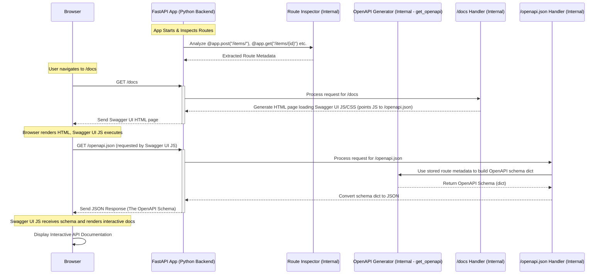

# Chapter 4: OpenAPI & Automatic Docs

Welcome back! In [Chapter 3: Data Validation & Serialization (Pydantic)](03_data_validation___serialization__pydantic_.md), we saw how FastAPI uses Pydantic models to automatically validate incoming data and serialize outgoing data, making our API robust and predictable. But how do we tell others (or remind ourselves later) how to actually *use* our API? What endpoints exist? What data should they send? What will they get back?

**Our Goal Today:** Discover how FastAPI automatically generates API documentation that is interactive and always stays synchronized with your code, using the OpenAPI standard.

## What Problem Does This Solve?

Imagine you've built an amazing, complex machine – maybe a fantastic coffee maker. You know exactly how it works, which buttons to press, and where to put the beans and water. But if someone else wants to use it, or even if you forget some details after a few months, you need a **user manual**.

An API is similar. It's a way for different software components (like a web frontend and a backend server, or two different backend services) to communicate. Without a clear "manual", it's hard for developers to know:

*   What specific URLs (paths) are available? (`/items/`, `/users/{user_id}`)
*   What HTTP methods can be used for each path? (`GET`, `POST`, `DELETE`)
*   What data needs to be sent in the URL path or query string? (`item_id`, `?q=search`)
*   What data needs to be sent in the request body (often as JSON)? (`{"name": "...", "price": ...}`)
*   What does the data returned by the API look like?
*   How does security work?

Manually writing and updating this documentation is a chore. It's easy to make mistakes, and even easier for the documentation to become outdated as the code changes. This leads to confusion, errors, and wasted time.

FastAPI solves this beautifully by automatically generating this "manual" based directly on your Python code. It uses an industry standard called **OpenAPI**.

## Key Concepts

### 1. OpenAPI Specification

*   **What it is:** OpenAPI (formerly known as Swagger Specification) is a standard, language-agnostic way to describe RESTful APIs. Think of it as a universal blueprint for APIs.
*   **Format:** It's usually written in JSON or YAML format. This format is machine-readable, meaning tools can automatically process it.
*   **Content:** An OpenAPI document details everything about your API: available paths, allowed operations (GET, POST, etc.) on those paths, expected parameters (path, query, header, cookie, body), data formats (using JSON Schema, which Pydantic models map to), security requirements, and more.

FastAPI automatically generates this OpenAPI schema for your entire application.

### 2. Automatic Generation: From Code to Docs

How does FastAPI create this OpenAPI schema? It intelligently inspects your code:

*   **Paths and Methods:** It looks at your path operation decorators like `@app.get("/items/")`, `@app.post("/items/")`, `@app.get("/users/{user_id}")`.
*   **Parameters:** It examines your function parameters, their type hints (`item_id: int`, `q: str | None = None`), and any extra information provided using `Path()`, `Query()` as seen in [Chapter 2: Path Operations & Parameter Declaration](02_path_operations___parameter_declaration.md).
*   **Request Bodies:** It uses the Pydantic models you declare as type hints for request body parameters (`item: Item`) from [Chapter 3: Data Validation & Serialization (Pydantic)](03_data_validation___serialization__pydantic_.md).
*   **Responses:** It uses the `response_model` you define in decorators and the status codes to describe possible responses.
*   **Metadata:** It reads docstrings from your functions and metadata like `title`, `description`, `tags`, `summary`, `deprecated` that you add to your path operations or parameters.

Because the documentation is generated *from* the code, it stays **synchronized**. If you change a parameter type or add a new endpoint, the documentation updates automatically the next time you run the app!

### 3. Interactive API Documentation UIs

Having the OpenAPI schema (the blueprint) is great, but it's just a JSON file. FastAPI goes a step further and provides two beautiful, interactive web interfaces *out-of-the-box* that use this schema:

*   **Swagger UI (at `/docs`):** This interface provides a rich, interactive environment where you can:
    *   Browse all your API endpoints, grouped by tags.
    *   See details for each endpoint: description, parameters, request body structure, possible responses.
    *   **Try it out!** You can directly make API calls from your browser, fill in parameters, and see the actual responses. This is incredibly useful for testing and debugging.

*   **ReDoc (at `/redoc`):** This provides an alternative documentation view, often considered cleaner for pure documentation reading, presenting a three-panel layout with navigation, documentation, and code samples. It's less focused on interactive "try it out" functionality compared to Swagger UI but excellent for understanding the API structure.

## Using the Automatic Docs

The best part? You barely have to do anything to get basic documentation! Let's use a simple example building on previous chapters.

```python
# main.py
from fastapi import FastAPI, Path, Query
from pydantic import BaseModel
from typing import Annotated

# Define a Pydantic model (like in Chapter 3)
class Item(BaseModel):
    name: str
    description: str | None = None
    price: float
    tax: float | None = None

app = FastAPI(
    title="My Super API",
    description="This is a very fancy API built with FastAPI",
    version="1.0.0",
)

# Simple in-memory storage
fake_items_db = {}

@app.post("/items/", response_model=Item, tags=["Items"])
async def create_item(item: Item):
    """
    Create a new item and store it.

    - **name**: Each item must have a name.
    - **description**: A long description.
    - **price**: Price must be positive.
    """
    item_id = len(fake_items_db) + 1
    fake_items_db[item_id] = item
    return item # Return the created item

@app.get("/items/{item_id}", response_model=Item, tags=["Items"])
async def read_item(
    item_id: Annotated[int, Path(
        title="The ID of the item to get",
        description="The ID of the item you want to retrieve.",
        gt=0
    )]
):
    """
    Retrieve a single item by its ID.
    """
    if item_id not in fake_items_db:
        # We'll cover proper error handling in Chapter 6
        from fastapi import HTTPException
        raise HTTPException(status_code=404, detail="Item not found")
    return fake_items_db[item_id]

@app.get("/items/", tags=["Items"])
async def read_items(
    skip: Annotated[int, Query(description="Number of items to skip")] = 0,
    limit: Annotated[int, Query(description="Maximum number of items to return")] = 10
):
    """
    Retrieve a list of items with pagination.
    """
    items = list(fake_items_db.values())
    return items[skip : skip + limit]

```

**Running the App:**

Save this as `main.py` and run it with Uvicorn:

```bash
uvicorn main:app --reload
```

Now, open your web browser and go to these URLs:

1.  **`http://127.0.0.1:8000/docs`**

    You'll see the **Swagger UI**:
    *   The API title ("My Super API"), version, and description you provided when creating `FastAPI()` are shown at the top.
    *   Endpoints are grouped under the "Items" tag (because we added `tags=["Items"]`).
    *   Expand an endpoint (e.g., `POST /items/`). You'll see:
        *   The description from the function's docstring (`Create a new item...`).
        *   A "Parameters" section (empty for this POST, but would show path/query params if present).
        *   A "Request body" section showing the required JSON structure based on the `Item` Pydantic model, including descriptions if you add them to the model fields.
        *   A "Responses" section showing the expected `200 OK` response (based on `response_model=Item`) and the automatic `422 Validation Error` response.
        *   A "Try it out" button! Click it, edit the example JSON body, and click "Execute" to send a real request to your running API.

2.  **`http://127.0.0.1:8000/redoc`**

    You'll see the **ReDoc** interface:
    *   A cleaner, more static documentation layout.
    *   It displays the same information derived from your code and the OpenAPI schema (paths, parameters, schemas, descriptions) but in a different presentation format.

3.  **`http://127.0.0.1:8000/openapi.json`**

    You'll see the raw **OpenAPI schema** in JSON format. This is the machine-readable definition that powers both `/docs` and `/redoc`. Tools can use this URL to automatically generate client code, run tests, and more.

**Enhancing the Docs:**

Notice how FastAPI used:

*   `title`, `description`, `version` in `app = FastAPI(...)` for the overall API info.
*   `tags=["Items"]` to group related operations.
*   Docstrings (`"""Create a new item..."""`) for operation descriptions.
*   Pydantic models (`Item`) for request body and response schemas.
*   Type hints and `Path`/`Query` for parameter definitions, including their `title` and `description`.

You can make your documentation even richer by adding more details like examples, summaries, and descriptions to your Pydantic models and parameters.

```python
# Example: Adding more detail to the Pydantic model
from pydantic import BaseModel, Field
# ... other imports ...

class Item(BaseModel):
    name: str = Field(..., # ... means required
                      title="Item Name",
                      description="The name of the item.",
                      example="Super Gadget")
    description: str | None = Field(default=None,
                                   title="Item Description",
                                   max_length=300,
                                   example="A very useful gadget.")
    price: float = Field(...,
                       gt=0, # Price must be greater than 0
                       title="Price",
                       description="The price of the item in USD.",
                       example=19.99)
    tax: float | None = Field(default=None,
                             ge=0, # Tax >= 0 if provided
                             title="Tax",
                             description="Optional sales tax.",
                             example=1.60)

# ... rest of your FastAPI app ...
```

With these `Field` annotations, your documentation (especially in the "Schemas" section at the bottom of `/docs`) will become even more descriptive and helpful.

## How it Works Under the Hood (Simplified)

How does FastAPI pull off this magic?

1.  **App Initialization:** When your `FastAPI()` application starts up, it doesn't just prepare to handle requests; it also sets up the documentation system.
2.  **Route Inspection:** FastAPI iterates through all the path operations you've defined (like `@app.post("/items/")`, `@app.get("/items/{item_id}")`). It uses Python's `inspect` module and its own logic to analyze each route.
3.  **Metadata Extraction:** For each route, it gathers all relevant information:
    *   The URL path (`/items/`, `/items/{item_id}`)
    *   The HTTP method (`POST`, `GET`)
    *   Function parameters (name, type hint, default value, `Path`/`Query`/`Body` info)
    *   Pydantic models used for request bodies and `response_model`.
    *   Status codes.
    *   Docstrings, tags, summary, description, operation ID, deprecation status.
4.  **OpenAPI Model Building:** FastAPI uses this extracted information to populate a set of Pydantic models that represent the structure of an OpenAPI document (these models live in `fastapi.openapi.models`, like `OpenAPI`, `Info`, `PathItem`, `Operation`, `Schema`, etc.). The core function doing this heavy lifting is `fastapi.openapi.utils.get_openapi`.
5.  **Schema Generation:** Pydantic models used in request/response bodies or parameters are converted into JSON Schema definitions, which are embedded within the OpenAPI structure under `components.schemas`. This describes the expected data shapes.
6.  **Docs Endpoint Creation:** FastAPI automatically adds three special routes to your application:
    *   `/openapi.json`: This endpoint is configured to call `get_openapi` when requested, generate the complete OpenAPI schema as a Python dictionary, and return it as a JSON response.
    *   `/docs`: This endpoint uses the `fastapi.openapi.docs.get_swagger_ui_html` function. This function generates an HTML page that includes the necessary JavaScript and CSS for Swagger UI (usually loaded from a CDN). Crucially, this HTML tells the Swagger UI JavaScript to fetch the API definition from `/openapi.json`.
    *   `/redoc`: Similarly, this endpoint uses `fastapi.openapi.docs.get_redoc_html` to generate an HTML page that loads ReDoc and tells it to fetch the API definition from `/openapi.json`.
7.  **Serving Docs:** When you visit `/docs` or `/redoc` in your browser:
    *   The browser first receives the basic HTML page from FastAPI.
    *   The JavaScript (Swagger UI or ReDoc) within that page then makes a *separate* request back to your FastAPI application, asking for `/openapi.json`.
    *   FastAPI responds with the generated OpenAPI JSON schema.
    *   The JavaScript in your browser parses this schema and dynamically renders the interactive documentation interface you see.

Here's a simplified view of the process when you access `/docs`:



This integration means your documentation isn't just an afterthought; it's a first-class citizen derived directly from the code that runs your API.

## Conclusion

You've now seen how FastAPI leverages the OpenAPI standard and your own Python code (type hints, Pydantic models, docstrings) to provide automatic, interactive API documentation.

*   You learned about the **OpenAPI specification** as a standard way to describe APIs.
*   You saw that FastAPI **automatically generates** this specification by inspecting your path operations, parameters, and models.
*   You explored the **interactive documentation UIs** provided by Swagger UI (`/docs`) and ReDoc (`/redoc`), which make understanding and testing your API much easier.
*   You understood that because the docs are generated from code, they **stay up-to-date** automatically.

This feature significantly improves the developer experience for both the creators and consumers of your API.

In the next chapter, we'll explore a powerful FastAPI feature called Dependency Injection. It helps manage complex dependencies (like database connections or authentication logic) that your path operations might need, and it also integrates neatly with the OpenAPI documentation system.

Ready to manage dependencies like a pro? Let's move on to [Chapter 5: Dependency Injection](05_dependency_injection.md)!

---

Generated by [AI Codebase Knowledge Builder](https://github.com/The-Pocket/Tutorial-Codebase-Knowledge)