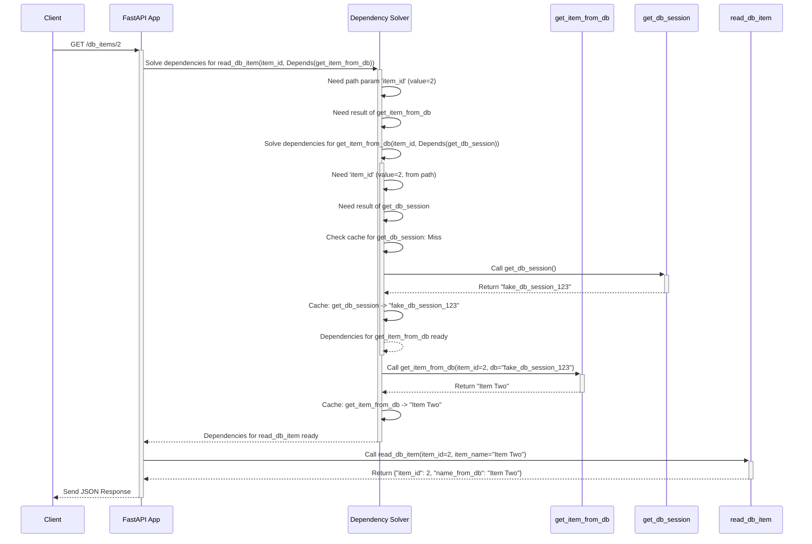

# Chapter 5: Dependency Injection

Welcome back! In [Chapter 4: OpenAPI & Automatic Docs](04_openapi___automatic_docs.md), we saw how FastAPI automatically generates interactive documentation for our API, making it easy for others (and ourselves!) to understand and use. This works because FastAPI understands the structure of our paths, parameters, and Pydantic models.

Now, let's explore another powerful feature that helps us write cleaner, more reusable, and better-organized code: **Dependency Injection**.

## What Problem Does This Solve?

Imagine you're building several API endpoints, and many of them need the same piece of information or the same setup step performed before they can do their main job. For example:

*   **Database Connection:** Many endpoints might need to talk to a database. You need to get a database "session" or connection first.
*   **User Authentication:** Many endpoints might require the user to be logged in. You need to check their credentials (like a token in a header) and fetch their user details.
*   **Common Parameters:** Maybe several endpoints share common query parameters like `skip` and `limit` for pagination.

You *could* write the code to get the database session, check the user, or parse the pagination parameters inside *each* path operation function. But that would be very repetitive (violating the DRY - Don't Repeat Yourself - principle) and hard to maintain. If you need to change how you get a database session, you'd have to update it in many places!

FastAPI's **Dependency Injection (DI)** system provides an elegant solution to this. It allows you to define these common pieces of logic (like getting a user or a DB session) as separate, reusable functions called "dependencies". Then, you simply "declare" that your path operation function needs the result of that dependency, and FastAPI automatically takes care of running the dependency and providing ("injecting") the result into your function.

**Our Goal Today:** Learn how to use FastAPI's `Depends` function to manage dependencies, reuse code, and make our API logic cleaner and more modular.

**Analogy:** Think of your path operation function as the main chef preparing a dish (handling the request). Before the chef can cook, they might need specific ingredients prepared or tools set up. Dependency Injection is like having specialized assistants (dependencies):
*   One assistant fetches fresh vegetables (e.g., gets common query parameters).
*   Another assistant prepares the cooking station (e.g., gets a database session).
*   Another assistant checks the order ticket to see who the dish is for (e.g., authenticates the user).

The chef simply tells the head waiter (`Depends`) what they need ("I need prepared vegetables", "I need the cooking station ready"), and the assistants automatically provide them just in time. The chef doesn't need to know the details of *how* the vegetables were fetched or the station prepared; they just get the result.

## Key Concepts

1.    **Dependency:** A function (or other callable) that provides some value needed by your path operation function (or even by another dependency). Examples: a function to get the current user, a function to connect to the database, a function to parse common query parameters.
2.    **`Depends`:** A special function imported from `fastapi` (`from fastapi import Depends`) that you use in the parameters of your path operation function to signal that it requires a dependency. You use it like this: `parameter_name: Annotated[ReturnType, Depends(dependency_function)]`.
3.    **Injection:** FastAPI "injects" the *result* returned by the dependency function into the parameter of your path operation function. If `dependency_function()` returns the value `10`, then `parameter_name` will be `10` inside your path function.
4.  **Automatic Execution:** FastAPI automatically figures out which dependencies are needed for a given request, calls them in the correct order (if dependencies depend on others), and manages their results.
5.  **Reusability:** Define a dependency once, and use `Depends(your_dependency)` in multiple path operations.
6.  **Caching (Per Request):** By default, if a dependency is declared multiple times for the *same request* (e.g., if multiple path operation parameters need it, or if other dependencies need it), FastAPI will only run the dependency function *once* per request and reuse the result. This is efficient, especially for things like database connections or fetching user data. You can disable this cache if needed.
7.  **Hierarchy:** Dependencies can depend on other dependencies using `Depends` in their own parameters, forming a chain or tree of dependencies. FastAPI resolves this entire structure.

## Using Dependencies: A Simple Example

Let's start with a very common scenario: having shared query parameters for pagination.

1.  **Define the Dependency Function:** Create a regular Python function that takes the parameters you want to share.

    ```python
    # common_dependencies.py (or within your router file)
    from typing import Annotated
    from fastapi import Query

    # This is our dependency function
    # It takes the common query parameters
    async def common_parameters(
        q: Annotated[str | None, Query(description="Optional query string")] = None,
        skip: Annotated[int, Query(description="Items to skip", ge=0)] = 0,
        limit: Annotated[int, Query(description="Max items to return", le=100)] = 100,
    ):
        # It simply returns a dictionary containing these parameters
        return {"q": q, "skip": skip, "limit": limit}

    ```

    **Explanation:**
    *   This looks like a normal function that could handle path operation parameters.
    *   It takes `q`, `skip`, and `limit` as arguments, using `Query` for validation and documentation just like we learned in [Chapter 2: Path Operations & Parameter Declaration](02_path_operations___parameter_declaration.md).
    *   It returns a dictionary containing the values it received. This dictionary will be the "result" injected into our path functions.

2.  **Use `Depends` in Path Operations:** Now, import `Depends` and your dependency function, and use it in your path operation parameters.

    ```python
    # routers/items.py (example)
    from typing import Annotated
    from fastapi import APIRouter, Depends
    # Assume common_parameters is defined in common_dependencies.py
    from ..common_dependencies import common_parameters

    router = APIRouter()

    # Fake data for demonstration
    fake_items = [{"item_name": "Foo"}, {"item_name": "Bar"}, {"item_name": "Baz"}]

    @router.get("/items/")
    # Here's the magic! Declare 'commons' parameter using Depends
    async def read_items(
        commons: Annotated[dict, Depends(common_parameters)] # Dependency Injection!
    ):
        # Inside this function, 'commons' will be the dictionary returned
        # by common_parameters after FastAPI calls it with the query params.
        print(f"Received common parameters: {commons}")

        # Use the values from the dependency
        q = commons["q"]
        skip = commons["skip"]
        limit = commons["limit"]

        response_items = fake_items[skip : skip + limit]
        if q:
            response_items = [item for item in response_items if q in item["item_name"]]
        return response_items

    @router.get("/users/")
    # We can reuse the SAME dependency here!
    async def read_users(
        commons: Annotated[dict, Depends(common_parameters)] # Reusing the dependency
    ):
        # 'commons' will again be the dict returned by common_parameters
        print(f"Received common parameters for users: {commons}")
        # Imagine fetching users using commons['skip'], commons['limit']...
        return {"message": "Users endpoint", "params": commons}

    ```

    **Explanation:**
    *   `from fastapi import Depends`: We import `Depends`.
    *   `from ..common_dependencies import common_parameters`: We import our dependency function.
    *   `commons: Annotated[dict, Depends(common_parameters)]`: This is the key part!
        *   We declare a parameter named `commons`.
        *   Its type hint is `dict` (because our dependency returns a dictionary). *Technically, FastAPI infers the type from the dependency function's return type hint if available, but explicitly adding `dict` here helps clarity.* For more complex types, use the exact return type.
        *   We wrap the type hint and `Depends(common_parameters)` in `Annotated`. This is the standard way to use `Depends`.
        *   `Depends(common_parameters)` tells FastAPI: "Before running `read_items`, call the `common_parameters` function. Take the query parameters `q`, `skip`, `limit` from the incoming request, pass them to `common_parameters`, get its return value, and assign it to the `commons` variable."
    *   **Reusability:** Notice how `read_users` uses the *exact same* dependency declaration `Annotated[dict, Depends(common_parameters)]`. We didn't have to repeat the `q`, `skip`, `limit` definitions.

**How it Behaves:**

1.  Run your app (`uvicorn main:app --reload`, assuming `main.py` includes this router).
2.  Visit `http://127.0.0.1:8000/items/?skip=1&limit=1`.
    *   FastAPI sees `Depends(common_parameters)`.
    *   It extracts `skip=1` and `limit=1` (and `q=None`) from the query string.
    *   It calls `common_parameters(q=None, skip=1, limit=1)`.
    *   `common_parameters` returns `{"q": None, "skip": 1, "limit": 1}`.
    *   FastAPI calls `read_items(commons={"q": None, "skip": 1, "limit": 1})`.
    *   You see the print statement and get the response `[{"item_name":"Bar"}]`.
3.  Visit `http://127.0.0.1:8000/users/?q=test`.
    *   FastAPI calls `common_parameters(q="test", skip=0, limit=100)`.
    *   `common_parameters` returns `{"q": "test", "skip": 0, "limit": 100}`.
    *   FastAPI calls `read_users(commons={"q": "test", "skip": 0, "limit": 100})`.
    *   You see the print statement and get the JSON response.

## Dependencies Can Depend on Other Dependencies

The real power comes when dependencies themselves need other dependencies. Let's sketch a simplified example for getting an item from a fake database.

1.  **Define a "DB Session" Dependency:** (This will be fake, just returning a string).

    ```python
    # common_dependencies.py
    async def get_db_session():
        print("Getting DB Session")
        # In reality, this would connect to a DB and yield/return a session object
        session = "fake_db_session_123"
        # You might use 'yield' here for setup/teardown (see FastAPI docs)
        return session
    ```

2.  **Define a Dependency that Uses the DB Session:**

    ```python
    # common_dependencies.py
    from typing import Annotated
    from fastapi import Depends, HTTPException

    # Import the DB session dependency
    from .common_dependencies import get_db_session

    async def get_item_from_db(
        item_id: int, # Takes a regular path parameter
        db: Annotated[str, Depends(get_db_session)] # Depends on get_db_session!
    ):
        print(f"Getting item {item_id} using DB session: {db}")
        # Fake database interaction
        fake_db = {1: "Item One", 2: "Item Two"}
        if item_id not in fake_db:
            raise HTTPException(status_code=404, detail="Item not found in DB")
        return fake_db[item_id]
    ```

    **Explanation:**
    *   `get_item_from_db` takes a regular `item_id` (which FastAPI will get from the path).
    *   It *also* takes `db: Annotated[str, Depends(get_db_session)]`. It declares its *own* dependency on `get_db_session`.
    *   When FastAPI needs to run `get_item_from_db`, it first sees the `Depends(get_db_session)`. It runs `get_db_session`, gets `"fake_db_session_123"`, and then calls `get_item_from_db(item_id=..., db="fake_db_session_123")`.

3.  **Use the High-Level Dependency in a Path Operation:**

    ```python
    # routers/items.py
    # ... other imports ...
    from ..common_dependencies import get_item_from_db

    @router.get("/db_items/{item_id}")
    # This endpoint depends on get_item_from_db
    async def read_db_item(
        item_id: int, # Path parameter for get_item_from_db
        item_name: Annotated[str, Depends(get_item_from_db)] # Inject result here!
    ):
        # 'item_name' will be the string returned by get_item_from_db
        # after it used the result from get_db_session.
        return {"item_id": item_id, "name_from_db": item_name}
    ```

    **Explanation:**
    *   The `read_db_item` function only needs to declare `Depends(get_item_from_db)`.
    *   FastAPI automatically handles the whole chain: `read_db_item` -> `get_item_from_db` -> `get_db_session`.
    *   Notice the `item_id: int` path parameter is declared in *both* `read_db_item` and `get_item_from_db`. FastAPI is smart enough to pass the path parameter value to the dependency that needs it.

**Caching in Action:**

If `get_db_session` was also needed directly by `read_db_item` (e.g., `db_session: Annotated[str, Depends(get_db_session)]`), FastAPI would *still* only call `get_db_session` **once** for the entire request to `/db_items/{item_id}` because of the default caching (`use_cache=True` in `Depends`). The result `"fake_db_session_123"` would be shared.

## How it Works Under the Hood (Simplified)

Let's trace a request to `/db_items/2` using the example above:

1.  **Request:** Client sends `GET /db_items/2`.
2.  **Routing:** FastAPI matches the request to the `read_db_item` path operation function.
3.  **Dependency Analysis:** FastAPI inspects the signature of `read_db_item`:
    *   `item_id: int` -> Needs value from path. Value is `2`.
    *   `item_name: Annotated[str, Depends(get_item_from_db)]` -> Needs the result of `get_item_from_db`.
4.  **Solving `get_item_from_db`:** FastAPI inspects `get_item_from_db`:
    *   `item_id: int` -> Needs a value. FastAPI sees `item_id` is also needed by the parent (`read_db_item`) and comes from the path. Value is `2`.
    *   `db: Annotated[str, Depends(get_db_session)]` -> Needs the result of `get_db_session`.
5.  **Solving `get_db_session`:** FastAPI inspects `get_db_session`:
    *   It has no parameters.
    *   Checks cache: Has `get_db_session` run for this request? No.
    *   Calls `get_db_session()`. It prints "Getting DB Session" and returns `"fake_db_session_123"`.
    *   Stores `get_db_session` -> `"fake_db_session_123"` in the request cache.
6.  **Calling `get_item_from_db`:** FastAPI now has the dependencies for `get_item_from_db`:
    *   `item_id` = `2` (from path)
    *   `db` = `"fake_db_session_123"` (from `get_db_session` result)
    *   Calls `get_item_from_db(item_id=2, db="fake_db_session_123")`.
    *   It prints "Getting item 2 using DB session: fake_db_session_123", looks up `2` in its fake DB, and returns `"Item Two"`.
    *   Stores `get_item_from_db` -> `"Item Two"` in the request cache.
7.  **Calling `read_db_item`:** FastAPI now has the dependencies for `read_db_item`:
    *   `item_id` = `2` (from path)
    *   `item_name` = `"Item Two"` (from `get_item_from_db` result)
    *   Calls `read_db_item(item_id=2, item_name="Item Two")`.
8.  **Response:** The function returns `{"item_id": 2, "name_from_db": "Item Two"}`, which FastAPI sends back to the client as JSON.

Here's a simplified sequence diagram:



### Code Connections

*   **`fastapi.Depends`** (`fastapi/param_functions.py`): This class is mostly a marker. When FastAPI analyzes function parameters, it looks for instances of `Depends`.
*   **`fastapi.dependencies.utils.get_dependant`**: This crucial function takes a callable (like your path operation function or another dependency) and inspects its signature. It identifies which parameters are path/query/body parameters and which are dependencies (marked with `Depends`). It builds a `Dependant` object representing this.
*   **`fastapi.dependencies.models.Dependant`**: A data structure (dataclass) that holds information about a callable: its name, the callable itself, its path/query/header/cookie/body parameters, and importantly, a list of *other* `Dependant` objects for its sub-dependencies. This creates the dependency tree/graph.
*   **`fastapi.dependencies.utils.solve_dependencies`**: This is the engine that recursively traverses the `Dependant` graph for a given request. It figures out the order, checks the cache (`dependency_cache`), calls the dependency functions (using `run_in_threadpool` for sync functions or awaiting async ones), handles results from generators (`yield`), and gathers all the computed values needed to finally call the target path operation function.

FastAPI intelligently combines Python's introspection capabilities with this structured dependency resolution system.

## Conclusion

You've learned about FastAPI's powerful Dependency Injection system!

*   You saw how to define reusable logic in **dependency functions**.
*   You learned to use **`Depends`** in your path operation function parameters to tell FastAPI what dependencies are needed.
*   You understood that FastAPI automatically **calls** dependencies and **injects** their results into your function.
*   You saw how dependencies can **depend on other dependencies**, creating manageable hierarchies.
*   You learned that results are **cached per request** by default for efficiency.
*   You grasped the core idea: separating concerns and promoting **reusable code**.

Dependency Injection is fundamental to building complex, maintainable applications in FastAPI. It's used extensively for things like database connections, authentication, authorization, and processing complex parameter sets.

While dependencies help manage complexity, sometimes things inevitably go wrong – a database might be unavailable, validation might fail within a dependency, or unexpected errors might occur. How should our API handle these situations gracefully? That's what we'll cover next.

Ready to handle errors like a pro? Let's move on to [Chapter 6: Error Handling](06_error_handling.md)!

---

Generated by [AI Codebase Knowledge Builder](https://github.com/The-Pocket/Tutorial-Codebase-Knowledge)