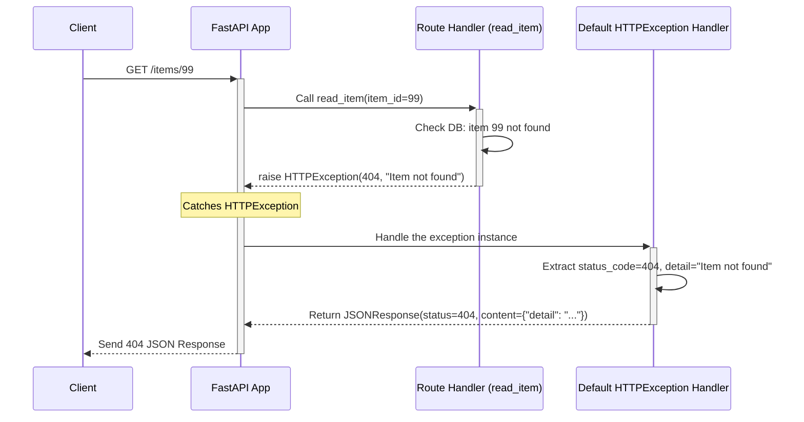

# Chapter 6: Error Handling

Welcome back! In [Chapter 5: Dependency Injection](05_dependency_injection.md), we learned how to structure our code using dependencies to manage common tasks like pagination or database sessions. This helps keep our code clean and reusable.

But what happens when things don't go as planned? A user might request data that doesn't exist, or they might send invalid input. Our API needs a way to gracefully handle these situations and inform the client about what went wrong.

**Our Goal Today:** Learn how FastAPI helps us manage errors effectively, both for problems we expect (like "item not found") and for unexpected issues like invalid input data.

## What Problem Does This Solve?

Imagine our online store API. We have an endpoint like `/items/{item_id}` to fetch details about a specific item. What should happen if a user tries to access `/items/9999` but there's no item with ID 9999 in our database?

If we don't handle this, our application might crash or return a confusing, generic server error (like `500 Internal Server Error`). This isn't helpful for the person using our API. They need clear feedback: "The item you asked for doesn't exist."

Similarly, if a user tries to *create* an item (`POST /items/`) but forgets to include the required `price` field in the JSON body, we shouldn't just crash. We need to tell them, "You forgot the price field!"

FastAPI provides a structured way to handle these different types of errors, ensuring clear communication with the client. Think of it as setting up clear emergency procedures for your API.

## Key Concepts

1.  **`HTTPException` for Expected Errors:**
    *   These are errors you anticipate might occur based on the client's request, like requesting a non-existent resource or lacking permissions.
    *   You can **raise** `HTTPException` directly in your code.
    *   You specify an appropriate HTTP **status code** (like `404 Not Found`, `403 Forbidden`) and a helpful **detail message** (like `"Item not found"`).
    *   FastAPI catches this exception and automatically sends a properly formatted JSON error response to the client.

2.  **`RequestValidationError` for Invalid Input:**
    *   This error occurs when the data sent by the client in the request (path parameters, query parameters, or request body) fails the validation rules defined by your type hints and Pydantic models (as seen in [Chapter 2: Path Operations & Parameter Declaration](02_path_operations___parameter_declaration.md) and [Chapter 3: Data Validation & Serialization (Pydantic)](03_data_validation___serialization__pydantic_.md)).
    *   FastAPI **automatically** catches these validation errors.
    *   It sends back a `422 Unprocessable Entity` response containing detailed information about *which* fields were invalid and *why*. You usually don't need to write extra code for this!

3.  **Custom Exception Handlers:**
    *   For more advanced scenarios, you can define your *own* functions to handle specific types of exceptions (either built-in Python exceptions or custom ones you create).
    *   This gives you full control over how errors are logged and what response is sent back to the client.

## Using `HTTPException` for Expected Errors

Let's solve our "item not found" problem using `HTTPException`.

1.  **Import `HTTPException`:**

    ```python
    # main.py or your router file
    from fastapi import FastAPI, HTTPException

    app = FastAPI() # Or use your APIRouter

    # Simple in-memory storage (like from Chapter 4)
    fake_items_db = {1: {"name": "Foo"}, 2: {"name": "Bar"}}
    ```

    **Explanation:** We import `HTTPException` directly from `fastapi`.

2.  **Check and Raise in Your Path Operation:**

    ```python
    @app.get("/items/{item_id}")
    async def read_item(item_id: int):
        # Check if the requested item_id exists in our "database"
        if item_id not in fake_items_db:
            # If not found, raise HTTPException!
            raise HTTPException(status_code=404, detail="Item not found")

        # If found, proceed normally
        return {"item": fake_items_db[item_id]}
    ```

    **Explanation:**
    *   Inside `read_item`, we check if the `item_id` exists as a key in our `fake_items_db` dictionary.
    *   If `item_id` is *not* found, we `raise HTTPException(...)`.
        *   `status_code=404`: We use the standard HTTP status code `404 Not Found`. FastAPI knows many common status codes (you can also use `from starlette import status; raise HTTPException(status_code=status.HTTP_404_NOT_FOUND, ...)` for more readability).
        *   `detail="Item not found"`: We provide a human-readable message explaining the error. This will be sent back to the client in the JSON response body.
    *   If the item *is* found, the `raise` statement is skipped, and the function returns the item details as usual.

**How it Behaves:**

*   **Request:** Client sends `GET /items/1`
    *   **Response (Status Code 200):**
        ```json
        {"item": {"name": "Foo"}}
        ```
*   **Request:** Client sends `GET /items/99`
    *   **Response (Status Code 404):**
        ```json
        {"detail": "Item not found"}
        ```

FastAPI automatically catches the `HTTPException` you raised and sends the correct HTTP status code along with the `detail` message formatted as JSON.

## Automatic Handling of `RequestValidationError`

You've already seen this in action without realizing it! When you define Pydantic models for your request bodies or use type hints for path/query parameters, FastAPI automatically validates incoming data.

Let's revisit the `create_item` example from [Chapter 3: Data Validation & Serialization (Pydantic)](03_data_validation___serialization__pydantic_.md):

```python
# main.py or your router file
from fastapi import FastAPI
from pydantic import BaseModel

app = FastAPI()

# Pydantic model requiring name and price
class Item(BaseModel):
    name: str
    price: float
    description: str | None = None

@app.post("/items/")
# Expects request body matching the Item model
async def create_item(item: Item):
    # If execution reaches here, validation PASSED automatically.
    return {"message": "Item received!", "item_data": item.model_dump()}
```

**How it Behaves (Automatically):**

*   **Request:** Client sends `POST /items/` with a *valid* JSON body:
    ```json
    {
      "name": "Gadget",
      "price": 19.95
    }
    ```
    *   **Response (Status Code 200):**
        ```json
        {
          "message": "Item received!",
          "item_data": {
            "name": "Gadget",
            "price": 19.95,
            "description": null
          }
        }
        ```

*   **Request:** Client sends `POST /items/` with an *invalid* JSON body (missing `price`):
    ```json
    {
      "name": "Widget"
    }
    ```
    *   **Response (Status Code 422):** FastAPI *automatically* intercepts this before `create_item` runs and sends:
        ```json
        {
          "detail": [
            {
              "type": "missing",
              "loc": [
                "body",
                "price"
              ],
              "msg": "Field required",
              "input": {
                "name": "Widget"
              },
              "url": "..." // Link to Pydantic error docs
            }
          ]
        }
        ```

*   **Request:** Client sends `POST /items/` with an *invalid* JSON body (wrong type for `price`):
    ```json
    {
      "name": "Doohickey",
      "price": "cheap"
    }
    ```
    *   **Response (Status Code 422):** FastAPI automatically sends:
        ```json
        {
          "detail": [
            {
              "type": "float_parsing",
              "loc": [
                "body",
                "price"
              ],
              "msg": "Input should be a valid number, unable to parse string as a number",
              "input": "cheap",
              "url": "..."
            }
          ]
        }
        ```

Notice that we didn't write any `try...except` blocks or `if` statements in `create_item` to handle these validation issues. FastAPI and Pydantic take care of it, providing detailed error messages that tell the client exactly what went wrong and where (`loc`). This is a huge time saver!

## Custom Exception Handlers (A Quick Look)

Sometimes, you might want to handle specific errors in a unique way. Maybe you want to log a particular error to a monitoring service, or perhaps you need to return error responses in a completely custom format different from FastAPI's default.

FastAPI allows you to register **exception handlers** using the `@app.exception_handler()` decorator.

**Example:** Imagine you have a custom error `UnicornNotFound` and want to return a `418 I'm a teapot` status code when it occurs.

1.  **Define the Custom Exception:**

    ```python
    # Can be in your main file or a separate exceptions.py
    class UnicornNotFound(Exception):
        def __init__(self, name: str):
            self.name = name
    ```

2.  **Define the Handler Function:**

    ```python
    # main.py
    from fastapi import FastAPI, Request
    from fastapi.responses import JSONResponse
    # Assuming UnicornNotFound is defined above or imported

    app = FastAPI()

    # Decorator registers this function to handle UnicornNotFound errors
    @app.exception_handler(UnicornNotFound)
    async def unicorn_exception_handler(request: Request, exc: UnicornNotFound):
        # This function runs whenever UnicornNotFound is raised
        return JSONResponse(
            status_code=418, # I'm a teapot!
            content={"message": f"Oops! Can't find unicorn named: {exc.name}."},
        )
    ```

    **Explanation:**
    *   `@app.exception_handler(UnicornNotFound)`: This tells FastAPI that the `unicorn_exception_handler` function should be called whenever an error of type `UnicornNotFound` is raised *and not caught* elsewhere.
    *   The handler function receives the `request` object and the exception instance (`exc`).
    *   It returns a `JSONResponse` with the desired status code (418) and a custom content dictionary.

3.  **Raise the Custom Exception in a Path Operation:**

    ```python
    @app.get("/unicorns/{name}")
    async def read_unicorn(name: str):
        if name == "yolo":
            # Raise our custom exception
            raise UnicornNotFound(name=name)
        return {"unicorn_name": name, "message": "Unicorn exists!"}
    ```

**How it Behaves:**

*   **Request:** `GET /unicorns/sparklehoof`
    *   **Response (Status Code 200):**
        ```json
        {"unicorn_name": "sparklehoof", "message": "Unicorn exists!"}
        ```
*   **Request:** `GET /unicorns/yolo`
    *   **Response (Status Code 418):** (Handled by `unicorn_exception_handler`)
        ```json
        {"message": "Oops! Can't find unicorn named: yolo."}
        ```

Custom handlers provide flexibility, but for most common API errors, `HTTPException` and the automatic `RequestValidationError` handling are sufficient.

## How it Works Under the Hood (Simplified)

When an error occurs during a request, FastAPI follows a process to decide how to respond:

**Scenario 1: Raising `HTTPException`**

1.  **Raise:** Your path operation code (e.g., `read_item`) executes `raise HTTPException(status_code=404, detail="Item not found")`.
2.  **Catch:** FastAPI's internal request/response cycle catches this specific `HTTPException`.
3.  **Find Handler:** FastAPI checks if there's a custom handler registered for `HTTPException`. If not (which is usually the case unless you override it), it uses its **default handler** for `HTTPException`.
4.  **Default Handler Executes:** The default handler (`fastapi.exception_handlers.http_exception_handler`) takes the `status_code` and `detail` from the exception you raised.
5.  **Create Response:** It creates a `starlette.responses.JSONResponse` containing `{"detail": exc.detail}` and sets the status code to `exc.status_code`.
6.  **Send Response:** This JSON response is sent back to the client.



**Scenario 2: Automatic `RequestValidationError`**

1.  **Request:** Client sends `POST /items/` with invalid data (e.g., missing `price`).
2.  **Parameter/Body Parsing:** FastAPI tries to parse the request body and validate it against the `Item` Pydantic model before calling `create_item`.
3.  **Pydantic Raises:** Pydantic's validation fails and raises a `pydantic.ValidationError`.
4.  **FastAPI Wraps:** FastAPI catches the `pydantic.ValidationError` and wraps it inside its own `fastapi.exceptions.RequestValidationError` to add context.
5.  **Catch:** FastAPI's internal request/response cycle catches the `RequestValidationError`.
6.  **Find Handler:** FastAPI looks for a handler for `RequestValidationError` and finds its default one.
7.  **Default Handler Executes:** The default handler (`fastapi.exception_handlers.request_validation_exception_handler`) takes the `RequestValidationError`.
8.  **Extract & Format Errors:** It calls the `.errors()` method on the exception to get the list of validation errors provided by Pydantic. It then formats this list into the standard structure (with `loc`, `msg`, `type`).
9.  **Create Response:** It creates a `JSONResponse` with status code `422` and the formatted error details as the content.
10. **Send Response:** This 422 JSON response is sent back to the client. Your `create_item` function was never even called.

### Code Connections

*   **`fastapi.exceptions.HTTPException`**: The class you import and raise for expected client errors. Defined in `fastapi/exceptions.py`. It inherits from `starlette.exceptions.HTTPException`.
*   **`fastapi.exception_handlers.http_exception_handler`**: The default function that handles `HTTPException`. Defined in `fastapi/exception_handlers.py`. It creates a `JSONResponse`.
*   **`fastapi.exceptions.RequestValidationError`**: The exception FastAPI raises internally when Pydantic validation fails for request data. Defined in `fastapi/exceptions.py`.
*   **`fastapi.exception_handlers.request_validation_exception_handler`**: The default function that handles `RequestValidationError`. Defined in `fastapi/exception_handlers.py`. It calls `jsonable_encoder(exc.errors())` and creates a 422 `JSONResponse`.
*   **`@app.exception_handler(ExceptionType)`**: The decorator used on the `FastAPI` app instance to register your own custom handler functions. The `exception_handler` method is part of the `FastAPI` class in `fastapi/applications.py`.

## Conclusion

You've learned how FastAPI helps you manage errors gracefully!

*   You can handle **expected client errors** (like "not found") by raising **`HTTPException`** with a specific `status_code` and `detail` message.
*   FastAPI **automatically handles validation errors** (`RequestValidationError`) when incoming data doesn't match your Pydantic models or type hints, returning detailed `422` responses.
*   You can define **custom exception handlers** for fine-grained control over error responses and logging using `@app.exception_handler()`.

Using these tools makes your API more robust, predictable, and easier for clients to interact with, even when things go wrong. Clear error messages are a crucial part of a good API design.

Now that we know how to handle errors, let's think about another critical aspect: security. How do we protect our endpoints, ensuring only authorized users can access certain data or perform specific actions?

Ready to secure your API? Let's move on to [Chapter 7: Security Utilities](07_security_utilities.md)!

---

Generated by [AI Codebase Knowledge Builder](https://github.com/The-Pocket/Tutorial-Codebase-Knowledge)