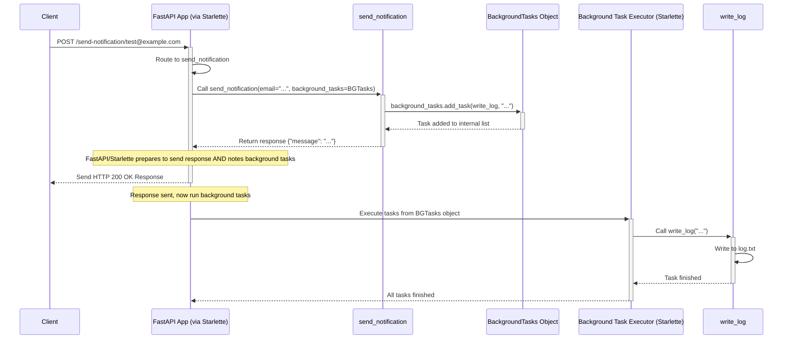

# Chapter 8: Background Tasks

Welcome back! In [Chapter 7: Security Utilities](07_security_utilities.md), we learned how to protect our API endpoints using FastAPI's security features. Now, let's explore how to perform actions *after* we've already sent a response back to the user.

## What Problem Does This Solve?

Imagine a user registers on your website. When they submit their registration form, your API endpoint needs to:

1.  Create the new user account in the database.
2.  Send a welcome email to the user.
3.  Send a notification to an admin.
4.  Return a "Success!" message to the user.

Creating the user (step 1) is quick and essential before confirming success. But sending emails or notifications (steps 2 and 3) can sometimes be slow. Should the user have to wait several extra seconds just for the emails to be sent before they see the "Success!" message? Probably not! It would be much better if the API could send the "Success!" response immediately after creating the user, and then handle sending the emails *in the background*.

This is exactly what **Background Tasks** allow you to do in FastAPI. They let you define operations that need to happen *after* the response has been sent to the client, ensuring your users get a fast response time for the main action.

**Analogy:** Think of your path operation function as having a conversation with the user (sending the response). Once the main conversation is finished, you might hand off a follow-up task (like mailing a letter) to an assistant to complete later, so you don't keep the user waiting. Background Tasks are like that helpful assistant.

## Key Concepts

1.  **`BackgroundTasks` Object:** A special object provided by FastAPI that holds a list of tasks to be run later.
2.  **Dependency Injection:** You get access to this object by declaring it as a parameter in your path operation function, just like we learned in [Chapter 5: Dependency Injection](05_dependency_injection.md). Example: `def my_endpoint(background_tasks: BackgroundTasks): ...`.
3.  **`add_task()` Method:** You use the `add_task()` method on the `BackgroundTasks` object to schedule a function to run in the background. You provide the function itself and any arguments it needs. Example: `background_tasks.add_task(send_welcome_email, user.email, user.name)`.
4.  **Post-Response Execution:** FastAPI (specifically, the underlying Starlette framework) ensures that all functions added via `add_task()` are executed *only after* the response has been successfully sent back to the client.

## Using Background Tasks

Let's create a simple example. Imagine we want to write a message to a log file *after* sending a notification response to the user.

**Step 1: Import `BackgroundTasks`**

First, import the necessary class from `fastapi`.

```python
# main.py (or your router file)
from fastapi import BackgroundTasks, FastAPI

app = FastAPI()
```

**Step 2: Define the Task Function**

This is the function you want to run in the background. It can be a regular `def` function or an `async def` function.

```python
# A function to simulate writing to a log
# In a real app, this might send an email, process data, etc.
def write_log(message: str):
    # Simulate writing to a file
    with open("log.txt", mode="a") as log_file:
        log_file.write(message + "\n")
    print(f"Log written: {message}") # Also print to console for demo

```

**Explanation:**
*   This is a simple Python function `write_log` that takes a `message` string.
*   It opens a file named `log.txt` in "append" mode (`a`) and writes the message to it.
*   We also print to the console so we can easily see when it runs during testing.

**Step 3: Inject `BackgroundTasks` and use `add_task`**

Now, modify your path operation function to accept `BackgroundTasks` as a parameter and use its `add_task` method.

```python
@app.post("/send-notification/{email}")
async def send_notification(
    email: str,
    background_tasks: BackgroundTasks # Inject BackgroundTasks
):
    # The message we want to log in the background
    log_message = f"Notification sent to: {email}"

    # Add the task to run after the response
    background_tasks.add_task(write_log, log_message) # Schedule write_log

    # Return the response immediately
    return {"message": "Notification sent successfully!"}

```

**Explanation:**

*   `background_tasks: BackgroundTasks`: We declare a parameter named `background_tasks` with the type hint `BackgroundTasks`. FastAPI's dependency injection system will automatically create and provide a `BackgroundTasks` object here.
*   `background_tasks.add_task(write_log, log_message)`: This is the crucial line.
    *   We call the `add_task` method on the injected `background_tasks` object.
    *   The first argument is the function we want to run in the background (`write_log`).
    *   The subsequent arguments (`log_message`) are the arguments that will be passed to our `write_log` function when it's eventually called.
*   `return {"message": "Notification sent successfully!"}`: The function returns its response *without* waiting for `write_log` to finish.

**How it Behaves:**

1.  **Run the App:** `uvicorn main:app --reload`
2.  **Send a Request:** Use `curl` or the `/docs` UI to send a `POST` request to `/send-notification/test@example.com`.
    ```bash
    curl -X POST http://127.0.0.1:8000/send-notification/test@example.com
    ```
3.  **Immediate Response:** You will immediately receive the JSON response:
    ```json
    {"message":"Notification sent successfully!"}
    ```
4.  **Background Execution:** *After* the response above has been sent, look at your Uvicorn console output. You will see the message:
    ```
    Log written: Notification sent to: test@example.com
    ```
    Also, check your project directory. A file named `log.txt` will have been created (or appended to) with the content:
    ```
    Notification sent to: test@example.com
    ```

This demonstrates that the `write_log` function ran *after* the client received the success message, preventing any delay for the user.

## How it Works Under the Hood (Simplified)

What's happening behind the scenes when you use `BackgroundTasks`?

1.  **Request In:** A request arrives at your FastAPI application (e.g., `POST /send-notification/test@example.com`).
2.  **Dependency Injection:** FastAPI processes the request, routes it to `send_notification`, and prepares its dependencies. It sees the `background_tasks: BackgroundTasks` parameter and creates an empty `BackgroundTasks` object instance.
3.  **Path Function Runs:** Your `send_notification` function is called with the `email` and the empty `background_tasks` object.
4.  **`add_task` Called:** Your code calls `background_tasks.add_task(write_log, log_message)`. This doesn't *run* `write_log` yet; it just adds the function (`write_log`) and its arguments (`log_message`) to an internal list within the `background_tasks` object.
5.  **Response Returned:** Your path function finishes and returns the dictionary `{"message": "Notification sent successfully!"}`.
6.  **Middleware Magic (Starlette):** FastAPI (using Starlette middleware) takes the response object *and* the `background_tasks` object (which now contains the scheduled task).
7.  **Response Sent:** The middleware sends the HTTP response (`200 OK` with the JSON body) back to the client over the network.
8.  **Tasks Executed:** *After* the response has been sent, the Starlette middleware iterates through the tasks stored in the `background_tasks` object. For each task, it calls the stored function (`write_log`) with the stored arguments (`log_message`). This happens in the server's process, separate from the initial request-response flow.

Here's a simplified sequence diagram:



### Code Connections

*   **`fastapi.BackgroundTasks`**: This class (in `fastapi/background.py`) inherits directly from `starlette.background.BackgroundTasks`. It mostly just provides type hints and documentation specific to FastAPI.
*   **`BackgroundTasks.add_task`**: This method simply calls the `add_task` method of the parent Starlette class.
*   **`starlette.background.BackgroundTasks`**: This is where the core logic resides (in the `starlette` library, which FastAPI builds upon). It stores tasks as tuples of `(callable, args, kwargs)`.
*   **`starlette.middleware.exceptions.ExceptionMiddleware` (and potentially others):** Starlette's middleware stack, particularly around exception handling and response sending, is responsible for checking if a `BackgroundTasks` object exists on the response object after the main endpoint code has run. If tasks exist, the middleware ensures they are executed *after* the response is sent using `anyio.create_task_group().start_soon()` or similar mechanisms. See `starlette.responses.Response.__call__`.

Essentially, FastAPI provides a convenient way (via dependency injection) to access Starlette's background task functionality.

## Conclusion

You've learned how to use FastAPI's `BackgroundTasks` to perform operations *after* sending a response to the client!

*   You understand that this is useful for **slow or non-critical tasks** (like sending emails or notifications) that shouldn't delay the user's primary action.
*   You learned to inject the **`BackgroundTasks`** object as a dependency.
*   You saw how to schedule functions using the **`add_task(func, *args, **kwargs)`** method.
*   You understand that these tasks run **after the response** has been delivered.

This feature helps you build more responsive APIs by deferring non-essential work.

This chapter concludes our core introduction to FastAPI! We've covered setting up applications, defining routes, handling parameters and data validation, using dependency injection, handling errors, securing endpoints, and now running background tasks. With these building blocks, you can create powerful and efficient web APIs.

Where do you go from here? You can dive deeper into the official FastAPI documentation to explore advanced topics like WebSockets, middleware, bigger application structures, testing, and deployment. Happy coding!

---

Generated by [AI Codebase Knowledge Builder](https://github.com/The-Pocket/Tutorial-Codebase-Knowledge)