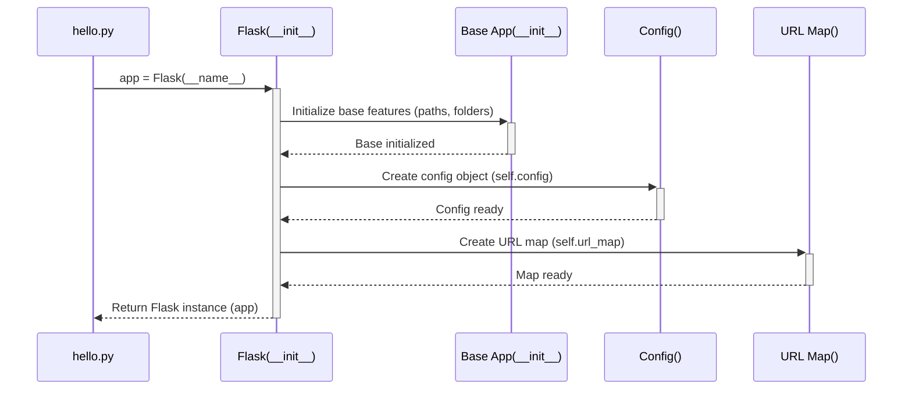

# Chapter 1: Application Object (`Flask`)

Welcome to your first step into the world of Flask! Flask is a "microframework" for building web applications in Python. "Micro" doesn't mean it's limited; it means Flask provides the essentials to get started quickly, letting you add features as needed.

In this chapter, we'll explore the absolute heart of any Flask application: the **Application Object**.

## What Problem Does It Solve? The Need for a Control Tower

Imagine you're building a simple website. Maybe it just needs to show "Hello, World!" when someone visits the homepage. How does the web server know *what* Python code to run when a request comes in for `/` (the homepage)? How does it manage different pages (like `/about` or `/contact`)? How does it handle settings or connect to other tools?

You need a central place to manage all these tasks. Think of a busy airport: you need a **control tower** to direct planes (incoming web requests), manage runways (URL paths), and coordinate ground crew (other parts of your application).

In Flask, the `Flask` object is that control tower. It's the main object you create that represents your entire web application.

## Creating Your First Flask Application

Let's create the simplest possible Flask app. You'll need a Python file (let's call it `hello.py`).

1.  **Import Flask:** First, you need to bring the `Flask` class into your code.
2.  **Create an Instance:** Then, you create an *instance* of this class. This instance *is* your application.

```python
# hello.py

from flask import Flask

# Create the application object
app = Flask(__name__)

# We'll add more here soon!
```

Let's break down `app = Flask(__name__)`:

*   `from flask import Flask`: This line imports the necessary `Flask` class from the Flask library you installed.
*   `app = Flask(...)`: This creates the actual application object. We usually call the variable `app`, but you could name it something else.
*   `__name__`: This is a special Python variable. When you run a Python script directly, Python sets `__name__` to the string `"__main__"`. If the script is imported by another script, `__name__` is set to the module's name (e.g., `"hello"` if your file is `hello.py`).
    *   **Why `__name__`?** Flask uses this argument to figure out the *location* of your application. This helps it find other files like templates and static assets (images, CSS) later on. For simple, single-module applications, using `__name__` is standard practice and almost always correct. The Flask documentation notes that if you're building a larger application structured as a Python package, you might hardcode the package name instead (like `app = Flask('yourapplication')`), but for beginners, `__name__` is the way to go.

This `app` object is now ready to be configured and run.

## Adding a Basic Route

Our `app` object doesn't do anything yet. Let's tell it what to do when someone visits the homepage (`/`). We do this using a *route*. We'll cover routing in detail in the next chapter, but here's a taste:

```python
# hello.py (continued)

from flask import Flask

app = Flask(__name__)

# Define what happens when someone visits the homepage ("/")
@app.route('/')
def index():
  return 'Hello, World!'

# More code to run the app below...
```

*   `@app.route('/')`: This is a Python decorator. It modifies the function defined right below it (`index`). It tells our `app` object: "When a web request comes in for the URL path `/`, call the `index` function."
*   `def index(): ...`: This is a simple Python function. Flask calls these "view functions."
*   `return 'Hello, World!'`: Whatever the view function returns is sent back to the user's web browser as the response.

## Running Your Application

How do we start the web server so people can actually visit our page? We use the `app` object's `run()` method. It's common practice to put this inside a special `if` block:

```python
# hello.py (end of the file)

from flask import Flask

app = Flask(__name__)

@app.route('/')
def index():
  return 'Hello, World!'

# This block runs the app only when the script is executed directly
if __name__ == '__main__':
  # Start the built-in development server
  app.run(debug=True)
```

*   `if __name__ == '__main__':`: This standard Python construct ensures that the code inside it only runs when you execute `hello.py` directly (like typing `python hello.py` in your terminal). It prevents the server from starting if you were to *import* `hello.py` into another Python file.
*   `app.run()`: This method starts Flask's built-in development web server. This server is great for testing but **not** suitable for production (live websites).
*   `debug=True`: This enables Flask's "debug mode". It provides helpful error messages in the browser and automatically restarts the server whenever you save changes to your code, making development much easier. **Never use debug mode in production!**

**To run this:**

1.  Save the complete code as `hello.py`.
2.  Open your terminal or command prompt.
3.  Navigate to the directory where you saved the file.
4.  Run the command: `python hello.py`
5.  You'll see output like this:
    ```
     * Serving Flask app 'hello'
     * Debug mode: on
     * Running on http://127.0.0.1:5000 (Press CTRL+C to quit)
     * Restarting with stat
     * Debugger is active!
     * Debugger PIN: ...
    ```
6.  Open your web browser and go to `http://127.0.0.1:5000/`.
7.  You should see the text "Hello, World!"

You've just created and run your first Flask application! The `app = Flask(__name__)` line was the crucial first step, creating the central object that manages everything.

## Under the Hood: What Happens When You Create `Flask(__name__)`?

While you don't *need* to know the deep internals right away, a little insight helps understanding. When you call `app = Flask(__name__)`, several things happen inside Flask (simplified):

1.  **Initialization:** The `Flask` class's `__init__` method (found in `app.py`, inheriting from `App` in `sansio/app.py`) is called.
2.  **Path Determination:** It uses the `import_name` (`__name__`) you passed to figure out the application's `root_path`. This is like finding the main hangar at the airport. (See `get_root_path` in `helpers.py` and `find_package` in `sansio/scaffold.py`).
3.  **Configuration Setup:** It creates a configuration object (`self.config`), usually an instance of the `Config` class (from `config.py`). This object holds settings like `DEBUG`, `SECRET_KEY`, etc. We'll cover this in [Configuration (`Config`)](06_configuration___config__.md).
4.  **URL Map Creation:** It creates a `URL Map` (`self.url_map`), which is responsible for matching incoming request URLs to your view functions. This is core to the [Routing System](02_routing_system.md).
5.  **Internal Structures:** It sets up various internal dictionaries to store things like your view functions (`self.view_functions`), error handlers (`self.error_handler_spec`), functions to run before/after requests, etc.
6.  **Static Route (Optional):** If you configured a `static_folder` (Flask does by default), it automatically adds a URL rule (like `/static/<filename>`) to serve static files like CSS and JavaScript.

Here's a simplified diagram of the process:



The `app` object returned is now the fully initialized "control tower," ready to register routes and handle requests.

## Conclusion

You've learned about the most fundamental concept in Flask: the **Application Object**, created by instantiating the `Flask` class (usually as `app = Flask(__name__)`). This object acts as the central registry and controller for your entire web application. It's where you define URL routes, manage configuration, and connect various components.

We saw how to create a minimal application, add a simple route using `@app.route()`, and run the development server using `app.run()`.

Now that you have your central `app` object, the next logical step is to understand how Flask directs incoming web requests to the correct Python functions. That's the job of the routing system.

Ready to direct some traffic? Let's move on to [Routing System](02_routing_system.md).

---

Generated by [AI Codebase Knowledge Builder](https://github.com/The-Pocket/Tutorial-Codebase-Knowledge)