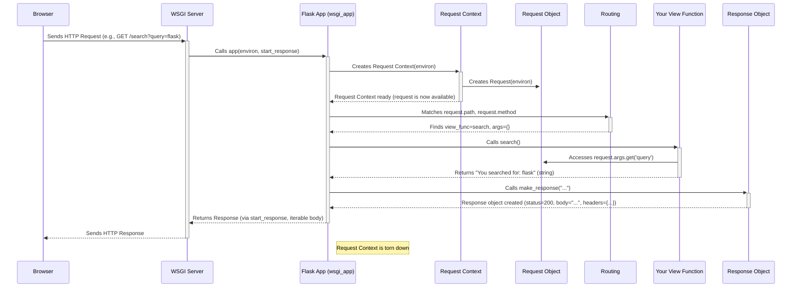

# Chapter 3: Request and Response Objects

Welcome back! In [Chapter 2: Routing System](02_routing_system.md), we learned how Flask uses routes (`@app.route(...)`) to direct incoming web requests to the correct Python view functions. We saw how to create static routes like `/about` and dynamic routes like `/user/<username>`.

But what exactly *is* a "web request"? And how do we send back something more sophisticated than just a plain string like `'Hello, World!'`? That's where **Request** and **Response** objects come into play.

## What Problem Do They Solve? The Need for Envelopes

Think about sending and receiving mail. When you receive a letter, it's not just the message inside that matters. The envelope has important information: the sender's address, the recipient's address, maybe a stamp indicating priority. When you send a letter back, you also need an envelope to put your message in, address it correctly, and maybe specify if it's regular mail or express.

In the world of web applications (specifically HTTP, the language browsers and servers speak):

*   The **Request** object is like the *incoming mail*. It contains everything the client (usually a web browser) sent to your server: the URL they requested, any data they submitted (like in a search box or login form), special instructions (HTTP headers), the method they used (like GET for fetching data or POST for submitting data), and more.
*   The **Response** object is like the *outgoing mail* you send back. It contains the content you want to show the user (like an HTML page), the status of the request (like "OK" or "Not Found"), and any special instructions for the browser (HTTP headers, like instructions on how to cache the page).

Flask provides easy-to-use objects to represent these two sides of the communication.

## The Request Object: Unpacking the Incoming Mail

Inside your view functions, Flask makes a special object called `request` available. You need to import it from the `flask` library first. This object holds all the information about the incoming request that triggered your view function.

```python
# hello.py (continued)
from flask import Flask, request # Import request

app = Flask(__name__)

@app.route('/')
def index():
  # Access the HTTP method (GET, POST, etc.)
  method = request.method
  # Access the browser's user agent string (an HTTP header)
  user_agent = request.headers.get('User-Agent')
  return f'Hello! You used the {method} method. Your browser is: {user_agent}'

# ... (rest of the app, including if __name__ == '__main__': ...)
```

**Explanation:**

*   `from flask import request`: We import the `request` object.
*   `request.method`: This attribute tells you *how* the user made the request (e.g., 'GET', 'POST'). Visiting a page normally uses GET.
*   `request.headers`: This is a dictionary-like object containing HTTP headers sent by the browser. We use `.get('User-Agent')` to safely get the browser identification string.

**Running this:**

1.  Save and run `hello.py`.
2.  Visit `http://127.0.0.1:5000/` in your browser.
3.  You'll see something like: "Hello! You used the GET method. Your browser is: Mozilla/5.0 (..." (your specific browser details will vary).

### Getting Data from the URL (Query Parameters)

Often, data is included directly in the URL after a `?`, like `http://127.0.0.1:5000/search?query=flask`. These are called query parameters. The `request` object provides the `args` attribute to access them.

```python
# hello.py (continued)
from flask import Flask, request

app = Flask(__name__)

@app.route('/search')
def search():
  # Get the value of the 'query' parameter from the URL
  # request.args.get() is safer than request.args[] as it returns None if the key doesn't exist
  search_term = request.args.get('query')

  if search_term:
    return f'You searched for: {search_term}'
  else:
    return 'Please provide a search term using ?query=...'

# ... (rest of the app)
```

**Running this:**

1.  Save and run `hello.py`.
2.  Visit `http://127.0.0.1:5000/search?query=python+web+framework`.
3.  You should see: "You searched for: python web framework".
4.  Visit `http://127.0.0.1:5000/search`.
5.  You should see: "Please provide a search term using ?query=..."

### Getting Data from Forms (POST Requests)

When a user submits an HTML form, the browser usually sends the data using the POST method. This data isn't in the URL; it's in the body of the request. The `request` object provides the `form` attribute to access this data.

Let's create a simple login page (we won't actually log anyone in yet).

First, a route to *show* the form (using GET):

```python
# hello.py (continued)
from flask import Flask, request, make_response # Import make_response

app = Flask(__name__)

@app.route('/login', methods=['GET']) # Only allow GET for this view
def show_login_form():
  # Just return the raw HTML for the form
  return '''
      <form method="POST">
          Username: <input type="text" name="username"><br>
          Password: <input type="password" name="password"><br>
          <input type="submit" value="Log In">
      </form>
  '''
# ... (add the next route below)
```

Now, a route to *handle* the form submission (using POST):

```python
# hello.py (continued)

@app.route('/login', methods=['POST']) # Only allow POST for this view
def process_login():
  # Access form data using request.form
  username = request.form.get('username')
  password = request.form.get('password') # In a real app, NEVER just display a password!

  if username and password:
    return f'Attempting login for username: {username}'
  else:
    return 'Missing username or password', 400 # Return an error status code

# ... (rest of the app, including if __name__ == '__main__': ...)
```

**Explanation:**

*   `@app.route('/login', methods=['GET'])`: We specify that `show_login_form` only handles GET requests.
*   `@app.route('/login', methods=['POST'])`: We specify that `process_login` only handles POST requests. This allows the same URL (`/login`) to do different things based on the HTTP method.
*   `<form method="POST">`: The HTML form is set to use the POST method when submitted.
*   `request.form.get('username')`: Inside `process_login`, we access the submitted form data using the `name` attributes of the input fields (`name="username"`).
*   `return 'Missing...', 400`: Here we return not just a string, but also a number. Flask understands this as `(body, status_code)`. `400` means "Bad Request".

**Running this:**

1.  Save and run `hello.py`.
2.  Visit `http://127.0.0.1:5000/login`. You'll see the simple login form.
3.  Enter a username and password and click "Log In".
4.  The browser will send a POST request to `/login`. The `process_login` function will handle it, and you'll see: "Attempting login for username: [your username]".

The `request` object is your window into the data sent by the client. You'll use `request.args` for URL parameters (GET) and `request.form` for form data (POST) most often.

## The Response Object: Crafting the Outgoing Mail

We've seen that Flask takes the return value of your view function and turns it into the HTTP response sent back to the browser.

*   Returning a string: Flask creates a Response with that string as the body, a `200 OK` status code, and a `text/html` content type.
*   Returning a tuple `(body, status)`: Flask uses the `body` (string) and the specified `status` code (integer).
*   Returning a tuple `(body, status, headers)`: Flask uses the body, status, and adds the specified `headers` (a dictionary or list of tuples).

For more control, you can explicitly create a Response object using the `make_response` helper function.

```python
# hello.py (continued)
from flask import Flask, make_response # Import make_response

app = Flask(__name__)

@app.route('/custom')
def custom_response():
  # Create a response object from a string
  response = make_response("This response has custom headers!")

  # Set a custom header
  response.headers['X-My-Custom-Header'] = 'Flask is Fun!'

  # Set a cookie (we'll learn more about sessions/cookies later)
  response.set_cookie('mycookie', 'some_value')

  # Set a specific status code (optional, defaults to 200)
  response.status_code = 201 # 201 means "Created"

  return response # Return the fully configured response object

# ... (rest of the app)
```

**Explanation:**

*   `from flask import make_response`: We import the helper function.
*   `response = make_response(...)`: Creates a Response object. You can pass the body content here.
*   `response.headers['...'] = '...'`: Allows setting custom HTTP headers. Browsers might use these for caching, security, or other purposes. Your own JavaScript code could also read them.
*   `response.set_cookie(...)`: A convenient way to set a cookie to be stored by the browser.
*   `response.status_code = 201`: Sets the HTTP status code. While `200` means "OK", other codes have specific meanings (`404` Not Found, `403` Forbidden, `500` Server Error, `201` Created, `302` Redirect, etc.).
*   `return response`: We return the response object we manually configured.

Using `make_response` gives you fine-grained control over exactly what gets sent back to the client.

## Under the Hood: Werkzeug and the Request/Response Cycle

Flask doesn't reinvent the wheel for handling low-level HTTP details. It uses another excellent Python library called **Werkzeug** (pronounced "verk-zoyg", German for "tool"). Flask's `Request` and `Response` objects are actually subclasses of Werkzeug's base `Request` and `Response` classes, adding some Flask-specific conveniences.

Here's a simplified view of what happens when a request comes in:

1.  **Incoming Request:** Your web server (like the Flask development server, or a production server like Gunicorn/uWSGI) receives the raw HTTP request from the browser.
2.  **WSGI Environment:** The server translates this raw request into a standard Python dictionary called the WSGI `environ`. This dictionary contains all the request details (path, method, headers, input stream, etc.).
3.  **Flask App Called:** The server calls your Flask application object (`app`) as a WSGI application, passing it the `environ`. (See `app.wsgi_app` in `app.py`).
4.  **Request Context:** Flask creates a **Request Context**. This involves:
    *   Creating a `Request` object (usually `flask.wrappers.Request`) by feeding it the `environ`. Werkzeug does the heavy lifting of parsing the environment. (See `app.request_context` in `app.py` which uses `app.request_class`).
    *   Making this `request` object (and other context-specific things like `session`) easily accessible. (We'll cover contexts in detail in [Chapter 5](05_context_globals___current_app____request____session____g__.md) and [Chapter 7](07_application_and_request_contexts.md)).
5.  **Routing:** Flask's routing system ([Chapter 2](02_routing_system.md)) uses `request.path` and `request.method` to find the correct view function via the `app.url_map`.
6.  **View Function Call:** Flask calls your view function, possibly passing arguments extracted from the URL (like `username` in `/user/<username>`).
7.  **Accessing Request Data:** Inside your view function, you access data using the `request` object (e.g., `request.args`, `request.form`).
8.  **View Return Value:** Your view function returns a value (string, tuple, Response object).
9.  **Response Creation:** Flask calls `app.make_response()` (see `app.py`) on the return value. This either uses the Response object you returned directly, or constructs a new one (`flask.wrappers.Response` or `app.response_class`) based on the string/tuple you returned. Werkzeug's `Response` handles formatting the body, status, and headers correctly.
10. **Response Sent:** Flask returns the Response object's details (status, headers, body) back to the WSGI server.
11. **Outgoing Response:** The server transmits the HTTP response back to the browser.
12. **Context Teardown:** The Request Context is cleaned up.



The key takeaway is that Flask uses Werkzeug to wrap the raw incoming request data into a convenient `Request` object and helps you format your return value into a proper `Response` object to send back.

## Conclusion

In this chapter, we explored the fundamental Request and Response objects in Flask.

*   The **`request` object** (imported from `flask`) gives you access to incoming data within your view functions, like URL parameters (`request.args`), form data (`request.form`), HTTP methods (`request.method`), and headers (`request.headers`). It's like opening the incoming mail.
*   Flask automatically converts the return value of your view functions into a **Response object**. You can return strings, tuples `(body, status)` or `(body, status, headers)`, or use `make_response` to create and customize a `Response` object directly (setting status codes, headers, cookies). This is like preparing your outgoing mail.
*   These objects are built upon Werkzeug's robust foundation.

Now you know how to receive data from the user and how to send back customized responses. But writing HTML directly inside Python strings (like in our form example) gets messy very quickly. How can we separate our presentation logic (HTML) from our application logic (Python)? That's where templating comes in!

Let's move on to [Chapter 4: Templating (Jinja2 Integration)](04_templating__jinja2_integration_.md) to see how Flask makes generating HTML much easier.

---

Generated by [AI Codebase Knowledge Builder](https://github.com/The-Pocket/Tutorial-Codebase-Knowledge)