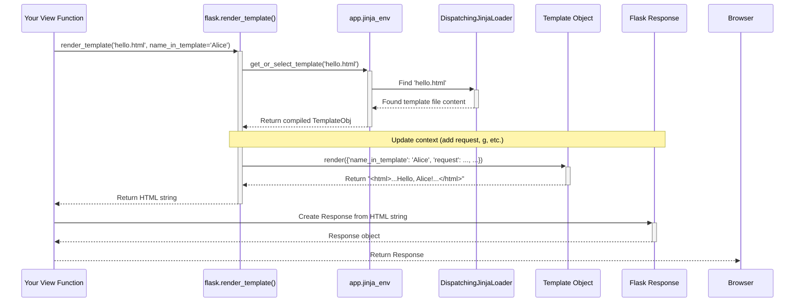

# Chapter 4: Templating (Jinja2 Integration)

Welcome back! In [Chapter 3: Request and Response Objects](03_request_and_response_objects.md), we saw how to handle incoming requests and craft outgoing responses. We even created a simple HTML form, but we had to write the HTML code directly as a string inside our Python function. Imagine building a whole website like that – it would get very messy very quickly!

How can we separate the design and structure of our web pages (HTML) from the Python code that generates the dynamic content? This chapter introduces **Templating**.

## What Problem Does It Solve? Mixing Code and Design is Messy

Think about writing a personalized email newsletter. You have a standard letter format (the design), but you need to insert specific details for each recipient (the dynamic data), like their name. You wouldn't want to write the entire letter from scratch in your code for every single person!

Similarly, when building a web page, you have the HTML structure (the design), but parts of it need to change based on data from your application (like showing the currently logged-in user's name, a list of products, or search results). Putting complex HTML directly into your Python view functions makes the code hard to read, hard to maintain, and difficult for web designers (who might not know Python) to work on.

We need a way to create HTML "templates" with special placeholders for the dynamic parts, and then have our Python code fill in those placeholders with actual data.

Flask uses a powerful template engine called **Jinja2** to solve this problem. Jinja2 lets you create HTML files (or other text files) that include variables and simple logic (like loops and conditions) directly within the template itself. Flask provides a convenient function, `render_template`, to take one of these template files, fill in the data, and give you back the final HTML ready to send to the user's browser.

It's exactly like **mail merge**:

*   **Template File (`.html`):** Your standard letter format.
*   **Placeholders (`{{ variable }}`):** The spots where you'd put <<Name>> or <<Address>>.
*   **Context Variables (Python dictionary):** The actual data (e.g., `name="Alice"`, `address="..."`).
*   **`render_template` Function:** The mail merge tool itself.
*   **Final HTML:** The personalized letter ready to be sent.

## Creating Your First Template

By default, Flask looks for template files in a folder named `templates` right next to your main application file (like `hello.py`).

1.  Create a folder named `templates` in the same directory as your `hello.py` file.
2.  Inside the `templates` folder, create a file named `hello.html`.

```html
<!-- templates/hello.html -->

<!doctype html>
<html>
  <head>
    <title>Hello Flask!</title>
  </head>
  <body>
    <h1>Hello, {{ name_in_template }}!</h1>
    <p>Welcome to our templated page.</p>
  </body>
</html>

```

**Explanation:**

*   This is mostly standard HTML.
*   `{{ name_in_template }}`: This is a Jinja2 **placeholder** or **expression**. It tells Jinja2: "When this template is rendered, replace this part with the value of the variable named `name_in_template` that the Python code provides."

## Rendering Templates with `render_template`

Now, let's modify our Python code (`hello.py`) to use this template. We need to:

1.  Import the `render_template` function from Flask.
2.  Call `render_template` in our view function, passing the name of the template file and any variables we want to make available in the template.

```python
# hello.py

# Make sure 'request' is imported if you use it elsewhere,
# otherwise remove it for this example.
from flask import Flask, render_template

app = Flask(__name__)

# Route for the homepage
@app.route('/')
def index():
  # The name we want to display in the template
  user_name = "World"
  # Render the template, passing the user_name as a variable
  # The key on the left ('name_in_template') is how we access it in HTML.
  # The value on the right (user_name) is the Python variable.
  return render_template('hello.html', name_in_template=user_name)

# NEW Route to greet a specific user using the same template
@app.route('/user/<username>')
def greet_user(username):
  # Here, 'username' comes from the URL
  # We still use 'name_in_template' as the key for the template
  return render_template('hello.html', name_in_template=username)

# Code to run the app (from Chapter 1)
if __name__ == '__main__':
  app.run(debug=True)
```

**Explanation:**

*   `from flask import render_template`: We import the necessary function.
*   `render_template('hello.html', ...)`: This tells Flask to find the `hello.html` file (it looks in the `templates` folder).
*   `name_in_template=user_name`: This is the crucial part where we pass data *into* the template. This creates a "context" dictionary like `{'name_in_template': 'World'}` (or `{'name_in_template': 'Alice'}` in the second route). Jinja2 uses this context to fill in the placeholders. The keyword argument name (`name_in_template`) **must match** the variable name used inside the `{{ }}` in the HTML file.

**Running this:**

1.  Make sure you have the `templates` folder with `hello.html` inside it.
2.  Save the updated `hello.py`.
3.  Run `python hello.py` in your terminal.
4.  Visit `http://127.0.0.1:5000/`. Your browser will receive and display HTML generated from `hello.html`, showing: "Hello, World!".
5.  Visit `http://127.0.0.1:5000/user/Alice`. Your browser will receive HTML generated from the *same* `hello.html` template, but this time showing: "Hello, Alice!".

See how we reused the same HTML structure but dynamically changed the content using `render_template` and variables!

## Basic Jinja2 Syntax: Variables, Conditionals, and Loops

Jinja2 offers more than just variable substitution. You can use basic programming constructs right inside your HTML.

There are two main types of delimiters:


*   `{{ ... }}`: Used for **expressions**. This is where you put variables you want to display, or even simple calculations or function calls. The result is inserted into the HTML.
*   ``: Used for **statements**. This includes things like `if`/`else` blocks, `for` loops, and other control structures. These don't directly output text but control how the template is rendered.


Let's look at some examples.

### Example: Using `if`/`else`

Imagine you want to show different content depending on whether a user is logged in.

**Python (`hello.py`):**

```python
# hello.py (add this route)

@app.route('/profile')
def profile():
  # Simulate a logged-in user for demonstration
  current_user = {'name': 'Charlie', 'is_logged_in': True}
  # Simulate no user logged in
  # current_user = None
  return render_template('profile.html', user=current_user)

# ... (keep other routes and run code)
```

**Template (`templates/profile.html`):**

```html
<!-- templates/profile.html -->

<!doctype html>
<html>
<head><title>User Profile</title></head>
<body>
  
    <h1>Welcome back, {{ user.name }}!</h1>
    <p>You are logged in.</p>
  
    <h1>Welcome, Guest!</h1>
    <p>Please log in.</p>
  
</body>
</html>

```

**Explanation:**


*   ``: Starts an `if` block. Jinja2 checks if the `user` variable exists and if its `is_logged_in` attribute is true.
*   ``: If the `if` condition is false, the code under `else` is used.
*   ``: Marks the end of the `if` block.
*   `{{ user.name }}`: Accesses the `name` attribute of the `user` dictionary passed from Python.


If you run this and visit `/profile`, you'll see the "Welcome back, Charlie!" message. If you change `current_user` to `None` in the Python code and refresh, you'll see the "Welcome, Guest!" message.

### Example: Using `for` Loops

Let's say you want to display a list of items.

**Python (`hello.py`):**

```python
# hello.py (add this route)

@app.route('/items')
def show_items():
  item_list = ['Apple', 'Banana', 'Cherry']
  return render_template('items.html', items=item_list)

# ... (keep other routes and run code)
```

**Template (`templates/items.html`):**

```html
<!-- templates/items.html -->

<!doctype html>
<html>
<head><title>Item List</title></head>
<body>
  <h2>Available Items:</h2>
  <ul>
    
      <li>{{ fruit }}</li>
    
      <li>No items available.</li>
    
  </ul>
</body>
</html>

```

**Explanation:**


*   ``: Starts a `for` loop. It iterates over the `items` list passed from Python. In each iteration, the current item is assigned to the variable `fruit`.
*   `<li>{{ fruit }}</li>`: Inside the loop, we display the current `fruit`.
*   ``: This optional block is executed if the `items` list was empty.
*   ``: Marks the end of the `for` loop.


Visiting `/items` will show a bulleted list of the fruits.

## Generating URLs within Templates using `url_for`

Just like we used `url_for` in Python ([Chapter 2: Routing System](02_routing_system.md)) to avoid hardcoding URLs, we often need to generate URLs within our HTML templates (e.g., for links or form actions). Flask automatically makes the `url_for` function available inside your Jinja2 templates.

**Template (`templates/navigation.html`):**

```html
<!-- templates/navigation.html -->

<nav>
  <ul>
    <li><a href="{{ url_for('index') }}">Home</a></li>
    <li><a href="{{ url_for('show_items') }}">Items</a></li>
    <li><a href="{{ url_for('greet_user', username='Admin') }}">Admin Profile</a></li>
    <!-- Example link that might require login -->
    
      <li><a href="{{ url_for('profile') }}">My Profile</a></li>
    
      <li><a href="#">Login</a></li> {# Replace # with login URL later #}
    
  </ul>
</nav>

```

**Explanation:**


*   `{{ url_for('index') }}`: Generates the URL for the view function associated with the endpoint `'index'` (which is likely `/`).
*   `{{ url_for('show_items') }}`: Generates the URL for the `show_items` endpoint (likely `/items`).
*   `{{ url_for('greet_user', username='Admin') }}`: Generates the URL for the `greet_user` endpoint, filling in the `username` variable (likely `/user/Admin`).


Using `url_for` in templates ensures that your links will always point to the correct place, even if you change the URL rules in your Python code later.

## Under the Hood: How `render_template` Works

When you call `render_template('some_template.html', var=value)`, here's a simplified sequence of what happens inside Flask and Jinja2:


1.  **Get Jinja Environment:** Flask accesses its configured Jinja2 environment (`current_app.jinja_env`). This environment holds the settings, filters, globals, and crucially, the **template loader**. (See `templating.py:render_template` which accesses `current_app.jinja_env`).
2.  **Find Template:** The environment asks its loader (`app.jinja_env.loader`, which is typically a `DispatchingJinjaLoader` as created in `app.py:create_jinja_environment` and `templating.py:Environment`) to find the template file (`'some_template.html'`).
3.  **Loader Search:** The `DispatchingJinjaLoader` knows where to look:
    *   It first checks the application's `template_folder` (usually `./templates`).
    *   If not found, it checks the `template_folder` of any registered Blueprints (more on those in [Chapter 8: Blueprints](08_blueprints.md)). (See `templating.py:DispatchingJinjaLoader._iter_loaders`).
4.  **Load and Parse:** Once the loader finds the file, Jinja2 reads its content, parses it, and compiles it into an internal representation (a `Template` object) for efficient rendering. This might be cached. (Handled by `jinja_env.get_or_select_template`).
5.  **Update Context:** Flask calls `app.update_template_context(context)` to add standard variables like `request`, `session`, `g`, and `config` to the dictionary of variables you passed (`{'var': value}`). This is done using "context processors" (more in [Chapter 5](05_context_globals___current_app____request____session____g__.md)). (See `templating.py:_render`).
6.  **Signal:** Flask sends the `before_render_template` signal.
7.  **Render:** The `Template` object's `render()` method is called with the combined context dictionary. Jinja2 processes the template, executing statements (``) and substituting expressions (`{{ }}`) with values from the context.
8.  **Return HTML:** The `render()` method returns the final, fully rendered HTML string.
9.  **Signal:** Flask sends the `template_rendered` signal.
10. **Send Response:** Flask takes this HTML string and builds an HTTP Response object to send back to the browser ([Chapter 3](03_request_and_response_objects.md)).




The key players are the `Flask` application instance (which holds the Jinja2 environment configuration), the `render_template` function, and the Jinja2 `Environment` itself, which uses loaders to find templates and context processors to enrich the data available during rendering.

## Conclusion

Templating is a fundamental technique for building dynamic web pages. Flask integrates seamlessly with the powerful Jinja2 template engine.


*   We learned that templating separates HTML structure from Python logic.
*   Flask looks for templates in a `templates` folder by default.
*   The `render_template()` function is used to load a template file and pass data (context variables) to it.
*   Jinja2 templates use `{{ variable }}` to display data and `` for control flow (like `if` and `for`).
*   The `url_for()` function is available in templates for generating URLs dynamically.


Now you can create clean, maintainable HTML pages driven by your Flask application's data and logic.

But how do functions like `url_for`, and variables like `request` and `session`, magically become available inside templates without us explicitly passing them every time? This happens through Flask's context system and context processors. Let's explore these "magic" variables in the next chapter.

Ready to uncover the context? Let's move on to [Chapter 5: Context Globals (`current_app`, `request`, `session`, `g`)](05_context_globals___current_app____request____session____g__.md).

---

Generated by [AI Codebase Knowledge Builder](https://github.com/The-Pocket/Tutorial-Codebase-Knowledge)