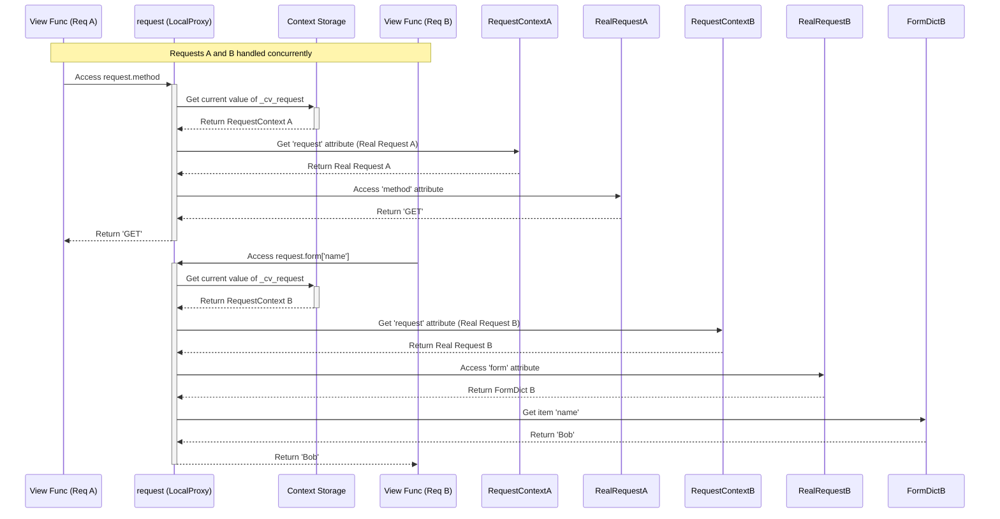

# Chapter 5: Context Globals (`current_app`, `request`, `session`, `g`)

Welcome back! In [Chapter 4: Templating (Jinja2 Integration)](04_templating__jinja2_integration_.md), we learned how to separate our HTML structure from our Python code using templates and the `render_template` function. We saw how variables like `request` and functions like `url_for` seemed to be magically available in our templates.

But how does that work? And more importantly, how can we easily access important information like the current application instance or the details of the incoming web request *inside* our Python view functions without passing these objects around manually to every single function? Imagine having to add `app` and `request` as arguments to all your helper functions – it would be very repetitive!

This chapter introduces Flask's solution: **Context Globals**.

## What Problem Do They Solve? Avoiding Tedious Parameter Passing

Think about working on a team project. There are certain tools or pieces of information everyone on the team needs access to frequently: the project plan, the shared calendar, the main contact person. It would be inefficient if every time someone needed the project plan, they had to specifically ask someone else to pass it to them. Instead, you might have a central place or a well-known name (like "The Plan") that everyone knows how to find.

Similarly, in a Flask application, several objects are very commonly needed while handling a web request:

*   The application instance itself (to access configuration, loggers, etc.).
*   The incoming request object (to get form data, query parameters, headers, etc.).
*   A way to store temporary information related to the current user across multiple requests (the session).
*   A temporary storage space just for the *current* request.

Passing these objects explicitly as parameters to every function that might need them (especially view functions, `before_request` functions, `after_request` functions, template context processors) would make our code cluttered and harder to manage.

Flask provides special "global" variables – **`current_app`**, **`request`**, **`session`**, and **`g`** – that act like smart pointers. They automatically find and give you access to the *correct* object relevant to the specific request you are currently handling, without you needing to pass anything around. They feel like magic variables!

## Meet the Context Globals

These special variables are technically called **proxies**. Think of a proxy as a stand-in or an agent. When you talk to the `request` proxy, it secretly finds the *actual* request object for the HTTP request that is currently being processed and acts on its behalf. This magic happens using Flask's "context" system, which we'll touch on later and explore more in [Chapter 7](07_application_and_request_contexts.md).

Let's meet the main context globals:

1.  **`request`**: Represents the incoming HTTP request from the client (browser). It contains all the data the client sent, like form data, URL parameters, HTTP headers, the requested URL, etc. We already used this in [Chapter 3: Request and Response Objects](03_request_and_response_objects.md).
2.  **`session`**: A dictionary-like object that lets you store information specific to a user *across multiple requests*. It's commonly used for things like remembering if a user is logged in, or storing items in a shopping cart. Flask typically uses secure cookies to handle this.
3.  **`current_app`**: Represents the *instance* of your Flask application that is handling the current request. This is useful for accessing application-wide configurations, resources, or extensions. It points to the same object you created with `app = Flask(__name__)` in [Chapter 1](01_application_object___flask__.md), but you can access it from anywhere *during* a request without needing the `app` variable directly.
4.  **`g`**: A simple namespace object (think of it like an empty box or scratchpad) that is available only for the duration of the *current request*. You can use it to store temporary data that multiple functions within the same request cycle might need access to, without passing it around. For example, you might store the current logged-in user object or a database connection here. It gets reset for every new request. The 'g' stands for "global", but it's global *only within the request context*.

## Using the Context Globals

First, you usually need to import them from the `flask` package:

```python
from flask import Flask, request, session, current_app, g, render_template
import os # For generating a secret key

# Create the application object
app = Flask(__name__)

# !! IMPORTANT !! Sessions require a secret key for security.
# In a real app, set this from an environment variable or config file!
# Never hardcode it like this in production.
app.config['SECRET_KEY'] = os.urandom(24)
# We'll learn more about config in Chapter 6: Configuration (Config)
```

Now let's see how to use them.

### `request`: Accessing Incoming Data

We saw this in Chapter 3. Notice how the `index` function can use `request` directly without it being passed as an argument.

```python
# hello.py (continued)

@app.route('/')
def index():
  user_agent = request.headers.get('User-Agent', 'Unknown')
  method = request.method
  return f'Welcome! Method: {method}, Browser: {user_agent}'
```

**Explanation:**

*   `request.headers.get(...)`: Accesses the HTTP headers from the incoming request.
*   `request.method`: Gets the HTTP method used (e.g., 'GET', 'POST').

Flask automatically makes the correct `request` object available here when the `/` route is visited.

### `current_app`: Accessing Application Settings

Imagine you want to log something using the application's logger or access a configuration value.

```python
# hello.py (continued)

# Add another config value for demonstration
app.config['MY_SETTING'] = 'Flask is Cool'

@app.route('/app-info')
def app_info():
  # Access the application's logger
  current_app.logger.info('Someone accessed the app-info page.')

  # Access a configuration value
  setting = current_app.config.get('MY_SETTING', 'Default Value')
  debug_mode = current_app.config['DEBUG'] # Accessing debug status

  return f'My Setting: {setting}<br>Debug Mode: {debug_mode}'

# Make sure debug is enabled for the logger example to show easily
# if __name__ == '__main__':
#   app.run(debug=True)
```

**Explanation:**

*   `current_app.logger.info(...)`: Uses the logger configured on the `app` object.
*   `current_app.config.get(...)`: Accesses the application's configuration dictionary.

Again, `app_info` doesn't need `app` passed in; `current_app` provides access to it within the request context.

### `session`: Remembering Things Across Requests

Sessions allow you to store data associated with a specific user's browser session. Flask uses a secret key (`app.secret_key` or `app.config['SECRET_KEY']`) to cryptographically sign the session cookie, preventing users from modifying it. **Always set a strong, random secret key!**

Let's create a simple view counter that increments each time the *same* user visits the page.

```python
# hello.py (continued)

@app.route('/counter')
def counter():
  # Get the current count from the session, default to 0 if not found
  count = session.get('view_count', 0)

  # Increment the count
  count += 1

  # Store the new count back in the session
  session['view_count'] = count

  # Log the session content (for demonstration)
  current_app.logger.info(f"Session data: {session}")

  return f'You have visited this page {count} times during this session.'
```

**Explanation:**

*   `session.get('view_count', 0)`: Reads the `view_count` value from the session. If it's the first visit, it doesn't exist yet, so we default to `0`.
*   `session['view_count'] = count`: Stores the updated count back into the session.
*   Flask handles sending the updated session data back to the browser in a secure cookie behind the scenes.

**Running this:**

1.  Make sure `app.config['SECRET_KEY']` is set in your `hello.py`.
2.  Run `python hello.py`.
3.  Visit `http://127.0.0.1:5000/counter`. You'll see "You have visited this page 1 times...".
4.  Refresh the page. You'll see "You have visited this page 2 times...".
5.  Refresh again. It will become 3, and so on.
6.  If you close your browser completely and reopen it (or use a private/incognito window), the count will reset to 1 because the session cookie is typically cleared or different.

### `g`: Temporary Storage for a Single Request

The `g` object is useful for storing data that needs to be accessed by multiple functions *within the same request cycle*. A common example is loading the current user's information from a database or verifying an API key. You might do this in a `@app.before_request` function and then access the result in your view function using `g`.

Let's simulate loading some data before the request and accessing it in the view.

```python
# hello.py (continued)
import time

# This function runs BEFORE every request
@app.before_request
def load_request_data():
  # Imagine loading data from a database or external source here
  g.request_time = time.time()
  g.user = 'Guest' # Default user
  # Maybe check for an API key or user session here and set g.user accordingly
  # For example: if session.get('logged_in_user'): g.user = session['logged_in_user']
  current_app.logger.info(f"Before request: Set g.user to {g.user}")

@app.route('/show-g')
def show_g():
  # Access the data stored in 'g' by the before_request handler
  req_time = g.get('request_time', 'Not Set')
  current_user = g.get('user', 'Unknown')

  # Check if it's still there after the request (it shouldn't be for the *next* request)
  # We can't easily show this here, but g is cleared between requests.

  return f'Data from g:<br>Request Time: {req_time}<br>User: {current_user}'

# This function runs AFTER every request, even if errors occur
# It receives the response object
@app.teardown_request
def teardown_request_data(exception=None):
    # This is a good place to clean up resources stored in g, like DB connections
    req_time = g.pop('request_time', None) # Safely remove request_time
    user = g.pop('user', None) # Safely remove user
    if req_time:
      duration = time.time() - req_time
      current_app.logger.info(f"Teardown request: User={user}, Duration={duration:.4f}s")
    else:
      current_app.logger.info("Teardown request: g values already popped or not set.")

# ... (rest of the app, including if __name__ == '__main__': app.run(debug=True))
```

**Explanation:**

*   `@app.before_request`: This decorator registers `load_request_data` to run before each request is processed.
*   `g.request_time = ...` and `g.user = ...`: We store arbitrary data on the `g` object. It acts like a Python object where you can set attributes.
*   `g.get('request_time', ...)`: In the view function `show_g`, we retrieve the data stored on `g`. Using `.get()` is safer as it allows providing a default if the attribute wasn't set.
*   `@app.teardown_request`: This decorator registers `teardown_request_data` to run after the request has been handled and the response sent, even if an exception occurred. It's a good place to clean up resources stored in `g`. `g.pop()` is used to get the value and remove it, preventing potential issues if the teardown runs multiple times in complex scenarios.

When you visit `/show-g`, the `before_request` function runs first, setting `g.user` and `g.request_time`. Then `show_g` runs and reads those values from `g`. Finally, `teardown_request` runs. If you make another request, `g` will be empty again until `before_request` runs for that *new* request.

## Why "Context"? The Magic Behind the Scenes

How do these globals always know which `request` or `app` to point to, especially if your web server is handling multiple requests at the same time?

Flask manages this using **Contexts**. There are two main types:

1.  **Application Context:** Holds information about the application itself. When an application context is active, `current_app` and `g` point to the correct application instance and its request-global storage (`g`). An application context is automatically created when a request context is pushed, or you can create one manually using `with app.app_context():`. This is needed for tasks that aren't tied to a specific request but need the application, like running background jobs or initializing database tables via a script.
2.  **Request Context:** Holds information about a single, specific HTTP request. When a request context is active, `request` and `session` point to the correct request object and session data for *that specific request*. Flask automatically creates and activates (pushes) a request context when it receives an incoming HTTP request and removes (pops) it when the request is finished.

Think of these contexts like temporary bubbles or environments. When Flask handles a request, it inflates a request context bubble (which automatically includes an application context bubble inside it). Inside this bubble, the names `request`, `session`, `current_app`, and `g` are set up to point to the objects belonging to *that specific bubble*. If another request comes in concurrently (in a different thread or process), Flask creates a *separate* bubble for it, and the context globals inside that second bubble point to *its* own request, session, app, and g objects.

This system ensures that even with multiple simultaneous requests, `request` in the code handling request A always refers to request A's data, while `request` in the code handling request B always refers to request B's data.

We will explore contexts in more detail in [Chapter 7: Application and Request Contexts](07_application_and_request_contexts.md).

## Under the Hood: Proxies and `contextvars`

How do these variables like `request` actually *do* the lookup within the current context?

Flask uses a concept called **Local Proxies**, specifically `werkzeug.local.LocalProxy`. These proxy objects are essentially clever stand-ins. When you access an attribute or method on a proxy (like `request.method`), the proxy doesn't have the method itself. Instead, it performs a lookup to find the *real* object it should be representing *at that moment* based on the current context.

Under the hood, Flask (since version 1.1, leveraging Werkzeug updates) uses Python's built-in `contextvars` module (or a backport for older Python versions). `contextvars` provides special kinds of variables (`ContextVar`) that can hold different values depending on the current execution context (like the specific request/thread/async task being handled).

1.  Flask defines context variables, for example, `_cv_request` in `flask.globals`.
2.  When a request context is pushed (`RequestContext.push()` in `ctx.py`), Flask stores the actual `Request` object for the current request into `_cv_request` *for the current context*.
3.  The `request` global variable (defined in `flask.globals`) is a `LocalProxy` that is configured to look up the object stored in `_cv_request`.
4.  When your code uses `request.method`, the proxy sees it needs the real request object, looks at the current context's value for `_cv_request`, gets the real `Request` object stored there, and then calls the `.method` attribute on *that* object.

A similar process happens for `current_app`, `session`, and `g` using `_cv_app`.

Here's how `request` and `session` are defined in `flask/globals.py`:

```python
# flask/globals.py (simplified)
from contextvars import ContextVar
from werkzeug.local import LocalProxy
# ... other imports

# Context Variables hold the actual context objects
_cv_app: ContextVar[AppContext] = ContextVar("flask.app_ctx")
_cv_request: ContextVar[RequestContext] = ContextVar("flask.request_ctx")

# Proxies point to objects within the currently active context
# The LocalProxy is told how to find the real object (e.g., via _cv_request)
# and which attribute on that context object to return (e.g., 'request')
request: Request = LocalProxy(_cv_request, "request") # type: ignore
session: SessionMixin = LocalProxy(_cv_request, "session") # type: ignore
current_app: Flask = LocalProxy(_cv_app, "app") # type: ignore
g: _AppCtxGlobals = LocalProxy(_cv_app, "g") # type: ignore
```

This proxy mechanism allows you to write clean code using simple global names, while Flask handles the complexity of ensuring those names point to the correct, context-specific objects behind the scenes.

Here's a diagram showing two concurrent requests and how the `request` proxy resolves differently in each context:



## Conclusion

You've learned about Flask's Context Globals: `current_app`, `request`, `session`, and `g`. These are powerful proxy objects that simplify your code by providing easy access to application- or request-specific information without needing to pass objects around manually.

*   **`request`**: Accesses incoming request data.
*   **`session`**: Stores user-specific data across requests (requires `SECRET_KEY`).
*   **`current_app`**: Accesses the active application instance and its config/resources.
*   **`g`**: A temporary storage space for the duration of a single request.

These globals work their magic through Flask's **context** system (Application Context and Request Context) and **proxies** that look up the correct object in the currently active context, often powered by Python's `contextvars`.

Understanding these globals is key to writing idiomatic Flask code. You'll frequently use `request` to handle user input, `session` for user state, `current_app` for configuration, and `g` for managing request-scoped resources like database connections.

Speaking of configuration, how exactly do we set things like the `SECRET_KEY`, database URLs, or other settings for our application? That's the topic of our next chapter.

Let's learn how to manage settings effectively in [Chapter 6: Configuration (`Config`)](06_configuration___config__.md).

---

Generated by [AI Codebase Knowledge Builder](https://github.com/The-Pocket/Tutorial-Codebase-Knowledge)