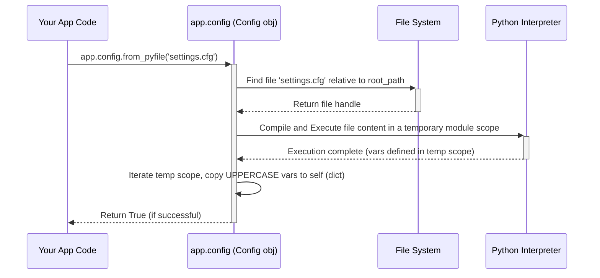

# Chapter 6: Configuration (`Config`)

Welcome back! In [Chapter 5: Context Globals (`current_app`, `request`, `session`, `g`)](05_context_globals___current_app____request____session____g__.md), we saw how Flask uses context globals like `current_app` and `session`. We even learned that using the `session` requires setting a `SECRET_KEY` on our application object. But where is the best place to put settings like the secret key, or maybe a database connection string, or a flag to turn debugging features on or off? We definitely don't want to hardcode these directly into our main application logic!

This chapter introduces Flask's built-in solution: the **Configuration** system.

## What Problem Does It Solve? The Need for a Settings Panel

Imagine building a piece of electronic equipment, like a stereo amplifier. It has various knobs and switches: volume, bass, treble, input source selectors. These controls allow you to adjust the amplifier's behavior without opening it up and rewiring things.

A web application also needs settings to control its behavior:

*   **Security:** A `SECRET_KEY` is needed for secure sessions.
*   **Debugging:** Should detailed error messages be shown (useful for development, dangerous for production)?
*   **Database:** Where is the database located? What are the login credentials?
*   **External Services:** What are the API keys for services like email sending or payment processing?

Hardcoding these values directly in your view functions or application setup code is messy and inflexible. If you need to change the database location when deploying your app from your laptop to a real server, you'd have to find and change the code. This is prone to errors and makes managing different environments (development, testing, production) difficult.

Flask provides a central object, usually accessed via `app.config`, that acts like your application's main **settings panel**. It's a dictionary-like object where you can store all your configuration values. Flask itself uses this object for its own settings (like `DEBUG` or `SECRET_KEY`), and you can add your own custom settings too. Crucially, Flask provides convenient ways to load these settings from different places, like files or environment variables, keeping your configuration separate from your code.

Our primary use case right now is setting the `SECRET_KEY` properly so we can use the `session` object securely, as discussed in [Chapter 5](05_context_globals___current_app____request____session____g__.md).

## Meet `app.config`

When you create a Flask application object (`app = Flask(__name__)`), Flask automatically creates a configuration object for you, accessible as `app.config`.

*   It works like a standard Python dictionary: you can store values using keys (e.g., `app.config['SECRET_KEY'] = '...'`) and retrieve them (e.g., `key = app.config['SECRET_KEY']`).
*   Keys are typically uppercase strings (e.g., `DEBUG`, `DATABASE_URI`). Flask's built-in settings follow this convention, and it's recommended for your own settings too.
*   It comes pre-populated with some default values.
*   It has special methods to load configuration from various sources.

## Populating the Configuration

There are several ways to add settings to `app.config`. Let's explore the most common ones.

### 1. Directly from Code (In-Place)

You can set configuration values directly like you would with a dictionary. This is often done right after creating the `app` object.

```python
# hello.py (or your main app file)
from flask import Flask
import os

app = Flask(__name__)

# Setting configuration directly
app.config['DEBUG'] = True # Turn on debug mode
app.config['SECRET_KEY'] = os.urandom(24) # Generate a random key (OK for simple dev)
app.config['MY_CUSTOM_SETTING'] = 'Hello Config!'

print(f"Debug mode is: {app.config['DEBUG']}")
print(f"My custom setting: {app.config.get('MY_CUSTOM_SETTING')}")
# Using .get() is safer if the key might not exist
print(f"Another setting: {app.config.get('NON_EXISTENT_KEY', 'Default Value')}")

# ... rest of your app (routes, etc.) ...

# Example route accessing config
@app.route('/config-example')
def config_example():
  custom_val = app.config.get('MY_CUSTOM_SETTING', 'Not set')
  return f'The custom setting is: {custom_val}'

if __name__ == '__main__':
  # The app.run(debug=True) argument also sets app.config['DEBUG'] = True
  # but setting it explicitly ensures it's set even if run differently.
  app.run()
```

**Explanation:**

*   We directly assign values to keys in `app.config`.
*   `os.urandom(24)` generates a random byte string suitable for a secret key during development. **Never hardcode a predictable secret key, especially in production!**
*   We can access values using `[]` or the safer `.get()` method which allows providing a default.

**When to use:** Good for setting Flask's built-in defaults (like `DEBUG`) temporarily during development or setting simple, non-sensitive values. **Not ideal for secrets or complex configurations**, especially for deployment, as it mixes configuration with code.

### 2. From a Python Object (`from_object`)

You can define your configuration in a separate Python object (like a class) or a dedicated module (`.py` file) and then load it using `app.config.from_object()`. This method only loads attributes whose names are **all uppercase**.

First, create a configuration file, say `config.py`:

```python
# config.py
# Note: Only uppercase variables will be loaded by from_object

DEBUG = True # Set debug mode
SECRET_KEY = 'a-very-secret-and-complex-key-loaded-from-object' # KEEP SECRET IN REAL APPS
DATABASE_URI = 'sqlite:///mydatabase.db'

# This lowercase variable will NOT be loaded into app.config
internal_value = 'ignore me'
```

Now, load it in your main application file:

```python
# hello.py
from flask import Flask

app = Flask(__name__)

# Load configuration from the config.py file (using its import path as a string)
app.config.from_object('config')
# Alternatively, if you imported the module:
# import config
# app.config.from_object(config)

print(f"Loaded Debug: {app.config.get('DEBUG')}")
print(f"Loaded Secret Key: {app.config.get('SECRET_KEY')}")
print(f"Loaded DB URI: {app.config.get('DATABASE_URI')}")
print(f"Internal Value (should be None): {app.config.get('internal_value')}")

# ... rest of your app ...
if __name__ == '__main__':
  app.run()
```

**Explanation:**

*   `app.config.from_object('config')` tells Flask to import the module named `config` (which corresponds to `config.py`) and look for any uppercase attributes (`DEBUG`, `SECRET_KEY`, `DATABASE_URI`).
*   It copies the values of these uppercase attributes into the `app.config` dictionary.
*   `internal_value` is ignored because it's lowercase.

**When to use:** Great for organizing your default configuration or different configurations (e.g., `DevelopmentConfig`, `ProductionConfig` classes) within your project structure. Helps keep settings separate from application logic.

### 3. From a Python File (`from_pyfile`)

Similar to `from_object`, but instead of importing a module, `app.config.from_pyfile()` executes a Python file (it doesn't have to end in `.py`, often `.cfg` is used by convention) and loads its uppercase variables.

Create a configuration file, say `settings.cfg`:

```python
# settings.cfg
# This file will be executed by Python

SECRET_KEY = 'secret-key-loaded-from-pyfile'
SERVER_NAME = '127.0.0.1:5000' # Example setting

# You can even have simple logic if needed
import os
APP_ROOT = os.path.dirname(__file__)
```

Load it in your application:

```python
# hello.py
from flask import Flask
import os

app = Flask(__name__)

# Construct the path to the config file relative to this file
# __file__ is the path to the current python script (hello.py)
# os.path.dirname gets the directory containing hello.py
# os.path.join creates the full path to settings.cfg
config_file_path = os.path.join(os.path.dirname(__file__), 'settings.cfg')

# Load configuration from the file
# Set silent=True to ignore errors if the file doesn't exist
loaded = app.config.from_pyfile(config_file_path, silent=False)

if loaded:
    print("Loaded config from settings.cfg")
    print(f"Loaded Secret Key: {app.config.get('SECRET_KEY')}")
    print(f"Loaded Server Name: {app.config.get('SERVER_NAME')}")
    print(f"Calculated APP_ROOT: {app.config.get('APP_ROOT')}")
else:
    print("Could not load settings.cfg")

# ... rest of your app ...
if __name__ == '__main__':
  app.run()
```

**Explanation:**

*   `app.config.from_pyfile('settings.cfg')` reads the specified file, executes it as Python code, and loads the uppercase variables into `app.config`.
*   This allows configuration files to be simple variable assignments but also include basic Python logic if needed.
*   The `silent=True` argument is useful if the config file is optional.

**When to use:** Very flexible. Good for separating configuration completely from your application package. Often used for instance-specific configurations (settings for a particular deployment).

### 4. From Environment Variables (`from_envvar`)

This is a common pattern, especially for production deployment. Instead of hardcoding the *path* to a configuration file, you store the path in an environment variable. `app.config.from_envvar()` reads the filename from the specified environment variable and then loads that file using `from_pyfile`.

Imagine you have your `settings.cfg` from the previous example.

Before running your app, you set an environment variable in your terminal:

*   **Linux/macOS:** `export YOURAPP_SETTINGS=/path/to/your/settings.cfg`
*   **Windows (cmd):** `set YOURAPP_SETTINGS=C:\path\to\your\settings.cfg`
*   **Windows (PowerShell):** `$env:YOURAPP_SETTINGS="C:\path\to\your\settings.cfg"`

Then, in your code:

```python
# hello.py
from flask import Flask

app = Flask(__name__)

# Load configuration from the file specified by the YOURAPP_SETTINGS env var
# Set silent=True to allow the app to run even if the env var isn't set
loaded = app.config.from_envvar('YOURAPP_SETTINGS', silent=True)

if loaded:
    print(f"Loaded config from file specified in YOURAPP_SETTINGS: {app.config.get('SECRET_KEY')}")
else:
    print("YOURAPP_SETTINGS environment variable not set or file not found.")
    # You might want to set default configs here or raise an error

# ... rest of your app ...
if __name__ == '__main__':
  app.run()

```

**Explanation:**

*   `app.config.from_envvar('YOURAPP_SETTINGS')` looks for the environment variable `YOURAPP_SETTINGS`.
*   If found, it takes the value (which should be a file path, e.g., `/path/to/your/settings.cfg`) and loads that file using `from_pyfile()`.
*   This decouples the *location* of the config file from your application code.

**When to use:** Excellent for production and deployment. Allows operators to specify the configuration file location without modifying the application code. Essential for managing different environments (development, staging, production) where configuration files might reside in different places or contain different values (especially secrets).

### Loading Order and Overrides

You can use multiple loading methods. Each subsequent method will **override** any values set by previous methods if the keys are the same.

A common pattern is:

1.  Set default values directly in `app.config` or load from a default `config.py` using `from_object`.
2.  Load settings from an instance-specific file (e.g., `settings.cfg`) using `from_pyfile` or `from_envvar`. This allows deployment-specific settings (like database URLs or secret keys) to override the defaults.

```python
# hello.py
from flask import Flask
import os

app = Flask(__name__)

# 1. Set built-in defaults maybe? Or load from a base config object.
app.config['DEBUG'] = False # Default to False for safety
app.config['SECRET_KEY'] = 'default-insecure-key' # Default bad key

# You could load more defaults from an object here:
# app.config.from_object('yourapp.default_config')

# 2. Try to load from an environment variable pointing to a deployment-specific file
config_file_path = os.environ.get('YOURAPP_SETTINGS')
if config_file_path:
    try:
        app.config.from_pyfile(config_file_path)
        print(f"Loaded overrides from {config_file_path}")
    except OSError as e:
        print(f"Warning: Could not load config file {config_file_path}: {e}")
else:
    print("Info: YOURAPP_SETTINGS environment variable not set, using defaults.")


print(f"Final Debug value: {app.config['DEBUG']}")
print(f"Final Secret Key: {app.config['SECRET_KEY']}")

# ... rest of your app ...
if __name__ == '__main__':
  app.run()
```

Now, if `YOURAPP_SETTINGS` points to a file containing `DEBUG = True` and a different `SECRET_KEY`, those values will override the defaults set earlier.

## Accessing Configuration Values

Once loaded, you can access configuration values anywhere you have access to the application object (`app`) or the `current_app` proxy (within a request or application context, see [Chapter 5](05_context_globals___current_app____request____session____g__.md)).

```python
from flask import current_app, session

# Inside a view function or other request-context code:
@app.route('/some-route')
def some_view():
    # Using current_app proxy
    api_key = current_app.config.get('MY_API_KEY')
    if not api_key:
        return "Error: API Key not configured!", 500

    # Flask extensions often use app.config too
    session['user_id'] = 123 # Uses current_app.config['SECRET_KEY'] implicitly
    
    # ... use api_key ...
    return f"Using API Key starting with: {api_key[:5]}..."

# Accessing outside a request context (e.g., in setup code)
# Requires the app object directly or an app context
with app.app_context():
    print(f"Accessing SECRET_KEY via current_app: {current_app.config['SECRET_KEY']}")

# Or directly via the app object if available
print(f"Accessing SECRET_KEY via app: {app.config['SECRET_KEY']}")
```

## Under the Hood: The `Config` Object

What's happening when you call these methods?

1.  **`app.config` Object:** When you create `Flask(__name__)`, the `Flask` constructor creates an instance of `app.config_class` (which defaults to `flask.Config`) and assigns it to `app.config`. The constructor passes the application's `root_path` and the `default_config` dictionary. (See `Flask.__init__` in `app.py` calling `self.make_config`, which uses `self.config_class` defined in `sansio/app.py`).
2.  **`Config` Class:** The `flask.Config` class (in `config.py`) inherits directly from Python's built-in `dict`. This is why you can use standard dictionary methods like `[]`, `.get()`, `.update()`, etc.
3.  **Loading Methods:**
    *   `from_object(obj)`: If `obj` is a string, it imports it using `werkzeug.utils.import_string`. Then, it iterates through the attributes of the object (`dir(obj)`) and copies any attribute whose name is entirely uppercase into the config dictionary (`self[key] = getattr(obj, key)`).
    *   `from_pyfile(filename)`: It constructs the full path to the file using `os.path.join(self.root_path, filename)`. It creates a temporary module object (`types.ModuleType`). It opens and reads the file, compiles the content (`compile()`), and then executes it within the temporary module's dictionary (`exec(..., d.__dict__)`). Finally, it calls `self.from_object()` on the temporary module object to load the uppercase variables.
    *   `from_envvar(variable_name)`: It simply reads the environment variable (`os.environ.get(variable_name)`). If the variable exists and is not empty, it calls `self.from_pyfile()` using the value of the environment variable as the filename.

Here's a simplified diagram for `from_pyfile`:



The key takeaway is that `app.config` is fundamentally a Python dictionary enhanced with convenient methods for populating itself from common configuration sources like Python objects, files, and environment variables, filtering for uppercase keys.

## Conclusion

Configuration is essential for any non-trivial Flask application. The `app.config` object provides a centralized, dictionary-like store for all your application settings.

*   We learned that configuration helps separate settings (like `SECRET_KEY`, `DEBUG`, database URLs) from application code.
*   `app.config` is the central object, behaving like a dictionary.
*   We explored various ways to load configuration: directly in code, from Python objects (`from_object`), from Python files (`from_pyfile`), and via environment variables pointing to files (`from_envvar`).
*   We saw that loading order matters, allowing defaults to be overridden by deployment-specific settings.
*   Configuration can be accessed using `app.config` or `current_app.config`.

Properly managing configuration makes your application more secure, flexible, and easier to deploy and maintain across different environments.

Now that we've covered the main building blocks – the application object, routing, request/response handling, templating, context globals, and configuration – you might be wondering about the "magic" behind those context globals (`request`, `current_app`, etc.). How does Flask manage their state, especially when handling multiple requests? Let's delve deeper into the mechanics of contexts.

Ready to understand the context lifecycle? Let's move on to [Chapter 7: Application and Request Contexts](07_application_and_request_contexts.md).

---

Generated by [AI Codebase Knowledge Builder](https://github.com/The-Pocket/Tutorial-Codebase-Knowledge)