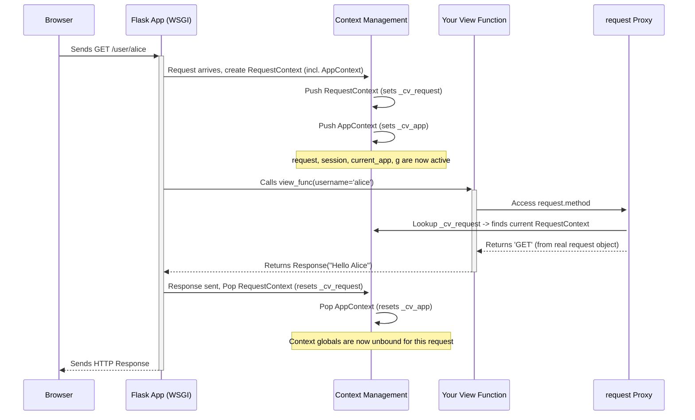

# Chapter 7: Application and Request Contexts

Welcome back! In [Chapter 6: Configuration (`Config`)](06_configuration___config__.md), we learned how to manage settings for our Flask application using the `app.config` object. And in [Chapter 5: Context Globals (`current_app`, `request`, `session`, `g`)](05_context_globals___current_app____request____session____g__.md), we met special variables like `request` and `current_app` that seem to magically know about the current request or application.

But how does Flask keep track of which request is which, especially if multiple users are accessing our web app at the same time? How does it ensure that `request` refers to *User A's* request when handling User A, and *User B's* request when handling User B? This magic is managed by **Application and Request Contexts**.

## What Problem Do They Solve? Keeping Things Separate

Imagine you're working at a busy service desk. Many people come up asking for different things simultaneously. You need a way to keep each person's request and related information separate from everyone else's. You can't just use one shared notepad for everyone – that would be chaos! Instead, for each person, you might create a temporary folder or workspace to hold their specific documents and details while you help them.

In a web application, your Flask server might be handling requests from many different users at the same time. Each request has its own data (like form submissions or URL parameters) and potentially its own user session. Storing this information in simple global variables in your Python code would be disastrous, as data from one request could overwrite or interfere with data from another.

Flask uses **Contexts** to solve this problem. Contexts act like those temporary, isolated workspaces. They ensure that variables like `request`, `session`, `current_app`, and `g` always point to the information relevant to the *specific task* Flask is currently working on (usually, handling one particular incoming web request).

## The Two Main Types of Contexts

Flask has two primary types of contexts:

1.  **Application Context (`AppContext`):**
    *   **Analogy:** Think of this as the main office building or the overall project workspace.
    *   **Purpose:** It holds information related to the application instance itself, regardless of any specific web request. It binds the `current_app` proxy (pointing to your `Flask` app instance) and the `g` proxy (a temporary storage space).
    *   **When is it active?** It's automatically active *during* a web request. It's also needed for tasks *outside* of web requests that still need access to the application, such as running command-line interface (CLI) commands (like database migrations) or background jobs.

2.  **Request Context (`RequestContext`):**
    *   **Analogy:** Think of this as a specific meeting room set up just for handling one client's request (one incoming web request).
    *   **Purpose:** It holds information specific to *one single incoming web request*. It binds the `request` proxy (containing details of the HTTP request) and the `session` proxy (for user-specific session data).
    *   **When is it active?** Flask automatically creates and activates a Request Context when a web request comes in, and removes it after the request is handled.
    *   **Relationship:** A Request Context *always* includes an Application Context within it. You can't have a meeting room (`RequestContext`) without being inside the main office building (`AppContext`).

Here's a simple breakdown:

| Context Type      | Analogy              | Key Globals Bound | Typical Use Case                     | Lifespan                                        |
| :---------------- | :------------------- | :---------------- | :----------------------------------- | :---------------------------------------------- |
| Application       | Main Office Building | `current_app`, `g`  | CLI commands, background tasks | Active during requests, or manually activated |
| Request           | Temporary Meeting Room | `request`, `session` | Handling a single web request      | Created/destroyed for each web request        |

## How Flask Uses Contexts Automatically (During Requests)

Most of the time, you don't need to worry about manually managing contexts. When a browser sends a request to your Flask application:

1.  **Request Arrives:** Your WSGI server (like the Flask development server) receives the HTTP request.
2.  **Context Creation:** Flask automatically creates a `RequestContext` object based on the incoming request details (the WSGI environment).
3.  **Context Pushing:** Flask *pushes* this `RequestContext`. This does two things:
    *   It makes the `request` and `session` proxies point to the specific request and session objects for *this* request.
    *   It *also* pushes an `AppContext` (if one isn't already active for this thread/task), making `current_app` and `g` point to the correct application and a fresh `g` object. "Pushing" is like activating that temporary workspace.
4.  **Code Execution:** Your view function runs. Because the contexts are active, you can freely use `request`, `session`, `current_app`, and `g` inside your function, and they will refer to the correct objects for the current request.
5.  **Response Sent:** Your view function returns a response.
6.  **Context Popping:** After the response is sent, Flask *pops* the `RequestContext` (and the `AppContext` if it was pushed along with it). This cleans up the workspace, effectively deactivating those specific `request`, `session`, and `g` objects for that request.

This automatic push/pop mechanism ensures that each request is handled in its own isolated context, preventing data clashes between concurrent requests.

## Manually Pushing Contexts (Outside Requests)

What if you need to access application settings or resources *outside* of a typical web request? For example, maybe you have a separate Python script (`init_db.py`) that needs to initialize your database using configuration stored in `app.config`. Since there's no incoming web request, Flask won't automatically create any contexts.

In these cases, you need to manually push an **Application Context** using `app.app_context()`.

```python
# init_db.py (Example script to run from command line)

from flask import Flask

# Assume your main Flask app object is defined in hello.py
# We need to import it here.
# In a real project, you'd structure this better, maybe using a factory function.
try:
    # Let's assume hello.py has app = Flask(__name__)
    from hello import app
except ImportError:
    print("Could not import 'app' from hello.py")
    print("Make sure hello.py exists and defines the Flask app.")
    exit(1)

# Define a function that needs app access
def setup_database():
    # We need an application context to access current_app.config
    # Without the 'with' block, current_app would not be available here.
    with app.app_context():
        # Now we can safely access app configuration via current_app
        db_uri = app.config.get('DATABASE_URI', 'No DB URI Set!')
        print(f"Inside app context: Accessing config...")
        print(f"Database URI found: {db_uri}")
        # Imagine database setup code here that uses the URI
        print("Database initialization logic would run here.")

# ---- Main execution part of the script ----
if __name__ == "__main__":
    print("Running database setup script...")
    setup_database()
    print("Script finished.")

```

**Explanation:**

*   `from hello import app`: We import the actual `Flask` application instance.
*   `with app.app_context():`: This is the key part! It creates an application context for the `app` instance and pushes it, making it active within the `with` block.
*   Inside the block, `current_app` becomes available and correctly points to our `app` object. We can now safely access `current_app.config`.
*   When the `with` block exits, the application context is automatically popped.

**To run this (assuming `hello.py` exists and defines `app`):**

1.  Save the code above as `init_db.py` in the same directory as `hello.py`.
2.  Optionally, add `app.config['DATABASE_URI'] = 'sqlite:///mydatabase.db'` to `hello.py` to see it picked up.
3.  Run from your terminal: `python init_db.py`
4.  You'll see output showing that the config was accessed successfully *inside* the context.

Similarly, if you need to simulate a request environment (perhaps for testing helper functions that rely on `request`), you can use `app.test_request_context()` which pushes both a Request and Application context.

```python
# example_test_context.py
from hello import app # Assuming hello.py defines app = Flask(__name__)

# A helper function that might be used inside a view
def get_user_agent_info():
    # This function relies on the 'request' context global
    from flask import request
    user_agent = request.headers.get('User-Agent', 'Unknown')
    return f"Request came from: {user_agent}"

# --- Simulate calling the function outside a real request ---
if __name__ == "__main__":
    # Create a test request context for a fake GET request to '/'
    # This pushes both Request and App contexts
    with app.test_request_context('/', method='GET'):
        # Now, inside this block, 'request' is available!
        print("Inside test request context...")
        agent_info = get_user_agent_info()
        print(agent_info)

    print("Outside context.")
    # Trying to call get_user_agent_info() here would fail because
    # the request context has been popped.
```

## Under the Hood: Context Locals and Stacks

How does Flask actually manage these contexts and make the globals like `request` point to the right object?

Historically, Flask used thread-local storage and maintained stacks of contexts for each thread. When `request` was accessed, it would look at the top of the request context stack *for the current thread*.

Modern Flask (leveraging updates in its core dependency, Werkzeug) relies on Python's built-in `contextvars` module. This module provides a more robust way to manage context-specific state that works correctly with both threads and modern asynchronous programming (like `async`/`await`).

Here's a simplified conceptual idea:

1.  **Context Variables:** Flask defines special "context variables" (using `contextvars.ContextVar`) for the application context (`_cv_app`) and the request context (`_cv_request`). Think of these like special slots that can hold different values depending on the current execution context (the specific request being handled).
2.  **Pushing:** When Flask pushes a context (e.g., `RequestContext.push()`), it stores the actual context object (like the `RequestContext` instance for the current request) into the corresponding context variable (`_cv_request.set(the_request_context)`).
3.  **Proxies:** The context globals (`request`, `session`, `current_app`, `g`) are special `LocalProxy` objects (from Werkzeug). They don't hold the data directly.
4.  **Proxy Access:** When you access something like `request.args`, the `request` proxy does the following:
    *   Looks up the *current* value stored in the `_cv_request` context variable. This gives it the *actual* `RequestContext` object for the currently active request.
    *   Retrieves the real `request` object stored *within* that `RequestContext`.
    *   Finally, accesses the `.args` attribute on that real request object.
5.  **Popping:** When Flask pops a context (e.g., `RequestContext.pop()`), it resets the context variable (`_cv_request.reset(token)`), effectively clearing that slot for the current context.

This `contextvars` mechanism ensures that even if your server is handling many requests concurrently (in different threads or async tasks), each one has its own isolated value for `_cv_app` and `_cv_request`, so the proxies always resolve to the correct objects for the task at hand.

Let's visualize the request lifecycle with contexts:



This diagram shows that Flask sets up (pushes) the context before calling your view and tears it down (pops) afterwards, allowing the proxies like `request` to find the right data while your code runs.

## Conclusion

Contexts are fundamental to how Flask manages state during the lifecycle of the application and individual requests. They provide isolated workspaces to prevent data from different requests interfering with each other.

*   **Application Context (`AppContext`):** Provides access to the application (`current_app`) and global storage (`g`). Used implicitly during requests and manually via `app.app_context()` for tasks like CLI commands.
*   **Request Context (`RequestContext`):** Provides access to request-specific data (`request`) and the user session (`session`). Automatically managed by Flask during the web request cycle. Contains an `AppContext`.
*   **Context Globals:** Proxies like `request` and `current_app` rely on the currently active contexts to find the correct objects.
*   **Management:** Flask usually handles context push/pop automatically for web requests. Manual pushing (`app.app_context()`, `app.test_request_context()`) is needed for specific scenarios like scripts, background jobs, or testing.

Understanding contexts helps explain how Flask allows convenient access to request and application data through globals while maintaining safety and isolation between concurrent operations.

Now that we understand how Flask manages state and configuration for the core application, how do we organize larger applications with multiple sections or features? That's where Blueprints come in.

Let's learn how to structure our projects in [Chapter 8: Blueprints](08_blueprints.md).

---

Generated by [AI Codebase Knowledge Builder](https://github.com/The-Pocket/Tutorial-Codebase-Knowledge)