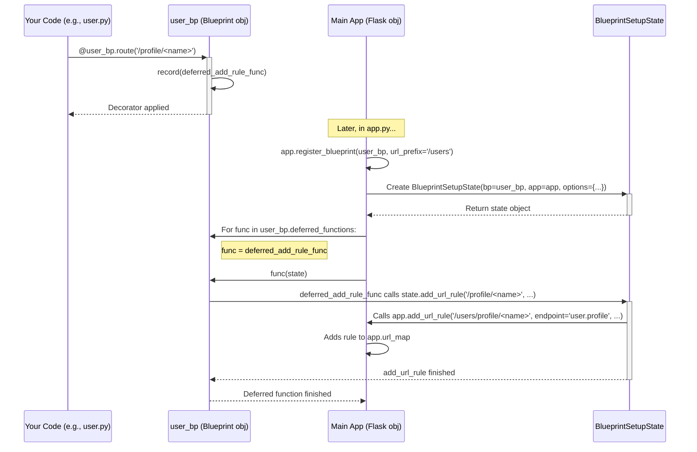

# Chapter 8: Blueprints

Welcome back! In [Chapter 7: Application and Request Contexts](07_application_and_request_contexts.md), we explored the "magic" behind Flask's context system, understanding how variables like `request` and `current_app` work reliably even with multiple concurrent requests.

Now, imagine your simple "Hello, World!" application starts growing. You add user profiles, an admin section, maybe a blog. Putting all your routes, view functions, and related logic into a single Python file (like our `hello.py`) quickly becomes messy and hard to manage. How can we organize our growing Flask application into smaller, more manageable pieces?

That's where **Blueprints** come in!

## What Problem Do They Solve? Organizing a Growing House

Think about building a house. You wouldn't try to build the kitchen, bathroom, and bedrooms all mixed together in one big pile. Instead, you might have separate plans or even pre-fabricated modules for each section. The kitchen module has its specific plumbing and electrical needs, the bathroom has its fixtures, etc. Once these modules are ready, you assemble them into the main structure of the house.

Similarly, as your Flask application grows, you want to group related features together. For example:

*   All the routes related to user authentication (`/login`, `/logout`, `/register`).
*   All the routes for an admin control panel (`/admin/dashboard`, `/admin/users`).
*   All the routes for a public-facing blog (`/blog`, `/blog/<post_slug>`).

Trying to manage all these in one file leads to:

*   **Clutter:** The main application file becomes huge and hard to navigate.
*   **Confusion:** It's difficult to see which routes belong to which feature.
*   **Poor Reusability:** If you wanted to reuse the "blog" part in another project, it would be hard to extract just that code.

**Blueprints** provide Flask's solution for this. They let you define collections of routes, view functions, templates, and static files as separate modules. You can develop these modules independently and then "register" them with your main Flask application, potentially multiple times or under different URL prefixes.

They are like the **prefabricated sections of your house**. You build the "user authentication module" (a blueprint) separately, then plug it into your main application structure.

## Creating and Using a Simple Blueprint

Let's see how this works. Imagine we want to create a separate section for user-related pages.

1.  **Create a Blueprint Object:** Instead of using `@app.route()`, we first create a `Blueprint` object.
2.  **Define Routes on the Blueprint:** We use decorators like `@bp.route()` (where `bp` is our blueprint object) to define routes *within* that blueprint.
3.  **Register the Blueprint with the App:** In our main application file, we tell the Flask `app` object about our blueprint using `app.register_blueprint()`.

Let's structure our project. We'll have our main `app.py` and a separate file for our user routes, maybe inside a `blueprints` folder:

```
yourproject/
├── app.py              # Main Flask application setup
├── blueprints/
│   └── __init__.py     # Makes 'blueprints' a Python package (can be empty)
│   └── user.py         # Our user blueprint routes
└── templates/
    └── user/
        └── profile.html # Template for the user profile
```

**Step 1 & 2: Define the Blueprint (`blueprints/user.py`)**

```python
# blueprints/user.py
from flask import Blueprint, render_template, abort

# 1. Create the Blueprint object
# 'user' is the name of the blueprint. Used internally by Flask.
# __name__ helps locate the blueprint's resources (like templates).
# template_folder specifies where to look for this blueprint's templates.
user_bp = Blueprint('user', __name__, template_folder='../templates/user')

# Sample user data (replace with database logic in a real app)
users = {
    "alice": {"name": "Alice", "email": "alice@example.com"},
    "bob": {"name": "Bob", "email": "bob@example.com"},
}

# 2. Define routes ON THE BLUEPRINT using @user_bp.route()
@user_bp.route('/profile/<username>')
def profile(username):
  user_info = users.get(username)
  if not user_info:
    abort(404) # User not found
  # Note: render_template will now look in 'templates/user/' first
  # because of template_folder='../templates/user' in Blueprint()
  return render_template('profile.html', user=user_info)

@user_bp.route('/')
def user_list():
    # A simple view within the user blueprint
    return f"List of users: {', '.join(users.keys())}"
```

**Explanation:**

*   `from flask import Blueprint`: We import the `Blueprint` class.
*   `user_bp = Blueprint('user', __name__, template_folder='../templates/user')`: We create an instance.
    *   `'user'`: The name of this blueprint. This is used later for generating URLs (`url_for`).
    *   `__name__`: Helps Flask determine the blueprint's root path, similar to how it works for the main `Flask` app object ([Chapter 1](01_application_object___flask__.md)).
    *   `template_folder='../templates/user'`: Tells this blueprint where its specific templates are located relative to `user.py`.
*   `@user_bp.route(...)`: We define routes using the blueprint object, *not* the main `app` object.

**Step 3: Register the Blueprint (`app.py`)**

Now, we need to tell our main Flask application about this blueprint.

```python
# app.py
from flask import Flask
from blueprints.user import user_bp # Import the blueprint object

app = Flask(__name__)
# We might have other config here, like SECRET_KEY from Chapter 6
# app.config['SECRET_KEY'] = 'your secret key'

# Register the blueprint with the main application
# We can add a url_prefix here!
app.register_blueprint(user_bp, url_prefix='/users')

# Maybe add a simple homepage route directly on the app
@app.route('/')
def home():
  return 'Welcome to the main application!'

if __name__ == '__main__':
  app.run(debug=True)
```

**Explanation:**

*   `from blueprints.user import user_bp`: We import the `Blueprint` instance we created in `user.py`.
*   `app.register_blueprint(user_bp, url_prefix='/users')`: This is the crucial step.
    *   It tells the `app` object to include all the routes defined in `user_bp`.
    *   `url_prefix='/users'`: This is very useful! It means all routes defined *within* the `user_bp` will automatically be prefixed with `/users`.
        *   The `/profile/<username>` route in `user.py` becomes `/users/profile/<username>`.
        *   The `/` route in `user.py` becomes `/users/`.

**Template (`templates/user/profile.html`)**

```html
<!-- templates/user/profile.html -->
<!doctype html>
<html>
<head><title>User Profile</title></head>
<body>
  <h1>Profile for {{ user.name }}</h1>
  <p>Email: {{ user.email }}</p>
  <p><a href="{{ url_for('user.user_list') }}">Back to User List</a></p>
  <p><a href="{{ url_for('home') }}">Back to Home</a></p>
</body>
</html>
```

**Running this:**

1.  Create the directory structure and files as shown above.
2.  Run `python app.py` in your terminal.
3.  Visit `http://127.0.0.1:5000/`. You'll see "Welcome to the main application!" (Handled by `app.py`).
4.  Visit `http://127.0.0.1:5000/users/`. You'll see "List of users: alice, bob" (Handled by `user.py`, route `/`, with prefix `/users`).
5.  Visit `http://127.0.0.1:5000/users/profile/alice`. You'll see the profile page for Alice (Handled by `user.py`, route `/profile/<username>`, with prefix `/users`).
6.  Visit `http://127.0.0.1:5000/users/profile/charlie`. You'll get a 404 Not Found error, as handled by `profile()` in `user.py`.

Notice how the blueprint allowed us to neatly separate the user-related code into `blueprints/user.py`, keeping `app.py` cleaner. The `url_prefix` made it easy to group all user routes under `/users/`.

## Generating URLs with `url_for` and Blueprints

How does `url_for` work when routes are defined in blueprints? You need to prefix the endpoint name with the **blueprint name**, followed by a dot (`.`).

Look back at the `profile.html` template:

*   `{{ url_for('user.user_list') }}`: Generates the URL for the `user_list` view function *within* the `user` blueprint. Because of the `url_prefix='/users'`, this generates `/users/`.
*   `{{ url_for('user.profile', username='alice') }}` (if used in Python): Would generate `/users/profile/alice`.
*   `{{ url_for('home') }}`: Generates the URL for the `home` view function, which is registered directly on the `app`, not a blueprint. This generates `/`.

If you are generating a URL for an endpoint *within the same blueprint*, you can use a dot prefix for a relative link:

```python
# Inside blueprints/user.py
from flask import url_for

@user_bp.route('/link-example')
def link_example():
    # Generate URL for 'profile' endpoint within the *same* blueprint ('user')
    alice_url = url_for('.profile', username='alice') # Note the leading dot!
    # alice_url will be '/users/profile/alice'

    # Generate URL for the main app's 'home' endpoint
    home_url = url_for('home') # No dot needed for app routes
    # home_url will be '/'

    return f'Alice profile: {alice_url}<br>Homepage: {home_url}'
```

Using the blueprint name (`user.profile`) or the relative dot (`.profile`) ensures `url_for` finds the correct endpoint, even if multiple blueprints happen to use the same view function name (like `index`).

## Blueprint Resources: Templates and Static Files

As we saw, you can specify `template_folder` when creating a `Blueprint`. When `render_template('profile.html')` is called from within the `user_bp`'s `profile` view, Flask (via Jinja2's `DispatchingJinjaLoader`, see [Chapter 4](04_templating__jinja2_integration_.md)) will look for `profile.html` in this order:

1.  The application's template folder (`templates/`).
2.  The blueprint's template folder (`templates/user/` in our example).

This allows blueprints to have their own templates, potentially overriding application-wide templates if needed, but usually just keeping them organized.

Similarly, you can specify a `static_folder` and `static_url_path` for a blueprint. This allows a blueprint to bundle its own CSS, JavaScript, or image files.

```python
# blueprints/admin.py
admin_bp = Blueprint('admin', __name__,
                     static_folder='static', # Look in blueprints/admin/static/
                     static_url_path='/admin-static', # URL like /admin-static/style.css
                     template_folder='templates') # Look in blueprints/admin/templates/

# Then register with the app:
# app.register_blueprint(admin_bp, url_prefix='/admin')
```

Accessing blueprint static files uses `url_for` with the special `static` endpoint, prefixed by the blueprint name:

```html
<!-- Inside an admin blueprint template -->
<link rel="stylesheet" href="{{ url_for('admin.static', filename='style.css') }}">
<!-- Generates a URL like: /admin-static/style.css -->
```

## Under the Hood: How Registration Works

What actually happens when you call `app.register_blueprint(bp)`?

1.  **Deferred Functions:** When you use decorators like `@bp.route`, `@bp.before_request`, `@bp.errorhandler`, etc., on a `Blueprint` object, the blueprint doesn't immediately tell the application about them. Instead, it stores these actions as "deferred functions" in a list (`bp.deferred_functions`). See `Blueprint.route` calling `Blueprint.add_url_rule`, which calls `Blueprint.record`.
2.  **Registration Call:** `app.register_blueprint(bp, url_prefix='/users')` is called.
3.  **State Creation:** The application creates a `BlueprintSetupState` object. This object holds references to the blueprint (`bp`), the application (`app`), and the options passed during registration (like `url_prefix='/users'`).
4.  **Recording the Blueprint:** The app adds the blueprint to its `app.blueprints` dictionary. This is important for routing and `url_for`.
5.  **Executing Deferred Functions:** The app iterates through the list of `deferred_functions` stored in the blueprint. For each deferred function, it calls it, passing the `BlueprintSetupState` object.
6.  **Applying Settings:** Inside the deferred function (which was created back when you used, e.g., `@bp.route`), the function now has access to both the original arguments (`'/'`, `view_func`, etc.) and the setup state (`state`).
    *   For a route, the deferred function typically calls `state.add_url_rule(...)`.
    *   `state.add_url_rule` then calls `app.add_url_rule(...)`, but it *modifies* the arguments first:
        *   It prepends the `url_prefix` from the `state` (e.g., `/users`) to the route's `rule`.
        *   It prepends the blueprint's name (`state.name`, e.g., `user`) plus a dot to the route's `endpoint` (e.g., `profile` becomes `user.profile`).
        *   It applies other options like `subdomain`.
    *   For other decorators like `@bp.before_request`, the deferred function registers the handler function in the appropriate application dictionary (e.g., `app.before_request_funcs`) but uses the blueprint's name as the key (or `None` for app-wide handlers added via the blueprint).
7.  **Nested Blueprints:** If the blueprint being registered itself contains nested blueprints, the registration process is called recursively for those nested blueprints, adjusting prefixes and names accordingly.

Here's a simplified diagram for registering a route via a blueprint:



The key idea is **deferral**. Blueprints record actions but don't apply them until they are registered on an actual application, using the `BlueprintSetupState` to correctly prefix routes and endpoints.

## Conclusion

Blueprints are Flask's powerful solution for organizing larger applications. They allow you to group related routes, views, templates, and static files into modular, reusable components.

*   We learned how to **create** a `Blueprint` object.
*   We saw how to **define routes** and other handlers using blueprint decorators (`@bp.route`, `@bp.before_request`, etc.).
*   We learned how to **register** a blueprint with the main application using `app.register_blueprint()`, optionally specifying a `url_prefix`.
*   We understood how `url_for` works with blueprint endpoints (using `blueprint_name.endpoint_name` or `.endpoint_name`).
*   Blueprints help keep your codebase **organized, maintainable, and modular**.

By breaking down your application into logical blueprints, you can manage complexity much more effectively as your project grows. This structure also makes it easier for teams to work on different parts of the application simultaneously.

This concludes our core tutorial on Flask's fundamental concepts! You now have a solid understanding of the Application Object, Routing, Request/Response, Templating, Context Globals, Configuration, Contexts, and Blueprints. With these tools, you're well-equipped to start building your own web applications with Flask.

From here, you might explore Flask extensions for common tasks (like database integration with Flask-SQLAlchemy, user authentication with Flask-Login, form handling with Flask-WTF), delve into testing your Flask applications, or learn about different deployment strategies. Happy Flasking!

---

Generated by [AI Codebase Knowledge Builder](https://github.com/The-Pocket/Tutorial-Codebase-Knowledge)