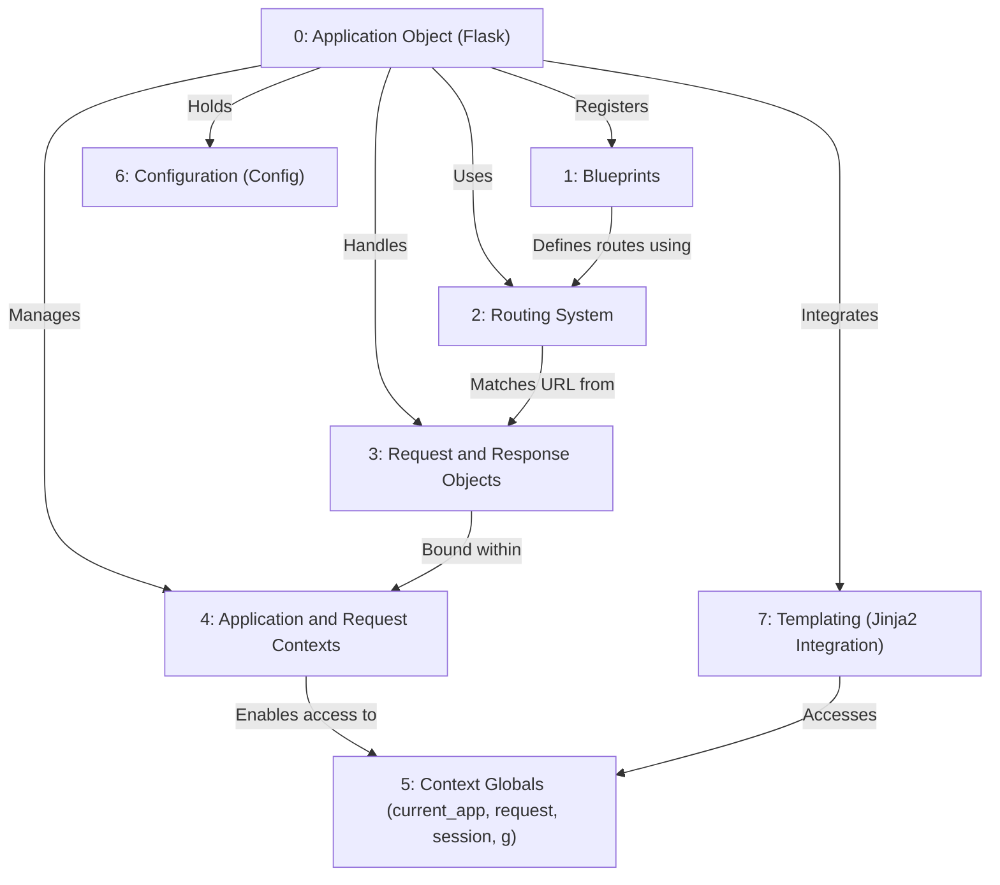

# Tutorial: Flask

> This tutorial is AI-generated! To learn more, check out [AI Codebase Knowledge Builder](https://github.com/The-Pocket/Tutorial-Codebase-Knowledge)

Flask[View Repo](https://github.com/pallets/flask/tree/ab8149664182b662453a563161aa89013c806dc9/src/flask) is a lightweight **web framework** for Python.
It helps you build web applications by handling incoming *web requests* and sending back *responses*.
Flask provides tools for **routing** URLs to your Python functions, managing *request data*, creating *responses*, and using *templates* to generate HTML.

