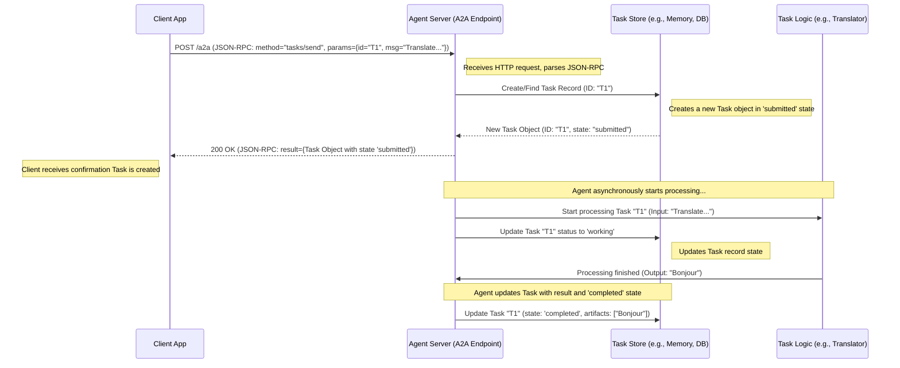

# Chapter 2: Task - The AI's Work Order

In the [previous chapter](01_agent_card.md), we learned how to find an AI agent and read its "business card" – the **Agent Card** – to understand what it can do and how to contact it. Think of it like finding a translator's contact information.

But just knowing the translator exists isn't enough. You need to actually *give them something to translate*! How do you formally request work from an A2A agent?

That's where the **Task** comes in. It solves the problem of **requesting and tracking work**.

## What is a Task?

Imagine you run a busy workshop. When a customer comes in wanting something built or fixed, you don't just rely on a verbal request. You create a **work order** or a **job ticket**. This ticket contains:

1.  **What needs to be done?** (The customer's request - e.g., "Build a small bookshelf")
2.  **Who requested it?** (Customer details)
3.  **A unique ID** to track this specific job.
4.  **The current status** (e.g., "Not Started", "In Progress", "Awaiting Materials", "Completed").
5.  **The final result** (e.g., the finished bookshelf, or notes about why it couldn't be done).

In the A2A world, a **Task** is exactly like that work order. It's the main way agents exchange work:

1.  **Instructions:** It starts with the initial request message from the client (e.g., "Translate 'hello world' to French").
2.  **Tracking ID:** Each task gets a unique ID so both the client and the agent know which job they're talking about.
3.  **Status:** It has a state that changes as the agent works on it (e.g., `submitted`, `working`, `completed`, `failed`).
4.  **Results:** When finished, it holds the output, called **Artifacts** (e.g., the translated text "Bonjour le monde").

So, if our "Translator Agent" receives a Task asking for a translation, that Task object will contain the text to translate, track whether the agent is currently translating it, and eventually hold the French translation once it's done.

## Creating and Sending a Task

How does a client (like your application, or another agent) actually create and send a Task to an agent server? It uses a specific command defined by the A2A protocol, usually called `tasks/send`.

Let's say our client found the "Translator Agent" from Chapter 1 and knows its `url` is `http://translator-agent.com/a2a`. The client wants to translate "hello".

Here's a simplified Python example of how the client might send this request:

```python
# File: samples/python/hosts/cli/cli_host.py (Conceptual Snippet)
import requests
import json
import uuid # To generate unique IDs
from common.types import TaskSendParams, Message, TextPart, Task

# Agent's communication endpoint (from Agent Card)
agent_a2a_url = "http://translator-agent.com/a2a"

# 1. Prepare the Task request details
task_id = str(uuid.uuid4()) # Generate a unique ID for this job
user_message = Message(
    role="user",
    parts=[TextPart(text="Translate 'hello' to French")]
)
task_params = TaskSendParams(id=task_id, message=user_message)

# 2. Create the JSON-RPC request structure
request_payload = {
    "jsonrpc": "2.0",
    "method": "tasks/send", # The command to send a task
    "params": task_params.model_dump(exclude_none=True), # Our task details
    "id": "req-1" # An ID for *this specific web request*
}

# 3. Send the request to the agent's URL
print(f"Sending task {task_id} to {agent_a2a_url}")
response = requests.post(agent_a2a_url, json=request_payload)
response.raise_for_status() # Check for HTTP errors

# 4. Process the response
response_data = response.json()
if response_data.get("result"):
  # Agent accepted the task! It returns the initial Task object.
  initial_task = Task(**response_data["result"])
  print(f"Task created! ID: {initial_task.id}, State: {initial_task.status.state}")
elif response_data.get("error"):
  print(f"Error creating task: {response_data['error']}")

```

**Explanation:**

1.  **Prepare Details:** We generate a unique `task_id` and create the `Message` containing the text we want translated. These become the `params` for our request.
2.  **Build Request:** We wrap our `params` in a standard structure specifying the `method` (`tasks/send`) we want the agent to execute. (This structure is part of JSON-RPC, which is used by A2A - more on this in the [next chapter](03_a2a_protocol___core_types.md)).
3.  **Send:** We use the `requests` library to send this structure as JSON data via an HTTP POST request to the agent's A2A `url`.
4.  **Process Response:** The agent sends back a response. If successful, the `result` contains the newly created `Task` object, likely in the `submitted` state. We print its ID and initial state. If something went wrong, the `error` field will contain details.

**Example Output:**

```
Sending task a1b2c3d4-e5f6-7890-abcd-ef1234567890 to http://translator-agent.com/a2a
Task created! ID: a1b2c3d4-e5f6-7890-abcd-ef1234567890, State: submitted
```

Now the client knows the task was received and has its unique ID (`a1b2c3d4-...`). It can use this ID later to check the status or get the final result.

## Task Lifecycle: States

A task doesn't just get created and instantly completed. It goes through different stages, represented by its `state` field. Here are the main states:

*   `submitted`: The agent has received the task request but hasn't started working on it yet.
*   `working`: The agent is actively processing the request (e.g., performing the translation).
*   `input-required`: (Optional) The agent needs more information from the client to continue. The client would then send another message using the same Task ID.
*   `completed`: The agent finished successfully. The results are available in the Task's `artifacts`.
*   `failed`: The agent encountered an error and could not complete the task.
*   `canceled`: The client (or agent) explicitly canceled the task before completion.
*   `unknown`: The state couldn't be determined.

These states allow the client to understand the progress of their request. For long-running tasks, the agent might even send updates as the state changes (we'll cover this in [Chapter 7: Streaming Communication (SSE)](07_streaming_communication__sse_.md)).

## Under the Hood: How a Task is Handled

Let's trace what happens when the client sends that `tasks/send` request:



**Steps:**

1.  **Client Sends Request:** The client sends the `tasks/send` JSON-RPC request via HTTP POST to the agent's A2A URL.
2.  **Server Receives:** The agent server receives the request and understands it wants to start a task.
3.  **Server Stores Task:** The server creates a new `Task` record (using something like the `InMemoryTaskStore` or `FileStore` shown in `samples/js/src/server/store.ts` or conceptually managed by `samples/python/common/server/task_manager.py`). It assigns the initial `submitted` state and stores the user's message.
4.  **Server Responds:** The server immediately sends a response back to the client confirming the task was created, including the initial `Task` object.
5.  **Server Processes (Async):** The server (likely in the background) triggers the actual work (e.g., calls its internal translation logic). It updates the task's state in the store to `working`.
6.  **Server Completes:** Once the translation is done, the server updates the task's state to `completed` and adds the result ("Bonjour") as an `Artifact` in the task record within the store.

The client can later use the Task ID (`T1`) to fetch the updated Task object (using a different command like `tasks/get`) and retrieve the final translation from the `artifacts`.

### Key Data Structures

The definition of these structures can be found in the protocol specification and helper libraries:

*   **Task:** (`samples/python/common/types.py:Task`, `samples/js/src/schema.ts:Task`) Holds the ID, status, artifacts, history, etc.
*   **Message:** (`samples/python/common/types.py:Message`, `samples/js/src/schema.ts:Message`) Represents a communication turn (user or agent) containing Parts.
*   **Part:** (`samples/python/common/types.py:Part`, `samples/js/src/schema.ts:Part`) The actual content (text, file, or structured data).
*   **Artifact:** (`samples/python/common/types.py:Artifact`, `samples/js/src/schema.ts:Artifact`) Output generated by the agent, also composed of Parts.
*   **TaskStatus:** (`samples/python/common/types.py:TaskStatus`, `samples/js/src/schema.ts:TaskStatus`) Contains the `TaskState` and timestamp.

```typescript
// File: samples/js/src/schema.ts (Simplified Task Structure)

export interface Task {
  // Unique identifier for the task.
  id: string;
  // The current status of the task.
  status: TaskStatus;
  // Optional list of artifacts (outputs).
  artifacts?: Artifact[] | null;
  // (Optional) History of messages for this task
  // history?: Message[] | null;
  // ... other fields like sessionId, metadata
}

export interface TaskStatus {
  // The current state (e.g., "submitted", "working", "completed").
  state: TaskState;
  // Optional message associated with this status.
  message?: Message | null;
  // Timestamp of this status update.
  timestamp?: string;
}

// Example Artifact containing translated text
// artifact = { parts: [ { type: "text", text: "Bonjour le monde" } ] }
```

This structure acts as the digital "work order" that travels between the client and the agent, carrying the request, tracking progress, and holding the final result.

## Conclusion

The **Task** is the fundamental unit of work in the A2A protocol. It's how one agent asks another to do something. Think of it as a formal job request or work order that:

*   Contains the initial instructions (as a `Message`).
*   Has a unique ID for tracking.
*   Goes through different states (`submitted`, `working`, `completed`, etc.) to show progress.
*   Holds the final results (`Artifacts`).

By sending a `tasks/send` request, a client initiates a Task, and by checking the Task's status and artifacts later, the client gets the results.

Now that we understand the basic concepts of finding an agent ([Agent Card](01_agent_card.md)) and giving it work ([Task](02_task.md)), let's look closer at the communication rules and the specific data types used in the A2A protocol.

**Next:** [Chapter 3: A2A Protocol & Core Types](03_a2a_protocol___core_types.md)

---

Generated by [AI Codebase Knowledge Builder](https://github.com/The-Pocket/Tutorial-Codebase-Knowledge)