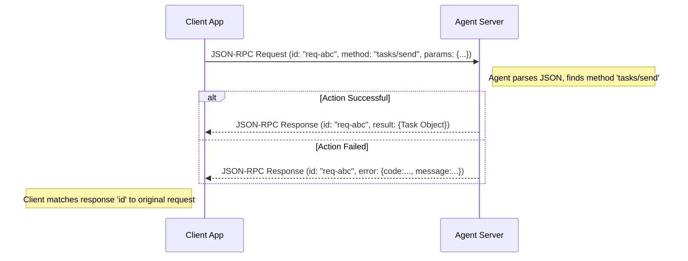

# Chapter 3: A2A Protocol & Core Types

In the previous chapters, we learned how to find an agent using its [Agent Card](01_agent_card.md) and how to give it work using a [Task](02_task.md). Think of it like finding a specific workshop (Agent Card) and submitting a work order (Task).

But how do the client (who submits the order) and the agent (the workshop) actually *talk* to each other? What language do they use? If the client writes the order in English, but the workshop only understands Spanish, nothing will get done!

This chapter tackles that problem: **How do different AI agents, possibly built by different teams using different technologies, communicate reliably?**

The answer lies in the **A2A Protocol** and its **Core Types**.

## What is a Protocol? The Rules of the Road

Imagine trying to drive in a country where you don't know the traffic rules. Do you drive on the left or right? What do the signs mean? It would be chaos! Traffic rules are a **protocol** – a shared set of rules everyone agrees on so things run smoothly.

Similarly, the **A2A Protocol** is the set of rules for how AI agents communicate. It defines:

1.  **The Transport:** *How* messages physically travel (usually over the internet using standard HTTP requests, like your web browser uses).
2.  **The Format:** *What* the messages look like (the structure and language used).
3.  **The Actions:** *What* commands one agent can send to another (like "start a task" or "cancel a task").

Think of it as the **shared language** for AI agents. Just like humans use languages like English or Spanish, which have grammar (rules) and vocabulary (words), the A2A protocol provides the grammar and vocabulary for agents.

## The Grammar: JSON-RPC 2.0

For the A2A protocol, the chosen "grammar" is a standard called **JSON-RPC 2.0**. Don't let the name scare you! It's just a simple way to structure messages using JSON (JavaScript Object Notation - a very common text format for data).

Here's the basic idea:

*   **Client sends a Request:** The client wanting the agent to do something sends a `Request` message.
*   **Agent sends a Response:** The agent replies with a `Response` message.

A typical JSON-RPC Request looks like this:

```json
{
  "jsonrpc": "2.0",        // Specifies the protocol version
  "method": "some_action", // What the client wants the agent to DO
  "params": { ... },       // The details needed for the action
  "id": "request-123"      // A unique ID to match request and response
}
```

**Explanation:**

*   `jsonrpc`: Always "2.0".
*   `method`: The name of the command or function the client wants the agent to run (like `tasks/send` from Chapter 2).
*   `params`: The input data needed for that command (like the text to translate). This can be an object `{}` or a list `[]`.
*   `id`: A unique identifier the client makes up.

The agent then processes this request and sends back a Response matching that `id`:

**Success Response:**

```json
{
  "jsonrpc": "2.0",
  "result": { ... },      // The output/result of the action
  "id": "request-123"     // The SAME ID as the request
}
```

**Error Response:**

```json
{
  "jsonrpc": "2.0",
  "error": {             // Details about what went wrong
    "code": -32601,
    "message": "Method not found"
  },
  "id": "request-123"     // The SAME ID as the request (or null if error was severe)
}
```

**Explanation:**

*   If the action worked, the response includes a `result` field containing the output.
*   If something went wrong, it includes an `error` field with a numeric `code` and a descriptive `message`.
*   Crucially, the `id` matches the request, so the client knows which request this response belongs to.



This simple request/response structure using JSON-RPC is the foundation of how A2A agents talk.

## The Vocabulary: Core Data Types

If JSON-RPC is the grammar, then the **Core Types** are the standard vocabulary – the specific kinds of "words" or data structures used within the `params` and `result` fields. We've already seen some of these!

Let's recap the most important ones:

*   **`AgentCard`**: ([Chapter 1](01_agent_card.md)) The agent's profile. Describes its name, skills, and communication endpoint (`url`). Found in `/.well-known/agent.json`.
    *   Defined in: `samples/js/src/schema.ts:AgentCard`, `samples/python/common/types.py:AgentCard`

*   **`Task`**: ([Chapter 2](02_task.md)) The work order. Contains the unique `id`, current `status`, final `artifacts` (results), etc.
    *   Defined in: `samples/python/common/types.py:Task`, `samples/js/src/schema.ts:Task`

*   **`Message`**: Represents one turn in the conversation (either from the `user` or the `agent`). Contains one or more `Parts`.
    *   Defined in: `samples/python/common/types.py:Message`, `samples/js/src/schema.ts:Message`

*   **`Part`**: The actual content within a `Message` or `Artifact`. This is how we send different kinds of data:
    *   `TextPart`: For plain text.
    *   `FilePart`: For files (either included directly as encoded text (`bytes`) or as a link (`uri`)).
    *   `DataPart`: For structured JSON data (like filling out a form).
    *   Defined in: `samples/python/common/types.py:Part`, `samples/js/src/schema.ts:Part`

*   **`Artifact`**: Represents an output generated by the agent during a `Task`. It also contains `Parts`. For example, if a Task was "create a presentation about cats", an Artifact might be a `FilePart` containing the presentation file.
    *   Defined in: `samples/python/common/types.py:Artifact`, `samples/js/src/schema.ts:Artifact`

*   **`TaskStatus`**: Holds the current progress state of a `Task`. Includes the `state` itself and a `timestamp`.
    *   Defined in: `samples/python/common/types.py:TaskStatus`, `samples/js/src/schema.ts:TaskStatus`

*   **`TaskState`**: The specific state within `TaskStatus`. Common values are: `submitted`, `working`, `completed`, `failed`, `canceled`.
    *   Defined in: `samples/python/common/types.py:TaskState`, `samples/js/src/schema.ts:TaskState`

**Example: Building a `Message`**

Let's say the user wants to send the text "Translate 'hello' to French". This would be structured as a `Message` containing a `TextPart`:

```json
// This structure would go inside the "params" of a tasks/send request
{
  "role": "user", // Who is sending this message
  "parts": [      // List of content parts (here, just one)
    {
      "type": "text", // Specifies this is a TextPart
      "text": "Translate 'hello' to French"
    }
  ]
}
```

If the user also wanted to attach a document for translation, the `parts` list would have two items: a `TextPart` with instructions and a `FilePart` with the document.

## Putting It Together: The `tasks/send` Example

Remember the `tasks/send` request from Chapter 2? Let's look at the full JSON-RPC structure that the client sends over HTTP:

```json
// Client Sends This (HTTP POST body to Agent's URL)
{
  "jsonrpc": "2.0",
  "method": "tasks/send", // The action: start/continue a task
  "params": {            // The details (TaskSendParams structure)
    "id": "task-xyz-789", // Unique Task ID
    "message": {         // The user's message
      "role": "user",
      "parts": [
        {
          "type": "text",
          "text": "Translate 'hello' to French"
        }
      ]
    }
    // Other optional params like sessionId could go here
  },
  "id": "client-req-001" // Unique ID for *this specific request*
}
```

If the agent accepts the task, it sends back a success response containing the initial `Task` object:

```json
// Agent Sends This Back (HTTP Response body)
{
  "jsonrpc": "2.0",
  "result": {          // The result: a Task object
    "id": "task-xyz-789", // The same Task ID
    "status": {        // The initial status
      "state": "submitted",
      "timestamp": "2023-10-27T10:00:00Z"
    },
    "artifacts": null, // No results yet
    "history": null    // History might be omitted initially
    // Other Task fields
  },
  "id": "client-req-001" // Matches the request ID
}
```

This exchange uses the JSON-RPC grammar (`method`, `params`, `result`, `id`) and the A2A vocabulary (`Task`, `Message`, `Part`, `TaskStatus`, `TaskState`) to communicate clearly.

## Handling Mistakes: Errors in the Protocol

What if the client sends a request for a method the agent doesn't understand, like `tasks/make_coffee`? The agent would respond with a JSON-RPC error:

```json
{
  "jsonrpc": "2.0",
  "error": {
    "code": -32601, // Standard JSON-RPC code for "Method not found"
    "message": "Method not found: tasks/make_coffee"
  },
  "id": "client-req-002"
}
```

The A2A protocol also defines some specific error codes for common agent issues:

*   `-32001`: `Task Not Found` (e.g., client asks for status of a task ID that doesn't exist)
*   `-32002`: `Task Not Cancelable` (e.g., trying to cancel an already completed task)
*   `-32004`: `Unsupported Operation`

These standard errors help clients understand what went wrong in a predictable way. You can find definitions in the schema files:

*   `samples/js/src/schema.ts` (search for `ErrorCode`)
*   `samples/python/common/types.py` (search for error classes like `MethodNotFoundError`, `TaskNotFoundError`)

## Conclusion

The A2A Protocol acts as the universal translator for AI agents. By defining:

1.  A common **grammar** (JSON-RPC 2.0) for structuring requests and responses.
2.  A standard **vocabulary** (Core Types like `Task`, `Message`, `Part`, `Artifact`) for the data being exchanged.

...it allows agents built by anyone, using any framework, to communicate and collaborate effectively. It ensures that when one agent asks another to do something, the request is understood, progress can be tracked, and results can be returned in a predictable format.

Now that we understand the language agents speak, let's see how to build an agent that can actually listen and respond using this protocol.

**Next:** [Chapter 4: A2A Server Implementation](04_a2a_server_implementation.md)

---

Generated by [AI Codebase Knowledge Builder](https://github.com/The-Pocket/Tutorial-Codebase-Knowledge)