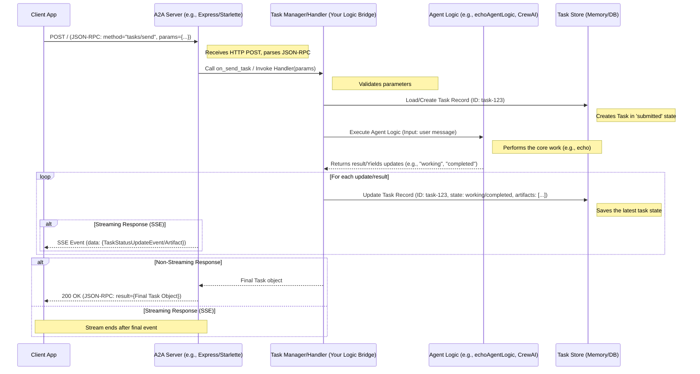

# Chapter 4: A2A Server Implementation

In the [previous chapter](03_a2a_protocol___core_types.md), we learned the "language" and "grammar" that AI agents use to talk to each other – the **A2A Protocol** based on JSON-RPC and its **Core Types** like `Task` and `Message`. Think of it like learning the rules of diplomacy and the standard format for official documents.

But just knowing the rules isn't enough. If one country (an AI agent) wants to send a diplomatic message (a [Task](02_task.md)) to another, it needs an official reception point – an embassy. How does an AI agent set up its "embassy" to receive and handle these official A2A communications?

That's the role of the **A2A Server Implementation**. It solves the problem of **hosting an agent** and making it **accessible** according to the A2A protocol rules.

## What is an A2A Server? The Agent's Embassy

Imagine our AI agent is like a skilled expert (a translator, a coder, an image generator) working inside a building. How do people from the outside world reach this expert and give them work? They can't just barge into the building!

They need to go through the official **reception desk** or **front office**. This office:

1.  Listens for visitors (incoming requests).
2.  Understands the standard procedures for submitting work (the A2A protocol).
3.  Takes the request (the `Task`), logs it, and passes it to the right expert inside.
4.  Keeps track of the work's progress.
5.  Delivers the results back to the visitor when ready.
6.  Provides basic information about the building and its services (the [Agent Card](01_agent_card.md)).

An **A2A Server** is exactly like that front office or embassy for your AI agent. It's the software component that runs on a server, listens for incoming network requests, and acts as the official gateway for all A2A communication.

## Why Do We Need It?

Without a server, our AI agent is isolated. It might be brilliant at its job, but no other agent or application can interact with it using the standard A2A protocol. The A2A Server provides the necessary "infrastructure" to:

*   **Listen:** Be constantly available on the network (at a specific URL) for incoming requests.
*   **Understand:** Decode the JSON-RPC messages and figure out what the client wants (e.g., `tasks/send`, `tasks/get`).
*   **Delegate:** Pass the work request (the `Task` details) to the actual AI logic (which might be implemented using tools like LangGraph, CrewAI, Genkit, or custom code).
*   **Manage:** Keep track of ongoing `Tasks`, their current `status` (e.g., `submitted`, `working`, `completed`), and store their results (`Artifacts`).
*   **Respond:** Send back properly formatted JSON-RPC responses (confirming task creation, providing results, or reporting errors).
*   **Advertise:** Serve the agent's `agent.json` ([Agent Card](01_agent_card.md)) so others can discover it.

Think of it as the bridge connecting your agent's internal world to the external world of A2A communication.

## Setting Up a Basic Server

Luckily, the `Google A2A` project provides helper libraries to make setting up a server much easier! You don't need to build the entire "embassy" from scratch. You mainly need to provide:

1.  Your agent's specific logic (the "expert" who does the actual work).
2.  The agent's [Agent Card](01_agent_card.md) details.

Let's look at simplified examples in JavaScript (Node.js) and Python.

### JavaScript Example (using `A2AServer` from the library)

Imagine we have a very simple "Echo Agent" that just sends back whatever text it receives.

```typescript
// File: simple-agent/index.ts (Conceptual Example)
import { A2AServer, TaskContext, TaskYieldUpdate } from "google-a2a/server"; // Simplified import
import * as schema from "google-a2a/schema";

// 1. Define the Agent's Logic (The "Expert")
// This function handles a single task.
async function* echoAgentLogic(
  context: TaskContext
): AsyncGenerator<TaskYieldUpdate, schema.Task | void> {
  const inputText = context.userMessage.parts[0].text ?? "No text found";

  // Yield a status update: "working"
  yield { state: "working", message: { role: "agent", parts: [{ text: "Echoing..." }] } };

  // Yield the final result: "completed"
  yield {
    state: "completed",
    message: { role: "agent", parts: [{ text: `You said: ${inputText}` }] }
  };
  // (Artifacts could also be yielded here if needed)
}

// 2. Define the Agent Card
const echoAgentCard: schema.AgentCard = {
  name: "Echo Agent",
  description: "Replies with the text it receives.",
  url: "http://localhost:4000", // Where this server will run
  version: "1.0",
  capabilities: { streaming: true }, // It yields updates
  skills: [{ id: "echo", name: "Echo Text" }],
  // ... other card details
};

// 3. Create and Start the Server
const server = new A2AServer(echoAgentLogic, { card: echoAgentCard });
server.start(4000); // Start listening on port 4000

console.log("Echo Agent server running on http://localhost:4000");
```

**Explanation:**

1.  **Agent Logic (`echoAgentLogic`):** This is the core function defining *what* the agent does. It receives the `TaskContext` (containing the user's message) and uses `yield` to send back status updates (`working`) and the final result (`completed`). We'll dive deeper into this logic in [Chapter 6: Task Handling Logic (Server-side)](06_task_handling_logic__server_side_.md). For now, just see it as the agent's brain.
2.  **Agent Card (`echoAgentCard`):** We define the agent's public profile, including its name, description, and importantly, the `url` where the server will be listening.
3.  **Server Setup:** We create an instance of `A2AServer`, passing our agent's logic function and its card. Then, we call `server.start()` to make it listen for requests on the specified port (4000).

That's it! With this code, we have a running A2A server ready to accept `tasks/send` requests for our Echo Agent.

### Python Example (using `A2AServer` from the library)

Let's do the same for Python.

```python
# File: simple_agent/main.py (Conceptual Example)
from common.server import A2AServer, TaskManager  # Simplified import
from common.types import (
    AgentCard, AgentCapabilities, AgentSkill,
    Task, TaskSendParams, TaskStatus, TaskState, Message, TextPart, SendTaskResponse
)
import logging

logging.basicConfig(level=logging.INFO)
logger = logging.getLogger(__name__)

# 1. Define the Agent's Logic Handler (Task Manager)
# This class bridges the server and the agent's actual logic.
class EchoTaskManager(TaskManager): # Inherit from the base TaskManager
    async def on_send_task(self, params: TaskSendParams) -> SendTaskResponse:
        # Simulate processing the task
        input_text = params.message.parts[0].text if params.message.parts else "No text"
        logger.info(f"Echo Agent received: {input_text}")

        # Create the final Task object (simplified for non-streaming)
        final_task = Task(
            id=params.id,
            status=TaskStatus(
                state=TaskState.COMPLETED,
                message=Message(role="agent", parts=[TextPart(text=f"You said: {input_text}")])
            ),
            # ... other Task fields ...
        )
        # In a real scenario, you'd store/update the task state
        # self.tasks[params.id] = final_task # Example storage
        return SendTaskResponse(id=params.id, result=final_task)

    # Implement other abstract methods from TaskManager (get, cancel, etc.)
    # (Skipped for brevity in this example)
    async def on_get_task(self, request): raise NotImplementedError()
    async def on_cancel_task(self, request): raise NotImplementedError()
    # ... and so on for streaming, push notifications etc.

# 2. Define the Agent Card
echo_agent_card = AgentCard(
    name="Echo Agent",
    description="Replies with the text it receives.",
    url="http://localhost:5000/", # Where this server will run
    version="1.0",
    capabilities=AgentCapabilities(streaming=False), # Simplified non-streaming Python example
    skills=[AgentSkill(id="echo", name="Echo Text")],
    # ... other card details
)

# 3. Create and Start the Server
server = A2AServer(
    agent_card=echo_agent_card,
    task_manager=EchoTaskManager(), # Pass our task handler
    host="localhost",
    port=5000,
)

logger.info("Starting Echo Agent server on http://localhost:5000")
server.start()
```

**Explanation:**

1.  **Agent Logic Handler (`EchoTaskManager`):** In the Python library structure, we often create a class that inherits from `TaskManager`. This class implements methods like `on_send_task` to handle specific A2A commands. Here, `on_send_task` simulates processing and returns the final `Task` object wrapped in a `SendTaskResponse`. [Chapter 6](06_task_handling_logic__server_side_.md) will cover this in detail.
2.  **Agent Card (`echo_agent_card`):** Similar to the JS example, we define the agent's profile.
3.  **Server Setup:** We create an `A2AServer` instance, providing the card and our custom `EchoTaskManager`. We then call `server.start()`.

Both examples achieve the same goal: they use the library's `A2AServer` class to quickly stand up a web server that listens for A2A requests, delegates the work to the provided agent logic, and handles the communication details.

## Under the Hood: How a Request is Processed

What happens when a client sends a `tasks/send` request to our running A2A server?



**Steps:**

1.  **Receive Request:** The client sends an HTTP POST request containing the JSON-RPC payload to the server's URL (e.g., `http://localhost:4000`). The web server part of the `A2AServer` (like Express in JS or Starlette in Python) receives this.
2.  **Parse & Route:** The `A2AServer` parses the JSON body, validates it's a valid JSON-RPC request, and looks at the `method` field (e.g., `tasks/send`). Based on the method, it calls the appropriate handler function (like `handleTaskSend` in the JS server or delegates to the `on_send_task` method of the `TaskManager` in Python).
3.  **Task Management:** The task handler (your `echoAgentLogic` or `EchoTaskManager`) takes over. It typically interacts with a `TaskStore` (like `InMemoryTaskStore`) to create or retrieve the [Task](02_task.md) record associated with the request's `taskId`. It updates the task's status to `submitted` or `working`.
4.  **Execute Agent Logic:** The handler calls the actual underlying AI agent code, passing the necessary input (like the user's message).
5.  **Process Results/Updates:** As the agent logic runs, it might produce results or status updates. The handler receives these.
6.  **Update Store & Respond:** The handler updates the `Task` record in the `TaskStore` with the new status or results (`Artifacts`).
    *   For a simple request/response like `tasks/send` (non-streaming), it waits for the final result and sends back a single JSON-RPC response containing the completed `Task`.
    *   For a streaming request like `tasks/sendSubscribe`, it sends back Server-Sent Events (SSE) for each update as they happen. ([Chapter 7: Streaming Communication (SSE)](07_streaming_communication__sse_.md) covers this).
7.  **Serve Agent Card:** Separately, if a client sends a GET request to `/.well-known/agent.json`, the `A2AServer` simply responds with the content of the `AgentCard` you provided during setup.

The `A2AServer` libraries (`samples/js/src/server/server.ts`, `samples/python/common/server/server.py`) handle the complexities of HTTP, JSON-RPC parsing, routing, and response formatting, letting you focus on implementing your agent's specific capabilities within the task handler ([Chapter 6](06_task_handling_logic__server_side_.md)).

## Conclusion

The **A2A Server Implementation** is the crucial component that brings your AI agent to life on the network, acting as its official "embassy" for A2A communication. It listens for requests, understands the A2A protocol, manages tasks, interacts with your agent's core logic, and sends back responses.

By using the provided `A2AServer` libraries, you can quickly set up a compliant server without worrying about the low-level details of web servers and JSON-RPC, allowing you to concentrate on building your agent's unique skills.

Now that we know how to build the *server* side (the agent's embassy), how does another application or agent *talk* to it? We need to build an **A2A Client**.

**Next:** [Chapter 5: A2A Client Implementation](05_a2a_client_implementation.md)

---

Generated by [AI Codebase Knowledge Builder](https://github.com/The-Pocket/Tutorial-Codebase-Knowledge)