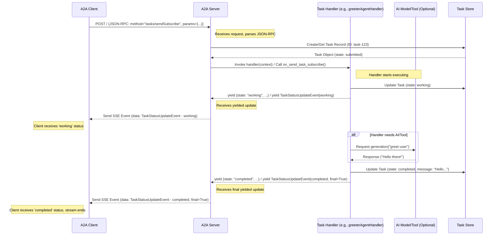

# Chapter 6: Task Handling Logic (Server-side)

Welcome back! In [Chapter 5: A2A Client Implementation](05_a2a_client_implementation.md), we learned how to build the "customer" side – the **A2A Client** – that sends requests to an agent's server. We saw how it formats messages and talks to the agent's "embassy" ([A2A Server Implementation](04_a2a_server_implementation.md)).

But what happens *inside* the embassy once a request arrives? Who actually reads the request, does the work, and prepares the response?

This chapter focuses on the **Task Handling Logic**. It solves the problem: **What is the core "brain" inside the A2A Server that performs the requested work?**

## The Agent's "Brain" - The Chef in the Kitchen

Imagine our A2A Server ([Chapter 4](04_a2a_server_implementation.md)) is like a restaurant's front desk. It takes orders ([Tasks](02_task.md)) from customers ([A2A Clients](05_a2a_client_implementation.md)) using the standard A2A language ([A2A Protocol & Core Types](03_a2a_protocol___core_types.md)).

But the front desk doesn't cook the food! It passes the order to the **kitchen**, where the **chef** takes over. The chef:

1.  **Reads the Order:** Understands what the customer wants (e.g., "Translate 'hello' to French").
2.  **Prepares the Dish:** Uses ingredients (data), tools (APIs, databases), and expertise (AI models like Gemini) to fulfill the request.
3.  **Updates the Waiter:** Might send updates back like "Order is being prepared" (`working` state).
4.  **Finishes the Dish:** Creates the final product (the translated text "Bonjour le monde").
5.  **Plates the Dish:** Packages the result (`Artifacts`) and signals completion (`completed` state).

The **Task Handling Logic** is the "chef" inside your A2A Server. It's the core piece of code that contains the agent's specific skills and business logic.

## What Does the Task Handler Do?

When the A2A Server receives a request like `tasks/send`, it hands off the details to the Task Handling Logic. This logic is responsible for:

*   **Understanding the Request:** Receiving the user's `Message` and any other context associated with the `Task`.
*   **Executing the Work:**
    *   Calling AI models (like Gemini via libraries like Genkit) for generation, analysis, etc.
    *   Using tools (like calling a weather API, searching a database, or using specific libraries like CrewAI or LangGraph).
    *   Performing custom calculations or data manipulation.
*   **Managing State:** Signaling progress by updating the `Task`'s status (e.g., changing from `submitted` to `working`).
*   **Generating Output:** Creating the final results (`Artifacts`) or intermediate updates.
*   **Handling Errors:** Reporting back if something goes wrong (`failed` state).

## Implementing the "Brain"

The `Google A2A` libraries provide structures to help you implement this logic. Let's look at simplified examples.

### JavaScript Example (Async Generator Handler)

In JavaScript, the task handler is often an `async function*` (an asynchronous generator). It receives `TaskContext` and uses `yield` to send back updates.

Imagine a simple agent that pretends to call an AI to greet the user.

```typescript
// File: samples/js/src/server/handler.ts (Conceptual Example of a Handler)
import * as schema from "../schema.js"; // For types like Task, Message, etc.
import { TaskContext, TaskYieldUpdate } from "./handler.js"; // Handler types

// The Task Handling Logic for our 'Greeter Agent'
async function* greeterAgentHandler(
  context: TaskContext
): AsyncGenerator<TaskYieldUpdate> { // It yields updates

  // 1. Get the user's name from the input message
  const userMessageText = context.userMessage.parts[0].text ?? "there";
  const userName = userMessageText.split(" ").pop(); // Simple extraction

  // 2. Signal that work is starting
  console.log(`[GreeterAgent] Task ${context.task.id}: Starting`);
  yield {
    state: "working", // Update status to 'working'
    message: { role: "agent", parts: [{ text: "Thinking..." }] }
  };

  // 3. Simulate calling an AI (the "chef" uses an "ingredient")
  await new Promise(resolve => setTimeout(resolve, 500)); // Pretend work
  const greeting = `Hello, ${userName}! Welcome.`;

  // 4. Signal completion and provide the final message
  console.log(`[GreeterAgent] Task ${context.task.id}: Completing`);
  yield {
    state: "completed", // Update status to 'completed'
    message: { role: "agent", parts: [{ text: greeting }] }
  };
  // For more complex results, we could yield Artifacts here too.
}

// This handler function (`greeterAgentHandler`) would be passed
// to the A2AServer constructor, like in Chapter 4.
// const server = new A2AServer(greeterAgentHandler, { card: greeterAgentCard });
```

**Explanation:**

1.  **Input:** The function receives `context` which contains the current `task` and the `userMessage`. We extract the user's name.
2.  **Signal Working:** It `yield`s an update object setting the `state` to `working` and providing an optional status message. The A2A Server receives this yield.
3.  **Do Work:** It simulates calling an AI to generate a greeting. In real agents (like `samples/js/src/agents/coder/index.ts` or `samples/js/src/agents/movie-agent/index.ts`), this is where you'd interact with Genkit, external APIs, or other tools.
4.  **Signal Completion:** It `yield`s the final update, setting the `state` to `completed` and including the greeting in the agent's `message`.

### Python Example (TaskManager with Streaming)

In Python, you typically subclass `TaskManager` and implement methods like `on_send_task` or `on_send_task_subscribe`. For streaming responses, `on_send_task_subscribe` can also be an async generator.

Let's create a similar Greeter Agent.

```python
# File: my_agent/task_manager.py (Conceptual Example)
import asyncio
from typing import Union, AsyncIterable
from common.server.task_manager import InMemoryTaskManager # Base class
from common.types import (
    Task, TaskSendParams, TaskStatus, TaskState, Message, TextPart,
    SendTaskStreamingRequest, SendTaskStreamingResponse, TaskStatusUpdateEvent,
    JSONRPCResponse
)
import logging

logger = logging.getLogger(__name__)

class GreeterTaskManager(InMemoryTaskManager): # Inherit from base

    # Handle non-streaming requests (optional)
    async def on_send_task(self, request):
        # ... implementation for non-streaming ...
        raise NotImplementedError()

    # Handle STREAMING requests using an async generator
    async def on_send_task_subscribe(
        self, request: SendTaskStreamingRequest
    ) -> Union[AsyncIterable[SendTaskStreamingResponse], JSONRPCResponse]:

        task_params: TaskSendParams = request.params
        task_id = task_params.id
        logger.info(f"[GreeterAgent] Task {task_id}: Received")

        # 0. Set up internal queue for SSE events
        # (Handled by library/base class, conceptually)

        # 1. Update store & get initial Task object
        await self.upsert_task(task_params) # Store the task initially

        # --- Start the async generator part ---
        async def _process_task() -> AsyncIterable[SendTaskStreamingResponse]:
            try:
                # 2. Get user name from input
                user_message_text = task_params.message.parts[0].text if task_params.message.parts else "there"
                user_name = user_message_text.split(" ").pop()

                # 3. Signal working (Yield a status update event)
                working_status = TaskStatus(state=TaskState.WORKING, message=Message(role="agent", parts=[TextPart(text="Thinking...")]))
                working_event = TaskStatusUpdateEvent(id=task_id, status=working_status, final=False)
                yield SendTaskStreamingResponse(id=request.id, result=working_event)
                # Update internal store (optional, depending on base class)
                await self.update_store(task_id, working_status, artifacts=None)

                # 4. Simulate AI call
                await asyncio.sleep(0.5)
                greeting = f"Hello, {user_name}! Welcome from Python."

                # 5. Signal completion (Yield final status update event)
                completed_status = TaskStatus(state=TaskState.COMPLETED, message=Message(role="agent", parts=[TextPart(text=greeting)]))
                completed_event = TaskStatusUpdateEvent(id=task_id, status=completed_status, final=True) # final=True
                yield SendTaskStreamingResponse(id=request.id, result=completed_event)
                # Update internal store
                await self.update_store(task_id, completed_status, artifacts=None)

                logger.info(f"[GreeterAgent] Task {task_id}: Completed")

            except Exception as e:
                logger.error(f"[GreeterAgent] Task {task_id}: Error - {e}")
                # Signal failure
                failed_status = TaskStatus(state=TaskState.FAILED, message=Message(role="agent", parts=[TextPart(text=f"Error: {e}")]))
                failed_event = TaskStatusUpdateEvent(id=task_id, status=failed_status, final=True)
                yield SendTaskStreamingResponse(id=request.id, result=failed_event)
                await self.update_store(task_id, failed_status, artifacts=None)

        # Return the async generator
        return _process_task()

# This GreeterTaskManager class would be passed to the A2AServer
# server = A2AServer(task_manager=GreeterTaskManager(), ...)
```

**Explanation:**

1.  **Inheritance:** We create `GreeterTaskManager` inheriting from `InMemoryTaskManager` (which provides basic task storage).
2.  **`on_send_task_subscribe`:** This method handles streaming requests. It first stores the initial task details.
3.  **Async Generator (`_process_task`):** The core logic is inside an inner `async def` that returns an `AsyncIterable`. This allows us to `yield` updates over time, similar to the JavaScript generator.
4.  **Yielding Events:** Instead of yielding raw status updates, we yield `SendTaskStreamingResponse` objects containing `TaskStatusUpdateEvent`. The `final=True` flag marks the last event. ([Chapter 7: Streaming Communication (SSE)](07_streaming_communication__sse_.md) covers SSE in detail).
5.  **Updating Store:** We explicitly call `self.update_store` after yielding events to keep the task's state consistent in our `InMemoryTaskManager`.
6.  **Error Handling:** A `try...except` block handles potential errors and yields a `failed` state event.

Real-world Python agents might use frameworks like CrewAI (`samples/python/agents/crewai/agent.py`) or LangGraph (`samples/python/agents/langgraph/agent.py`) within these handler methods to orchestrate more complex logic.

## Key Inputs to the Handler

The handler needs information to do its job. The context typically includes:

*   **Task Details:** The current `Task` object, including its unique `id`, current `status`, and any `metadata`.
*   **User Message:** The specific `Message` from the user that triggered this work (containing `Parts` like text or files).
*   **History (Optional):** Previous `Messages` exchanged within this `Task` for conversational context.
*   **Cancellation Check:** A way to see if the client has requested to cancel the task.

These inputs are bundled in `TaskContext` (JS) or passed as parameters to the `TaskManager` methods (Python).

## Signaling Progress and Delivering Results

*   **Status Updates:** Yielding status changes (`working`, `input-required`, `completed`, `failed`) keeps the client informed, especially for long-running tasks. This often includes a `Message` from the agent (e.g., "Looking up information...", "Please provide the city name.").
*   **Artifacts (Results):** For tasks that produce distinct outputs (like files, structured data, or images), the handler yields `Artifact` objects. These artifacts are collected and associated with the `Task`.
    *   JS: Yield `schema.Artifact` objects directly. (`samples/js/src/agents/coder/index.ts`)
    *   Python (Streaming): Yield `SendTaskStreamingResponse` containing `TaskArtifactUpdateEvent`. (`demo/ui/service/server/adk_host_manager.py` shows `process_artifact_event`)

## Connecting to the Server

As shown in [Chapter 4](04_a2a_server_implementation.md), you connect your Task Handling Logic to the `A2AServer` during its setup:

*   **JS:** Pass the async generator function (`greeterAgentHandler`) to the `A2AServer` constructor.
*   **Python:** Pass an instance of your `TaskManager` subclass (`GreeterTaskManager()`) to the `A2AServer` constructor.

The server then knows exactly which "chef" to call when an order comes in.

## Under the Hood: Server Invoking the Handler

Let's visualize how the server uses the handler when a streaming `tasks/sendSubscribe` request arrives:



**Steps:**

1.  **Request In:** The `A2A Server` receives the `tasks/sendSubscribe` request.
2.  **Task Prep:** It looks up or creates the `Task` in the `Task Store`.
3.  **Invoke Handler:** It calls your registered Task Handling Logic (e.g., `greeterAgentHandler` or `GreeterTaskManager.on_send_task_subscribe`), providing the necessary context.
4.  **Handler Executes & Yields:** Your handler runs. When it `yield`s a status update (like `working`):
    *   It might update the `Task Store`.
    *   It returns the update to the `A2AServer`.
5.  **Server Sends Update:** The `A2AServer` formats the update as a Server-Sent Event (SSE) and sends it to the `A2A Client`.
6.  **(Optional) External Calls:** The handler might call external services (AI, tools).
7.  **Handler Yields Final Result:** When the handler is done, it `yield`s the final `completed` (or `failed`) status update (often marked as `final=True` in streaming).
8.  **Server Sends Final Update:** The `A2AServer` sends the final SSE event to the client, closing the stream.

Key files involved:

*   **JS Handler Definition:** `samples/js/src/server/handler.ts` (defines `TaskContext`, `TaskYieldUpdate`, `TaskHandler`)
*   **JS Agent Example:** `samples/js/src/agents/coder/index.ts`, `samples/js/src/agents/movie-agent/index.ts`
*   **Python Base Manager:** `samples/python/common/server/task_manager.py` (defines `TaskManager`, `InMemoryTaskManager`)
*   **Python Agent Examples:** `samples/python/agents/crewai/agent.py`, `samples/python/agents/langgraph/agent.py`, `demo/ui/service/server/adk_host_manager.py` (more complex, uses ADK)

## Conclusion

The **Task Handling Logic** is the heart of your A2A agent – the "chef" that actually does the work. It receives requests via the `A2AServer`, interacts with AI models or tools, manages the task's state transitions, and generates the final response or intermediate updates.

By implementing this logic (often as an async generator in JS or a `TaskManager` subclass in Python) and connecting it to your server, you define your agent's unique capabilities and how it fulfills the tasks requested by clients.

We saw how handlers can `yield` updates. But how do these updates actually get sent back to the client in real-time? Let's dive into the mechanism used for that: Streaming Communication using Server-Sent Events (SSE).

**Next:** [Chapter 7: Streaming Communication (SSE)](07_streaming_communication__sse_.md)

---

Generated by [AI Codebase Knowledge Builder](https://github.com/The-Pocket/Tutorial-Codebase-Knowledge)