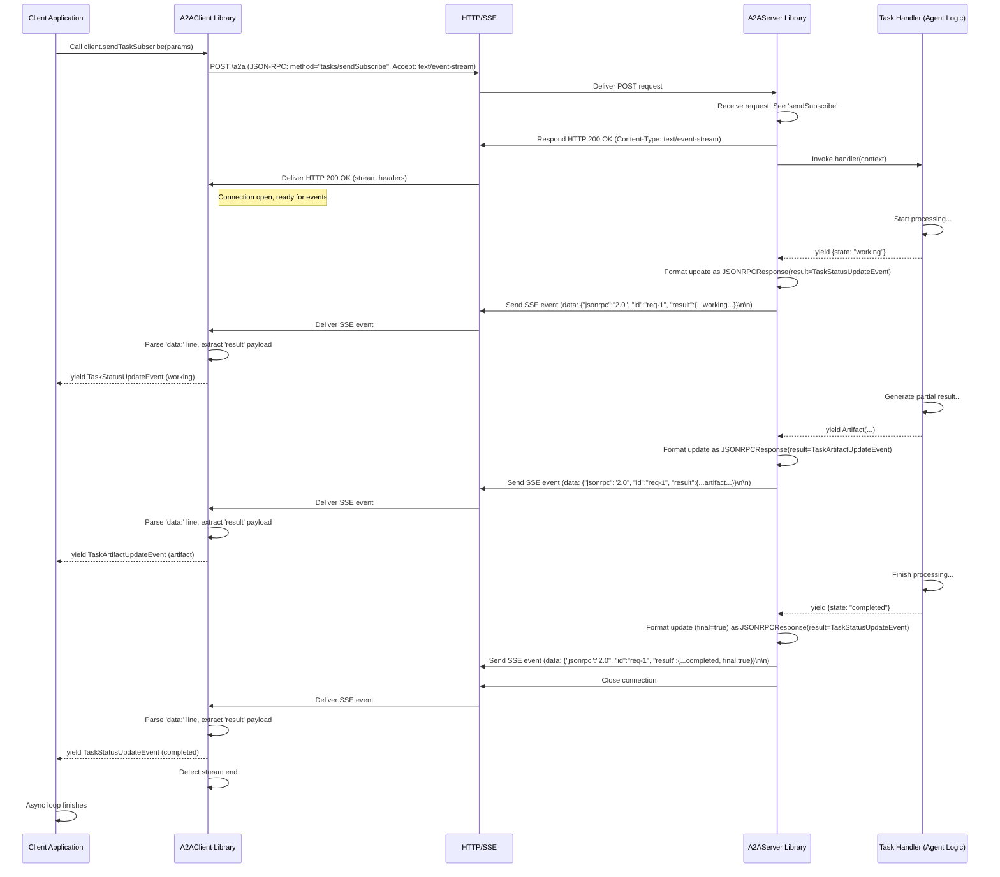

# Chapter 7: Streaming Communication (SSE)

In the [previous chapter](06_task_handling_logic__server_side_.md), we built the "brain" of our agent – the **Task Handling Logic**. We saw how this logic can `yield` status updates or partial results as it works on a task. That's great, but how do those updates actually get back to the client in real-time? If the agent is writing a long story, how does the user see it paragraph by paragraph instead of waiting minutes for the whole thing?

This chapter dives into **Streaming Communication** using **Server-Sent Events (SSE)**. It solves the problem: **How can the server send real-time updates to the client for tasks that take time?**

## The Problem: Waiting is Boring!

Imagine you ask your AI agent assistant to plan a detailed weekend trip to a new city. This involves looking up flights, hotels, attractions, restaurants, checking opening times, maybe even booking things. This could take a minute or two!

If the communication was just a simple request and response, your application would send the request "Plan my trip" and then... wait. And wait. And wait. Finally, after two minutes, it would get the complete plan back. That's not a very engaging experience! You'd wonder if it was even working.

Wouldn't it be better if the agent could send updates like:

*   "Okay, planning your trip to Paris..."
*   "Found potential flights..."
*   "Checking hotel availability near the Eiffel Tower..."
*   "Here's a draft itinerary..."
*   "Okay, the final plan is ready!"

This way, the user sees progress and knows the agent is actively working.

## The Solution: Streaming with Server-Sent Events (SSE)

This real-time update mechanism is called **streaming**. Instead of one big response at the end, the server *streams* multiple small messages back to the client over a single connection.

The Google A2A protocol uses a standard web technology called **Server-Sent Events (SSE)** to achieve this.

**Analogy: Package Tracking**

Think about ordering a package online:

*   **Regular Request/Response:** You place the order, and the *only* update you get is when the package finally arrives at your door.
*   **Streaming (SSE):** You place the order, and you get *live updates*: "Order confirmed," "Package shipped," "Out for delivery," "Delivered."

SSE works like that live tracking. The client makes one request, and the server keeps that connection open, pushing updates (events) whenever something new happens.

**Key points about SSE:**

*   **Server Pushes:** The server sends data to the client whenever it wants (after the initial connection).
*   **One-Way:** Data primarily flows from Server -> Client.
*   **Standard Web Tech:** It's built on top of regular HTTP.

## How Streaming Works in A2A

1.  **Client Initiates:** The [A2A Client](05_a2a_client_implementation.md) uses a specific JSON-RPC method: `tasks/sendSubscribe` (instead of the regular `tasks/send`). This tells the server, "I want to start this task, AND I want to receive live updates."
2.  **Server Acknowledges:** The [A2A Server](04_a2a_server_implementation.md) receives the `tasks/sendSubscribe` request. It prepares to handle a streaming response.
3.  **Special Response Header:** The server sends back an initial HTTP response with a special header: `Content-Type: text/event-stream`. This tells the client, "Get ready for a stream of events!" The connection stays open.
4.  **Handler Yields:** Inside the server, the [Task Handling Logic](06_task_handling_logic__server_side_.md) (the async generator) starts working. When it `yield`s a status update (like `state: 'working'`) or an artifact:
    *   The `A2AServer` library catches this yielded value.
5.  **Server Sends Event:** The `A2AServer` formats the yielded data into an SSE message (more on the format later) and sends it down the open connection to the client.
6.  **Repeat:** Steps 4 and 5 repeat every time the handler yields something new.
7.  **Stream Ends:** When the handler finishes (or yields a final state like `completed` or `failed`), the server sends a final event (often marked with `final: true`) and then closes the connection.

## Server-Side: Sending the Stream

Let's peek at how the `A2AServer` library handles yielded values from your task handler ([Chapter 6](06_task_handling_logic__server_side_.md)) to send SSE events.

### JavaScript Example (Conceptual)

The `A2AServer` in `samples/js/src/server/server.ts` uses the underlying Express.js response object (`res`) to write SSE messages.

```typescript
// File: samples/js/src/server/server.ts (Simplified Snippet inside handleTaskSendSubscribe)

// --- Setup SSE ---
res.writeHead(200, {
  "Content-Type": "text/event-stream", // Tell client it's SSE
  "Cache-Control": "no-cache",
  "Connection": "keep-alive",
});

// Function to send a single SSE event
const sendEvent = (eventData: schema.JSONRPCResponse) => {
  // Format: "data: <json string>\n\n"
  res.write(`data: ${JSON.stringify(eventData)}\n\n`);
};

// --- Process generator yields ---
for await (const yieldValue of generator) {
  // ... (Apply update, save to store etc. - see Chapter 6) ...

  // Create the JSON payload (TaskStatusUpdateEvent or TaskArtifactUpdateEvent)
  const eventPayload = createEventFromYield(taskId, yieldValue, isFinal);

  // Wrap payload in a JSON-RPC Response structure
  const rpcResponse = createSuccessResponse(req.id, eventPayload);

  // Send the formatted event down the stream
  sendEvent(rpcResponse);

  if (isFinal) break; // Stop if handler yielded a final state
}

// --- End Stream ---
if (!res.writableEnded) {
  res.end(); // Close the connection
}
```

**Explanation:**

1.  **Headers:** The server first sends HTTP headers to establish the SSE connection (`Content-Type: text/event-stream`).
2.  **`sendEvent` Helper:** A function is defined to format the JSON data correctly (`data: ...\n\n`) and write it to the response stream (`res.write`).
3.  **Looping:** The code loops through the values yielded by your `TaskHandler` generator.
4.  **Formatting:** Each yielded value is turned into a standard A2A event payload (`TaskStatusUpdateEvent` or `TaskArtifactUpdateEvent`) wrapped in a JSON-RPC response structure.
5.  **Sending:** `sendEvent` is called to push the formatted message to the client.
6.  **Closing:** Once the loop finishes (or a final event is sent), `res.end()` closes the connection.

### Python Example (Conceptual)

The Python `A2AServer` in `samples/python/common/server/server.py` uses the `sse-starlette` library and `EventSourceResponse` to handle the streaming.

```python
# File: samples/python/common/server/server.py (Simplified Snippet _create_response)
from sse_starlette.sse import EventSourceResponse
from typing import AsyncIterable

# ... inside _process_request ...
result = await self.task_manager.on_send_task_subscribe(json_rpc_request)
return self._create_response(result) # Pass the generator to _create_response

# ... inside A2AServer ...
def _create_response(self, result: Any) -> JSONResponse | EventSourceResponse:
    if isinstance(result, AsyncIterable):
        # If the handler returned an async generator...

        async def event_generator(generator_result) -> AsyncIterable[dict[str, str]]:
            # Wrap the generator to format SSE messages
            async for item in generator_result:
                # item is expected to be a JSONRPCResponse containing the event payload
                yield {"data": item.model_dump_json(exclude_none=True)}

        # Use EventSourceResponse to handle the streaming
        return EventSourceResponse(event_generator(result))
    # ... (handle non-streaming JSONResponse) ...
```

**Explanation:**

1.  **Generator:** The `on_send_task_subscribe` method in your `TaskManager` ([Chapter 6](06_task_handling_logic__server_side_.md)) returns an `AsyncIterable` (an async generator).
2.  **`EventSourceResponse`:** The `A2AServer` detects this generator and wraps it in `EventSourceResponse`.
3.  **Formatting:** The inner `event_generator` function iterates through the items yielded by your handler (which are already formatted as `SendTaskStreamingResponse` objects containing the event payload). It takes each item, converts it to a JSON string, and yields it in the `{"data": ...}` format expected by `EventSourceResponse`.
4.  **Automatic Streaming:** `EventSourceResponse` automatically handles sending the correct SSE headers and writing each yielded `data` chunk to the client over the open connection.

In both cases, the library handles the details of SSE formatting, letting your `TaskHandler` focus just on yielding the updates.

## Client-Side: Receiving the Stream

How does the `A2AClient` handle these incoming events?

### JavaScript Example (Conceptual)

The `A2AClient` in `samples/js/src/client/client.ts` uses the browser's `fetch` API and `ReadableStream` to process the SSE events.

```typescript
// File: samples/js/src/client/client.ts (Simplified Snippet inside _handleStreamingResponse)

async function* _handleStreamingResponse(response: Response): AsyncIterable<any> {
  if (!response.ok || !response.body) {
    // Handle HTTP errors before trying to stream
    throw new Error(`HTTP error ${response.status}`);
  }

  // Get a reader for the response body stream (decoded as text)
  const reader = response.body
    .pipeThrough(new TextDecoderStream())
    .getReader();
  let buffer = ""; // To handle partial messages

  try {
    while (true) {
      const { done, value } = await reader.read(); // Read next chunk

      if (done) break; // Stream finished

      buffer += value; // Add chunk to buffer
      const lines = buffer.split("\n\n"); // Split into potential messages
      buffer = lines.pop() || ""; // Keep any trailing partial message

      for (const message of lines) {
        if (message.startsWith("data: ")) { // Check for SSE data line
          const dataLine = message.substring("data: ".length);
          try {
            // Parse the JSON data from the line
            const parsedData = JSON.parse(dataLine);
            // parsedData is expected to be a JSONRPCResponse
            if (parsedData.result) {
              // Yield the actual event payload (TaskStatusUpdateEvent, etc.)
              yield parsedData.result;
            } else if (parsedData.error) {
              // Handle errors received in the stream
              throw new RpcError(parsedData.error.code, parsedData.error.message);
            }
          } catch (e) {
            console.error("Failed to parse SSE data:", dataLine, e);
          }
        }
      }
    }
  } finally {
    reader.releaseLock(); // Clean up the reader
  }
}

// Usage (from Chapter 5):
// const stream = client.sendTaskSubscribe(params);
// for await (const event of stream) {
//   console.log("Received Agent Event:", event);
// }
```

**Explanation:**

1.  **Reader:** It gets a `ReadableStreamDefaultReader` to read the response body chunk by chunk.
2.  **Buffering:** It uses a `buffer` to accumulate incoming text, because SSE messages (`data: ...\n\n`) might arrive split across multiple network packets.
3.  **Splitting Messages:** It splits the buffer by the SSE message separator (`\n\n`).
4.  **Parsing `data:`:** It looks for lines starting with `data: `, extracts the JSON string after it, and parses it.
5.  **Yielding Payload:** It extracts the `result` field from the parsed JSON-RPC response (this `result` contains the `TaskStatusUpdateEvent` or `TaskArtifactUpdateEvent`) and `yield`s it to the application code (the `for await...of` loop).
6.  **Error Handling:** It includes checks for HTTP errors and JSON parsing errors.

### Python Example (Conceptual)

The Python `A2AClient` in `samples/python/common/client/client.py` uses the `httpx-sse` library.

```python
# File: samples/python/common/client/client.py (Simplified Snippet send_task_streaming)
import httpx
from httpx_sse import connect_sse # SSE client library
import json

async def send_task_streaming(self, payload: dict) -> AsyncIterable[SendTaskStreamingResponse]:
    request = SendTaskStreamingRequest(params=payload)
    request_json = request.model_dump(exclude_none=True)

    # Use httpx client and connect_sse context manager
    async with httpx.AsyncClient(timeout=None) as client:
      try:
        async with connect_sse(client, "POST", self.url, json=request_json) as event_source:
            # Iterate through Server-Sent Events provided by the library
            async for sse in event_source.aiter_sse():
                if sse.event == "message": # Default event type
                    try:
                        # Parse the JSON data from the event
                        response_data = json.loads(sse.data)
                        # Validate and yield the parsed response object
                        yield SendTaskStreamingResponse(**response_data)
                    except json.JSONDecodeError:
                        print(f"Warning: Could not decode SSE data: {sse.data}")
                    except Exception as e: # Catch validation errors too
                        print(f"Warning: Error processing SSE data: {e} - Data: {sse.data}")
      except httpx.RequestError as e:
          raise A2AClientHTTPError(400, str(e)) from e
      # Handle other potential errors like connection issues
```

**Explanation:**

1.  **`httpx-sse`:** It uses the `connect_sse` function from `httpx-sse`. This function handles the underlying HTTP connection and SSE parsing.
2.  **Iteration:** `event_source.aiter_sse()` provides an async iterator that yields individual SSE events as they arrive.
3.  **Parsing:** Inside the loop, `sse.data` contains the JSON string from the `data:` line. We parse it using `json.loads()`.
4.  **Validation & Yield:** We validate the parsed data against the `SendTaskStreamingResponse` model (which expects the `result` to be an event payload) and `yield` the resulting object to the application code (`async for result in response_stream:`).
5.  **Error Handling:** Includes `try...except` blocks for JSON decoding errors and HTTP request errors.

Again, the client libraries hide most of the complexity, providing a simple async iterator for your application to consume.

## Under the Hood: The SSE Sequence

Here's how the pieces fit together when a client requests streaming:



## SSE Event Format in A2A

The basic format of an SSE message is:

```
data: <payload_as_json_string>

```

(Note the two newlines at the end!)

In the A2A protocol, the `<payload_as_json_string>` is typically a standard JSON-RPC `Response` object. The `result` field of this response object contains the actual A2A event payload:

*   **`TaskStatusUpdateEvent`:** Sent when the task's status changes (e.g., `submitted` -> `working`). Includes the new `TaskStatus`.
*   **`TaskArtifactUpdateEvent`:** Sent when the task generates an output `Artifact` (like a chunk of text, a file reference, or structured data).

**Example Status Update Event (as sent over SSE):**

```
data: {"jsonrpc": "2.0", "id": "req-client-123", "result": {"id": "task-abc", "status": {"state": "working", "message": {"role": "agent", "parts": [{"text": "Analyzing data..."}]}, "timestamp": "..." }, "final": false}}

```

**Example Artifact Update Event (as sent over SSE):**

```
data: {"jsonrpc": "2.0", "id": "req-client-123", "result": {"id": "task-abc", "artifact": {"parts": [{"text": "Here is the first paragraph..."}]}, "final": false}}

```

The `final: true` flag is added to the *last* event sent for a task (usually a final `TaskStatusUpdateEvent` with state `completed` or `failed`) to signal the end of the stream.

## Conclusion

Streaming Communication using Server-Sent Events (SSE) is a powerful feature of the A2A protocol that allows agents to provide real-time feedback for long-running tasks.

*   It improves user experience by showing progress instead of making users wait.
*   It uses the standard SSE web technology (`Content-Type: text/event-stream`).
*   Clients initiate streaming using `tasks/sendSubscribe`.
*   Servers use libraries (like `sse-starlette` or custom Express logic) to send `data:` events containing JSON-RPC responses with `TaskStatusUpdateEvent` or `TaskArtifactUpdateEvent` payloads.
*   Clients use libraries (like `httpx-sse` or `fetch` streams) to easily consume these events.

Now that we understand how individual agents can communicate, even for long tasks, how can we coordinate *multiple* agents to work together on a larger goal?

**Next:** [Chapter 8: Multi-Agent Orchestration (Host Agent)](08_multi_agent_orchestration__host_agent_.md)

---

Generated by [AI Codebase Knowledge Builder](https://github.com/The-Pocket/Tutorial-Codebase-Knowledge)