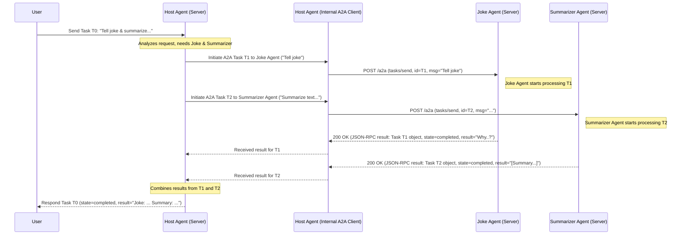

# Chapter 8: Multi-Agent Orchestration (Host Agent)

In the [previous chapter](07_streaming_communication__sse_.md), we saw how an agent server can stream updates back to a client using Server-Sent Events (SSE). This is great for keeping users informed during long tasks.

But what if a task is *so* complex that no single AI agent can handle it alone? Imagine asking an assistant: "Plan a weekend trip to London for me, including flights from New York, a hotel near the British Museum, and suggest two vegetarian restaurants."

One agent might be amazing at finding flights, another specialized in hotel bookings, and a third brilliant at restaurant recommendations. How can we get these specialist agents to work together to fulfill your complex request?

This chapter introduces the concept of **Multi-Agent Orchestration** using a **Host Agent**. It solves the problem: **How can we coordinate multiple, specialized AI agents to achieve a larger goal?**

## What is a Host Agent? The Project Manager AI

Think of a big project, like building a house. You don't just talk to one person. You have a **project manager** (or general contractor). They:

1.  Receive the high-level goal (build a house).
2.  Understand the different skills needed (plumbing, electrical, framing, etc.).
3.  Find and hire specialists (plumbers, electricians, carpenters).
4.  Assign specific tasks to each specialist.
5.  Coordinate their work and deadlines.
6.  Combine their contributions into the final house.

A **Host Agent** in the A2A world acts exactly like that project manager. It's an AI agent whose main job is *not* to perform tasks itself, but to **coordinate other agents**. Specifically, it acts as an **[A2A Client](05_a2a_client_implementation.md)** to *other* downstream A2A agents.

Here's the flow:

1.  **Receives Request:** The Host Agent gets a request from a user or application (e.g., "Plan my London trip").
2.  **Finds Specialists:** It looks at its list of known downstream agents and their [Agent Cards](01_agent_card.md) to see who has the needed skills (e.g., "Flight Booker Agent", "Hotel Finder Agent").
3.  **Delegates Tasks:** It breaks down the request and sends specific [Tasks](02_task.md) to the chosen downstream agents using the standard [A2A Protocol & Core Types](03_a2a_protocol___core_types.md). For example:
    *   Sends a task "Find NYC-London flights for next weekend" to the Flight Booker Agent.
    *   Sends a task "Find hotels near British Museum" to the Hotel Finder Agent.
4.  **Gathers Results:** It receives the results (potentially via [Streaming Communication (SSE)](07_streaming_communication__sse_.md)) from the downstream agents.
5.  **Combines & Responds:** It might combine the flight info and hotel options into a single, coherent response for the original user.

The Host Agent is the central coordinator, making multiple agents appear as one unified, more capable agent.

## How a Host Agent Works (Conceptual)

Let's imagine we're building a simple Host Agent. It knows about two other agents:

*   `Joke Teller Agent` (at `http://joke-agent.com`) - Skill: `tell_joke`
*   `Summarizer Agent` (at `http://summary-agent.com`) - Skill: `summarize_text`

Our Host Agent receives the request: "Tell me a joke and summarize this article: [long article text]"

Here's how the Host Agent's internal logic might work:

1.  **Analyze Request:** The Host Agent realizes the request has two parts: telling a joke and summarizing text.
2.  **Match Skills:**
    *   It checks its known agents' [Agent Cards](01_agent_card.md).
    *   It sees `Joke Teller Agent` has the `tell_joke` skill.
    *   It sees `Summarizer Agent` has the `summarize_text` skill.
3.  **Delegate Task 1 (Joke):**
    *   It acts as an [A2A Client](05_a2a_client_implementation.md).
    *   It sends a `tasks/send` request to `http://joke-agent.com/a2a` with the message "Tell me a joke".
4.  **Delegate Task 2 (Summary):**
    *   It acts as an [A2A Client](05_a2a_client_implementation.md) again.
    *   It sends a `tasks/send` request to `http://summary-agent.com/a2a` with the message containing the article text.
5.  **Await Responses:** It waits for both downstream tasks to complete (using their Task IDs to track them). Let's say it gets:
    *   From Joke Agent: "Why don't scientists trust atoms? Because they make up everything!"
    *   From Summarizer Agent: "[Short summary of the article]"
6.  **Combine & Reply:** It combines these results into a single response for the original user: "Okay, here's a joke: Why don't scientists trust atoms? Because they make up everything! \n\nAnd here's the summary: [Short summary of the article]"

## Example Implementation Snippets (Conceptual Python)

Building a full Host Agent often involves frameworks like Google's Agent Development Kit (ADK), as seen in `samples/python/hosts/multiagent/host_agent.py`. However, let's look at the core A2A concepts conceptually.

The Host Agent needs a way to manage connections to downstream agents. We might have a helper class like `RemoteAgentConnection` (inspired by `samples/python/hosts/multiagent/remote_agent_connection.py`) which internally uses an [A2A Client](05_a2a_client_implementation.md).

```python
# Conceptual Helper Class (Manages client for one downstream agent)
from common.client import A2AClient
from common.types import AgentCard, TaskSendParams, Task

class RemoteAgentConnection:
    def __init__(self, agent_card: AgentCard):
        # Store the downstream agent's card
        self.card = agent_card
        # Create an A2A client specifically for this agent
        self.client = A2AClient(agent_card=agent_card)
        print(f"Connection ready for agent: {self.card.name}")

    async def send_task_to_remote(self, params: TaskSendParams) -> Task:
        print(f"Host sending task {params.id} to {self.card.name}...")
        # Use the internal A2A client to send the task
        # (Simplified: assumes non-streaming for clarity)
        response = await self.client.send_task(params.model_dump())
        print(f"Host received response for task {params.id} from {self.card.name}")
        return response.result # Return the final Task object
```

**Explanation:**

*   This class holds the [Agent Card](01_agent_card.md) of a downstream agent.
*   It creates and holds an [A2A Client](05_a2a_client_implementation.md) instance configured to talk to that specific agent's A2A server URL.
*   The `send_task_to_remote` method takes the task details (`TaskSendParams`) and uses the internal client to actually send the [Task](02_task.md) over A2A.

Now, the Host Agent's main logic might look something like this:

```python
# Conceptual Host Agent Logic
import asyncio
from common.types import Message, TextPart, TaskSendParams
import uuid

class HostAgentLogic:
    def __init__(self):
        # Assume agent cards are loaded somehow
        joke_agent_card = AgentCard(name="Joke Agent", url="http://joke-agent.com/a2a", ...)
        summary_agent_card = AgentCard(name="Summarizer Agent", url="http://summary-agent.com/a2a", ...)

        # Create connections to downstream agents
        self.remote_connections = {
            "Joke Agent": RemoteAgentConnection(joke_agent_card),
            "Summarizer Agent": RemoteAgentConnection(summary_agent_card),
        }
        print("Host Agent initialized with remote connections.")

    async def handle_user_request(self, user_request_text: str):
        print(f"Host received user request: {user_request_text}")
        # Super simplified logic: If "joke" in request, call Joke Agent.
        # If "summarize" in request, call Summarizer Agent.

        tasks_to_run = []
        if "joke" in user_request_text.lower():
            joke_conn = self.remote_connections["Joke Agent"]
            joke_params = TaskSendParams(
                id=str(uuid.uuid4()),
                message=Message(role="user", parts=[TextPart(text="Tell joke")])
            )
            # Add the task-sending coroutine to the list
            tasks_to_run.append(joke_conn.send_task_to_remote(joke_params))

        if "summarize" in user_request_text.lower():
            # (Assume article_text is extracted from user_request_text)
            article_text = "This is the article to summarize..."
            summary_conn = self.remote_connections["Summarizer Agent"]
            summary_params = TaskSendParams(
                id=str(uuid.uuid4()),
                message=Message(role="user", parts=[TextPart(text=article_text)])
            )
            tasks_to_run.append(summary_conn.send_task_to_remote(summary_params))

        # Run the downstream tasks concurrently
        print(f"Host dispatching {len(tasks_to_run)} tasks...")
        results = await asyncio.gather(*tasks_to_run)
        print("Host gathered results from downstream agents.")

        # Combine results (simplified)
        final_response = ""
        for task_result in results:
            if task_result.status.message and task_result.status.message.parts:
                final_response += task_result.status.message.parts[0].text + "\n"

        print(f"Host final response: {final_response}")
        return final_response

# --- Example Usage ---
# async def main():
#     host = HostAgentLogic()
#     await host.handle_user_request("Tell me a joke and summarize stuff.")
# asyncio.run(main())
```

**Explanation:**

1.  **Initialization:** The `HostAgentLogic` creates `RemoteAgentConnection` instances for each downstream agent it knows.
2.  **Request Handling:** When `handle_user_request` is called, it figures out which downstream agents are needed based on the request text (very basic keyword matching here).
3.  **Prepare Tasks:** It prepares the `TaskSendParams` for each required downstream task.
4.  **Concurrent Delegation:** It uses `asyncio.gather` to run the `send_task_to_remote` calls for all needed agents *concurrently*. This means it doesn't wait for the joke agent to finish before asking the summarizer agent to start.
5.  **Combine Results:** After `asyncio.gather` finishes (meaning all downstream tasks have completed), it extracts the results from the returned `Task` objects and combines them into a final response.

This example shows the core idea: the Host Agent uses its knowledge of other agents' capabilities and acts as an A2A client to delegate work, potentially in parallel. Real host agents would have much more sophisticated logic for planning, delegation, and result synthesis, possibly using large language models themselves for coordination.

## Under the Hood: Orchestration Flow

Let's trace the communication for our "Joke & Summarize" example:



**Steps:**

1.  User sends the initial request (Task T0) to the Host Agent.
2.  The Host Agent's logic determines it needs both the Joke Agent and Summarizer Agent.
3.  The Host Agent uses its internal A2A client capabilities (represented by `HAClient`) to send Task T1 to the Joke Agent's A2A server endpoint.
4.  Concurrently (or sequentially), the Host Agent uses its client capabilities to send Task T2 to the Summarizer Agent's A2A server endpoint.
5.  The downstream agents (Joke, Summary) process their respective tasks and send back A2A responses (containing the final Task object with results) to the Host Agent's client component.
6.  The Host Agent logic receives the results for T1 and T2.
7.  The Host Agent combines the results and sends the final response for the original Task T0 back to the user.

The key is that the Host Agent speaks A2A *both* as a server (to the original user) and as a client (to the downstream agents).

**Relevant Files:**

*   `samples/python/hosts/multiagent/host_agent.py`: Implements the host agent logic, deciding which tools (remote agents) to call.
*   `samples/python/hosts/multiagent/remote_agent_connection.py`: Wraps the `A2AClient` for easier use by the `HostAgent`. It handles sending the task via A2A (streaming or non-streaming).
*   `demo/ui/service/server/adk_host_manager.py`: Manages the lifecycle and state of the host agent within the demo application framework (using Google ADK). It shows how task callbacks from `RemoteAgentConnection` update the overall state.

## Conclusion

Multi-Agent Orchestration allows us to combine the strengths of specialized AI agents to tackle complex problems that a single agent might struggle with.

The **Host Agent** acts as the "project manager" in this system. It:

*   Understands the overall goal.
*   Knows the capabilities of other available agents (via their [Agent Cards](01_agent_card.md)).
*   Delegates sub-tasks to appropriate downstream agents by acting as an [A2A Client](05_a2a_client_implementation.md).
*   Coordinates the process and potentially combines the results.

This pattern enables building sophisticated applications by composing modular, specialized agents that communicate using the standard A2A protocol.

Now that we've explored the core concepts and components of the A2A protocol, let's see how they all come together in a practical demonstration.

**Next:** [Chapter 9: Demo UI Application & Service](09_demo_ui_application___service.md)

---

Generated by [AI Codebase Knowledge Builder](https://github.com/The-Pocket/Tutorial-Codebase-Knowledge)