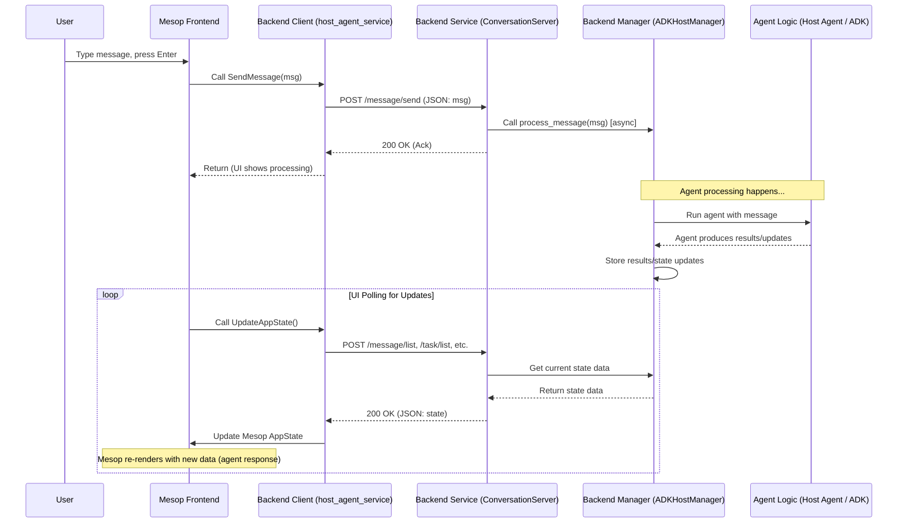

# Chapter 9: Demo UI Application & Service

In the [previous chapter](08_multi_agent_orchestration__host_agent_.md), we explored how a **Host Agent** can act like a project manager, coordinating multiple specialized agents using the A2A protocol to achieve complex goals. We've learned about Agent Cards, Tasks, the protocol itself, servers, clients, task logic, streaming, and orchestration. That's a lot of building blocks!

But how do we see all these pieces working together in a real, interactive way? Just reading about protocols and servers is like reading the blueprints for a car. Wouldn't it be more helpful to actually *see* the car drive?

That's where the **Demo UI Application & Service** comes in. It solves the problem: **How can we visualize and interact with the A2A protocol and multi-agent systems in action?**

## What is the Demo UI Application & Service? The Control Room

Imagine a space mission control room. You have:

*   **Big Screens (UI):** Showing the rocket's status, communication logs, astronaut locations, etc.
*   **Flight Controllers (Backend Service):** People at consoles managing specific parts of the mission, talking to different teams, and updating the screens.
*   **Astronauts & Ground Crew (A2A Agents):** The actual experts doing the work (flying, repairing, analyzing), communicating back via radio (A2A protocol).

The **Demo UI Application & Service** is like that control room for our A2A agents:

1.  **Demo UI Application:** This is the web-based frontend, built using a Python framework called [Mesop](https://github.com/mesop-dev/mesop). It provides the "big screens" – a chat interface where you can talk to agents, see their responses (including special content like forms or images), view lists of available agents, and inspect the communication flow.
2.  **Backend Service (`ConversationServer`):** This is the "flight controller" software running behind the scenes. It's a backend web service (built using FastAPI in Python) that the UI application talks to. It's *not* the main [Host Agent](08_multi_agent_orchestration__host_agent_.md) itself, but rather an **intermediary**. It manages the user's conversations, receives events from the UI (like sending a message), communicates with the actual agent logic (like the Host Agent), and sends state updates back to the UI so the screens stay current.

Think of it as a user-friendly window into the world of A2A, letting you watch and participate as agents collaborate.

## Key Components

Let's break down the two main parts:

### 1. Frontend (Mesop UI Application)

This is what you see and interact with in your web browser. Mesop allows building UIs purely in Python. Key features include:

*   **Chat Interface:** Displays the conversation history between you and the agent system. (`demo/ui/components/conversation.py`)
*   **Input Box:** Where you type your messages to the agent. (`demo/ui/components/conversation.py`)
*   **Agent Management:** Allows adding new agents by providing their [Agent Card](01_agent_card.md) URL. (`demo/ui/pages/agent_list.py`)
*   **Rich Content Rendering:** Can display not just text, but also interactive forms sent by agents (`demo/ui/components/form_render.py`), images, etc.
*   **Task/Event Views:** Provides ways to inspect the underlying [Tasks](02_task.md) and communication events happening via A2A. (`demo/ui/pages/task_list.py`, `demo/ui/pages/event_list.py`)

```python
# File: demo/ui/components/conversation.py (Simplified Snippet)
# ... imports ...

@me.component
def conversation():
    """Conversation component"""
    page_state = me.state(PageState) # Local page state
    app_state = me.state(AppState)   # Global application state

    # ... loop to display existing messages using chat_bubble component ...
    for message in app_state.messages:
        if is_form(message):
          render_form(message, app_state) # Special handling for forms
        # ... other message types ...
        else:
          chat_bubble(message, message.message_id) # Display regular chat message

    # --- Input area ---
    with me.box(style=me.Style(display="flex", flex_direction="row", ...)):
        me.input(
            label="How can I help you?",
            on_enter=send_message_enter, # Function to call when user presses Enter
            # ... other attributes ...
        )
        with me.content_button(on_click=send_message_button): # Button handler
            me.icon(icon="send")

async def send_message_enter(e: me.InputEnterEvent):
    # ... (get state) ...
    message_content = e.value
    message_id = str(uuid.uuid4())
    # Store something to indicate a background task is running
    app_state = me.state(AppState)
    app_state.background_tasks[message_id] = "Processing..."
    yield # Update UI to show indicator
    # Call the backend service to actually send the message
    await send_message(message_content, message_id)
    yield # Allow UI to potentially update again
```

**Explanation:**

*   This Mesop component defines the chat interface.
*   It uses `app_state` (defined in `demo/ui/state/state.py`) to access the current list of messages and display them.
*   It renders an `me.input` field. When the user presses Enter (`on_enter`), the `send_message_enter` function is called.
*   `send_message_enter` gets the user's text, updates the state to show a "Processing..." indicator, and then calls `send_message` (defined in `demo/ui/state/host_agent_service.py`) which actually communicates with the backend `ConversationServer`.

### 2. Backend (`ConversationServer`)

This FastAPI server acts as the bridge between the simple HTTP/JSON communication from the UI and the potentially more complex agent interactions (which might involve A2A or frameworks like Google ADK).

*   **API Endpoints:** Exposes simple HTTP endpoints (e.g., `/message/send`, `/conversation/list`) that the UI's client can call. (`demo/ui/service/server/server.py`)
*   **Conversation Management:** Keeps track of different chat sessions.
*   **State Management:** Holds the application state (messages, tasks, agents) that the UI needs to display.
*   **Agent Interaction Logic:** Contains the logic to forward requests from the UI to the actual agent system (e.g., the ADK [Host Agent](08_multi_agent_orchestration__host_agent_.md)). (`demo/ui/service/server/adk_host_manager.py`)
*   **Callback Handling:** Receives updates (like task status changes or new artifacts) from the agent system and updates its internal state.

```python
# File: demo/ui/service/server/server.py (Simplified Snippet)
from fastapi import APIRouter, Request
from common.types import Message
from .adk_host_manager import ADKHostManager # Implements agent interaction logic
# ... other imports ...

class ConversationServer:
    def __init__(self, router: APIRouter):
        # Choose the manager (e.g., ADKHostManager uses the Host Agent)
        self.manager = ADKHostManager()

        # Define API route for sending messages
        router.add_api_route(
            "/message/send",
            self._send_message, # Maps URL to the _send_message method
            methods=["POST"])
        # ... other routes (/conversation/list, /task/list, etc.) ...

    async def _send_message(self, request: Request):
        message_data = await request.json()
        # Parse the message data sent by the UI client
        message = Message(**message_data['params'])
        # Add necessary metadata (IDs, etc.)
        message = self.manager.sanitize_message(message)
        # --- Crucial Part: Pass message to the agent logic ---
        # Run the actual agent processing in a background thread
        # so the API call returns quickly to the UI.
        thread = threading.Thread(
           target=lambda: asyncio.run(self.manager.process_message(message))
        )
        thread.start()
        # Return an immediate confirmation to the UI
        return SendMessageResponse(result=MessageInfo(
            message_id=message.metadata['message_id'],
            # ... other info ...
        ))
```

**Explanation:**

*   The `ConversationServer` sets up API routes using FastAPI.
*   The `_send_message` method handles requests to the `/message/send` endpoint.
*   It parses the `Message` sent from the UI client.
*   It calls `self.manager.process_message(message)`. The `manager` (here, `ADKHostManager`) is responsible for actually interacting with the underlying agent system ([Host Agent](08_multi_agent_orchestration__host_agent_.md)).
*   Crucially, `process_message` is run in a separate thread so the API can respond quickly, acknowledging receipt, while the potentially long-running agent work happens in the background.

## How It Works: The Flow of a Message

Let's trace what happens when you type "Hello" and press Enter in the Demo UI:

1.  **UI (Mesop):** The `on_enter` event triggers `send_message_enter` in `conversation.py`.
2.  **UI State:** `send_message_enter` updates the `AppState` to show a "Processing" indicator.
3.  **UI Client (`host_agent_service.py`):** `send_message_enter` calls `SendMessage(message)`. This function uses the `ConversationClient` to make an HTTP POST request to the `ConversationServer`'s `/message/send` endpoint, sending the user's message as JSON.
    ```python
    # File: demo/ui/state/host_agent_service.py (Simplified Snippet)
    async def SendMessage(message: Message) -> str | None:
      client = ConversationClient(server_url) # Backend server URL
      try:
        # Make HTTP POST request to backend API
        response = await client.send_message(SendMessageRequest(params=message))
        return response.result # Contains confirmation IDs
      except Exception as e:
        print("Failed to send message: ", e)
    ```
4.  **Backend Service (`server.py`):** The `_send_message` method on the `ConversationServer` receives the POST request.
5.  **Backend Service Logic (`adk_host_manager.py`):** `_send_message` calls `self.manager.process_message(message)` (running in a background thread).
    ```python
    # File: demo/ui/service/server/adk_host_manager.py (Simplified Snippet)
    async def process_message(self, message: Message):
        # ... (Store message, add event) ...
        # Get conversation context
        conversation_id = message.metadata.get('conversation_id')
        # --- Interact with the actual agent (e.g., Google ADK Runner) ---
        async for event in self._host_runner.run_async(
            user_id=self.user_id,
            session_id=conversation_id,
            new_message=self.adk_content_from_message(message) # Convert to agent format
        ):
            # Process events coming *back* from the agent
            self.add_event(...) # Store for UI event log
            # ... potentially update task status via task_callback ...
        # ... (Store final response message) ...
        # Remove pending indicator
        self._pending_message_ids.remove(get_message_id(message))
    ```
6.  **Agent Processing:** `process_message` uses the ADK `Runner` (`self._host_runner`) to send the message to the configured agent (our [Host Agent](08_multi_agent_orchestration__host_agent_.md)). The Host Agent might then use its own [A2A Client](05_a2a_client_implementation.md) logic to talk to downstream agents via A2A.
7.  **Agent Response/Updates:** As the agent system works, it sends back events (potentially via [Streaming Communication (SSE)](07_streaming_communication__sse_.md) if using A2A, or via ADK callbacks). The `ADKHostManager`'s `task_callback` or the `run_async` loop processes these updates, storing new messages, updating task statuses, and storing artifacts.
8.  **UI Polling (`page_scaffold.py`):** Meanwhile, the Mesop UI periodically polls the `ConversationServer` for state updates using an `async_poller` component. This poller triggers `UpdateAppState` in `host_agent_service.py`.
    ```python
    # File: demo/ui/components/page_scaffold.py (Simplified Snippet)
    async def refresh_app_state(e: mel.WebEvent): # Triggered by poller
        yield
        app_state = me.state(AppState)
        # Call backend service to get the latest state
        await UpdateAppState(app_state, app_state.current_conversation_id)
        yield
    # ... in page_scaffold component setup ...
    async_poller(action=..., trigger_event=refresh_app_state)
    ```
9.  **Backend State Request (`host_agent_service.py`):** `UpdateAppState` calls various `ConversationServer` endpoints (like `/conversation/list`, `/message/list`, `/task/list`) to get the latest messages, tasks, etc.
10. **Backend Response:** The `ConversationServer` returns the current state data from its `manager`.
11. **UI Update:** `UpdateAppState` updates the global `AppState` in Mesop with the fresh data. Because Mesop automatically re-renders when state changes, the UI updates to show the agent's response, remove the "Processing" indicator, and update task lists.

## Under the Hood: Sequence Diagram

This diagram shows the high-level flow for sending a message and getting a response, involving the UI, the Backend Service, and the Agent Logic (like the Host Agent).



## Conclusion

The Demo UI Application and its associated `ConversationServer` backend provide a crucial, practical tool for the Google A2A project. They act as an interactive "control room" allowing you to:

*   **Visualize** conversations involving one or more A2A agents.
*   **Interact** with the system by sending messages.
*   **Observe** how components like the [Host Agent](08_multi_agent_orchestration__host_agent_.md) delegate tasks using the A2A protocol.
*   **Inspect** the state of [Tasks](02_task.md) and communication events.
*   **Experiment** by adding new agents via their [Agent Cards](01_agent_card.md).

It brings together all the concepts we've discussed – servers, clients, tasks, streaming, orchestration – into a tangible demonstration, making the abstract protocol concrete and easier to understand. This completes our journey through the core concepts of the Google A2A protocol and its demonstration application!

---

Generated by [AI Codebase Knowledge Builder](https://github.com/The-Pocket/Tutorial-Codebase-Knowledge)