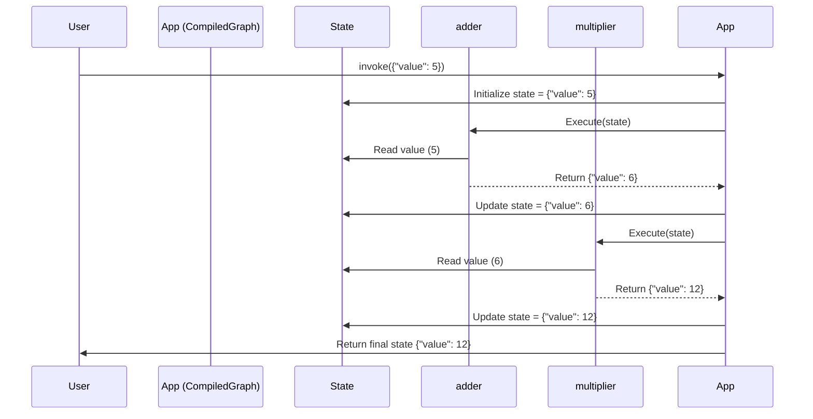

# Chapter 1: Graph / StateGraph - The Blueprint of Your Application

Welcome to the LangGraph tutorial! We're excited to help you learn how to build powerful, stateful applications with Large Language Models (LLMs).

Imagine you're building an application, maybe a chatbot, an agent that performs tasks, or something that processes data in multiple steps. As these applications get more complex, just calling an LLM once isn't enough. You need a way to structure the flow – maybe call an LLM, then a tool, then another LLM based on the result. How do you manage this sequence of steps and the information passed between them?

That's where **Graphs** come in!

## What Problem Do Graphs Solve?

Think of a complex task like baking a cake. You don't just throw all the ingredients in the oven. There's a sequence: mix dry ingredients, mix wet ingredients, combine them, pour into a pan, bake, cool, frost. Each step depends on the previous one.

LangGraph helps you define these steps and the order they should happen in. It provides a way to create a **flowchart** or a **blueprint** for your application's logic.

The core idea is to break down your application into:

1.  **Nodes:** These are the individual steps or actions (like "mix dry ingredients" or "call the LLM").
2.  **Edges:** These are the connections or transitions between the steps, defining the order (after mixing dry ingredients, mix wet ingredients).

LangGraph provides different types of graphs, but the most common and useful one for building stateful applications is the `StateGraph`.

## Core Concepts: `Graph`, `StateGraph`, and `MessageGraph`

Let's look at the main types of graphs you'll encounter:

1.  **`Graph` (The Basic Blueprint)**
    *   This is the most fundamental type. You define nodes (steps) and edges (connections).
    *   It's like a basic flowchart diagram.
    *   You explicitly define how information passes from one node to the next.
    *   While foundational, you'll often use the more specialized `StateGraph` for convenience.

    ```python
    # This is a conceptual example - we usually use StateGraph
    from langgraph.graph import Graph

    # Define simple functions or Runnables as nodes
    def step_one(input_data):
        print("Running Step 1")
        return input_data * 2

    def step_two(processed_data):
        print("Running Step 2")
        return processed_data + 5

    # Create a basic graph
    basic_graph_builder = Graph()

    # Add nodes
    basic_graph_builder.add_node("A", step_one)
    basic_graph_builder.add_node("B", step_two)

    # Add edges (connections)
    basic_graph_builder.add_edge("A", "B") # Run B after A
    basic_graph_builder.set_entry_point("A") # Start at A
    # basic_graph_builder.set_finish_point("B") # Not needed for this simple Graph type
    ```

2.  **`StateGraph` (The Collaborative Whiteboard)**
    *   This is the workhorse for most LangGraph applications. It's a specialized `Graph`.
    *   **Key Idea:** Nodes communicate *implicitly* by reading from and writing to a shared **State** object.
    *   **Analogy:** Imagine a central whiteboard (the State). Each node (person) can read what's on the whiteboard, do some work, and then update the whiteboard with new information or changes.
    *   You define the *structure* of this shared state first (e.g., what keys it holds).
    *   Each node receives the *current* state and returns a *dictionary* containing only the parts of the state it wants to *update*. LangGraph handles merging these updates into the main state.

3.  **`MessageGraph` (The Chatbot Specialist)**
    *   This is a further specialization of `StateGraph`, designed specifically for building chatbots or conversational agents.
    *   It automatically manages a `messages` list within its state.
    *   Nodes typically take the current list of messages and return new messages to be added.
    *   It uses a special function (`add_messages`) to append messages while handling potential duplicates or updates based on message IDs. This makes building chat flows much simpler.

For the rest of this chapter, we'll focus on `StateGraph` as it introduces the core concepts most clearly.

## Building a Simple `StateGraph`

Let's build a tiny application that takes a number, adds 1 to it, and then multiplies it by 2.

**Step 1: Define the State**

First, we define the "whiteboard" – the structure of the data our graph will work with. We use Python's `TypedDict` for this.

```python
from typing import TypedDict

class MyState(TypedDict):
    # Our state will hold a single number called 'value'
    value: int
```

This tells our `StateGraph` that the shared information will always contain an integer named `value`.

**Step 2: Define the Nodes**

Nodes are functions (or LangChain Runnables) that perform the work. They take the current `State` as input and return a dictionary containing the *updates* to the state.

```python
# Node 1: Adds 1 to the value
def add_one(state: MyState) -> dict:
    print("--- Running Adder Node ---")
    current_value = state['value']
    new_value = current_value + 1
    print(f"Input value: {current_value}, Output value: {new_value}")
    # Return *only* the key we want to update
    return {"value": new_value}

# Node 2: Multiplies the value by 2
def multiply_by_two(state: MyState) -> dict:
    print("--- Running Multiplier Node ---")
    current_value = state['value']
    new_value = current_value * 2
    print(f"Input value: {current_value}, Output value: {new_value}")
    # Return the update
    return {"value": new_value}
```

Notice how each function takes `state` and returns a `dict` specifying which part of the state (`"value"`) should be updated and with what new value.

**Step 3: Create the Graph and Add Nodes/Edges**

Now we assemble our blueprint using `StateGraph`.

```python
from langgraph.graph import StateGraph, END, START

# Create a StateGraph instance linked to our state definition
workflow = StateGraph(MyState)

# Add the nodes to the graph
workflow.add_node("adder", add_one)
workflow.add_node("multiplier", multiply_by_two)

# Set the entry point --> where does the flow start?
workflow.set_entry_point("adder")

# Add edges --> how do the nodes connect?
workflow.add_edge("adder", "multiplier") # After adder, run multiplier

# Set the finish point --> where does the flow end?
# We use the special identifier END
workflow.add_edge("multiplier", END)
```

*   `StateGraph(MyState)`: Creates the graph, telling it to use our `MyState` structure.
*   `add_node("name", function)`: Registers our functions as steps in the graph with unique names.
*   `set_entry_point("adder")`: Specifies that the `adder` node should run first. This implicitly creates an edge from a special `START` point to `adder`.
*   `add_edge("adder", "multiplier")`: Creates a connection. After `adder` finishes, `multiplier` will run.
*   `add_edge("multiplier", END)`: Specifies that after `multiplier` finishes, the graph execution should stop. `END` is a special marker for the graph's conclusion.

**Step 4: Compile the Graph**

Before we can run it, we need to `compile` the graph. This finalizes the structure and makes it executable.

```python
# Compile the workflow into an executable object
app = workflow.compile()
```

**Step 5: Run It!**

Now we can invoke our compiled graph (`app`) with some initial state.

```python
# Define the initial state
initial_state = {"value": 5}

# Run the graph
final_state = app.invoke(initial_state)

# Print the final result
print("\n--- Final State ---")
print(final_state)
```

**Expected Output:**

```text
--- Running Adder Node ---
Input value: 5, Output value: 6
--- Running Multiplier Node ---
Input value: 6, Output value: 12

--- Final State ---
{'value': 12}
```

As you can see, the graph executed the nodes in the defined order (`adder` then `multiplier`), automatically passing the updated state between them!

## How Does `StateGraph` Work Under the Hood?

You defined the nodes and edges, but what actually happens when you call `invoke()`?

1.  **Initialization:** LangGraph takes your initial input (`{"value": 5}`) and puts it onto the "whiteboard" (the internal state).
2.  **Execution Engine:** A powerful internal component called the [Pregel Execution Engine](05_pregel_execution_engine.md) takes over. It looks at the current state and the graph structure.
3.  **Following Edges:** It starts at the `START` node and follows the edge to the entry point (`adder`).
4.  **Node Execution:** It runs the `adder` function, passing it the current state (`{"value": 5}`).
5.  **State Update:** The `adder` function returns `{"value": 6}`. The Pregel engine uses special mechanisms called [Channels](03_channels.md) to update the value associated with the `"value"` key on the "whiteboard". The state is now `{"value": 6}`.
6.  **Next Step:** The engine sees the edge from `adder` to `multiplier`.
7.  **Node Execution:** It runs the `multiplier` function, passing it the *updated* state (`{"value": 6}`).
8.  **State Update:** `multiplier` returns `{"value": 12}`. The engine updates the state again via the [Channels](03_channels.md). The state is now `{"value": 12}`.
9.  **Following Edges:** The engine sees the edge from `multiplier` to `END`.
10. **Finish:** Reaching `END` signals the execution is complete. The final state (`{"value": 12}`) is returned.

Here's a simplified visual:



Don't worry too much about the details of Pregel or Channels yet – we'll cover them in later chapters. The key takeaway is that `StateGraph` manages the state and orchestrates the execution based on your defined nodes and edges.

## A Peek at the Code (`graph/state.py`, `graph/graph.py`)

Let's briefly look at the code snippets provided to see how these concepts map to the implementation:

*   **`StateGraph.__init__` (`graph/state.py`)**:
    ```python
    # Simplified view
    class StateGraph(Graph):
        def __init__(self, state_schema: Optional[Type[Any]] = None, ...):
            super().__init__()
            # ... stores the state_schema ...
            self.schema = state_schema
            # ... analyzes the schema to understand state keys and how to update them ...
            self._add_schema(state_schema)
            # ... sets up internal dictionaries for channels, nodes etc. ...
    ```
    This code initializes the graph, crucially storing the `state_schema` you provide. It analyzes this schema to figure out the "keys" on your whiteboard (like `"value"`) and sets up the internal structures ([Channels](03_channels.md)) needed to manage updates to each key.

*   **`StateGraph.add_node` (`graph/state.py`)**:
    ```python
    # Simplified view
    def add_node(self, node: str, action: RunnableLike, ...):
        # ... basic checks for name conflicts, reserved names (START, END) ...
        if node in self.channels: # Cannot use a state key name as a node name
             raise ValueError(...)
        # ... wrap the provided action (function/runnable) ...
        runnable = coerce_to_runnable(action, ...)
        # ... store the node details (runnable, input type etc.) ...
        self.nodes[node] = StateNodeSpec(runnable, ..., input=input or self.schema, ...)
        return self
    ```
    When you add a node, it stores the associated function (`action`) and links it to the provided `node` name. It also figures out what input schema the node expects (usually the main graph state schema).

*   **`Graph.add_edge` (`graph/graph.py`)**:
    ```python
    # Simplified view from the base Graph class
    def add_edge(self, start_key: str, end_key: str):
        # ... checks for invalid edges (e.g., starting from END) ...
        # ... basic validation ...
        # Stores the connection as a simple pair
        self.edges.add((start_key, end_key))
        return self
    ```
    Adding an edge is relatively simple – it just records the `(start_key, end_key)` pair in a set, representing the connection.

*   **`StateGraph.compile` (`graph/state.py`)**:
    ```python
    # Simplified view
    def compile(self, ...):
        # ... validation checks ...
        self.validate(...)
        # ... create the CompiledStateGraph instance ...
        compiled = CompiledStateGraph(builder=self, ...)
        # ... add nodes, edges, branches to the compiled version ...
        for key, node in self.nodes.items():
            compiled.attach_node(key, node)
        for start, end in self.edges:
            compiled.attach_edge(start, end)
        # ... more setup for branches, entry/exit points ...
        # ... finalize and return the compiled graph ...
        return compiled.validate()
    ```
    Compilation takes your defined nodes and edges and builds the final, executable `CompiledStateGraph`. It sets up the internal machinery ([Pregel](05_pregel_execution_engine.md), [Channels](03_channels.md)) based on your blueprint.

## Conclusion

You've learned the fundamental concept in LangGraph: the **Graph**.

*   Graphs define the structure and flow of your application using **Nodes** (steps) and **Edges** (connections).
*   **`StateGraph`** is the most common type, where nodes communicate implicitly by reading and updating a shared **State** object (like a whiteboard).
*   **`MessageGraph`** is a specialized `StateGraph` for easily building chatbots.
*   You define the state structure, write node functions that update parts of the state, connect them with edges, and `compile` the graph to make it runnable.

Now that you understand how to define the overall *structure* of your application using `StateGraph`, the next step is to dive deeper into what constitutes a **Node**.

Let's move on to [Chapter 2: Nodes (`PregelNode`)](02_nodes___pregelnode__.md) to explore how individual steps are defined and executed.

---

Generated by [AI Codebase Knowledge Builder](https://github.com/The-Pocket/Tutorial-Codebase-Knowledge)