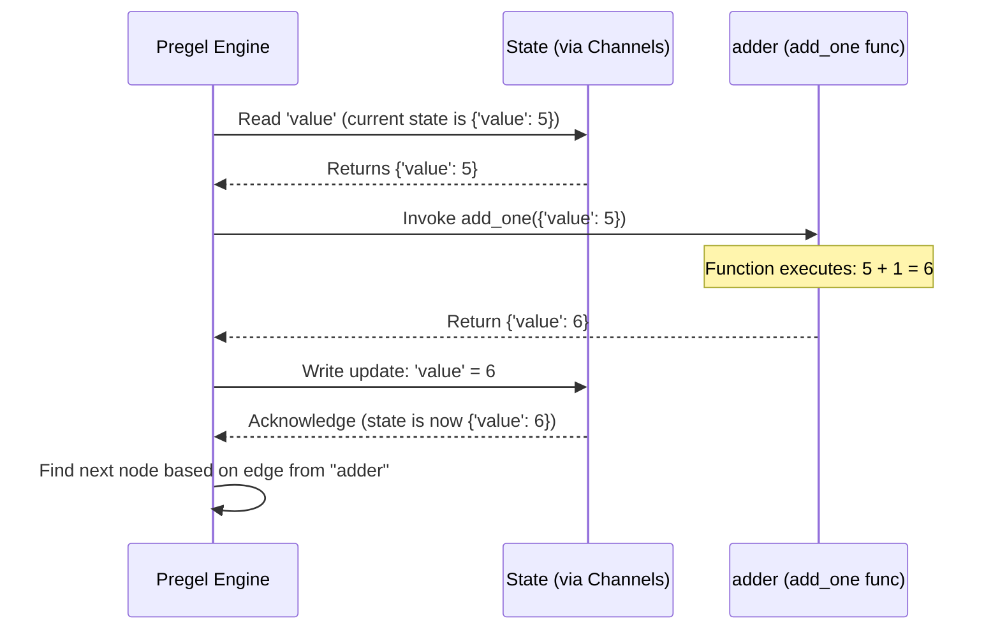

# Chapter 2: Nodes (`PregelNode`) - The Workers of Your Graph

In [Chapter 1: Graph / StateGraph](01_graph___stategraph.md), we learned how `StateGraph` acts as a blueprint or a flowchart for our application. It defines the overall structure and the shared "whiteboard" (the State) that holds information.

But who actually does the work? If the `StateGraph` is the assembly line blueprint, who are the workers on the line?

That's where **Nodes** come in!

## What Problem Do Nodes Solve?

Think back to our cake baking analogy from Chapter 1. We had steps like "mix dry ingredients," "mix wet ingredients," "combine," etc. Each of these distinct actions needs to be performed by someone or something.

In LangGraph, **Nodes** represent these individual units of work or computation steps within your graph.

*   **Analogy:** Imagine chefs in a kitchen (the graph). Each chef (node) has a specific task: one chops vegetables, another mixes the sauce, another cooks the main course. They all work with shared ingredients (the state) from the pantry and fridge, and they put their finished components back for others to use.

Nodes are the core building blocks that perform the actual logic of your application.

## Key Concepts: What Makes a Node?

1.  **The Action:** At its heart, a node is usually a Python function or a LangChain Runnable. This is the code that gets executed when the node runs.
2.  **Input:** A node typically reads data it needs from the shared graph **State**. It receives the *current* state when it's invoked. In our `StateGraph` example from Chapter 1, both `add_one` and `multiply_by_two` received the `state` dictionary containing the current `value`.
3.  **Execution:** The node runs its defined logic (the function or Runnable).
4.  **Output:** After executing, a node in a `StateGraph` returns a dictionary. This dictionary specifies *which parts* of the shared state the node wants to *update* and what the new values should be. LangGraph takes care of merging these updates back into the main state.

## Adding Nodes to Your Graph (`add_node`)

How do we tell our `StateGraph` about these workers? We use the `add_node` method.

Let's revisit the code from Chapter 1:

**Step 1: Define the Node Functions**

These are our "workers". They take the state and return updates.

```python
from typing import TypedDict

# Define the state structure (the whiteboard)
class MyState(TypedDict):
    value: int

# Node 1: Adds 1 to the value
def add_one(state: MyState) -> dict:
    print("--- Running Adder Node ---")
    current_value = state['value']
    new_value = current_value + 1
    print(f"Input value: {current_value}, Output value: {new_value}")
    # Return *only* the key we want to update
    return {"value": new_value}

# Node 2: Multiplies the value by 2
def multiply_by_two(state: MyState) -> dict:
    print("--- Running Multiplier Node ---")
    current_value = state['value']
    new_value = current_value * 2
    print(f"Input value: {current_value}, Output value: {new_value}")
    # Return the update
    return {"value": new_value}
```

**Step 2: Create the Graph and Add Nodes**

Here's where we hire our workers and assign them names on the assembly line.

```python
from langgraph.graph import StateGraph

# Create the graph builder linked to our state
workflow = StateGraph(MyState)

# Add the first node:
# Give it the name "adder" and tell it to use the 'add_one' function
workflow.add_node("adder", add_one)

# Add the second node:
# Give it the name "multiplier" and tell it to use the 'multiply_by_two' function
workflow.add_node("multiplier", multiply_by_two)

# (Edges like set_entry_point, add_edge, etc. define the flow *between* nodes)
# ... add edges and compile ...
```

*   `workflow.add_node("adder", add_one)`: This line registers the `add_one` function as a node within the `workflow` graph. We give it the unique name `"adder"`. When the graph needs to execute the "adder" step, it will call our `add_one` function.
*   `workflow.add_node("multiplier", multiply_by_two)`: Similarly, this registers the `multiply_by_two` function under the name `"multiplier"`.

It's that simple! You define what a step does (the function) and then register it with `add_node`, giving it a name so you can connect it using edges later.

## How Do Nodes Actually Run? (Under the Hood)

You've defined the functions and added them as nodes. What happens internally when the graph executes?

1.  **Triggering:** The [Pregel Execution Engine](05_pregel_execution_engine.md) (LangGraph's internal coordinator) determines which node should run next based on the graph's structure (edges) and the current state. For example, after the `START` point, it knows to run the entry point node ("adder" in our example).
2.  **Reading State:** Before running the node's function (`add_one`), the engine reads the necessary information from the shared state. It knows what the function needs (the `MyState` dictionary). This reading happens via mechanisms called [Channels](03_channels.md), which manage the shared state.
3.  **Invoking the Function:** The engine calls the node's function (e.g., `add_one`), passing the state it just read (`{'value': 5}`).
4.  **Executing Logic:** Your function's code runs (e.g., `5 + 1`).
5.  **Receiving Updates:** The engine receives the dictionary returned by the function (e.g., `{'value': 6}`).
6.  **Writing State:** The engine uses [Channels](03_channels.md) again to update the shared state with the information from the returned dictionary. The state on the "whiteboard" is now modified (e.g., becomes `{'value': 6}`).
7.  **Next Step:** The engine then looks for the next edge originating from the completed node ("adder") to determine what runs next ("multiplier").

Here's a simplified view of the "adder" node executing:



## A Peek at the Code (`graph/state.py`, `pregel/read.py`)

Let's look at simplified snippets to see how this maps to the code:

*   **`StateGraph.add_node` (`graph/state.py`)**:
    ```python
    # Simplified view
    class StateGraph(Graph):
        # ... (other methods) ...
        def add_node(
            self,
            node: str,            # The name you give the node (e.g., "adder")
            action: RunnableLike, # The function or Runnable (e.g., add_one)
            *,
            # ... other optional parameters ...
            input: Optional[Type[Any]] = None, # Optional: specific input type for this node
        ) -> Self:
            # ... (checks for valid name, etc.) ...
            if node in self.channels: # Can't use a state key name as a node name
                raise ValueError(...)

            # Converts your function into a standard LangChain Runnable if needed
            runnable = coerce_to_runnable(action, ...)

            # Stores the node's details, including the runnable and input schema
            self.nodes[node] = StateNodeSpec(
                runnable=runnable,
                metadata=None, # Optional metadata
                input=input or self.schema, # Default to graph's main state schema
                # ... other details ...
            )
            return self
    ```
    When you call `add_node`, LangGraph stores your function (`action`) under the given `node` name. It wraps your function into a standard `Runnable` object (`coerce_to_runnable`) and keeps track of what input schema it expects (usually the graph's main state schema). This stored information is a `StateNodeSpec`.

*   **`CompiledStateGraph.attach_node` (`graph/state.py`)**:
    ```python
    # Simplified view (during graph.compile())
    class CompiledStateGraph(CompiledGraph):
        # ... (other methods) ...
        def attach_node(self, key: str, node: Optional[StateNodeSpec]) -> None:
            # ... (handles START node specially) ...
            if node is not None:
                # Determine what parts of the state this node needs to read
                input_schema = node.input
                input_values = list(self.builder.schemas[input_schema]) # Keys to read

                # Create the internal representation: PregelNode
                self.nodes[key] = PregelNode(
                    triggers=[f"branch:to:{key}"], # When should this node run? (Connected via Channels)
                    channels=input_values, # What state keys does it read?
                    mapper=_pick_mapper(...), # How to format the input state for the function
                    writers=[ChannelWrite(...)], # How to write the output back to state (via Channels)
                    bound=node.runnable, # The actual function/Runnable to execute!
                    # ... other internal details ...
                )
            # ...
    ```
    During the `compile()` step, the information stored in `StateNodeSpec` is used to create the actual operational node object, which is internally called `PregelNode`. This `PregelNode` is the real "worker" managed by the execution engine.

*   **`PregelNode` (`pregel/read.py`)**:
    ```python
    # Simplified view
    class PregelNode(Runnable):
        channels: Union[list[str], Mapping[str, str]] # State keys to read as input
        triggers: list[str]                          # Channel updates that activate this node
        mapper: Optional[Callable[[Any], Any]]       # Function to format input state
        writers: list[Runnable]                      # Runnables to write output back to Channels
        bound: Runnable[Any, Any]                    # << THE ACTUAL FUNCTION/RUNNABLE YOU PROVIDED >>
        # ... other attributes like retry policy, tags, etc. ...

        def __init__(self, *, channels, triggers, writers, bound, ...) -> None:
            self.channels = channels
            self.triggers = list(triggers)
            self.writers = writers or []
            self.bound = bound # Your code lives here!
            # ... initialize other attributes ...

        # ... (methods for execution, handled by the Pregel engine) ...
    ```
    The `PregelNode` object encapsulates everything needed to run your node:
    *   `bound`: This holds the actual function or Runnable you passed to `add_node`.
    *   `channels`: Specifies which parts of the state (managed by [Channels](03_channels.md)) to read as input.
    *   `triggers`: Specifies which [Channels](03_channels.md) must be updated to make this node eligible to run.
    *   `writers`: Defines how the output of `bound` should be written back to the state using [Channels](03_channels.md).

Don't worry too much about `PregelNode` details right now. The key idea is that `add_node` registers your function, and `compile` turns it into an executable component (`PregelNode`) that the graph engine can manage, telling it when to run, what state to read, and how to write results back.

## Conclusion

You've now learned about the "workers" in your LangGraph application: **Nodes**.

*   Nodes are the individual computational steps defined by Python functions or LangChain Runnables.
*   They read from the shared `StateGraph` state.
*   They execute their logic.
*   They return dictionaries specifying updates to the state.
*   You add them to your graph using `graph.add_node("node_name", your_function)`.
*   Internally, they are represented as `PregelNode` objects, managed by the execution engine.

We have the blueprint (`StateGraph`) and the workers (`Nodes`). But how exactly does information get passed around? How does the "adder" node's output (`{'value': 6}`) reliably get to the "multiplier" node? How is the state managed efficiently?

That's the role of [Chapter 3: Channels](03_channels.md), the communication system of the graph.

---

Generated by [AI Codebase Knowledge Builder](https://github.com/The-Pocket/Tutorial-Codebase-Knowledge)