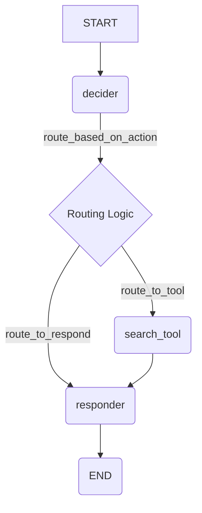

# Chapter 4: Control Flow Primitives (`Branch`, `Send`, `Interrupt`)

In [Chapter 3: Channels](03_channels.md), we saw how information is stored and updated in our graph's shared state using Channels. We have the blueprint ([`StateGraph`](01_graph___stategraph.md)), the workers ([`Nodes`](02_nodes___pregelnode__.md)), and the communication system ([Channels](03_channels.md)).

But what if we don't want our graph to follow a single, fixed path? What if we need it to make decisions? For example, imagine a chatbot: sometimes it needs to use a tool (like a search engine), and other times it can answer directly. How do we tell the graph *which* path to take based on the current situation?

This is where **Control Flow Primitives** come in. They are special mechanisms that allow you to dynamically direct the execution path of your graph, making it much more flexible and powerful.

## What Problem Do Control Flow Primitives Solve?

Think of our graph like a train system. So far, we've only built tracks that go in a straight line from one station (node) to the next. Control flow primitives are like the **switches** and **signals** that allow the train (our execution flow) to:

1.  **Choose a path:** Decide whether to go left or right at a junction based on some condition (like an "if" statement).
2.  **Dispatch specific trains:** Send a specific piece of cargo directly to a particular station, maybe even multiple pieces to the same station to be processed in parallel.
3.  **Wait for instructions:** Pause the train journey until an external signal (like human approval) is given.

LangGraph provides three main primitives for this:

*   **`Branch`**: Acts like a conditional router or switch ("if/else"). It directs the flow to different nodes based on the current state.
*   **`Send`**: Allows a node to directly trigger another node with specific input, useful for parallel processing patterns like map-reduce.
*   **`Interrupt`**: Pauses the graph execution, usually to wait for external input (like a human clicking "Approve") before continuing.

Let's explore each one.

## 1. `Branch` - The Conditional Router

Imagine our chatbot needs to decide: "Should I use the search tool, or can I answer from my knowledge?" This decision depends on the conversation history or the user's specific question stored in the graph's state.

The `Branch` primitive allows us to implement this kind of conditional logic. You add it using the `graph.add_conditional_edges()` method.

**How it Works:**

1.  You define a regular node (let's call it `should_i_search`).
2.  You define a separate **routing function**. This function takes the current state and decides *which node* should run next. It returns the name of the next node (or a list of names).
3.  You connect the `should_i_search` node to the routing function using `add_conditional_edges`. You tell it: "After `should_i_search` finishes, call this routing function to decide where to go next."
4.  You provide a mapping (a dictionary) that links the possible return values of your routing function to the actual node names in your graph.

**Example: Chatbot Deciding to Search**

Let's build a tiny graph that decides whether to go to a `search_tool` node or a `respond_directly` node.

**Step 1: Define State**

```python
from typing import TypedDict, Annotated, List
import operator

class ChatState(TypedDict):
    user_query: str
    # We'll store the decision here
    next_action: str
    # Keep track of intermediate results
    search_result: Annotated[List[str], operator.add] # Use Topic or add if accumulating
    final_response: str
```

Our state holds the user's query and a field `next_action` to store the decision.

**Step 2: Define Nodes**

```python
# Node that decides the next step
def determine_action(state: ChatState) -> dict:
    print("--- Determining Action ---")
    query = state['user_query']
    if "weather" in query.lower():
        print("Decision: Need to use search tool for weather.")
        return {"next_action": "USE_TOOL"}
    else:
        print("Decision: Can respond directly.")
        return {"next_action": "RESPOND"}

# Node representing the search tool
def run_search_tool(state: ChatState) -> dict:
    print("--- Using Search Tool ---")
    query = state['user_query']
    # Simulate finding a result
    result = f"Search result for '{query}': It's sunny!"
    # We return the result to be ADDED to the state list
    return {"search_result": [result]} # Return as list for operator.add

# Node that generates a final response
def generate_response(state: ChatState) -> dict:
    print("--- Generating Response ---")
    if state.get("search_result"):
        response = f"Based on my search: {state['search_result'][-1]}"
    else:
        response = f"Responding directly to: {state['user_query']}"
    return {"final_response": response}
```

**Step 3: Define the Routing Function**

This function reads the `next_action` from the state and returns the *key* we'll use in our mapping.

```python
def route_based_on_action(state: ChatState) -> str:
    print("--- Routing ---")
    action = state['next_action']
    print(f"Routing based on action: {action}")
    if action == "USE_TOOL":
        return "route_to_tool" # This key must match our path_map
    else:
        return "route_to_respond" # This key must match our path_map
```

**Step 4: Build the Graph with Conditional Edges**

```python
from langgraph.graph import StateGraph, END, START

workflow = StateGraph(ChatState)

workflow.add_node("decider", determine_action)
workflow.add_node("search_tool", run_search_tool)
workflow.add_node("responder", generate_response)

workflow.set_entry_point("decider")

# After 'decider', call 'route_based_on_action' to choose the next step
workflow.add_conditional_edges(
    "decider", # Start node
    route_based_on_action, # The routing function
    {
        # Map the routing function's output to actual node names
        "route_to_tool": "search_tool",
        "route_to_respond": "responder"
    }
)

# Define what happens *after* the conditional paths
workflow.add_edge("search_tool", "responder") # After searching, generate response
workflow.add_edge("responder", END) # After responding, end

# Compile
app = workflow.compile()
```

*   `add_conditional_edges("decider", route_based_on_action, ...)`: This is the key part. It tells LangGraph: after the "decider" node runs, execute the `route_based_on_action` function.
*   `path_map = {"route_to_tool": "search_tool", ...}`: This dictionary maps the string returned by `route_based_on_action` to the actual next node to execute.

**Step 5: Run It!**

```python
# Scenario 1: Query needs the tool
print("--- Scenario 1: Weather Query ---")
input1 = {"user_query": "What's the weather like?"}
final_state1 = app.invoke(input1)
print("Final State 1:", final_state1)

print("\n--- Scenario 2: Direct Response ---")
# Scenario 2: Query doesn't need the tool
input2 = {"user_query": "Tell me a joke."}
final_state2 = app.invoke(input2)
print("Final State 2:", final_state2)
```

**Expected Output:**

```text
--- Scenario 1: Weather Query ---
--- Determining Action ---
Decision: Need to use search tool for weather.
--- Routing ---
Routing based on action: USE_TOOL
--- Using Search Tool ---
--- Generating Response ---
Final State 1: {'user_query': "What's the weather like?", 'next_action': 'USE_TOOL', 'search_result': ["Search result for 'What's the weather like?': It's sunny!"], 'final_response': "Based on my search: Search result for 'What's the weather like?': It's sunny!"}

--- Scenario 2: Direct Response ---
--- Determining Action ---
Decision: Can respond directly.
--- Routing ---
Routing based on action: RESPOND
--- Generating Response ---
Final State 2: {'user_query': 'Tell me a joke.', 'next_action': 'RESPOND', 'search_result': [], 'final_response': 'Responding directly to: Tell me a joke.'}
```

See how the graph took different paths based on the `next_action` set by the `decider` node and interpreted by the `route_based_on_action` function!

**Visualizing the Branch:**



**Internals (`graph/branch.py`)**

*   When you call `add_conditional_edges`, LangGraph stores a `Branch` object (`graph/branch.py`). This object holds your routing function (`path`) and the mapping (`path_map` / `ends`).
*   During execution, after the source node ("decider") finishes, the [Pregel Execution Engine](05_pregel_execution_engine.md) runs the `Branch` object.
*   The `Branch.run()` method eventually calls your routing function (`_route` or `_aroute` internally) with the current state.
*   It takes the return value (e.g., "route_to_tool"), looks it up in the `ends` dictionary to get the actual node name ("search_tool"), and tells the engine to schedule that node next.

```python
# graph/branch.py (Simplified view)
class Branch(NamedTuple):
    path: Runnable # Your routing function wrapped as a Runnable
    ends: Optional[dict[Hashable, str]] # Your path_map
    # ... other fields ...

    def _route(self, input: Any, config: RunnableConfig, ...) -> Runnable:
        # ... reads current state if needed ...
        value = ... # Get the state
        result = self.path.invoke(value, config) # Call your routing function
        # ... determines destination node(s) using self.ends mapping ...
        destinations = [self.ends[r] for r in result]
        # ... tells the engine (via writer) which node(s) to run next ...
        return writer(destinations, config) or input # writer is a callback to the engine

# graph/state.py (Simplified view)
class StateGraph(Graph):
    # ...
    def add_conditional_edges(self, source, path, path_map, ...):
        # ... wrap 'path' into a Runnable ...
        runnable_path = coerce_to_runnable(path, ...)
        # Create and store the Branch object
        self.branches[source][name] = Branch.from_path(runnable_path, path_map, ...)
        return self
```

## 2. `Send` - Directing Specific Traffic

Sometimes, you don't just want to choose *one* path, but you want to trigger a *specific* node with *specific* data, possibly multiple times. This is common in "map-reduce" patterns where you split a task into smaller pieces, process each piece independently, and then combine the results.

The `Send` primitive allows a node (or a conditional edge function) to directly "send" a piece of data to another node, telling the engine: "Run *this* node next, and give it *this* input."

**How it Works:**

1.  You import `Send` from `langgraph.graph` (or `langgraph.types`).
2.  In a node or a conditional edge function, instead of just returning a state update or a node name, you return `Send(target_node_name, data_for_that_node)`.
3.  You can return a list of `Send` objects to trigger multiple node executions, potentially in parallel (depending on the executor).

**Example: Simple Map-Reduce**

Let's imagine we want to process a list of items. One node splits the list, another node processes each item individually (the "map" step), and a final node aggregates the results (the "reduce" step).

**Step 1: Define State**

```python
from typing import TypedDict, List, Annotated
import operator

class MapReduceState(TypedDict):
    items_to_process: List[str]
    # Use Topic or operator.add to collect results from worker nodes
    processed_items: Annotated[List[str], operator.add]
    final_result: str
```

**Step 2: Define Nodes**

```python
# Node to prepare items (not really needed here, but shows the flow)
def prepare_items(state: MapReduceState) -> dict:
    print("--- Preparing Items (No change) ---")
    # In a real scenario, this might fetch or generate the items
    return {}

# Node to process a single item (Our "Worker")
def process_single_item(state: dict) -> dict:
    # Note: This node receives the dict passed via Send, NOT the full MapReduceState
    item = state['item']
    print(f"--- Processing Item: {item} ---")
    processed = f"Processed_{item.upper()}"
    # Return the processed item to be ADDED to the list in the main state
    return {"processed_items": [processed]} # Return list for operator.add

# Node to aggregate results
def aggregate_results(state: MapReduceState) -> dict:
    print("--- Aggregating Results ---")
    all_processed = state['processed_items']
    final = ", ".join(all_processed)
    return {"final_result": final}
```

**Step 3: Define the Dispatching Function (using `Send`)**

This function will run after `prepare_items` and will use `Send` to trigger `process_single_item` for each item.

```python
from langgraph.graph import Send # Import Send

def dispatch_work(state: MapReduceState) -> List[Send]:
    print("--- Dispatching Work ---")
    items = state['items_to_process']
    send_packets = []
    for item in items:
        print(f"Sending item '{item}' to worker node.")
        # Create a Send object for each item
        # Target node: "worker"
        # Data payload: a dictionary {'item': current_item}
        packet = Send("worker", {"item": item})
        send_packets.append(packet)
    return send_packets # Return a list of Send objects
```

**Step 4: Build the Graph**

```python
from langgraph.graph import StateGraph, END, START

workflow = StateGraph(MapReduceState)

workflow.add_node("preparer", prepare_items)
workflow.add_node("worker", process_single_item) # The node targeted by Send
workflow.add_node("aggregator", aggregate_results)

workflow.set_entry_point("preparer")

# After 'preparer', call 'dispatch_work' which returns Send packets
workflow.add_conditional_edges("preparer", dispatch_work)
# NOTE: We don't need a path_map here because dispatch_work directly
#       returns Send objects specifying the target node.

# The 'worker' node outputs are aggregated implicitly by the 'processed_items' channel.
# We need an edge to tell the graph when to run the aggregator.
# Let's wait until ALL workers triggered by Send are done.
# We can achieve this implicitly if the aggregator reads state written by workers.
# A simple edge ensures aggregator runs *after* the step involving workers.
# (More complex aggregation might need explicit barrier channels)
workflow.add_edge("worker", "aggregator")

workflow.add_edge("aggregator", END)

# Compile
app = workflow.compile()
```

**Step 5: Run It!**

```python
input_state = {"items_to_process": ["apple", "banana", "cherry"]}
final_state = app.invoke(input_state)
print("\nFinal State:", final_state)
```

**Expected Output (order of processing might vary):**

```text
--- Preparing Items (No change) ---
--- Dispatching Work ---
Sending item 'apple' to worker node.
Sending item 'banana' to worker node.
Sending item 'cherry' to worker node.
--- Processing Item: apple ---
--- Processing Item: banana ---
--- Processing Item: cherry ---
--- Aggregating Results ---

Final State: {'items_to_process': ['apple', 'banana', 'cherry'], 'processed_items': ['Processed_APPLE', 'Processed_BANANA', 'Processed_CHERRY'], 'final_result': 'Processed_APPLE, Processed_BANANA, Processed_CHERRY'}
```

The `dispatch_work` function returned three `Send` objects. The LangGraph engine then scheduled the "worker" node to run three times, each time with a different input dictionary (`{'item': 'apple'}`, `{'item': 'banana'}`, `{'item': 'cherry'}`). The results were automatically collected in `processed_items` thanks to the `operator.add` reducer on our `Annotated` state key. Finally, the `aggregator` ran.

**Internals (`types.py`, `constants.py`)**

*   `Send(node, arg)` is a simple data class defined in `langgraph/types.py`.
*   When a node or branch returns `Send` objects, the engine collects them. Internally, these are often associated with a special channel key like `TASKS` (defined in `langgraph/constants.py`).
*   The [Pregel Execution Engine](05_pregel_execution_engine.md) processes these `TASKS`. For each `Send(node, arg)`, it schedules the target `node` to run in the *next* step, passing `arg` as its input.
*   This allows for dynamic, data-driven invocation of nodes outside the standard edge connections.

```python
# types.py (Simplified view)
class Send:
    __slots__ = ("node", "arg")
    node: str # Target node name
    arg: Any  # Data payload for the node

    def __init__(self, /, node: str, arg: Any) -> None:
        self.node = node
        self.arg = arg
    # ... repr, eq, hash ...

# constants.py (Simplified view)
TASKS = sys.intern("__pregel_tasks") # Internal key for Send objects

# pregel/algo.py (Conceptual idea during task processing)
# if write is for TASKS channel:
#   packet = write_value # This is the Send object
#   # Schedule packet.node to run in the next step with packet.arg
#   schedule_task(node=packet.node, input=packet.arg, ...)
```

## 3. `Interrupt` - Pausing for Instructions

Sometimes, your graph needs to stop and wait for external input before proceeding. A common case is Human-in-the-Loop (HITL), where an AI agent proposes a plan or an action, and a human needs to approve it.

The `Interrupt` primitive allows a node to pause the graph's execution and wait. This requires a [Checkpointer](06_checkpointer___basecheckpointsaver__.md) to be configured, as the graph needs to save its state to be resumable later.

**How it Works:**

1.  You import `interrupt` from `langgraph.types`.
2.  Inside a node, you call `interrupt(value_to_send_to_client)`.
3.  This immediately raises a special `GraphInterrupt` exception.
4.  The LangGraph engine catches this, saves the current state using the checkpointer, and returns control to your calling code, often signaling that an interrupt occurred. The `value_to_send_to_client` is included in the information returned.
5.  Later, you can resume the graph execution by providing a value. This is typically done by invoking the compiled graph again with a special `Command(resume=value_for_interrupt)` object (from `langgraph.types`) and the same configuration (including the thread ID for the checkpointer).
6.  When resumed, the graph loads the saved state. The execution engine restarts the *interrupted node from the beginning*. When the code reaches the `interrupt()` call again, instead of raising an exception, it *returns* the `value_for_interrupt` that you provided when resuming. The node then continues executing from that point.

**Example: Human Approval Step**

Let's create a graph where a node plans an action, another node presents it for human approval (using `interrupt`), and a final node executes it if approved.

**Step 1: Define State**

```python
from typing import TypedDict, Optional

class ApprovalState(TypedDict):
    plan: str
    # We'll use the resume value to implicitly know if approved
    feedback: Optional[str] # Store feedback/approval status
```

**Step 2: Define Nodes (including interrupt)**

```python
from langgraph.types import interrupt, Command # Import interrupt and Command

# Node that creates a plan
def create_plan(state: ApprovalState) -> dict:
    print("--- Creating Plan ---")
    plan = "Plan: Execute risky action X."
    return {"plan": plan}

# Node that requests human approval using interrupt
def request_approval(state: ApprovalState) -> dict:
    print("--- Requesting Human Approval ---")
    plan = state['plan']
    print(f"Proposed Plan: {plan}")
    # Call interrupt, passing the plan to the client
    # Execution STOPS here on the first run.
    feedback_or_approval = interrupt(plan)
    # --- Execution RESUMES here on the second run ---
    print(f"--- Resumed with feedback: {feedback_or_approval} ---")
    # Store the feedback received from the resume command
    return {"feedback": str(feedback_or_approval)} # Ensure it's a string

# Node that executes the plan (only if approved implicitly by resuming)
def execute_plan(state: ApprovalState) -> dict:
    print("--- Executing Plan ---")
    if state.get("feedback"): # Check if we got feedback (meaning we resumed)
        print(f"Executing '{state['plan']}' based on feedback: {state['feedback']}")
        return {} # No state change needed
    else:
        # This path shouldn't be hit if interrupt works correctly
        print("Execution skipped (no feedback received).")
        return{}

```

**Step 3: Build the Graph (with Checkpointer!)**

```python
from langgraph.graph import StateGraph, END, START
# Need a checkpointer for interrupts!
from langgraph.checkpoint.memory import MemorySaver

workflow = StateGraph(ApprovalState)

workflow.add_node("planner", create_plan)
workflow.add_node("approval_gate", request_approval)
workflow.add_node("executor", execute_plan)

workflow.set_entry_point("planner")
workflow.add_edge("planner", "approval_gate")
workflow.add_edge("approval_gate", "executor") # Runs after interrupt is resolved
workflow.add_edge("executor", END)

# Create checkpointer and compile
memory_saver = MemorySaver()
app = workflow.compile(checkpointer=memory_saver)
```

**Step 4: Run and Resume**

```python
import uuid

# Unique ID for this conversation thread is needed for the checkpointer
config = {"configurable": {"thread_id": str(uuid.uuid4())}}

print("--- Initial Invocation ---")
# Start the graph. It should interrupt at the approval node.
interrupt_info = None
for chunk in app.stream({"plan": ""}, config=config):
    print(chunk)
    # Check if the chunk contains interrupt information
    if "__interrupt__" in chunk:
        interrupt_info = chunk["__interrupt__"]
        print("\n!! Graph Interrupted !!")
        break # Stop processing stream after interrupt

# The client code inspects the interrupt value (the plan)
if interrupt_info:
    print(f"Interrupt Value (Plan): {interrupt_info[0].value}") # interrupt_info is a tuple

    # --- Simulate human interaction ---
    human_decision = "Approved, proceed with caution."
    print(f"\n--- Resuming with Decision: '{human_decision}' ---")

    # Resume execution with the human's feedback/approval
    # We pass the decision using Command(resume=...)
    for chunk in app.stream(Command(resume=human_decision), config=config):
         print(chunk)

else:
    print("Graph finished without interruption.")
```

**Expected Output:**

```text
--- Initial Invocation ---
{'planner': {'plan': 'Plan: Execute risky action X.'}}
{'approval_gate': None} # Node starts execution
--- Requesting Human Approval ---
Proposed Plan: Plan: Execute risky action X.
{'__interrupt__': (Interrupt(value='Plan: Execute risky action X.', resumable=True, ns=..., when='during'),)} # Interrupt occurs

!! Graph Interrupted !!
Interrupt Value (Plan): Plan: Execute risky action X.

--- Resuming with Decision: 'Approved, proceed with caution.' ---
{'approval_gate': {'feedback': 'Approved, proceed with caution.'}} # Node resumes and finishes
--- Resumed with feedback: Approved, proceed with caution. ---
{'executor': {}} # Executor node runs
--- Executing Plan ---
Executing 'Plan: Execute risky action X.' based on feedback: Approved, proceed with caution.
{'__end__': {'plan': 'Plan: Execute risky action X.', 'feedback': 'Approved, proceed with caution.'}} # Graph finishes
```

The graph paused at `request_approval` after printing the plan. We then resumed it by sending `Command(resume="Approved, proceed with caution.")`. The `request_approval` node restarted, the `interrupt()` call returned our resume value, which was stored in the state, and finally, the `executor` node ran using that feedback.

**Internals (`types.py`, `errors.py`, Checkpointer)**

*   The `interrupt(value)` function (in `langgraph/types.py`) checks if a resume value is available for the current step within the node.
*   If no resume value exists (first run), it raises a `GraphInterrupt` exception (`langgraph/errors.py`) containing an `Interrupt` object (`langgraph/types.py`) which holds the `value`.
*   The [Pregel Execution Engine](05_pregel_execution_engine.md) catches `GraphInterrupt`.
*   If a [Checkpointer](06_checkpointer___basecheckpointsaver__.md) is present, the engine saves the current state (including which node was interrupted) and passes the `Interrupt` object back to the caller.
*   When you resume with `Command(resume=resume_value)`, the engine loads the checkpoint.
*   It knows which node was interrupted and provides the `resume_value` to it (often via a special `RESUME` entry written to the state channels, managed internally via `PregelScratchpad` in `pregel/algo.py`).
*   The node restarts. When `interrupt()` is called again, it finds the `resume_value` (provided via the scratchpad or internal state) and returns it instead of raising an exception.

```python
# types.py (Simplified view)
def interrupt(value: Any) -> Any:
    # ... access internal config/scratchpad ...
    scratchpad = conf[CONFIG_KEY_SCRATCHPAD]
    idx = scratchpad.interrupt_counter()

    # Check if resume value already exists for this interrupt index
    if scratchpad.resume and idx < len(scratchpad.resume):
        return scratchpad.resume[idx] # Return existing resume value

    # Check if a new global resume value was provided
    v = scratchpad.get_null_resume(consume=True)
    if v is not None:
        # Store and return the new resume value
        scratchpad.resume.append(v)
        conf[CONFIG_KEY_SEND]([(RESUME, scratchpad.resume)]) # Update state internally
        return v

    # No resume value - raise the interrupt exception
    raise GraphInterrupt(
        (Interrupt(value=value, resumable=True, ns=...),)
    )

# types.py (Simplified view)
@dataclasses.dataclass
class Interrupt:
    value: Any # The value passed to interrupt()
    resumable: bool = True
    # ... other fields ...

# types.py (Simplified view)
@dataclasses.dataclass
class Command:
    # ... other fields like update, goto ...
    resume: Optional[Any] = None # Value to provide to a pending interrupt

# errors.py (Simplified view)
class GraphInterrupt(Exception): # Base class for interrupts
    pass
```

## Conclusion

You've learned about the essential tools for controlling the flow of execution in your LangGraph applications:

*   **`Branch`** (`add_conditional_edges`): Used to create conditional paths, like `if/else` statements, directing the flow based on the current state. Requires a routing function and often a path map.
*   **`Send`**: Used to directly trigger a specific node with specific data, bypassing normal edges. Essential for patterns like map-reduce where you want to invoke the same worker node multiple times with different inputs.
*   **`Interrupt`** (`langgraph.types.interrupt`): Used to pause graph execution, typically for human-in-the-loop scenarios. Requires a checkpointer and is resumed using `Command(resume=...)`.

These primitives transform your graph from a simple linear sequence into a dynamic, decision-making process capable of handling complex, real-world workflows.

Now that we understand how nodes execute, how state is managed via channels, and how control flow directs traffic, let's look at the engine that orchestrates all of this behind the scenes.

Next up: [Chapter 5: Pregel Execution Engine](05_pregel_execution_engine.md)

---

Generated by [AI Codebase Knowledge Builder](https://github.com/The-Pocket/Tutorial-Codebase-Knowledge)