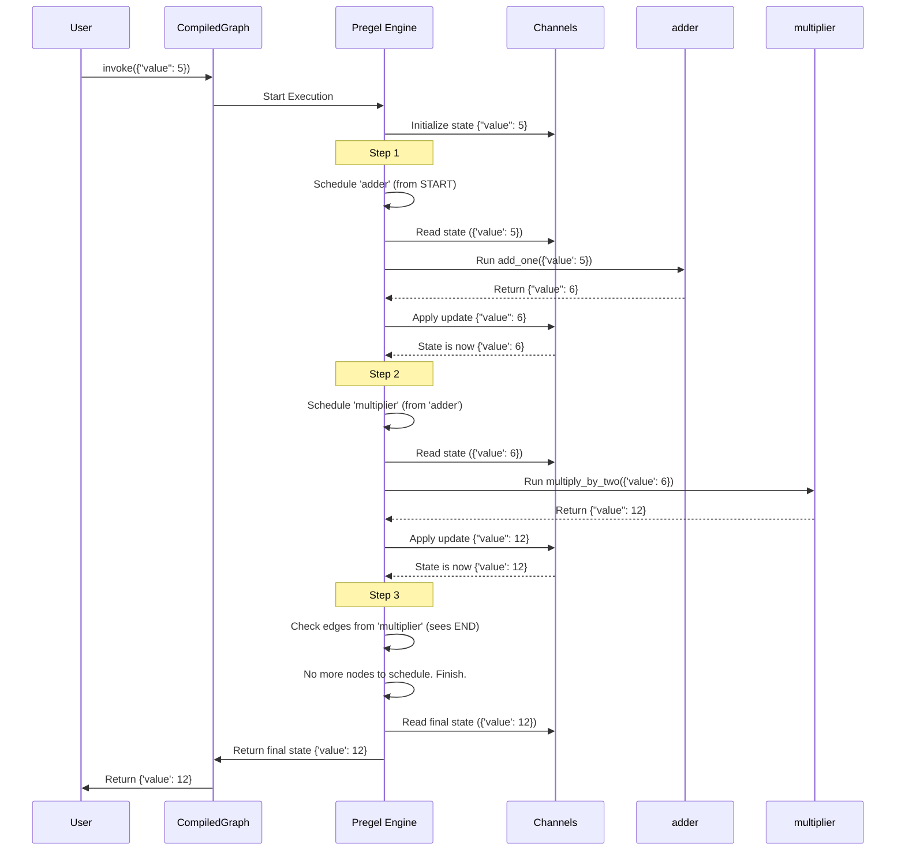

# Chapter 5: Pregel Execution Engine - The Engine Room

In the previous chapters, we learned how to build the blueprint of our application using [`StateGraph`](01_graph___stategraph.md), define the workers with [`Nodes`](02_nodes___pregelnode__.md), manage the shared state with [`Channels`](03_channels.md), and direct the traffic using [Control Flow Primitives](04_control_flow_primitives___branch____send____interrupt__.md).

But what actually takes all these pieces – the blueprint, the workers, the communication rules, the traffic signals – and makes them *run*? What ensures Node A runs, its output updates the state correctly via channels, and then Node B (or maybe Node C based on a Branch) runs with that updated state?

Meet the **Pregel Execution Engine**. This is the heart of LangGraph, the engine room that drives your graph forward.

## What Problem Does Pregel Solve?

Imagine you've designed a complex assembly line (your `StateGraph`). You have different stations (Nodes) where specific tasks are done, conveyor belts (Channels) moving parts between stations, and switches (Branches) directing parts down different paths.

How do you ensure the line runs smoothly? You need a manager! Someone who:

1.  Knows the overall plan (the graph structure).
2.  Knows which station should work next based on what just finished.
3.  Delivers the right parts (state) to the right station.
4.  Collects the finished work from a station.
5.  Updates the central inventory (the shared state via Channels).
6.  Deals with decisions (Branches) and special instructions (Sends, Interrupts).
7.  Handles multiple stations working at the same time if possible (parallelism).
8.  Keeps track of progress and can save the state (Checkpointing).

The **Pregel Execution Engine** is this assembly line manager for your LangGraph application. It takes your compiled graph definition and orchestrates its execution step-by-step.

## Key Concepts: How Pregel Manages the Flow

Pregel is inspired by a system developed at Google for processing large graphs. LangGraph adapts these ideas for executing AI agents and multi-step workflows. Here's how it works conceptually:

1.  **Step-by-Step Execution ("Supersteps"):** Pregel runs the graph in discrete steps, often called "supersteps." Think of it like turns in a board game.
2.  **Scheduling Nodes:** In each step, Pregel looks at the current state and the graph structure (edges, branches) to figure out which [Nodes (`PregelNode`)](02_nodes___pregelnode__.md) should run *in this turn*. This could be the entry point node at the start, nodes triggered by the previous step's output, or nodes activated by a `Send` command.
3.  **Executing Nodes:** It runs the scheduled nodes. If multiple nodes are scheduled for the same step and they don't directly depend on each other *within that step*, Pregel might run them in parallel using background threads or asyncio tasks.
4.  **Gathering Updates:** As each node finishes, it returns a dictionary of updates (like `{"value": 6}`). Pregel collects all these updates from all the nodes that ran in the current step.
5.  **Updating State via Channels:** Pregel takes the collected updates and applies them to the shared state using the appropriate [`Channels`](03_channels.md). For example, it sends `6` to the `"value"` channel, which might overwrite the old value (if it's `LastValue`) or add to it (if it's `BinaryOperatorAggregate`).
6.  **Looping:** After updating the state, Pregel checks if there are more nodes to run (e.g., nodes connected by edges from the ones that just finished) or if the graph has reached the `END`. If there's more work, it starts the next step (superstep).
7.  **Handling Control Flow:** It seamlessly integrates [Control Flow Primitives](04_control_flow_primitives___branch____send____interrupt__.md). When a `Branch` needs to run, Pregel executes the routing function and schedules the next node accordingly. When `Send` is used, Pregel schedules the target node with the specific data. When `Interrupt` occurs, Pregel pauses execution (and relies on a [Checkpointer](06_checkpointer___basecheckpointsaver__.md) to save state).
8.  **Checkpointing:** At configurable points (often after each step), Pregel interacts with the [Checkpointer (`BaseCheckpointSaver`)](06_checkpointer___basecheckpointsaver__.md) to save the current state of all channels. This allows the graph to be paused and resumed later.

Essentially, Pregel is the **orchestrator** that manages the entire lifecycle of a graph's execution.

## How Pregel Executes Our Simple Graph

Let's revisit the simple `adder -> multiplier` graph from [Chapter 1: Graph / StateGraph](01_graph___stategraph.md) and see how Pregel runs it when you call `app.invoke({"value": 5})`.

**Graph:**

*   State: `{'value': int}` (uses `LastValue` channel by default)
*   Nodes: `adder` (value+1), `multiplier` (value*2)
*   Edges: `START -> adder`, `adder -> multiplier`, `multiplier -> END`

**Execution Flow:**

1.  **Start:** `app.invoke({"value": 5})` is called. The Pregel engine inside the compiled `app` takes over.
2.  **Initialization:** Pregel sets the initial state in the `"value"` [Channel](03_channels.md) to `5`. `step = 0`.
3.  **Step 1 Begins:**
    *   **Scheduling:** Pregel sees the edge from `START` to `adder`. It schedules the `adder` node to run in this step.
    *   **Execution:** Pregel retrieves the current state (`{'value': 5}`) from the [Channel](03_channels.md) and runs the `add_one` function associated with the `adder` node.
    *   **Gathering Updates:** The `add_one` function returns `{"value": 6}`. Pregel gathers this write.
    *   **Applying Updates:** Pregel sends the update `6` to the `"value"` [Channel](03_channels.md). Since it's a `LastValue` channel, its state becomes `6`.
    *   **(Checkpointing):** If a checkpointer is configured (and enabled for this step), Pregel saves the state (`{'value': 6}`).
    *   `step` increments to `1`.
4.  **Step 2 Begins:**
    *   **Scheduling:** Pregel looks at edges originating from nodes that completed in Step 1 (`adder`). It finds the edge `adder -> multiplier`. It schedules the `multiplier` node.
    *   **Execution:** Pregel retrieves the current state (`{'value': 6}`) from the `"value"` [Channel](03_channels.md) and runs the `multiply_by_two` function.
    *   **Gathering Updates:** The `multiply_by_two` function returns `{"value": 12}`. Pregel gathers this write.
    *   **Applying Updates:** Pregel sends the update `12` to the `"value"` [Channel](03_channels.md). The channel's state becomes `12`.
    *   **(Checkpointing):** Pregel saves the state (`{'value': 12}`).
    *   `step` increments to `2`.
5.  **Step 3 Begins:**
    *   **Scheduling:** Pregel looks at edges from `multiplier`. It finds the edge `multiplier -> END`. Reaching `END` means no more application nodes are scheduled.
    *   **(Execution, Gathering, Applying):** No application nodes run.
    *   **(Checkpointing):** Pregel saves the final state (`{'value': 12}`).
6.  **Finish:** Pregel detects the `END` state. Execution halts.
7.  **Return:** The final state (`{'value': 12}`) is read from the channels and returned by `app.invoke()`.

**Visualizing the Flow:**



Pregel acts as the hidden conductor ensuring each part plays at the right time with the right information.

## Internal Implementation: A Glimpse Under the Hood

You don't typically interact with the Pregel engine directly; it's encapsulated within the compiled graph object you get from `graph.compile()`. However, understanding its core components helps clarify how LangGraph works. The main logic resides in the `langgraph/pregel/` directory.

1.  **Compilation:** When you call `graph.compile()`, LangGraph analyzes your nodes, edges, branches, and state schema. It translates your high-level graph definition into an internal representation suitable for the Pregel engine. This includes creating the actual [`PregelNode`](02_nodes___pregelnode__.md) objects which contain information about which channels to read, which function to run, and how to write outputs back.
2.  **The Loop (`pregel/loop.py`):** The core execution happens within a loop (managed by classes like `SyncPregelLoop` or `AsyncPregelLoop`). Each iteration of this loop represents one "superstep".
3.  **Task Preparation (`pregel/algo.py::prepare_next_tasks`):** At the start of each step, this function determines which tasks (nodes) are ready to run. It checks:
    *   Which [Channels](03_channels.md) were updated in the previous step.
    *   Which nodes are triggered by those updated channels (based on edges and branches).
    *   Are there any pending `Send` messages ([Control Flow Primitives](04_control_flow_primitives___branch____send____interrupt__.md)) targeting specific nodes?
    *   It uses internal versioning on channels to avoid re-running nodes unnecessarily if their inputs haven't changed.
4.  **Task Execution (`pregel/runner.py::PregelRunner`):** This component takes the list of tasks scheduled for the current step and executes them.
    *   It uses an executor (like Python's `concurrent.futures.ThreadPoolExecutor` for sync code or `asyncio` for async code) to potentially run independent tasks in parallel.
    *   For each task, it reads the required state from the [Channels](03_channels.md), executes the node's function/Runnable, and collects the returned writes (the update dictionary).
    *   It handles retries if configured for a node.
5.  **Applying Writes (`pregel/algo.py::apply_writes`):** After tasks in a step complete (or fail), this function gathers all the writes returned by those tasks.
    *   It groups writes by channel name.
    *   It calls the `.update()` method on each corresponding [Channel](03_channels.md) object, passing the collected updates for that channel. The channel itself enforces its update logic (e.g., `LastValue` overwrites, `Topic` appends).
    *   It updates the internal checkpoint state with new channel versions.
6.  **Checkpointing (`pregel/loop.py`, `checkpoint/base.py`):** The loop interacts with the configured [Checkpointer (`BaseCheckpointSaver`)](06_checkpointer___basecheckpointsaver__.md) to save the graph's state (the values and versions of all channels) at appropriate times (e.g., after each step).
7.  **Interrupt Handling (`pregel/loop.py`, `types.py::interrupt`):** If a node calls `interrupt()`, the `PregelRunner` catches the `GraphInterrupt` exception. The `PregelLoop` then coordinates with the [Checkpointer](06_checkpointer___basecheckpointsaver__.md) to save state and pause execution, returning control to the user. Resuming involves loading the checkpoint and providing the resume value back to the waiting `interrupt()` call.

**Simplified Code Snippets:**

*   **Task Preparation (Conceptual):**
    ```python
    # pregel/algo.py (Simplified Concept)
    def prepare_next_tasks(checkpoint, processes, channels, config, step, ...):
        tasks = {}
        # Check PUSH tasks (from Send)
        for packet in checkpoint["pending_sends"]:
            # ... create task if node exists ...
            task = create_task_for_send(packet, ...)
            tasks[task.id] = task

        # Check PULL tasks (from edges/triggers)
        for name, proc in processes.items():
            # Check if any trigger channel for 'proc' was updated since last seen
            if _triggers(channels, checkpoint["channel_versions"], proc):
                # ... read input for the node ...
                task = create_task_for_pull(name, proc, ...)
                tasks[task.id] = task
        return tasks
    ```
    This function checks both explicit `Send` commands and regular node triggers based on updated channels to build the list of tasks for the next step.

*   **Applying Writes (Conceptual):**
    ```python
    # pregel/algo.py (Simplified Concept)
    def apply_writes(checkpoint, channels, tasks: list[PregelExecutableTask], get_next_version):
        # ... (sort tasks for determinism, update seen versions) ...
        pending_writes_by_channel = defaultdict(list)
        for task in tasks:
            for chan, val in task.writes: # task.writes is the dict returned by the node
                if chan in channels:
                    pending_writes_by_channel[chan].append(val)
                # ... (handle TASKS, PUSH, managed values etc.) ...

        updated_channels = set()
        # Apply writes to channels
        for chan_name, values_to_update in pending_writes_by_channel.items():
            channel_obj = channels[chan_name]
            if channel_obj.update(values_to_update): # Channel applies its logic here!
                # If updated, bump the version in the checkpoint
                checkpoint["channel_versions"][chan_name] = get_next_version(...)
                updated_channels.add(chan_name)

        # ... (handle channels that weren't written to but need bumping) ...
        return updated_channels
    ```
    This function takes the results from all nodes in a step and uses the `channel.update()` method to modify the state according to each channel's rules.

*   **The Main Loop (Conceptual):**
    ```python
    # pregel/loop.py (Simplified Concept - SyncPregelLoop/AsyncPregelLoop)
    class PregelLoop:
        def run(self): # Simplified invoke/stream logic
            with self: # Enters context (loads checkpoint, sets up channels)
                while self.tick(): # tick executes one step
                    # Start tasks for the current step using PregelRunner
                    runner = PregelRunner(...)
                    for _ in runner.tick(self.tasks):
                         # Yield control back, allowing writes/outputs to be streamed
                         pass # (actual stream logic happens via callbacks)
            return self.output # Return final result
    ```
    The loop repeatedly calls `tick()`. Inside `tick()`, it prepares tasks, runs them using `PregelRunner`, applies the resulting writes, handles checkpoints/interrupts, and determines if another step is needed.

You don't need to know the deep implementation details, but understanding this step-by-step process managed by Pregel helps visualize how your graph comes alive.

## Conclusion

The **Pregel Execution Engine** is the powerful, yet hidden, coordinator that runs your LangGraph graphs.

*   It executes the graph **step-by-step** (supersteps).
*   In each step, it **schedules** which nodes run based on the graph structure and current state.
*   It **runs** the nodes (potentially in parallel).
*   It **gathers** node outputs and **updates** the shared state using [`Channels`](03_channels.md).
*   It seamlessly integrates [`Control Flow Primitives`](04_control_flow_primitives___branch____send____interrupt__.md) like `Branch`, `Send`, and `Interrupt`.
*   It works with a [`Checkpointer`](06_checkpointer___basecheckpointsaver__.md) to save and resume state.

Think of it as the engine ensuring your application's logic flows correctly, state is managed reliably, and complex operations are orchestrated smoothly.

We've mentioned checkpointing several times – the ability to save and load the graph's state. This is crucial for long-running processes, human-in-the-loop workflows, and resilience. How does that work?

Let's dive into [Chapter 6: Checkpointer (`BaseCheckpointSaver`)](06_checkpointer___basecheckpointsaver__.md) to understand how LangGraph persists and resumes state.

---

Generated by [AI Codebase Knowledge Builder](https://github.com/The-Pocket/Tutorial-Codebase-Knowledge)