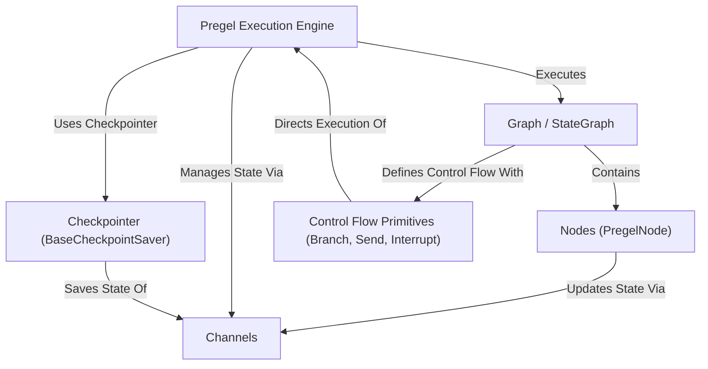

# Tutorial: LangGraph

> This tutorial is AI-generated! To learn more, check out [AI Codebase Knowledge Builder](https://github.com/The-Pocket/Tutorial-Codebase-Knowledge)

LangGraph[View Repo](https://github.com/langchain-ai/langgraph/tree/55f922cf2f3e63600ed8f0d0cd1262a75a991fdc/libs/langgraph/langgraph) helps you build complex **stateful applications**, like chatbots or agents, using a *graph-based approach*.
You define your application's logic as a series of steps (**Nodes**) connected by transitions (**Edges**) in a **Graph**.
The system manages the application's *shared state* using **Channels** and executes the graph step-by-step with its **Pregel engine**, handling things like branching, interruptions, and saving progress (**Checkpointing**).

