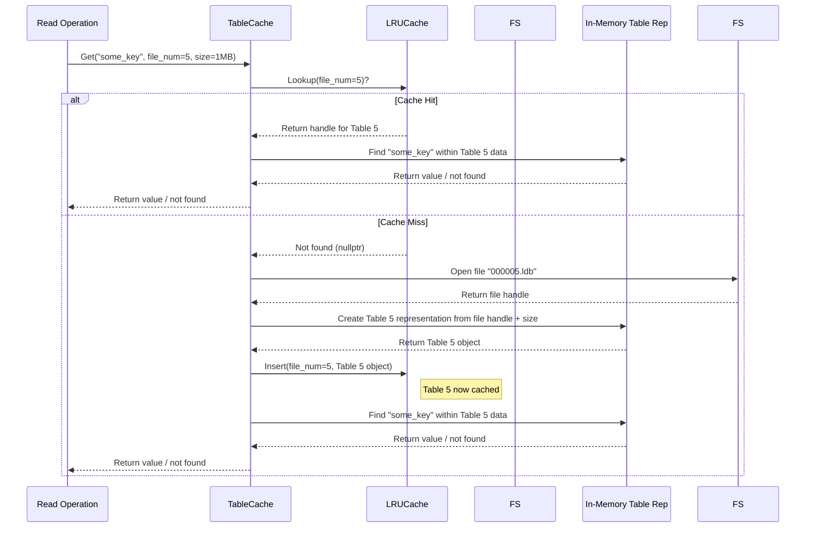

# Chapter 1: Table / SSTable & TableCache

Welcome to your LevelDB journey! This is the first chapter where we'll start exploring the fundamental building blocks of LevelDB.

Imagine you're building a system to store a massive amount of data, like user profiles or product information. You need a way to save this data permanently (so it doesn't disappear when the computer turns off) and retrieve it quickly. How does LevelDB handle this?

The core idea we'll explore in this chapter is how LevelDB stores the bulk of its data on disk in special files and how it accesses them efficiently.

## What's the Problem? Storing Lots of Data Permanently

Databases need to store key-value pairs (like `user_id` -> `user_data`) persistently. This means writing the data to disk. However, disks are much slower than computer memory (RAM). If we just wrote every tiny change directly to a file, it would be very slow. Also, how do we organize the data on disk so we can find a specific key quickly without reading *everything*?

LevelDB's solution involves files called **SSTables** (Sorted String Tables), often just called **Tables** in the code.

## SSTable: The Sorted, Immutable Book on the Shelf

Think of an SSTable as a **permanently bound book** in a library.

1.  **Stores Key-Value Pairs:** Just like a dictionary or an encyclopedia volume, an SSTable contains data entries, specifically key-value pairs.
2.  **Sorted:** The keys inside an SSTable file are always stored in sorted order (like words in a dictionary). This is crucial for finding data quickly later on. If you're looking for the key "zebra", you know you don't need to look in the "A" section.
3.  **Immutable:** Once an SSTable file is written to disk, LevelDB **never changes it**. It's like a printed book – you can't erase or rewrite a page. If you need to update or delete data, LevelDB writes *new* information in *newer* SSTables. (We'll see how this works in later chapters like [Compaction](08_compaction.md)). This immutability makes many things simpler and safer.
4.  **It's a File:** At the end of the day, an SSTable is just a file on your computer's disk. LevelDB gives these files names like `000005.ldb` or `000010.sst`.

Here's how LevelDB determines the filename for an SSTable:

```c++
// --- File: filename.cc ---

// Creates a filename like "dbname/000005.ldb"
std::string TableFileName(const std::string& dbname, uint64_t number) {
  assert(number > 0);
  // Uses a helper to format the number with leading zeros
  // and adds the '.ldb' or '.sst' suffix.
  return MakeFileName(dbname, number, "ldb"); // or "sst"
}
```

This simple function takes the database name (e.g., `/path/to/my/db`) and a unique number and creates the actual filename used on disk. The `.ldb` or `.sst` extension helps identify it as a LevelDB table file.

## Creating SSTables: `BuildTable`

How do these sorted, immutable files get created? This happens during processes like "flushing" data from memory or during "compaction" (which we'll cover in later chapters: [MemTable](02_memtable.md) and [Compaction](08_compaction.md)).

The function responsible for writing a new SSTable file is `BuildTable`. Think of `BuildTable` as the **printing press and binding machine** for our book analogy. It takes data (often from memory, represented by an `Iterator`) and writes it out to a new, sorted SSTable file on disk.

Let's look at a simplified view of `BuildTable`:

```c++
// --- File: builder.cc ---

// Builds an SSTable file from the key/value pairs provided by 'iter'.
Status BuildTable(const std::string& dbname, Env* env, const Options& options,
                  TableCache* table_cache, Iterator* iter, FileMetaData* meta) {
  Status s;
  // ... setup: determine filename, open the file for writing ...
  std::string fname = TableFileName(dbname, meta->number);
  WritableFile* file;
  s = env->NewWritableFile(fname, &file);
  // ... handle potential errors ...

  // TableBuilder does the heavy lifting of formatting the file
  TableBuilder* builder = new TableBuilder(options, file);

  // Find the first key to store as the smallest key in metadata
  iter->SeekToFirst();
  meta->smallest.DecodeFrom(iter->key());

  // Loop through all key-value pairs from the input iterator
  Slice key;
  for (; iter->Valid(); iter->Next()) {
    key = iter->key();
    // Add the key and value to the table being built
    builder->Add(key, iter->value());
  }
  // Store the last key as the largest key in metadata
  if (!key.empty()) {
    meta->largest.DecodeFrom(key);
  }

  // Finish writing the file (adds index blocks, etc.)
  s = builder->Finish();
  // ... more steps: update metadata, sync file to disk, close file ...
  if (s.ok()) {
      meta->file_size = builder->FileSize();
      s = file->Sync(); // Ensure data is physically written
  }
  if (s.ok()) {
      s = file->Close();
  }
  // ... cleanup: delete builder, file; handle errors ...

  return s;
}
```

**Explanation:**

1.  **Input:** `BuildTable` receives data via an `Iterator`. An iterator is like a cursor that lets you go through key-value pairs one by one, already in sorted order. It also gets other necessary info like the database name (`dbname`), environment (`env`), options, the `TableCache` (we'll see this next!), and a `FileMetaData` object to store information *about* the new file (like its number, size, smallest key, and largest key).
2.  **File Creation:** It creates a new, empty file using `env->NewWritableFile`.
3.  **TableBuilder:** It uses a helper object called `TableBuilder` to handle the complex details of formatting the SSTable file structure (data blocks, index blocks, etc.).
4.  **Iteration & Adding:** It loops through the `Iterator`. For each key-value pair, it calls `builder->Add()`. Because the input `Iterator` provides keys in sorted order, the `TableBuilder` can write them sequentially to the file.
5.  **Metadata:** It records the very first key (`meta->smallest`) and the very last key (`meta->largest`) it processes. This is useful later for quickly knowing the range of keys stored in this file without opening it.
6.  **Finishing Up:** It calls `builder->Finish()` to write out the final pieces of the SSTable (like the index). Then it `Sync`s the file to ensure the data is safely on disk and `Close`s it.
7.  **Output:** If successful, a new `.ldb` file exists on disk containing the sorted key-value pairs, and the `meta` object is filled with details about this file.

## Accessing SSTables Efficiently: `TableCache`

Okay, so we have these SSTable files on disk. But reading from disk is slow. If we need to read from the same SSTable file multiple times (which is common), opening and closing it repeatedly, or re-reading its internal index structure, would be inefficient.

This is where the `TableCache` comes in. Think of the `TableCache` as a **smart librarian**.

1.  **Keeps Files Open:** The librarian might keep the most popular books near the front desk instead of running to the far shelves every time someone asks for them. Similarly, the `TableCache` keeps recently used SSTable files open.
2.  **Caches Structures:** Just opening the file isn't enough. LevelDB needs to read some index information *within* the SSTable file to find keys quickly. The `TableCache` also keeps this parsed information in memory (RAM). It uses a specific caching strategy called LRU (Least Recently Used) to decide which table information to keep in memory if the cache gets full.
3.  **Provides Access:** When LevelDB needs to read data from a specific SSTable (identified by its file number), it asks the `TableCache`. The cache checks if it already has that table open and ready in memory. If yes (a "cache hit"), it returns access quickly. If no (a "cache miss"), it opens the actual file from disk, reads the necessary index info, stores it in the cache for next time, and then returns access.

Let's see how the `TableCache` finds a table:

```c++
// --- File: table_cache.cc ---

// Tries to find the Table structure for a given file number.
// If not in cache, opens the file and loads it.
Status TableCache::FindTable(uint64_t file_number, uint64_t file_size,
                             Cache::Handle** handle) {
  Status s;
  // Create a key for the cache lookup (based on file number)
  char buf[sizeof(file_number)];
  EncodeFixed64(buf, file_number);
  Slice key(buf, sizeof(buf));

  // 1. Try looking up the table in the cache
  *handle = cache_->Lookup(key);

  if (*handle == nullptr) { // Cache Miss!
    // 2. If not found, open the actual file from disk
    std::string fname = TableFileName(dbname_, file_number);
    RandomAccessFile* file = nullptr;
    Table* table = nullptr;
    s = env_->NewRandomAccessFile(fname, &file); // Open the file
    // ... handle errors, potentially check for old .sst filename ...

    if (s.ok()) {
      // 3. Parse the Table structure (index etc.) from the file
      s = Table::Open(options_, file, file_size, &table);
    }

    if (s.ok()) {
      // 4. Store the opened file and parsed Table in the cache
      TableAndFile* tf = new TableAndFile;
      tf->file = file;
      tf->table = table;
      *handle = cache_->Insert(key, tf, 1 /*charge*/, &DeleteEntry);
    } else {
      // Error occurred, cleanup
      delete file;
      // Note: Errors are NOT cached. We'll retry opening next time.
    }
  } // else: Cache Hit! *handle is already valid.
  return s;
}
```

**Explanation:**

1.  **Lookup:** It first tries `cache_->Lookup` using the `file_number`.
2.  **Cache Miss:** If `Lookup` returns `nullptr`, it means the table isn't in the cache. It then proceeds to open the file (`env_->NewRandomAccessFile`).
3.  **Table::Open:** It calls `Table::Open`, which reads the file's footer, parses the index block, and sets up a `Table` object ready for lookups.
4.  **Insert:** If opening and parsing succeed, it creates a `TableAndFile` struct (holding both the file handle and the `Table` object) and inserts it into the cache using `cache_->Insert`. Now, the next time `FindTable` is called for this `file_number`, it will be a cache hit.
5.  **Cache Hit:** If `Lookup` initially returned a valid handle, `FindTable` simply returns `Status::OK()`, and the caller can use the handle to get the `Table` object.

When LevelDB needs to read data, it often gets an `Iterator` for a specific SSTable via the `TableCache`:

```c++
// --- File: table_cache.cc ---

// Returns an iterator for reading the specified SSTable file.
Iterator* TableCache::NewIterator(const ReadOptions& options,
                                  uint64_t file_number, uint64_t file_size,
                                  Table** tableptr) {
  // ... setup ...
  Cache::Handle* handle = nullptr;
  // Use FindTable to get the Table object (from cache or by opening file)
  Status s = FindTable(file_number, file_size, &handle);
  if (!s.ok()) {
    return NewErrorIterator(s); // Return an iterator that yields the error
  }

  // Get the Table object from the cache handle
  Table* table = reinterpret_cast<TableAndFile*>(cache_->Value(handle))->table;
  // Ask the Table object to create a new iterator for its data
  Iterator* result = table->NewIterator(options);

  // Important: Register cleanup to release the cache handle when iterator is done
  result->RegisterCleanup(&UnrefEntry, cache_, handle);

  // Optionally return the Table object itself
  if (tableptr != nullptr) {
    *tableptr = table;
  }
  return result;
}
```

This function uses `FindTable` to get the `Table` object (either from the cache or by loading it from disk) and then asks that `Table` object to provide an `Iterator` to step through its key-value pairs. It also cleverly registers a cleanup function (`UnrefEntry`) so that when the iterator is no longer needed, the cache handle is released, allowing the cache to potentially evict the table later if needed.

Here's a diagram showing how a read might use the `TableCache`:



## Conclusion

In this chapter, we learned about two fundamental concepts in LevelDB:

1.  **SSTable (Table):** These are the immutable, sorted files on disk where LevelDB stores the bulk of its key-value data. Think of them as sorted, bound books. They are created using `BuildTable`.
2.  **TableCache:** This acts like an efficient librarian for SSTables. It keeps recently used tables open and their index structures cached in memory (RAM) to speed up access, avoiding slow disk reads whenever possible. It provides access to table data, often via iterators.

These two components work together to provide persistent storage and relatively fast access to the data within those files.

But where does the data *come from* before it gets written into an SSTable? Often, it lives in memory first. In the next chapter, we'll look at the in-memory structure where recent writes are held before being flushed to an SSTable.

Next up: [Chapter 2: MemTable](02_memtable.md)

---

Generated by [AI Codebase Knowledge Builder](https://github.com/The-Pocket/Tutorial-Codebase-Knowledge)