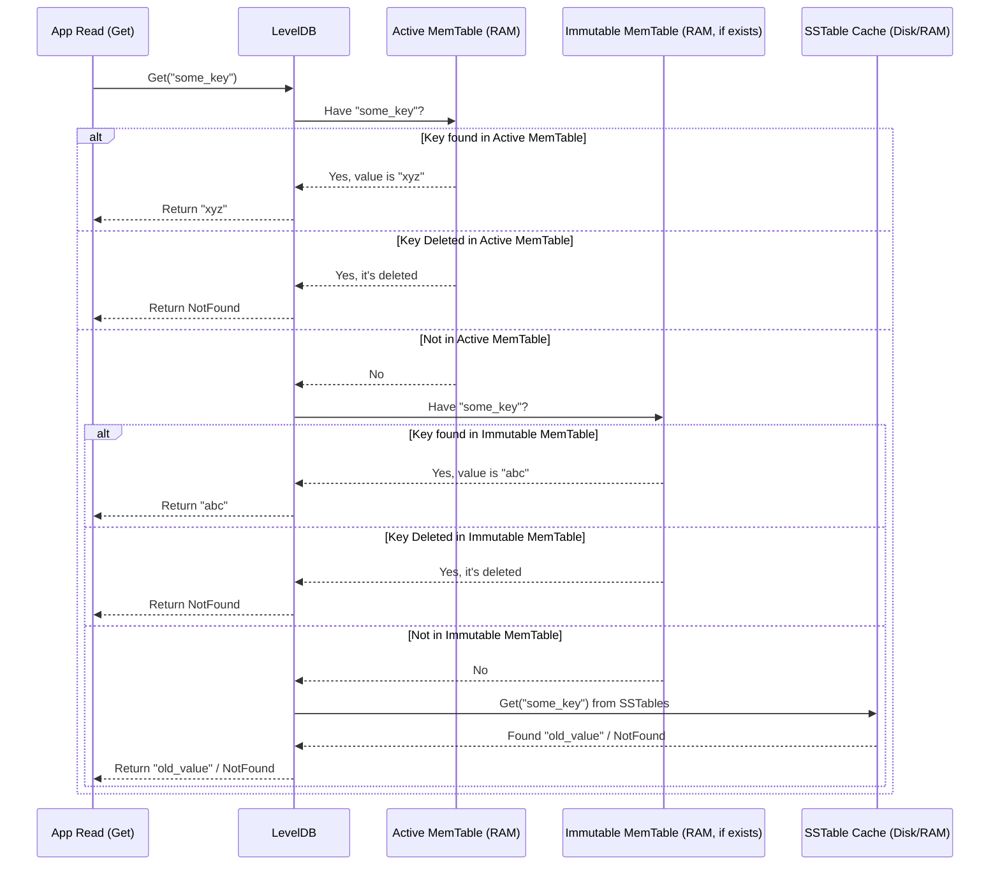
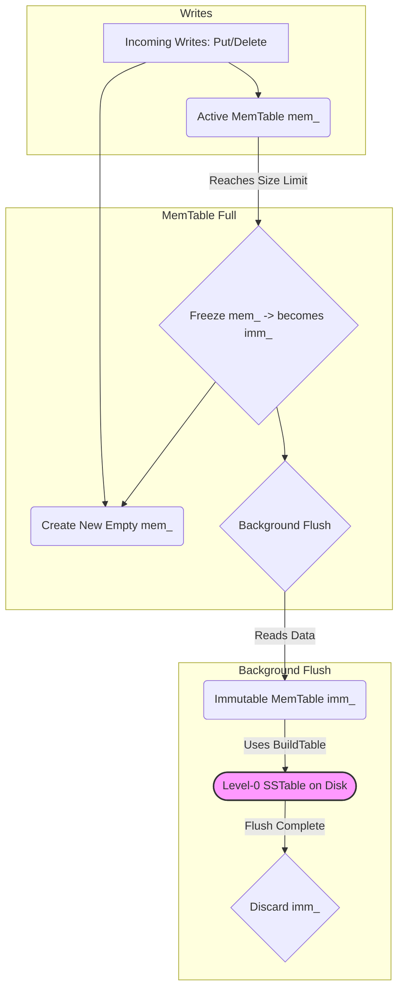

# Chapter 2: MemTable

In [Chapter 1: Table / SSTable & TableCache](01_table___sstable___tablecache.md), we learned how LevelDB stores the bulk of its data permanently on disk in sorted, immutable files called SSTables. We also saw how the `TableCache` helps access these files efficiently.

But imagine you're updating your data frequently – adding new users, changing scores, deleting temporary items. Writing every tiny change directly to a new SSTable file on disk would be incredibly slow, like carving every single note onto a stone tablet! We need a faster way to handle recent changes.

## What's the Problem? Slow Disk Writes for Every Change

Disk drives (even fast SSDs) are much slower than your computer's main memory (RAM). If LevelDB wrote every `Put` or `Delete` operation straight to an SSTable file, your application would constantly be waiting for the disk, making it feel sluggish.

How can we accept new writes quickly but still eventually store them permanently on disk?

## MemTable: The Fast In-Memory Notepad

LevelDB's solution is the **MemTable**. Think of it as a **temporary notepad** or a **scratchpad** that lives entirely in your computer's fast RAM.

1.  **In-Memory:** It's stored in RAM, making reads and writes extremely fast.
2.  **Holds Recent Writes:** When you `Put` a new key-value pair or `Delete` a key, the change goes into the MemTable first.
3.  **Sorted:** Just like SSTables, the data inside the MemTable is kept sorted by key. This is important for efficiency later.
4.  **Temporary:** It's only a temporary holding area. Eventually, its contents get written out to a permanent SSTable file on disk.

So, when you write data:

*Your Application* -> `Put("user123", "data")` -> **MemTable** (Fast RAM write!)

This makes write operations feel almost instantaneous to your application.

## How Reads Use the MemTable

When you try to read data using `Get(key)`, LevelDB is smart. It knows the most recent data might still be on the "notepad" (MemTable). So, it checks there *first*:

1.  **Check MemTable:** Look for the key in the current MemTable.
    *   If the key is found, return the value immediately (super fast!).
    *   If a "deletion marker" for the key is found, stop and report "Not Found" (the key was recently deleted).
2.  **Check Older MemTable (Immutable):** If there's an older MemTable being flushed (we'll cover this next), check that too.
3.  **Check SSTables:** If the key wasn't found in memory (or wasn't deleted there), *then* LevelDB looks for it in the SSTable files on disk, using the [Table / SSTable & TableCache](01_table___sstable___tablecache.md) we learned about in Chapter 1.

This "check memory first" strategy ensures that you always read the most up-to-date value, even if it hasn't hit the disk yet.



## What Happens When the Notepad Fills Up?

The MemTable lives in RAM, which is limited. We can't just keep adding data to it forever. LevelDB has a configured size limit for the MemTable ( `options.write_buffer_size`, often a few megabytes).

When the MemTable gets close to this size:

1.  **Freeze!** LevelDB declares the current MemTable "immutable" (meaning read-only). No new writes go into this specific MemTable anymore. Let's call it `imm_` (Immutable MemTable).
2.  **New Notepad:** LevelDB immediately creates a *new*, empty MemTable (`mem_`) to accept incoming writes. Your application doesn't pause; new writes just start going to the fresh MemTable.
3.  **Flush to Disk:** A background task starts working on the frozen `imm_`. It reads all the sorted key-value pairs from `imm_` and uses the `BuildTable` process (from [Chapter 1](01_table___sstable___tablecache.md)) to write them into a brand new SSTable file on disk. This new file becomes part of "Level-0" (we'll learn more about levels in [Chapter 8: Compaction](08_compaction.md)).
4.  **Discard:** Once the `imm_` is successfully written to the SSTable file, the in-memory `imm_` is discarded, freeing up RAM.

This process ensures that writes are always fast (going to the *new* `mem_`) while the *old* data is efficiently flushed to disk in the background.



## Under the Hood: Keeping it Sorted with a SkipList

We mentioned that the MemTable keeps keys sorted. Why?

1.  **Efficient Flushing:** When flushing the MemTable to an SSTable, the data needs to be written in sorted order. If the MemTable is already sorted, this is very efficient – we just read through it sequentially.
2.  **Efficient Reads:** Keeping it sorted allows for faster lookups within the MemTable itself.

How does LevelDB keep the MemTable sorted while allowing fast inserts? It uses a clever data structure called a **SkipList**.

Imagine a sorted linked list. To find an element, you might have to traverse many nodes. Now, imagine adding some "express lanes" (higher-level links) that skip over several nodes at a time. You can use these express lanes to quickly get close to your target, then drop down to the detailed level (the base list) to find the exact spot. This is the core idea of a SkipList!

*   **Fast Inserts:** Adding a new item is generally fast.
*   **Fast Lookups:** Finding an item is much faster than a simple linked list, often close to the speed of more complex balanced trees.
*   **Efficient Iteration:** Reading all items in sorted order (needed for flushing) is straightforward.

The MemTable essentially wraps a SkipList provided by `skiplist.h`.

```c++
// --- File: db/memtable.h ---

#include "db/skiplist.h" // The SkipList data structure
#include "util/arena.h"   // Memory allocator

class MemTable {
 private:
  // The core data structure: a SkipList.
  // The Key is 'const char*' pointing into the Arena.
  // KeyComparator helps compare keys correctly (we'll see this later).
  typedef SkipList<const char*, KeyComparator> Table;

  Arena arena_;   // Allocates memory for nodes efficiently
  Table table_;   // The actual SkipList instance
  int refs_;      // Reference count for managing lifetime
  // ... other members like KeyComparator ...

 public:
  // Add an entry (Put or Delete marker)
  void Add(SequenceNumber seq, ValueType type, const Slice& key,
           const Slice& value);

  // Look up a key
  bool Get(const LookupKey& key, std::string* value, Status* s);

  // Create an iterator to scan the MemTable's contents
  Iterator* NewIterator();

  // Estimate memory usage
  size_t ApproximateMemoryUsage();

  // Constructor, Ref/Unref omitted for brevity...
};
```

This header shows the `MemTable` class uses an `Arena` for memory management and a `Table` (which is a `SkipList`) to store the data.

## Adding and Getting Data (Code View)

Let's look at simplified versions of `Add` and `Get`.

**Adding an Entry:**

When you call `db->Put(key, value)` or `db->Delete(key)`, it eventually calls `MemTable::Add`.

```c++
// --- File: db/memtable.cc ---

void MemTable::Add(SequenceNumber s, ValueType type, const Slice& key,
                   const Slice& value) {
  // Calculate size needed for the entry in the skiplist.
  // Format includes key size, key, sequence number + type tag, value size, value.
  size_t key_size = key.size();
  size_t val_size = value.size();
  size_t internal_key_size = key_size + 8; // 8 bytes for seq + type
  const size_t encoded_len = VarintLength(internal_key_size) +
                             internal_key_size + VarintLength(val_size) +
                             val_size;

  // Allocate memory from the Arena
  char* buf = arena_.Allocate(encoded_len);

  // Encode the entry into the buffer 'buf' (details omitted)
  // Format: [key_len][key_bytes][seq_num|type][value_len][value_bytes]
  // ... encoding logic ...

  // Insert the buffer pointer into the SkipList. The SkipList uses the
  // KeyComparator to know how to sort based on the encoded format.
  table_.Insert(buf);
}
```

**Explanation:**

1.  **Calculate Size:** Determines how much memory is needed to store the key, value, sequence number, and type. (We'll cover sequence numbers and internal keys in [Chapter 9](09_internalkey___dbformat.md)).
2.  **Allocate:** Gets a chunk of memory from the `Arena`. Arenas are efficient allocators for many small objects with similar lifetimes.
3.  **Encode:** Copies the key, value, and metadata into the allocated buffer (`buf`).
4.  **Insert:** Calls `table_.Insert(buf)`, where `table_` is the SkipList. The SkipList takes care of finding the correct sorted position and linking the new entry.

**Getting an Entry:**

When you call `db->Get(key)`, it checks the MemTable first using `MemTable::Get`.

```c++
// --- File: db/memtable.cc ---

bool MemTable::Get(const LookupKey& lkey, std::string* value, Status* s) {
  // Get the specially formatted key to search for in the MemTable.
  Slice memkey = lkey.memtable_key();

  // Create an iterator for the SkipList.
  Table::Iterator iter(&table_);

  // Seek to the first entry >= the key we are looking for.
  iter.Seek(memkey.data());

  if (iter.Valid()) { // Did we find something at or after our key?
    // Decode the key found in the SkipList
    const char* entry = iter.key();
    // ... decode logic to get user_key, sequence, type ...
    Slice found_user_key = /* decoded user key */;
    ValueType found_type = /* decoded type */;

    // Check if the user key matches exactly
    if (comparator_.comparator.user_comparator()->Compare(
            found_user_key, lkey.user_key()) == 0) {
      // It's the right key! Check the type.
      if (found_type == kTypeValue) { // Is it a Put record?
        // Decode the value and return it
        Slice v = /* decoded value */;
        value->assign(v.data(), v.size());
        return true; // Found the value!
      } else { // Must be kTypeDeletion
        // Found a deletion marker for this key. Report "NotFound".
        *s = Status::NotFound(Slice());
        return true; // Found a deletion!
      }
    }
  }
  // Key not found in this MemTable
  return false;
}
```

**Explanation:**

1.  **Get Search Key:** Prepares the key in the format used internally by the MemTable (`LookupKey`).
2.  **Create Iterator:** Gets a `SkipList::Iterator`.
3.  **Seek:** Uses the iterator's `Seek` method to efficiently find the first entry in the SkipList whose key is greater than or equal to the search key.
4.  **Check Found Entry:** If `Seek` finds an entry (`iter.Valid()`):
    *   It decodes the entry found in the SkipList.
    *   It compares the *user* part of the key to ensure it's an exact match (not just the next key in sorted order).
    *   If the keys match, it checks the `type`:
        *   If it's `kTypeValue`, it decodes the value and returns `true`.
        *   If it's `kTypeDeletion`, it sets the status to `NotFound` and returns `true` (indicating we found definitive information about the key – it's deleted).
5.  **Not Found:** If no matching key is found, it returns `false`.

## Conclusion

The **MemTable** is LevelDB's crucial in-memory cache for recent writes. It acts like a fast notepad:

*   Accepts new `Put` and `Delete` operations quickly in RAM.
*   Keeps entries sorted using an efficient **SkipList**.
*   Allows recent data to be read quickly without touching the disk.
*   When full, it's frozen, flushed to a new Level-0 **SSTable** file on disk in the background, and then discarded.

This design allows LevelDB to provide very fast write performance while still ensuring data is eventually persisted safely to disk.

However, what happens if the power goes out *after* data is written to the MemTable but *before* it's flushed to an SSTable? Isn't the data in RAM lost? To solve this, LevelDB uses another component alongside the MemTable: the Write-Ahead Log (WAL).

Next up: [Chapter 3: Write-Ahead Log (WAL) & LogWriter/LogReader](03_write_ahead_log__wal____logwriter_logreader.md)

---

Generated by [AI Codebase Knowledge Builder](https://github.com/The-Pocket/Tutorial-Codebase-Knowledge)
