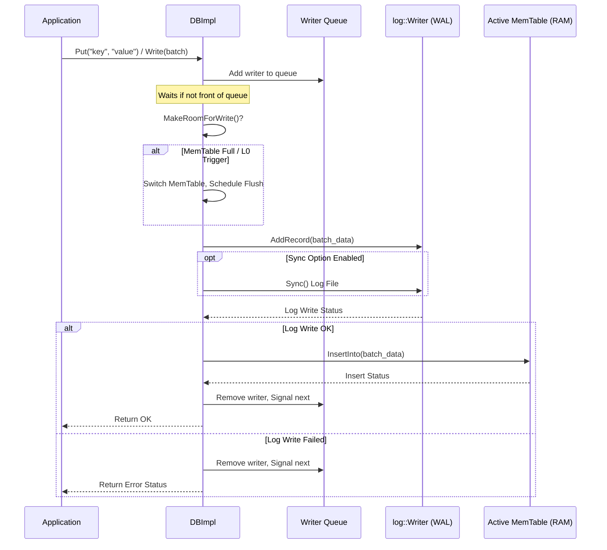
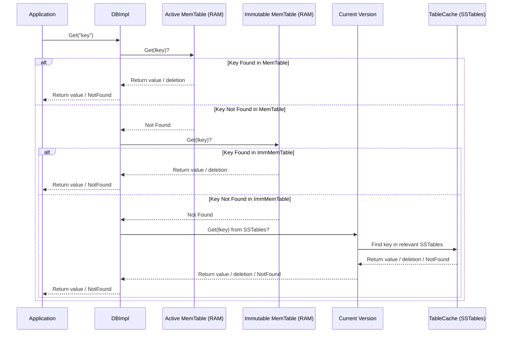
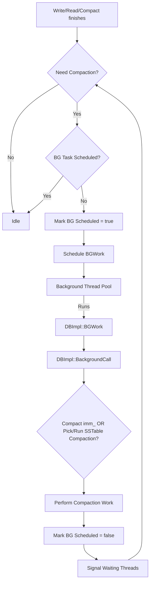

# Chapter 4: DBImpl - The Database General Manager

In the previous chapters, we've explored some key ingredients of LevelDB:
*   [SSTables](01_table___sstable___tablecache.md) for storing data permanently on disk.
*   The [MemTable](02_memtable.md) for quickly handling recent writes in memory.
*   The [Write-Ahead Log (WAL)](03_write_ahead_log__wal____logwriter_logreader.md) for ensuring durability even if the system crashes.

But how do all these pieces work together? Who tells LevelDB to write to the WAL first, *then* the MemTable? Who decides when the MemTable is full and needs to be flushed to an SSTable? Who coordinates reading data from both memory *and* disk files?

## What's the Problem? Orchestrating Everything

Imagine a large library. You have librarians putting books on shelves (SSTables), a front desk clerk taking newly returned books (MemTable), and a security guard logging everyone who enters (WAL). But someone needs to be in charge of the whole operation – the **General Manager**.

This manager doesn't shelve every book themselves, but they direct the staff, manage the budget, decide when to rearrange sections (compaction), and handle emergencies (recovery). Without a manager, it would be chaos!

LevelDB needs a similar central coordinator to manage all its different parts and ensure they work together smoothly and correctly.

## DBImpl: The General Manager of LevelDB

The `DBImpl` class is the heart of LevelDB's implementation. It's the **General Manager** of our database library. It doesn't *contain* the data itself (that's in MemTables and SSTables), but it **orchestrates** almost every operation.

*   It takes requests from your application (like `Put`, `Get`, `Delete`).
*   It directs these requests to the right components (WAL, MemTable, TableCache).
*   It manages the state of the database (like which MemTable is active, which files exist).
*   It initiates and manages background tasks like flushing the MemTable and running compactions.
*   It handles the recovery process when the database starts up.

Almost every interaction you have with a LevelDB database object ultimately goes through `DBImpl`.

## Key Responsibilities of DBImpl

Think of the `DBImpl` general manager juggling several key tasks:

1.  **Handling Writes (`Put`, `Delete`, `Write`):** Ensuring data is safely written to the WAL and then the MemTable. Managing the process when the MemTable fills up.
2.  **Handling Reads (`Get`, `NewIterator`):** Figuring out where to find the requested data – checking the active MemTable, the soon-to-be-flushed immutable MemTable, and finally the various SSTable files on disk (using helpers like [Version & VersionSet](06_version___versionset.md) and [Table / SSTable & TableCache](01_table___sstable___tablecache.md)).
3.  **Background Maintenance ([Compaction](08_compaction.md)):** Deciding when and how to run compactions to clean up old data, merge SSTables, and keep reads efficient. It schedules and oversees this background work.
4.  **Startup and Recovery:** When the database opens, `DBImpl` manages locking the database directory, reading the manifest file ([Version & VersionSet](06_version___versionset.md)), and replaying the [WAL](03_write_ahead_log__wal____logwriter_logreader.md) to recover any data that wasn't flushed before the last shutdown or crash.
5.  **Snapshot Management:** Handling requests to create and release snapshots, which provide a consistent view of the database at a specific point in time.

`DBImpl` uses other components extensively to perform these tasks. It holds references to the active MemTable (`mem_`), the immutable MemTable (`imm_`), the WAL (`log_`), the `TableCache`, and the `VersionSet` (which tracks all the SSTable files).

## How DBImpl Handles Writes

Let's trace a simple `Put` operation:

1.  **Request:** Your application calls `db->Put("mykey", "myvalue")`.
2.  **DBImpl Entry:** This call enters the `DBImpl::Put` method (which typically wraps the operation in a [WriteBatch](05_writebatch.md) and calls `DBImpl::Write`).
3.  **Queueing (Optional):** `DBImpl` manages a queue of writers to ensure writes happen in order. It might group multiple concurrent writes together for efficiency (`BuildBatchGroup`).
4.  **Making Room:** Before writing, `DBImpl` checks if there's space in the current `MemTable` (`mem_`). If not (`MakeRoomForWrite`), it might:
    *   Pause briefly if Level-0 SSTable count is high (slowdown trigger).
    *   Wait if the *immutable* MemTable (`imm_`) is still being flushed.
    *   Wait if Level-0 SSTable count is too high (stop trigger).
    *   **Trigger a MemTable switch:**
        *   Mark the current `mem_` as read-only (`imm_`).
        *   Create a new empty `mem_`.
        *   Create a new WAL file (`logfile_`).
        *   Schedule a background task (`MaybeScheduleCompaction`) to flush the old `imm_` to an SSTable.
5.  **Write to WAL:** `DBImpl` writes the operation(s) to the current WAL file (`log_->AddRecord(...)`). If requested (`options.sync`), it ensures the WAL data is physically on disk (`logfile_->Sync()`).
6.  **Write to MemTable:** Only after the WAL write succeeds, `DBImpl` inserts the data into the active `MemTable` (`mem_->Add(...)` via `WriteBatchInternal::InsertInto`).
7.  **Return:** Control returns to your application.

Here's a highly simplified view of the `Write` method:

```c++
// --- Simplified from db/db_impl.cc ---

Status DBImpl::Write(const WriteOptions& options, WriteBatch* updates) {
  // ... acquire mutex, manage writer queue (omitted) ...

  // Step 4: Make sure there's space. This might trigger a MemTable switch
  // and schedule background work. May wait if MemTable is full or
  // too many L0 files exist.
  Status status = MakeRoomForWrite(updates == nullptr /* force compact? */);

  if (status.ok() && updates != nullptr) {
    // ... potentially group multiple concurrent writes (BuildBatchGroup) ...

    // Step 5: Add the batch to the Write-Ahead Log
    status = log_->AddRecord(WriteBatchInternal::Contents(updates));
    if (status.ok() && options.sync) {
      // Ensure log entry is on disk if requested
      status = logfile_->Sync();
      // ... handle sync error by recording background error ...
    }

    // Step 6: Insert the batch into the active MemTable (only if WAL ok)
    if (status.ok()) {
      status = WriteBatchInternal::InsertInto(updates, mem_);
    }
  }

  // ... update sequence number, manage writer queue, release mutex ...
  return status; // Step 7: Return status to caller
}
```

**Explanation:** This code shows the core sequence: check/make room (`MakeRoomForWrite`), write to the log (`log_->AddRecord`), potentially sync the log (`logfile_->Sync`), and finally insert into the MemTable (`InsertInto(..., mem_)`). Error handling and writer coordination are omitted for clarity.



## How DBImpl Handles Reads

Reading data involves checking different places in a specific order to ensure the most recent value is found:

1.  **Request:** Your application calls `db->Get("mykey")`.
2.  **DBImpl Entry:** The call enters `DBImpl::Get`.
3.  **Snapshot:** `DBImpl` determines the sequence number to read up to (either from the provided `ReadOptions::snapshot` or the current latest sequence number).
4.  **Check MemTable:** It first checks the active `MemTable` (`mem_`). If the key is found (either a value or a deletion marker), the search stops, and the result is returned.
5.  **Check Immutable MemTable:** If not found in `mem_`, and if an immutable MemTable (`imm_`) exists (one that's waiting to be flushed), it checks `imm_`. If found, the search stops.
6.  **Check SSTables:** If the key wasn't found in memory, `DBImpl` asks the current `Version` (managed by `VersionSet`) to find the key in the SSTable files (`current->Get(...)`). The `Version` object knows which files might contain the key and uses the `TableCache` to access them efficiently.
7.  **Update Stats (Optional):** If the read involved checking SSTables, `DBImpl` might update internal statistics about file access (`current->UpdateStats`). If a file is read frequently, this might trigger a future compaction (`MaybeScheduleCompaction`).
8.  **Return:** The value found (or a "Not Found" status) is returned to the application.

A simplified view of `Get`:

```c++
// --- Simplified from db/db_impl.cc ---

Status DBImpl::Get(const ReadOptions& options, const Slice& key,
                   std::string* value) {
  Status s;
  SequenceNumber snapshot;
  // ... (Step 3) Determine snapshot sequence number ...
  mutex_.Lock(); // Need lock to access mem_, imm_, current version
  MemTable* mem = mem_;
  MemTable* imm = imm_;
  Version* current = versions_->current();
  mem->Ref(); // Increase reference counts
  if (imm != nullptr) imm->Ref();
  current->Ref();
  mutex_.Unlock(); // Unlock for potentially slow lookups

  LookupKey lkey(key, snapshot); // Internal key format for lookup

  // Step 4: Check active MemTable
  if (mem->Get(lkey, value, &s)) {
    // Found in mem_ (value or deletion marker)
  }
  // Step 5: Check immutable MemTable (if it exists)
  else if (imm != nullptr && imm->Get(lkey, value, &s)) {
    // Found in imm_
  }
  // Step 6: Check SSTables via current Version
  else {
    Version::GetStats stats; // To record file access stats
    s = current->Get(options, lkey, value, &stats);
    // Step 7: Maybe update stats and schedule compaction
    if (current->UpdateStats(stats)) {
       mutex_.Lock();
       MaybeScheduleCompaction(); // Needs lock
       mutex_.Unlock();
    }
  }

  // Decrease reference counts
  mutex_.Lock();
  mem->Unref();
  if (imm != nullptr) imm->Unref();
  current->Unref();
  mutex_.Unlock();

  return s; // Step 8: Return status
}
```

**Explanation:** This shows the order of checking: `mem->Get`, `imm->Get`, and finally `current->Get` (which searches SSTables). It also highlights the reference counting (`Ref`/`Unref`) needed because these components might be changed or deleted by background threads while the read is in progress. The lock is held only when accessing shared pointers, not during the actual data lookup.



## Managing Background Work (Compaction)

`DBImpl` is responsible for kicking off background work. It doesn't *do* the compaction itself (that logic is largely within [Compaction](08_compaction.md) and [VersionSet](06_version___versionset.md)), but it manages the *triggering* and the background thread.

*   **When is work needed?** `DBImpl` checks if work is needed in a few places:
    *   After a MemTable switch (`MakeRoomForWrite` schedules flush of `imm_`).
    *   After a read operation updates file stats (`Get` might call `MaybeScheduleCompaction`).
    *   After a background compaction finishes (it checks if *more* compaction is needed).
    *   When explicitly requested (`CompactRange`).
*   **Scheduling:** If work is needed and a background task isn't already running, `DBImpl::MaybeScheduleCompaction` sets a flag (`background_compaction_scheduled_`) and asks the `Env` (Environment object, handles OS interactions) to schedule a function (`DBImpl::BGWork`) to run on a background thread.
*   **Performing Work:** The background thread eventually calls `DBImpl::BackgroundCall`, which locks the mutex and calls `DBImpl::BackgroundCompaction`. This method decides *what* work to do:
    *   If `imm_` exists, it calls `CompactMemTable` (which uses `WriteLevel0Table` -> `BuildTable`) to flush it.
    *   Otherwise, it asks the `VersionSet` to pick an appropriate SSTable compaction (`versions_->PickCompaction()`).
    *   It then calls `DoCompactionWork` to perform the actual SSTable compaction (releasing the main lock during the heavy lifting).
*   **Signaling:** Once background work finishes, it signals (`background_work_finished_signal_.SignalAll()`) any foreground threads that might be waiting (e.g., a write operation waiting for `imm_` to be flushed).

Here's the simplified scheduling logic:

```c++
// --- Simplified from db/db_impl.cc ---

void DBImpl::MaybeScheduleCompaction() {
  mutex_.AssertHeld(); // Must hold lock to check/change state

  if (background_compaction_scheduled_) {
    // Already scheduled
  } else if (shutting_down_.load(std::memory_order_acquire)) {
    // DB is closing
  } else if (!bg_error_.ok()) {
    // Background error stopped activity
  } else if (imm_ == nullptr && // No MemTable flush needed AND
             manual_compaction_ == nullptr && // No manual request AND
             !versions_->NeedsCompaction()) { // VersionSet says no work needed
    // No work to be done
  } else {
    // Work needs to be done! Schedule it.
    background_compaction_scheduled_ = true;
    env_->Schedule(&DBImpl::BGWork, this); // Ask Env to run BGWork later
  }
}
```

**Explanation:** This function checks several conditions under a lock. If there's an immutable MemTable to flush (`imm_ != nullptr`) or the `VersionSet` indicates compaction is needed (`versions_->NeedsCompaction()`) and no background task is already scheduled, it marks one as scheduled and tells the environment (`env_`) to run the `BGWork` function in the background.



## Recovery on Startup

When you open a database, `DBImpl::Open` orchestrates the recovery process:

1.  **Lock:** It locks the database directory (`env_->LockFile`) to prevent other processes from using it.
2.  **Recover VersionSet:** It calls `versions_->Recover()`, which reads the `MANIFEST` file to understand the state of SSTables from the last clean run.
3.  **Find Logs:** It scans the database directory for any `.log` files (WAL files) that are newer than the ones recorded in the `MANIFEST`. These logs represent writes that might not have been flushed to SSTables before the last shutdown/crash.
4.  **Replay Logs:** For each relevant log file found, it calls `DBImpl::RecoverLogFile`.
    *   Inside `RecoverLogFile`, it creates a `log::Reader`.
    *   It reads records (which are serialized `WriteBatch`es) from the log file one by one.
    *   For each record, it applies the operations (`WriteBatchInternal::InsertInto`) to a temporary in-memory `MemTable`.
    *   This effectively rebuilds the state of the MemTable(s) as they were just before the crash/shutdown.
5.  **Finalize State:** Once all logs are replayed, the recovered MemTable becomes the active `mem_`. If the recovery process itself filled the MemTable, `RecoverLogFile` might even flush it to a Level-0 SSTable (`WriteLevel0Table`). `DBImpl` updates the `VersionSet` with the recovered sequence number and potentially writes a new `MANIFEST`.
6.  **Ready:** The database is now recovered and ready for new operations.

Here's a conceptual snippet from the recovery logic:

```c++
// --- Conceptual, simplified from DBImpl::RecoverLogFile ---

// Inside loop processing a single log file during recovery:
while (reader.ReadRecord(&record, &scratch) && status.ok()) {
  // Check if record looks like a valid WriteBatch
  if (record.size() < 12) { /* report corruption */ continue; }

  // Parse the raw log record back into a WriteBatch object
  WriteBatchInternal::SetContents(&batch, record);

  // Create a MemTable if we don't have one yet for this log
  if (mem == nullptr) {
    mem = new MemTable(internal_comparator_);
    mem->Ref();
  }

  // Apply the operations from the batch TO THE MEMTABLE
  status = WriteBatchInternal::InsertInto(&batch, mem);
  // ... handle error ...

  // Keep track of the latest sequence number seen
  const SequenceNumber last_seq = /* ... get sequence from batch ... */;
  if (last_seq > *max_sequence) {
    *max_sequence = last_seq;
  }

  // If the MemTable gets full *during recovery*, flush it!
  if (mem->ApproximateMemoryUsage() > options_.write_buffer_size) {
    status = WriteLevel0Table(mem, edit, nullptr); // Flush to L0 SSTable
    mem->Unref();
    mem = nullptr; // Will create a new one if needed
    // ... handle error ...
  }
}
// After loop, handle the final state of 'mem'
```

**Explanation:** This loop reads each record (a `WriteBatch`) from the log file using `reader.ReadRecord`. It then applies the batch's changes directly to an in-memory `MemTable` (`InsertInto(&batch, mem)`), effectively replaying the lost writes. It even handles flushing this MemTable if it fills up during the recovery process.

## The DBImpl Class (Code Glimpse)

The definition of `DBImpl` in `db_impl.h` shows the key components it manages:

```c++
// --- Simplified from db/db_impl.h ---

class DBImpl : public DB {
 public:
  DBImpl(const Options& options, const std::string& dbname);
  ~DBImpl() override;

  // Public API methods (implementing DB interface)
  Status Put(...) override;
  Status Delete(...) override;
  Status Write(...) override;
  Status Get(...) override;
  Iterator* NewIterator(...) override;
  const Snapshot* GetSnapshot() override;
  void ReleaseSnapshot(...) override;
  // ... other public methods ...

 private:
  // Friend classes allow access to private members
  friend class DB;
  struct CompactionState; // Helper struct for compactions
  struct Writer;          // Helper struct for writer queue

  // Core methods for internal operations
  Status Recover(VersionEdit* edit, bool* save_manifest);
  void CompactMemTable();
  Status RecoverLogFile(...);
  Status WriteLevel0Table(...);
  Status MakeRoomForWrite(...);
  void MaybeScheduleCompaction();
  static void BGWork(void* db); // Background task entry point
  void BackgroundCall();
  void BackgroundCompaction();
  Status DoCompactionWork(...);
  // ... other private helpers ...

  // == Key Member Variables ==
  Env* const env_;                // OS interaction layer
  const InternalKeyComparator internal_comparator_; // For sorting keys
  const Options options_;         // Database configuration options
  const std::string dbname_;      // Database directory path

  TableCache* const table_cache_; // Cache for open SSTable files

  FileLock* db_lock_;             // Lock file handle for DB directory

  port::Mutex mutex_;             // Main mutex protecting shared state
  std::atomic<bool> shutting_down_; // Flag indicating DB closure
  port::CondVar background_work_finished_signal_ GUARDED_BY(mutex_); // For waiting

  MemTable* mem_ GUARDED_BY(mutex_); // Active memtable (accepts writes)
  MemTable* imm_ GUARDED_BY(mutex_); // Immutable memtable (being flushed)
  std::atomic<bool> has_imm_;        // Fast check if imm_ is non-null

  WritableFile* logfile_;         // Current WAL file handle
  uint64_t logfile_number_ GUARDED_BY(mutex_); // Current WAL file number
  log::Writer* log_;              // WAL writer object

  VersionSet* const versions_ GUARDED_BY(mutex_); // Manages SSTables/Versions

  // Queue of writers waiting for their turn
  std::deque<Writer*> writers_ GUARDED_BY(mutex_);
  // List of active snapshots
  SnapshotList snapshots_ GUARDED_BY(mutex_);
  // Files being generated by compactions
  std::set<uint64_t> pending_outputs_ GUARDED_BY(mutex_);
  // Is a background compaction scheduled/running?
  bool background_compaction_scheduled_ GUARDED_BY(mutex_);
  // Error status from background threads
  Status bg_error_ GUARDED_BY(mutex_);
  // Compaction statistics
  CompactionStats stats_[config::kNumLevels] GUARDED_BY(mutex_);
};
```

**Explanation:** This header shows `DBImpl` inheriting from the public `DB` interface. It contains references to essential components like the `Env`, `Options`, `TableCache`, `MemTable` (`mem_` and `imm_`), WAL (`log_`, `logfile_`), and `VersionSet`. Crucially, it also has a `mutex_` to protect shared state accessed by multiple threads (foreground application threads and background compaction threads) and condition variables (`background_work_finished_signal_`) to allow threads to wait for background work.

## Conclusion

`DBImpl` is the central nervous system of LevelDB. It doesn't store the data itself, but it acts as the **General Manager**, receiving requests and coordinating the actions of all the other specialized components like the MemTable, WAL, VersionSet, and TableCache. It handles the intricate dance between fast in-memory writes, durable logging, persistent disk storage, background maintenance, and safe recovery. Understanding `DBImpl`'s role is key to seeing how all the pieces of LevelDB fit together to create a functional database.

One tool `DBImpl` uses to make writes efficient and atomic is the `WriteBatch`. Let's see how that works next.

Next up: [Chapter 5: WriteBatch](05_writebatch.md)

---

Generated by [AI Codebase Knowledge Builder](https://github.com/The-Pocket/Tutorial-Codebase-Knowledge)
