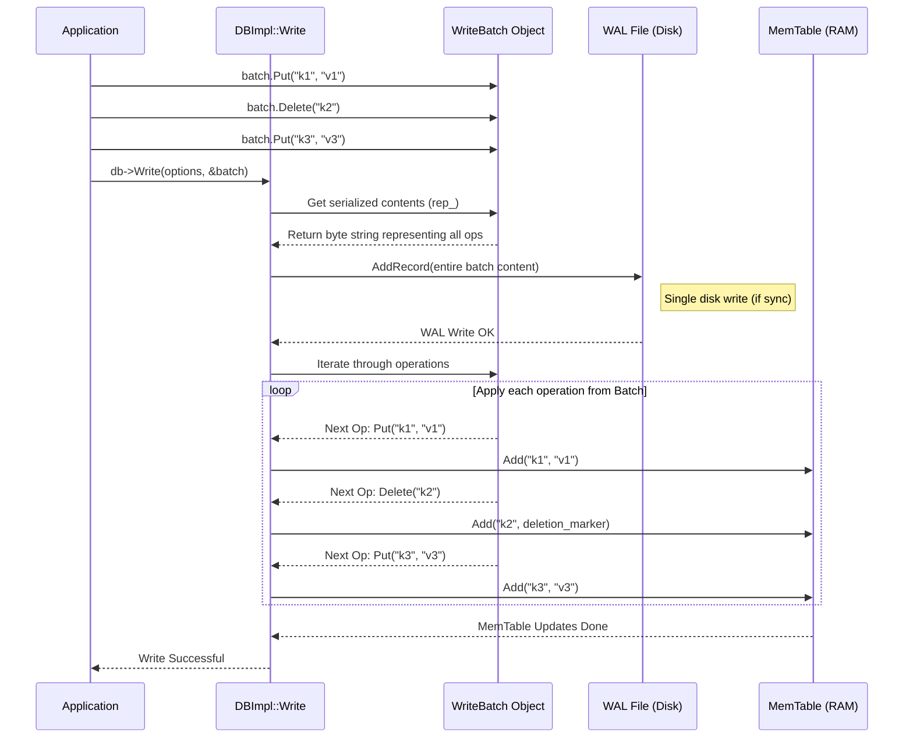

# Chapter 5: WriteBatch - Grouping Changes Together

Welcome back! In [Chapter 4: DBImpl](04_dbimpl.md), we saw how `DBImpl` acts as the general manager, coordinating writes, reads, and background tasks. We learned that when you call `Put` or `Delete`, `DBImpl` handles writing to the [Write-Ahead Log (WAL)](03_write_ahead_log__wal____logwriter_logreader.md) and then updating the [MemTable](02_memtable.md).

But what if you need to make *multiple* changes that should happen *together*?

## What's the Problem? Making Multiple Changes Atomically

Imagine you're managing game scores. When Player A beats Player B, you need to do two things: increase Player A's score and decrease Player B's score.

```
// Goal: Increase playerA score, decrease playerB score
db->Put(options, "score_playerA", "101");
db->Put(options, "score_playerB", "49");
```

What happens if the system crashes right *after* the first `Put` but *before* the second `Put`? Player A gets a point, but Player B *doesn't* lose one. The scores are now inconsistent! This isn't good.

We need a way to tell LevelDB: "Please perform these *multiple* operations (like updating both scores) as a single, indivisible unit. Either *all* of them should succeed, or *none* of them should." This property is called **atomicity**.

## WriteBatch: The Atomic To-Do List

LevelDB provides the `WriteBatch` class to solve this exact problem.

Think of a `WriteBatch` like making a **shopping list** before you go to the store, or giving a librarian a list of multiple transactions to perform all at once (check out book A, return book B).

1.  **Collect Changes:** You create an empty `WriteBatch` object. Then, instead of calling `db->Put` or `db->Delete` directly, you call `batch.Put` and `batch.Delete` to add your desired changes to the batch object. This just adds items to your "to-do list" in memory; it doesn't modify the database yet.
2.  **Apply Atomically:** Once your list is complete, you hand the entire `WriteBatch` to the database using a single `db->Write(options, &batch)` call.
3.  **All or Nothing:** LevelDB guarantees that all the operations (`Put`s and `Delete`s) listed in the `WriteBatch` will be applied **atomically**. They will either *all* succeed and become durable together, or if something goes wrong (like a crash during the process), *none* of them will appear to have happened after recovery.

Using `WriteBatch` for our score update:

```c++
#include "leveldb/write_batch.h"
#include "leveldb/db.h"

// ... assume db is an open LevelDB database ...
leveldb::WriteOptions write_options;
write_options.sync = true; // Ensure durability

// 1. Create an empty WriteBatch
leveldb::WriteBatch batch;

// 2. Add changes to the batch (in memory)
batch.Put("score_playerA", "101"); // Add 'Put playerA' to the list
batch.Delete("old_temp_key");       // Add 'Delete old_temp_key' to the list
batch.Put("score_playerB", "49");  // Add 'Put playerB' to the list

// 3. Apply the entire batch atomically
leveldb::Status status = db->Write(write_options, &batch);

if (status.ok()) {
  // Success! Both score_playerA and score_playerB are updated,
  // and old_temp_key is deleted.
} else {
  // Failure! The database state is unchanged. Neither score was updated,
  // and old_temp_key was not deleted.
}
```

**Explanation:**

1.  We create a `WriteBatch` called `batch`.
2.  We call `batch.Put` and `batch.Delete`. These methods modify the `batch` object itself, not the database. They are very fast as they just record the desired operations internally.
3.  We call `db->Write` with the completed `batch`. LevelDB now takes this list and applies it atomically. Thanks to the [WAL](03_write_ahead_log__wal____logwriter_logreader.md), even if the system crashes *during* the `db->Write` call, recovery will ensure either all changes from the batch are applied or none are.

## Performance Benefit Too!

Besides atomicity, `WriteBatch` also often improves performance when making multiple changes:

*   **Single Log Write:** LevelDB can write the *entire batch* as a single record to the WAL file on disk. This is usually much faster than writing separate log records for each individual `Put` or `Delete`, reducing disk I/O.
*   **Single Lock Acquisition:** The `DBImpl` only needs to acquire its internal lock once for the entire `Write` call, rather than once per operation.

So, even if you don't strictly *need* atomicity, using `WriteBatch` for bulk updates can be faster.

## Under the Hood: How WriteBatch Works

What happens inside LevelDB when you call `db->Write(options, &batch)`?

1.  **Serialization:** The `WriteBatch` object holds a simple, serialized representation of all the `Put` and `Delete` operations you added. It's basically a byte string (`rep_` internally) containing the sequence of operations and their arguments.
2.  **DBImpl Coordination:** The `DBImpl::Write` method receives the `WriteBatch`.
3.  **WAL Write:** `DBImpl` takes the entire serialized content of the `WriteBatch` (from `WriteBatchInternal::Contents`) and writes it as **one single record** to the [Write-Ahead Log (WAL)](03_write_ahead_log__wal____logwriter_logreader.md) using `log_->AddRecord()`.
4.  **MemTable Update:** If the WAL write is successful (and synced to disk if `options.sync` is true), `DBImpl` then iterates through the operations *within* the `WriteBatch`. For each operation, it applies the change to the in-memory [MemTable](02_memtable.md) (`WriteBatchInternal::InsertInto(batch, mem_)`).

This two-step process (WAL first, then MemTable) ensures both durability and atomicity. If a crash occurs after the WAL write but before the MemTable update finishes, the recovery process will read the *entire batch* from the WAL and re-apply it to the MemTable, ensuring all changes are present.



## WriteBatch Internals (Code View)

Let's peek at the code.

**Adding to the Batch:**

When you call `batch.Put("key", "val")` or `batch.Delete("key")`, the `WriteBatch` simply appends a representation of that operation to its internal string buffer (`rep_`).

```c++
// --- File: leveldb/write_batch.cc ---

// Simplified serialization format:
// rep_ :=
//    sequence: fixed64 (8 bytes, initially 0)
//    count:    fixed32 (4 bytes, number of records)
//    data:     record[count]
// record :=
//    kTypeValue  varstring varstring |
//    kTypeDeletion varstring
// varstring :=
//    len: varint32
//    data: uint8[len]

void WriteBatch::Put(const Slice& key, const Slice& value) {
  // Increment the record count stored in the header
  WriteBatchInternal::SetCount(this, WriteBatchInternal::Count(this) + 1);

  // Append the type marker (kTypeValue)
  rep_.push_back(static_cast<char>(kTypeValue));
  // Append the key (length-prefixed)
  PutLengthPrefixedSlice(&rep_, key);
  // Append the value (length-prefixed)
  PutLengthPrefixedSlice(&rep_, value);
}

void WriteBatch::Delete(const Slice& key) {
  // Increment the record count stored in the header
  WriteBatchInternal::SetCount(this, WriteBatchInternal::Count(this) + 1);

  // Append the type marker (kTypeDeletion)
  rep_.push_back(static_cast<char>(kTypeDeletion));
  // Append the key (length-prefixed)
  PutLengthPrefixedSlice(&rep_, key);
}

// Helper to get/set the 4-byte count from the header (bytes 8-11)
int WriteBatchInternal::Count(const WriteBatch* b) {
  return DecodeFixed32(b->rep_.data() + 8); // Read count from header
}
void WriteBatchInternal::SetCount(WriteBatch* b, int n) {
  EncodeFixed32(&b->rep_[8], n); // Write count to header
}

// Helper to get the full serialized content
Slice WriteBatchInternal::Contents(const WriteBatch* batch) {
  return Slice(batch->rep_);
}
```

**Explanation:**

*   Each `Put` or `Delete` increments a counter stored in the first 12 bytes (`kHeader`) of the internal string `rep_`.
*   It then appends a 1-byte type marker (`kTypeValue` or `kTypeDeletion`).
*   Finally, it appends the key (and value for `Put`) using `PutLengthPrefixedSlice`, which writes the length of the slice followed by its data. This makes it easy to parse the operations back later.

**Applying the Batch to MemTable:**

When `DBImpl::Write` calls `WriteBatchInternal::InsertInto(batch, mem_)`, this helper function iterates through the serialized `rep_` string and applies each operation to the MemTable.

```c++
// --- File: leveldb/write_batch.cc ---
// Helper class used by InsertInto
namespace {
class MemTableInserter : public WriteBatch::Handler {
 public:
  SequenceNumber sequence_; // Starting sequence number for the batch
  MemTable* mem_;           // MemTable to insert into

  void Put(const Slice& key, const Slice& value) override {
    // Add the Put operation to the MemTable
    mem_->Add(sequence_, kTypeValue, key, value);
    sequence_++; // Increment sequence number for the next operation
  }
  void Delete(const Slice& key) override {
    // Add the Delete operation (as a deletion marker) to the MemTable
    mem_->Add(sequence_, kTypeDeletion, key, Slice()); // Value is ignored
    sequence_++; // Increment sequence number for the next operation
  }
};
} // namespace

// Applies the batch operations to the MemTable
Status WriteBatchInternal::InsertInto(const WriteBatch* b, MemTable* memtable) {
  MemTableInserter inserter;
  // Get the starting sequence number assigned by DBImpl::Write
  inserter.sequence_ = WriteBatchInternal::Sequence(b);
  inserter.mem_ = memtable;
  // Iterate() parses rep_ and calls handler.Put/handler.Delete
  return b->Iterate(&inserter);
}

// Helper to get/set the 8-byte sequence number from header (bytes 0-7)
SequenceNumber WriteBatchInternal::Sequence(const WriteBatch* b) {
  return SequenceNumber(DecodeFixed64(b->rep_.data()));
}
void WriteBatchInternal::SetSequence(WriteBatch* b, SequenceNumber seq) {
  EncodeFixed64(&b->rep_[0], seq);
}
```

**Explanation:**

1.  `InsertInto` creates a helper object `MemTableInserter`.
2.  It gets the starting `SequenceNumber` for this batch (which was assigned by `DBImpl::Write` and stored in the batch's header).
3.  It calls `b->Iterate(&inserter)`. The `Iterate` method (code not shown, but it reverses the serialization process) parses the `rep_` string. For each operation it finds, it calls the appropriate method on the `inserter` object (`Put` or `Delete`).
4.  The `inserter.Put` and `inserter.Delete` methods simply call `mem_->Add`, passing along the correct sequence number (which increments for each operation within the batch) and the type (`kTypeValue` or `kTypeDeletion`).

## Conclusion

The `WriteBatch` is a simple yet powerful tool in LevelDB. It allows you to:

1.  **Group Multiple Changes:** Collect several `Put` and `Delete` operations together.
2.  **Ensure Atomicity:** Apply these changes as a single, all-or-nothing unit using `db->Write`. This prevents inconsistent states if errors or crashes occur mid-operation.
3.  **Improve Performance:** Often makes bulk updates faster by reducing the number of WAL writes and lock acquisitions.

It works by serializing the list of operations into a byte string, which LevelDB writes to the WAL as a single record and then replays into the MemTable.

Now that we understand how individual changes and batches of changes are safely written and stored temporarily in the MemTable and WAL, how does LevelDB manage the overall state of the database, including all the SSTable files on disk? How does it know which files contain the data for a particular key?

Next up: [Chapter 6: Version & VersionSet](06_version___versionset.md)

---

Generated by [AI Codebase Knowledge Builder](https://github.com/The-Pocket/Tutorial-Codebase-Knowledge)