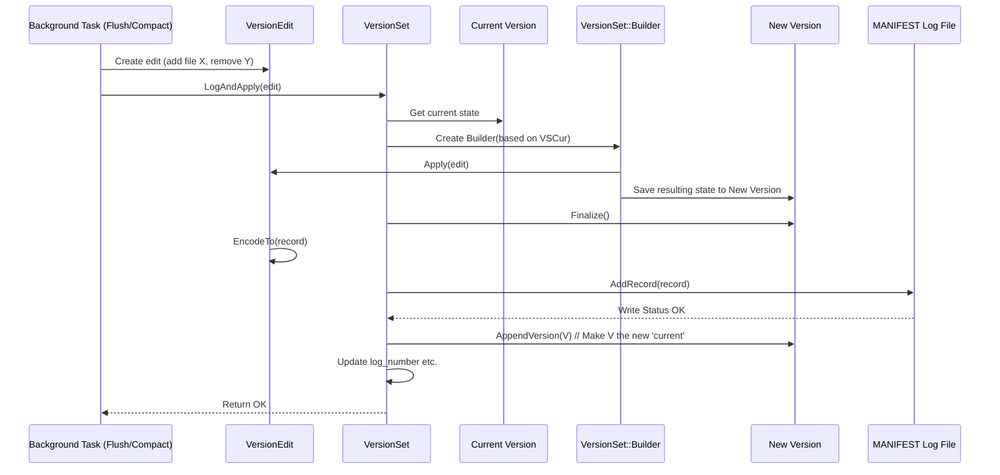

# Chapter 6: Version & VersionSet - The Database Catalog

In the previous chapter, [Chapter 5: WriteBatch](05_writebatch.md), we learned how LevelDB groups multiple `Put` and `Delete` operations together to apply them atomically and efficiently. We saw that writes go first to the [Write-Ahead Log (WAL)](03_write_ahead_log__wal____logwriter_logreader.md) for durability, and then to the in-memory [MemTable](02_memtable.md).

Eventually, the MemTable gets full and is flushed to an [SSTable](01_table___sstable___tablecache.md) file on disk. Over time, LevelDB also runs compactions, which read data from existing SSTables and write new ones, deleting the old ones afterwards. This means the set of SSTable files that represent the database's current state is constantly changing!

## What's the Problem? Tracking a Changing Set of Files

Imagine our library again. Books (SSTables) are constantly being added (from MemTable flushes), removed (after compaction), and sometimes even moved between sections (levels during compaction). How does the librarian know *which* books are currently part of the official collection and where they are located? If a reader asks for information, the librarian can't just guess which books to look in – they need an accurate, up-to-date catalog.

Similarly, LevelDB needs a system to track:

1.  Which SSTable files exist and are currently "live" (contain valid data)?
2.  Which "level" each live SSTable file belongs to? (Levels are important for compaction, see [Chapter 8: Compaction](08_compaction.md)).
3.  What's the overall state of the database, like the next available file number or the sequence number of the last operation?
4.  How can reads see a consistent snapshot of the database, even while background tasks are adding and removing files?

## The Solution: Versions, VersionEdits, and the VersionSet

LevelDB uses a trio of concepts to manage this state:

1.  **Version:** Think of a `Version` object as **one specific edition of the library's catalog**. It represents a complete, consistent snapshot of the database state at a single point in time. Specifically, it contains lists of all the live SSTable files for *each* level. Once created, a `Version` object is **immutable** – it never changes, just like a printed catalog edition. Reads (`Get` operations or [Iterators](07_iterator.md)) use a specific `Version` to know which files to consult.

2.  **VersionEdit:** This is like a **list of corrections and updates** to get from one catalog edition to the next. It describes the *changes* between two versions. A `VersionEdit` might say:
    *   "Add file number 15 to Level-0." (Because a MemTable was flushed).
    *   "Remove files 8 and 9 from Level-1." (Because they were compacted).
    *   "Add file number 25 to Level-2." (The result of the compaction).
    *   "Update the next available file number to 26."
    *   "Update the last sequence number."
    These edits are small descriptions of changes. They are stored persistently in a special file called the `MANIFEST`.

3.  **VersionSet:** This is the **chief librarian** or the **cataloguing department**. It's the central manager for all database state related to the set of live files. The `VersionSet` performs several critical tasks:
    *   Keeps track of the single `current` Version (the latest catalog edition).
    *   Reads the `MANIFEST` file during startup to reconstruct the database state.
    *   Applies `VersionEdit`s to the `current` Version to create *new* `Version`s.
    *   Manages essential metadata like the `next_file_number_`, `log_number_`, and `last_sequence_`.
    *   Decides which compactions are needed ([Chapter 8: Compaction](08_compaction.md)).
    *   Manages the lifecycle of `Version` objects (using reference counting) so that old versions needed by iterators or snapshots aren't deleted prematurely.

**In short:** `VersionSet` uses `VersionEdit`s (from the `MANIFEST`) to create a sequence of immutable `Version`s, each representing the database state at a point in time. The `current` `Version` tells LevelDB which files to read from.

## How Reads Use Versions

When you perform a `Get(key)` operation, the [DBImpl](04_dbimpl.md) needs to know which SSTables to check (after checking the MemTables). It does this by consulting the `current` `Version` held by the `VersionSet`.

```c++
// --- Simplified from db/db_impl.cc Get() ---

Status DBImpl::Get(const ReadOptions& options, const Slice& key,
                   std::string* value) {
  // ... check MemTable, Immutable MemTable first ...

  // If not found in memory, check SSTables:
  else {
    MutexLock l(&mutex_); // Need lock to get current Version pointer safely
    Version* current = versions_->current(); // Ask VersionSet for current Version
    current->Ref();       // Increment ref count (important!)
    mutex_.Unlock();      // Unlock for potentially slow disk I/O

    LookupKey lkey(key, snapshot_sequence_number); // Key to search for
    Version::GetStats stats;
    // Ask the Version object to perform the lookup in its files
    Status s = current->Get(options, lkey, value, &stats);

    mutex_.Lock();        // Re-acquire lock for cleanup
    current->Unref();     // Decrement ref count
    // ... maybe trigger compaction based on stats ...
    mutex_.Unlock();
    return s;
  }
  // ...
}
```

The key step is `versions_->current()->Get(...)`. The `DBImpl` asks the `VersionSet` (`versions_`) for the pointer to the `current` `Version`. It then calls the `Get` method *on that `Version` object*.

How does `Version::Get` work?

```c++
// --- Simplified from db/version_set.cc ---

Status Version::Get(const ReadOptions& options, const LookupKey& k,
                    std::string* value, GetStats* stats) {
  Slice ikey = k.internal_key();
  Slice user_key = k.user_key();

  // We search level-by-level
  for (int level = 0; level < config::kNumLevels; level++) {
    const std::vector<FileMetaData*>& files = files_[level]; // Get list for this level
    if (files.empty()) continue; // Skip empty levels

    if (level == 0) {
      // Level-0 files might overlap, search newest-first
      std::vector<FileMetaData*> tmp;
      // Find potentially overlapping files in level 0
      // ... logic to find relevant files ...
      // Sort them newest-first
      std::sort(tmp.begin(), tmp.end(), NewestFirst);
      // Search each relevant file
      for (uint32_t i = 0; i < tmp.size(); i++) {
        FileMetaData* f = tmp[i];
        // Use TableCache to search the actual SSTable file
        Status s = vset_->table_cache_->Get(options, f->number, f->file_size,
                                           ikey, /* saver state */, SaveValue);
        // ... check if found/deleted/error and update stats ...
        if (/* found or deleted */) return s;
      }
    } else {
      // Levels > 0 files are sorted and non-overlapping
      // Binary search to find the single file that might contain the key
      uint32_t index = FindFile(vset_->icmp_, files, ikey);
      if (index < files.size()) {
        FileMetaData* f = files[index];
        // Check if user_key is within the file's range
        if (/* user_key is within f->smallest/f->largest range */) {
          // Use TableCache to search the actual SSTable file
          Status s = vset_->table_cache_->Get(options, f->number, f->file_size,
                                             ikey, /* saver state */, SaveValue);
          // ... check if found/deleted/error and update stats ...
          if (/* found or deleted */) return s;
        }
      }
    }
  } // End loop over levels

  return Status::NotFound(Slice()); // Key not found in any SSTable
}
```

**Explanation:**

1.  The `Version` object has arrays (`files_[level]`) storing `FileMetaData` pointers for each level. `FileMetaData` contains the file number, size, and smallest/largest keys for an SSTable.
2.  It iterates through the levels.
3.  **Level 0:** Files might overlap, so it finds all potentially relevant files, sorts them newest-first (by file number), and checks each one using the [Table / SSTable & TableCache](01_table___sstable___tablecache.md).
4.  **Levels > 0:** Files are sorted and non-overlapping. It performs a binary search (`FindFile`) to quickly locate the *single* file that *might* contain the key. It checks that file's key range and then searches it using the `TableCache`.
5.  The search stops as soon as the key is found (either a value or a deletion marker) in any file. If it searches all relevant files in all levels without finding the key, it returns `NotFound`.

The `Version` object acts as the map, guiding the search to the correct SSTable files.

## How State Changes: Applying VersionEdits

The database state doesn't stand still. MemTables are flushed, compactions happen. How does the `VersionSet` update the state? By applying `VersionEdit`s.

When a background task (like flushing the immutable MemTable or running a compaction) finishes, it creates a `VersionEdit` describing the changes it made (e.g., "add file X, remove file Y"). It then asks the `VersionSet` to apply this edit.

The core logic is in `VersionSet::LogAndApply`:

```c++
// --- Simplified from db/version_set.cc ---

Status VersionSet::LogAndApply(VersionEdit* edit, port::Mutex* mu) {
  // 1. Fill in metadata in the edit (log number, sequence number etc.)
  // ... set edit->log_number_, edit->last_sequence_, etc. ...

  // 2. Create a new Version based on the current one + the edit
  Version* v = new Version(this);
  {
    Builder builder(this, current_); // Builder starts with 'current_' state
    builder.Apply(edit);             // Apply the changes described by 'edit'
    builder.SaveTo(v);               // Save the resulting state into 'v'
  }
  Finalize(v); // Calculate compaction score/level for the new version

  // 3. Write the edit to the MANIFEST file (for persistence)
  std::string record;
  edit->EncodeTo(&record); // Serialize the VersionEdit

  // Unlock mutex while writing to disk (can be slow)
  mu->Unlock();
  Status s = descriptor_log_->AddRecord(record); // Append edit to MANIFEST log
  if (s.ok()) {
    s = descriptor_file_->Sync(); // Ensure MANIFEST write is durable
  }
  // ... handle MANIFEST write errors ...
  mu->Lock(); // Re-lock mutex

  // 4. Install the new version as the 'current' one
  if (s.ok()) {
    AppendVersion(v); // Make 'v' the new current_ version
    // Update VersionSet's metadata based on the edit
    log_number_ = edit->log_number_;
    prev_log_number_ = edit->prev_log_number_;
  } else {
    delete v; // Discard the new version if MANIFEST write failed
  }

  return s;
}
```

**Explanation:**

1.  **Prepare Edit:** Fills in missing metadata fields in the `VersionEdit` (like the current log number and last sequence number).
2.  **Build New Version:** Creates a temporary `Builder` object, initialized with the state of the `current_` version. It applies the changes from the `edit` to this builder and then saves the resulting state into a completely *new* `Version` object (`v`).
3.  **Log to MANIFEST:** Serializes the `VersionEdit` into a string (`record`) and appends it to the `MANIFEST` log file (`descriptor_log_`). This step makes the state change persistent. If the database crashes and restarts, it can replay the `MANIFEST` file to recover the state.
4.  **Install New Version:** If the `MANIFEST` write succeeds, it calls `AppendVersion(v)`. This crucial step updates the `current_` pointer in the `VersionSet` to point to the newly created `Version` `v`. Future read operations will now use this new version. It also updates the `VersionSet`'s own metadata (like `log_number_`).

This process ensures that the database state transitions atomically: a new `Version` only becomes `current` *after* the changes it represents have been safely recorded in the `MANIFEST`.



## Version Lifecycle and Snapshots

Why keep old `Version` objects around if we have a `current` one? Because ongoing read operations or snapshots might still need them!

*   **Reference Counting:** Each `Version` has a reference count (`refs_`). When `DBImpl::Get` uses a version, it calls `Ref()` (increment count) before starting the lookup and `Unref()` (decrement count) when finished.
*   **Snapshots:** When you request a snapshot (`db->GetSnapshot()`), LevelDB essentially gives you a pointer to the `current` `Version` at that moment and increments its reference count. As long as you hold onto that snapshot, the corresponding `Version` object (and the SSTable files it refers to) won't be deleted, even if the `current` version advances due to subsequent writes and compactions. This provides a consistent point-in-time view of the data.
*   **Cleanup:** When a `Version`'s reference count drops to zero (meaning no reads or snapshots are using it anymore), it can be safely deleted. The `VersionSet` also keeps track of which underlying SSTable files are no longer referenced by *any* active `Version` and can trigger their deletion from disk ([DBImpl::RemoveObsoleteFiles](04_dbimpl.md)).

## The MANIFEST File

The `MANIFEST` file is crucial for durability. It's a log file (like the [WAL](03_write_ahead_log__wal____logwriter_logreader.md), but for metadata changes) that stores the sequence of `VersionEdit` records.

When LevelDB starts (`DB::Open`), the `VersionSet::Recover` method reads the `MANIFEST` file from beginning to end. It starts with an empty initial state and applies each `VersionEdit` it reads, step-by-step, rebuilding the database's file state in memory. This ensures that LevelDB knows exactly which SSTable files were live when it last shut down (or crashed).

Occasionally, the `MANIFEST` file can grow large. LevelDB might then write a *snapshot* of the entire current state (all files in all levels) as a single large record into a *new* `MANIFEST` file and then switch subsequent edits to that new file. This prevents the recovery process from becoming too slow.

## Conclusion

`Version`, `VersionEdit`, and `VersionSet` form the core cataloguing system of LevelDB.

*   **Version:** An immutable snapshot of which SSTable files exist at each level. Used by reads to find data.
*   **VersionEdit:** A description of changes (files added/deleted, metadata updated) between versions. Persisted in the `MANIFEST` log.
*   **VersionSet:** Manages the `current` Version, applies edits to create new versions, handles recovery from the `MANIFEST`, and manages metadata like file numbers and sequence numbers.

Together, they allow LevelDB to manage a constantly changing set of files on disk while providing consistent views for read operations and ensuring the database state can be recovered after a restart.

Now that we understand how LevelDB finds data (checking MemTables, then using the current `Version` to check SSTables via the `TableCache`), how does it provide a way to *scan* through data, not just get single keys?

Next up: [Chapter 7: Iterator](07_iterator.md)

---

Generated by [AI Codebase Knowledge Builder](https://github.com/The-Pocket/Tutorial-Codebase-Knowledge)