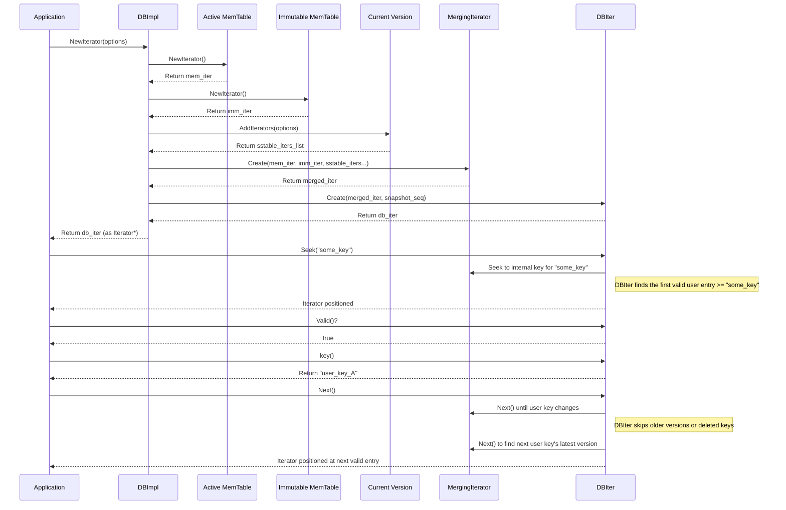

# Chapter 7: Iterator - Your Guide Through the Database

Welcome back! In [Chapter 6: Version & VersionSet](06_version___versionset.md), we learned how LevelDB keeps track of all the live SSTable files using `Version` objects and the `VersionSet`. This catalog helps LevelDB efficiently find a single key by looking first in the [MemTable](02_memtable.md) and then pinpointing the right [SSTables](01_table___sstable___tablecache.md) to check.

But what if you don't want just *one* key? What if you want to see *all* the key-value pairs in the database, or all the keys within a specific range?

## What's the Problem? Scanning Multiple Keys

Imagine you have a database storing user scores, with keys like `score:userA`, `score:userB`, `score:userC`, etc. How would you find all the users whose usernames start with 'user'? Or how would you list all scores from highest to lowest?

Calling `db->Get()` repeatedly for every possible key isn't practical or efficient. We need a way to easily **scan** or **traverse** through the key-value pairs stored in the database, in sorted order.

Furthermore, this scan needs to be smart. It has to combine the data from the current MemTable (the fast notepad), potentially an older immutable MemTable, and all the different SSTable files on disk. It also needs to correctly handle situations where a key was updated or deleted – showing you only the *latest* live version of the data, just like `Get` does.

## Iterator: Your Database Research Assistant

LevelDB provides the `Iterator` concept to solve this. Think of an `Iterator` as a **super-smart research assistant**.

You tell the assistant what you're looking for (e.g., "start from the beginning" or "find keys starting with 'user'"). The assistant then efficiently looks through the current notepad (`MemTable`), the previous notepad (`imm_`), and all the relevant books on the shelves (`SSTables`), using the latest catalog (`Version`).

As the assistant finds relevant entries, it presents them to you one by one, in perfect sorted order by key. Crucially, the assistant knows how to:

1.  **Merge Sources:** Combine results from memory (MemTable) and disk (SSTables) seamlessly.
2.  **Handle Versions:** If the same key exists in multiple places (e.g., an old value in an SSTable and a newer value in the MemTable), the assistant only shows you the *most recent* one based on the database's internal sequence numbers.
3.  **Handle Deletions:** If a key has been deleted, the assistant knows to *skip* it entirely, even if older versions of the key exist in SSTables.
4.  **Provide a Snapshot:** An iterator typically operates on a consistent snapshot of the database. Data added *after* the iterator was created won't suddenly appear during your scan.

The main iterator you interact with, obtained via `db->NewIterator()`, is often implemented internally by a class called `DBIter`. `DBIter` coordinates the work of lower-level iterators.

## How to Use an Iterator

Using an iterator is quite straightforward. Here's a typical pattern:

```c++
#include "leveldb/db.h"
#include "leveldb/iterator.h"
#include <iostream>

// ... assume db is an open LevelDB database ...

// 1. Create an iterator
leveldb::ReadOptions options;
// options.snapshot = db->GetSnapshot(); // Optional: Use a specific snapshot
leveldb::Iterator* it = db->NewIterator(options);

// 2. Position the iterator (e.g., seek to the first key >= "start_key")
std::string start_key = "user:";
it->Seek(start_key);

// 3. Loop through the keys
std::cout << "Keys starting with '" << start_key << "':" << std::endl;
for (; it->Valid(); it->Next()) {
  leveldb::Slice key = it->key();
  leveldb::Slice value = it->value();

  // Optional: Stop if we go past the desired range
  if (!key.starts_with(start_key)) {
     break;
  }

  std::cout << key.ToString() << " => " << value.ToString() << std::endl;
}

// 4. Check for errors (optional but recommended)
if (!it->status().ok()) {
  std::cerr << "Iterator error: " << it->status().ToString() << std::endl;
}

// 5. Clean up the iterator and snapshot (if used)
delete it;
// if (options.snapshot != nullptr) {
//   db->ReleaseSnapshot(options.snapshot);
// }
```

**Explanation:**

1.  **`db->NewIterator(options)`:** You ask the database for a new iterator. You can pass `ReadOptions`, optionally including a specific snapshot you obtained earlier using `db->GetSnapshot()`. If you don't provide a snapshot, the iterator uses an implicit snapshot of the database state at the time of creation.
2.  **Positioning:**
    *   `it->Seek(slice)`: Moves the iterator to the first key-value pair whose key is greater than or equal to the `slice`.
    *   `it->SeekToFirst()`: Moves to the very first key-value pair in the database.
    *   `it->SeekToLast()`: Moves to the very last key-value pair.
3.  **Looping:**
    *   `it->Valid()`: Returns `true` if the iterator is currently pointing to a valid key-value pair, `false` otherwise (e.g., if you've reached the end).
    *   `it->Next()`: Moves the iterator to the next key-value pair in sorted order.
    *   `it->Prev()`: Moves to the previous key-value pair (less common, but supported).
    *   `it->key()`: Returns a `Slice` representing the current key.
    *   `it->value()`: Returns a `Slice` representing the current value. **Important:** The `Slice`s returned by `key()` and `value()` are only valid until the next call that modifies the iterator (`Next`, `Prev`, `Seek`, etc.). If you need to keep the data longer, make a copy (e.g., `key.ToString()`).
4.  **`it->status()`:** After the loop, check this to see if any errors occurred during iteration (e.g., disk corruption).
5.  **`delete it;`:** Crucially, you **must** delete the iterator when you're done with it to free up resources. If you used an explicit snapshot, release it too.

This simple interface lets you scan through potentially vast amounts of data spread across memory and disk files without needing to know the complex details of where each piece resides.

## Under the Hood: Merging and Filtering

How does the iterator provide this unified, sorted view? It doesn't load everything into memory! Instead, it uses a clever strategy involving **merging** and **filtering**.

1.  **Gather Internal Iterators:** When you call `db->NewIterator()`, the `DBImpl` asks for iterators from all the relevant sources, based on the current [Version](06_version___versionset.md):
    *   An iterator for the active `MemTable`.
    *   An iterator for the immutable `imm_` (if it exists).
    *   Iterators for all the files in Level-0.
    *   A special "concatenating" iterator for Level-1 (which opens SSTable files lazily as needed).
    *   Similar concatenating iterators for Level-2, Level-3, etc.

2.  **Create MergingIterator:** These individual iterators are then passed to a `MergingIterator`. The `MergingIterator` acts like a zipper, taking multiple sorted streams and producing a single output stream that is also sorted. It keeps track of the current position in each input iterator and always yields the smallest key currently available across all inputs.

3.  **Wrap with DBIter:** The `MergingIterator` produces *internal* keys (with sequence numbers and types). This merged stream is then wrapped by the `DBIter`. `DBIter` is the "research assistant" we talked about. It reads the stream from the `MergingIterator` and performs the final filtering:
    *   It compares the sequence number of each internal key with the iterator's snapshot sequence number. Keys newer than the snapshot are ignored.
    *   It keeps track of the current user key. If it sees multiple versions of the same user key, it only considers the one with the highest sequence number (that's still <= the snapshot sequence).
    *   If the most recent entry for a user key is a deletion marker (`kTypeDeletion`), it skips that key entirely.
    *   Only when it finds a valid, non-deleted key (`kTypeValue`) with the highest sequence number for that user key (within the snapshot) does it make that key/value available via `it->key()` and `it->value()`.

**Sequence Diagram:**



## Code Dive: `DBImpl::NewIterator` and `DBIter`

Let's look at how this is initiated in the code.

**1. Creating the Iterator (`db_impl.cc`)**

When you call `db->NewIterator(options)`, it eventually calls `DBImpl::NewIterator`:

```c++
// --- File: db/db_impl.cc ---

Iterator* DBImpl::NewIterator(const ReadOptions& options) {
  SequenceNumber latest_snapshot;
  uint32_t seed; // Used for read sampling randomization

  // (1) Create the internal merging iterator
  Iterator* internal_iter = NewInternalIterator(options, &latest_snapshot, &seed);

  // (2) Determine the sequence number for the snapshot
  SequenceNumber snapshot_seq =
      (options.snapshot != nullptr
           ? static_cast<const SnapshotImpl*>(options.snapshot)
                 ->sequence_number()
           : latest_snapshot);

  // (3) Wrap the internal iterator with DBIter
  return NewDBIterator(this, // Pass DBImpl pointer for read sampling
                       user_comparator(),
                       internal_iter,
                       snapshot_seq,
                       seed);
}
```

**Explanation:**

1.  `NewInternalIterator`: This helper function (we'll glance at it next) creates the `MergingIterator` that combines MemTables and SSTables.
2.  `snapshot_seq`: It figures out which sequence number to use. If the user provided an explicit `options.snapshot`, it uses that snapshot's sequence number. Otherwise, it uses the latest sequence number in the database when the iterator was created (`latest_snapshot`).
3.  `NewDBIterator`: This function (defined in `db_iter.cc`) creates the `DBIter` object, passing it the underlying `internal_iter` and the `snapshot_seq` to use for filtering.

**2. Creating the Internal Iterator (`db_impl.cc`)**

The `NewInternalIterator` gathers all the source iterators:

```c++
// --- File: db/db_impl.cc ---

Iterator* DBImpl::NewInternalIterator(const ReadOptions& options,
                                      SequenceNumber* latest_snapshot,
                                      uint32_t* seed) {
  mutex_.Lock(); // Need lock to access shared state (mem_, imm_, versions_)
  *latest_snapshot = versions_->LastSequence();
  *seed = ++seed_; // For random sampling

  // Collect together all needed child iterators
  std::vector<Iterator*> list;
  // Add iterator for active MemTable
  list.push_back(mem_->NewIterator());
  mem_->Ref(); // Manage lifetime with ref counting

  // Add iterator for immutable MemTable (if it exists)
  if (imm_ != nullptr) {
    list.push_back(imm_->NewIterator());
    imm_->Ref();
  }

  // Add iterators for all SSTable files in the current Version
  versions_->current()->AddIterators(options, &list);
  versions_->current()->Ref();

  // Create the MergingIterator
  Iterator* internal_iter =
      NewMergingIterator(&internal_comparator_, &list[0], list.size());

  // Register cleanup function to Unref MemTables/Version when iterator is deleted
  IterState* cleanup = new IterState(&mutex_, mem_, imm_, versions_->current());
  internal_iter->RegisterCleanup(CleanupIteratorState, cleanup, nullptr);

  mutex_.Unlock();
  return internal_iter;
}
```

**Explanation:**

1.  It locks the database mutex to safely access the current MemTables (`mem_`, `imm_`) and the current `Version`.
2.  It creates iterators for `mem_` and `imm_` using their `NewIterator()` methods ([MemTable](02_memtable.md) uses a SkipList iterator).
3.  It calls `versions_->current()->AddIterators(...)`. This method (in `version_set.cc`) adds iterators for Level-0 files and the special concatenating iterators for Levels 1+ to the `list`. See [Version & VersionSet](06_version___versionset.md).
4.  `NewMergingIterator` creates the iterator that merges all sources in `list`.
5.  `RegisterCleanup` ensures that the MemTables and Version are properly `Unref`'d when the iterator is eventually deleted.
6.  It returns the `MergingIterator`.

**3. `DBIter` Filtering Logic (`db_iter.cc`)**

The `DBIter` class takes the `MergingIterator` and applies the filtering logic. Let's look at a simplified `Next()` method:

```c++
// --- File: db/db_iter.cc ---

void DBIter::Next() {
  assert(valid_);

  if (direction_ == kReverse) {
    // ... code to switch from moving backward to forward ...
    // Position iter_ at the first entry >= saved_key_
    // Fall through to FindNextUserEntry...
    direction_ = kForward;
  } else {
    // We are moving forward. Save the current user key so we can skip
    // all other entries for it.
    SaveKey(ExtractUserKey(iter_->key()), &saved_key_);
    // Advance the internal iterator.
    iter_->Next();
  }

  // Find the next user key entry that is visible at our sequence number.
  FindNextUserEntry(true, &saved_key_);
}

// Find the next entry for a different user key, skipping deleted
// or older versions of the key in 'skip'.
void DBIter::FindNextUserEntry(bool skipping, std::string* skip) {
  // Loop until we hit an acceptable entry
  assert(iter_->Valid() || !valid_); // iter_ might be invalid if Next() moved past end
  assert(direction_ == kForward);

  do {
    if (!iter_->Valid()) { // Reached end of internal iterator
        valid_ = false;
        return;
    }

    ParsedInternalKey ikey;
    // Parse the internal key (key, sequence, type)
    if (ParseKey(&ikey)) {
      // Check if the sequence number is visible in our snapshot
      if (ikey.sequence <= sequence_) {
        // Check the type (Put or Deletion)
        switch (ikey.type) {
          case kTypeDeletion:
            // This key is deleted. Save the user key so we skip
            // any older versions of it we might encounter later.
            SaveKey(ikey.user_key, skip);
            skipping = true; // Ensure we skip older versions
            break;
          case kTypeValue:
            // This is a potential result (a Put operation).
            // Is it for the user key we are trying to skip?
            if (skipping &&
                user_comparator_->Compare(ikey.user_key, *skip) <= 0) {
              // Yes, it's hidden by a newer deletion or is an older version
              // of the key we just yielded. Skip it.
            } else {
              // Found a valid entry!
              valid_ = true;
              // Clear skip key since we found a new valid key
              // saved_key_.clear(); // Done in Next() or Seek()
              return; // Exit the loop, iterator is now positioned correctly.
            }
            break;
        }
      }
    } else {
      // Corrupted key, mark iterator as invalid
      valid_ = false;
      status_ = Status::Corruption("corrupted internal key in DBIter");
      return;
    }

    // Current internal key was skipped (too new, deleted, hidden), move to next.
    iter_->Next();
  } while (true); // Loop until we return or reach the end
}

```

**Explanation:**

*   The `Next()` method first handles switching direction if needed. If moving forward, it saves the current user key (`saved_key_`) so it can skip other entries for the same key. It then advances the underlying `iter_` (the `MergingIterator`).
*   `FindNextUserEntry` is the core loop. It repeatedly gets the next entry from `iter_`.
*   `ParseKey(&ikey)` decodes the internal key, sequence number, and type.
*   It checks if `ikey.sequence <= sequence_` (the iterator's snapshot sequence number). If the entry is too new, it's skipped.
*   If it's a `kTypeDeletion`, the user key is saved in `skip`, and the `skipping` flag is set to true. Any older entries for this `user_key` will be ignored.
*   If it's a `kTypeValue`:
    *   It checks if `skipping` is true and if the current `ikey.user_key` is less than or equal to the key in `skip`. If so, it means this entry is hidden by a newer deletion or is an older version of a key we just processed, so it's skipped.
    *   Otherwise, this is the newest, visible version of this user key! The loop terminates, `valid_` is set to true, and the `DBIter` is now positioned at this entry.
*   If the current entry from `iter_` was skipped for any reason, the loop continues by calling `iter_->Next()`.

This careful dance ensures that `DBIter` only exposes the correct, latest, non-deleted user key/value pairs according to the snapshot sequence number, while efficiently merging data from all underlying sources.

## Conclusion

LevelDB's `Iterator` provides a powerful and convenient way to scan through key-value pairs. It acts like a smart assistant, giving you a unified, sorted view across data stored in the `MemTable` and numerous `SSTable` files.

Under the hood, it uses a `MergingIterator` to combine multiple sorted sources and the `DBIter` wrapper to filter out deleted entries and older versions based on sequence numbers and the requested snapshot.

This ability to efficiently scan sorted data is not just useful for application queries, but it's also fundamental to how LevelDB maintains itself. How does LevelDB merge old SSTables and incorporate data flushed from the MemTable to keep the database structure efficient? It uses these very same iterator concepts!

Next up: [Chapter 8: Compaction](08_compaction.md)

---

Generated by [AI Codebase Knowledge Builder](https://github.com/The-Pocket/Tutorial-Codebase-Knowledge)