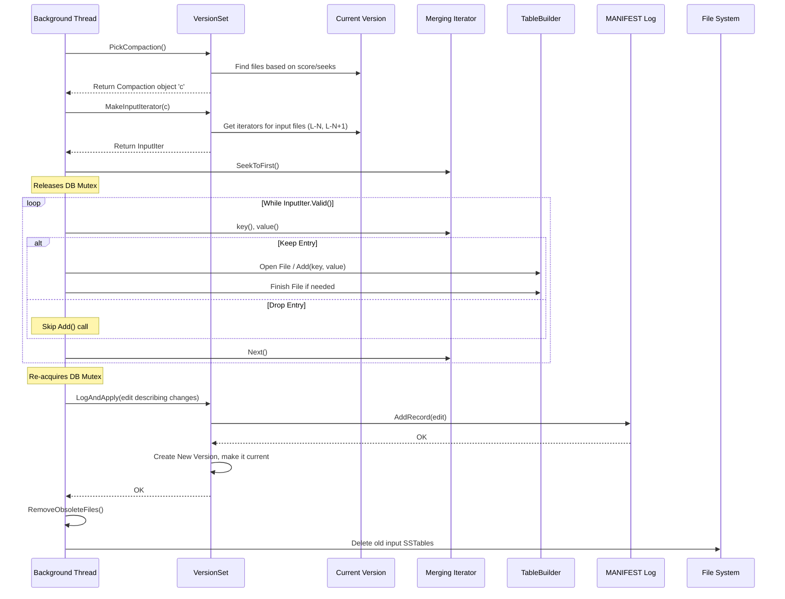

# Chapter 8: Compaction - Keeping the Library Tidy

In [Chapter 7: Iterator](07_iterator.md), we saw how LevelDB provides iterators to give us a unified, sorted view of our data, cleverly merging information from the in-memory [MemTable](02_memtable.md) and the various [SSTable](01_table___sstable___tablecache.md) files on disk.

This works great, but think about what happens over time. Every time a MemTable fills up, it gets flushed to a *new* SSTable file in Level-0. If you have lots of writes, you'll quickly accumulate many small files in Level-0. Also, when you update or delete a key, LevelDB doesn't modify old SSTables; it just writes a *new* entry (a new value or a deletion marker) in a newer MemTable or SSTable. This means older files contain outdated or deleted data that's just taking up space.

## What's the Problem? A Messy, Inefficient Library

Imagine our library again. New notes and pamphlets (MemTable flushes) keep arriving and get dumped in a temporary pile (Level-0). Meanwhile, older books on the main shelves (higher levels) contain crossed-out paragraphs (deleted data) or outdated information (overwritten data).

This leads to several problems:

1.  **Slow Reads:** To find a specific piece of information, the librarian might have to check *many* different pamphlets in the temporary pile (Level-0) before even getting to the main shelves. Reading from many files is slow.
2.  **Wasted Space:** The library shelves are cluttered with books containing crossed-out sections or old editions that are no longer needed. This wastes valuable shelf space.
3.  **Growing Number of Files:** The temporary pile (Level-0) just keeps growing, making it harder and harder to manage.

We need a process to periodically tidy up this library, organize the temporary pile into the main shelves, and remove the outdated information.

## Compaction: The Background Tidy-Up Crew

**Compaction** is LevelDB's background process that solves these problems. It's like the library staff who work quietly behind the scenes to keep the library organized and efficient.

Here's what compaction does:

1.  **Selects Files:** It picks one or more SSTable files from a specific level (let's say Level-N). Often, this starts with files in Level-0.
2.  **Finds Overlapping Files:** It identifies the files in the *next* level (Level-N+1) whose key ranges overlap with the selected files from Level-N.
3.  **Merges and Filters:** It reads the key-value pairs from *all* these selected files (from both Level-N and Level-N+1) using iterators, much like the merging process we saw in [Chapter 7: Iterator](07_iterator.md). As it merges, it performs crucial filtering:
    *   It keeps only the *latest* version of each key (based on sequence numbers).
    *   It completely discards keys that have been deleted.
    *   It discards older versions of keys that have been updated.
4.  **Writes New Files:** It writes the resulting stream of filtered, sorted key-value pairs into *new* SSTable files at Level-N+1. These new files are typically larger and contain only live data.
5.  **Updates Catalog:** It updates the database's catalog ([Version & VersionSet](06_version___versionset.md)) to reflect the changes: the old input files (from Level-N and Level-N+1) are marked for deletion, and the new output files (in Level-N+1) are added.
6.  **Deletes Old Files:** Finally, the old, now-obsolete input SSTable files are deleted from the disk.

**Analogy:** The library staff takes a batch of pamphlets from the temporary pile (Level-0) and finds the corresponding books on the main shelves (Level-1). They go through both, creating a new, clean edition of the book (new Level-1 SSTable) that incorporates the new information from the pamphlets, removes any crossed-out entries, and keeps only the latest version of each topic. Then, they discard the original pamphlets and the old version of the book.

This process happens continuously in the background, keeping the database structure efficient.

## Triggering Compaction: When to Tidy Up?

How does LevelDB decide when to run a compaction? The [DBImpl](04_dbimpl.md) checks if compaction is needed after writes or reads, or when background work finishes. It uses the [VersionSet](06_version___versionset.md) to determine this, primarily based on two conditions:

1.  **Size Compaction:** Each level (except Level-0) has a target size limit. If the total size of files in a level exceeds its limit, the `VersionSet` calculates a "compaction score". If the score is >= 1, a size compaction is needed. This is the most common trigger. Level-0 is special: it triggers compaction based on the *number* of files, not their total size, because too many files there significantly slows down reads.
    *   `config::kL0_CompactionTrigger`: Default is 4 files.
    *   Higher levels (1+): Trigger based on total bytes (`MaxBytesForLevel`).
2.  **Seek Compaction:** To avoid performance issues caused by reading very wide (many keys) but shallow (few overwrites/deletions) files repeatedly, LevelDB tracks how many times a file is "seeked" during reads. If a file receives too many seeks (`allowed_seeks` counter drops to zero), it might be chosen for compaction even if the level size limit isn't reached. This helps rewrite files that are frequently accessed, potentially merging them or breaking them up.

When `DBImpl::MaybeScheduleCompaction` detects that work is needed (and no other background work is running), it schedules the `DBImpl::BGWork` function to run on a background thread.

```c++
// --- Simplified from db/db_impl.cc ---

void DBImpl::MaybeScheduleCompaction() {
  mutex_.AssertHeld(); // Must hold lock to check/change state

  if (background_compaction_scheduled_) {
    // Already scheduled
  } else if (shutting_down_.load(std::memory_order_acquire)) {
    // DB is closing
  } else if (!bg_error_.ok()) {
    // Background error stopped activity
  } else if (imm_ == nullptr && // No MemTable flush needed AND
             manual_compaction_ == nullptr && // No manual request AND
             !versions_->NeedsCompaction()) { // <<-- VersionSet check!
    // No work to be done: VersionSet says size/seek limits are okay.
  } else {
    // Work needs to be done! Schedule it.
    background_compaction_scheduled_ = true;
    env_->Schedule(&DBImpl::BGWork, this); // Ask Env to run BGWork later
  }
}

// --- Simplified from db/version_set.h ---

// In VersionSet::NeedsCompaction()
bool NeedsCompaction() const {
  Version* v = current_;
  // Check score (size trigger) OR if a file needs compaction due to seeks
  return (v->compaction_score_ >= 1) || (v->file_to_compact_ != nullptr);
}
```

## The Compaction Process: A Closer Look

Let's break down the steps involved when a background compaction runs (specifically a major compaction between levels N and N+1):

**1. Picking the Compaction (`VersionSet::PickCompaction`)**

The first step is deciding *what* to compact. `VersionSet::PickCompaction` is responsible for this:

*   It checks if a seek-based compaction is pending (`file_to_compact_ != nullptr`). If so, it chooses that file and its level.
*   Otherwise, it looks at the `compaction_score_` and `compaction_level_` pre-calculated for the current [Version](06_version___versionset.md). If the score is >= 1, it chooses that level for a size-based compaction.
*   It creates a `Compaction` object to hold information about this task.
*   It selects an initial set of files from the chosen level (Level-N) to compact. For size compactions, it often picks the file just after the `compact_pointer_` for that level (a bookmark remembering where the last compaction ended) to ensure work spreads across the key range over time.
*   For Level-0, since files can overlap, it expands this initial set to include *all* Level-0 files that overlap with the initially chosen file(s).

```c++
// --- Simplified from db/version_set.cc ---

Compaction* VersionSet::PickCompaction() {
  Compaction* c = nullptr;
  int level;

  // Check for seek-triggered compaction first
  const bool seek_compaction = (current_->file_to_compact_ != nullptr);
  if (seek_compaction) {
    level = current_->file_to_compact_level_;
    c = new Compaction(options_, level);
    c->inputs_[0].push_back(current_->file_to_compact_); // Add the specific file
  } else {
    // Check for size-triggered compaction
    const bool size_compaction = (current_->compaction_score_ >= 1);
    if (!size_compaction) {
      return nullptr; // No compaction needed
    }
    level = current_->compaction_level_;
    c = new Compaction(options_, level);

    // Pick starting file in chosen level (often based on compact_pointer_)
    // ... logic to select initial file(s) ...
    // c->inputs_[0].push_back(chosen_file);
  }

  c->input_version_ = current_; // Remember which Version we are compacting
  c->input_version_->Ref();

  // Expand Level-0 inputs if necessary due to overlap
  if (level == 0) {
    InternalKey smallest, largest;
    GetRange(c->inputs_[0], &smallest, &largest); // Find range of initial file(s)
    // Find ALL L0 files overlapping that range
    current_->GetOverlappingInputs(0, &smallest, &largest, &c->inputs_[0]);
    assert(!c->inputs_[0].empty());
  }

  // Now figure out the overlapping files in the next level (Level+1)
  SetupOtherInputs(c);
  return c;
}
```

**2. Setting Up Inputs (`VersionSet::SetupOtherInputs`)**

Once the initial Level-N files are chosen, `SetupOtherInputs` figures out the rest:

*   It determines the smallest and largest keys covered by the Level-N input files.
*   It finds all files in Level-(N+1) that overlap this key range. These become `c->inputs_[1]`.
*   It might slightly expand the Level-N inputs if doing so allows including more Level-N files without pulling in any *additional* Level-(N+1) files (this can make compactions more efficient).
*   It finds all files in Level-(N+2) that overlap the *total* key range of the compaction. These are the "grandparents". This is important to prevent creating huge files in Level-(N+1) that would overlap too much data in Level-(N+2), making future compactions expensive.

**3. Performing the Work (`DBImpl::DoCompactionWork`)**

This is where the main merging happens. It runs on the background thread, and importantly, it **releases the main database lock** (`mutex_.Unlock()`) while doing the heavy I/O.

*   **Input Iterator:** Creates a `MergingIterator` ([Chapter 7: Iterator](07_iterator.md)) that reads from all input files (Level-N and Level-N+1) as a single sorted stream (`versions_->MakeInputIterator(compact)`).
*   **Snapshot:** Determines the oldest sequence number needed by any existing snapshot (`compact->smallest_snapshot`). Entries older than this can potentially be dropped even if not deleted.
*   **Loop:** Iterates through the `MergingIterator`:
    *   Reads the next internal key/value.
    *   **Parses Key:** Extracts user key, sequence number, and type.
    *   **Checks for Stop:** Decides if the current output file should be finished and a new one started (e.g., due to size limits or too much overlap with grandparents).
    *   **Drop Logic:** Determines if the current entry should be dropped:
        *   Is it a deletion marker for a key that has no older data in lower levels (`IsBaseLevelForKey`) and is older than the oldest snapshot? (Obsolete deletion marker).
        *   Is it an entry for a key where we've already seen a *newer* entry during this same compaction?
        *   Is it older than the `smallest_snapshot` AND we've already seen a newer entry for this key (even if that newer entry was also dropped)?
    *   **Keep Logic:** If the entry is not dropped:
        *   Opens a new output SSTable file in Level-(N+1) if one isn't already open (`OpenCompactionOutputFile`).
        *   Adds the key/value pair to the `TableBuilder` (`compact->builder->Add`).
        *   Updates the smallest/largest keys for the output file metadata.
        *   Closes the output file if it reaches the target size (`FinishCompactionOutputFile`).
    *   Moves to the next input entry (`input->Next()`).
*   **Finish:** Writes the last output file.
*   **Status:** Checks for errors from the input iterator or file writes.

```c++
// --- Highly simplified loop from db/db_impl.cc DoCompactionWork ---

// Create iterator over Level-N and Level-N+1 input files
Iterator* input = versions_->MakeInputIterator(compact->compaction);
input->SeekToFirst();

// ... Release Mutex ...

while (input->Valid() && !shutting_down_) {
  Slice key = input->key();
  Slice value = input->value();

  // Should we finish the current output file and start a new one?
  if (compact->compaction->ShouldStopBefore(key) && compact->builder != nullptr) {
    status = FinishCompactionOutputFile(compact, input);
    // ... handle status ...
  }

  // Should we drop this key/value pair?
  bool drop = false;
  if (ParseInternalKey(key, &ikey)) {
      // Logic based on ikey.sequence, ikey.type, smallest_snapshot,
      // last_sequence_for_key, IsBaseLevelForKey...
      // drop = true if this entry is deleted, shadowed, or obsolete.
  } else {
      // Corrupt key? Maybe keep it? (See actual code for details)
  }

  if (!drop) {
    // Open output file if needed
    if (compact->builder == nullptr) {
      status = OpenCompactionOutputFile(compact);
      // ... handle status ...
    }
    // Add key/value to the output file being built
    compact->builder->Add(key, value);
    // ... update output file metadata (smallest/largest key) ...

    // Close output file if it's big enough
    if (compact->builder->FileSize() >= compact->compaction->MaxOutputFileSize()) {
      status = FinishCompactionOutputFile(compact, input);
      // ... handle status ...
    }
  }

  // Advance to the next key in the merged input stream
  input->Next();
}

// ... Finish the last output file ...
// ... Check input iterator status ...
delete input;

// ... Re-acquire Mutex ...
```

**4. Installing Results (`DBImpl::InstallCompactionResults`)**

If the compaction work finished successfully:

*   A `VersionEdit` is created.
*   It records the deletion of all input files (from Level-N and Level-N+1).
*   It records the addition of all the newly created output files (in Level-N+1), including their file numbers, sizes, and key ranges.
*   `VersionSet::LogAndApply` is called to:
    *   Write the `VersionEdit` to the `MANIFEST` file.
    *   Create a new `Version` reflecting these changes.
    *   Make this new `Version` the `current` one.

**5. Cleaning Up (`DBImpl::RemoveObsoleteFiles`)**

After the new `Version` is successfully installed:

*   `DBImpl` calls `RemoveObsoleteFiles`.
*   This function gets the list of all files needed by *any* live `Version` (including those held by snapshots or iterators).
*   It compares this list with the actual files in the database directory.
*   Any file that exists on disk but is *not* in the live set (like the input files from the just-completed compaction) is deleted from the filesystem.

**Compaction Flow Diagram:**



## Conclusion

Compaction is the essential background process that keeps LevelDB performant and prevents space usage from growing indefinitely due to old data. It intelligently merges files between levels, filtering out deleted and overwritten entries while preserving a consistent view for readers.

*   It's triggered by level size or file access patterns.
*   It uses iterators to merge input files efficiently.
*   It drops obsolete data based on sequence numbers and deletion markers.
*   It writes new, clean SSTable files to the next level.
*   It atomically updates the database state using `VersionEdit`s, the `MANIFEST`, and the `VersionSet`.

Understanding compaction helps explain how LevelDB achieves good performance despite its append-only (immutable SSTable) design.

But how does LevelDB manage those sequence numbers and deletion markers internally? How does it combine a user's key with this metadata?

Next up: [Chapter 9: InternalKey & DBFormat](09_internalkey___dbformat.md)

---

Generated by [AI Codebase Knowledge Builder](https://github.com/The-Pocket/Tutorial-Codebase-Knowledge)