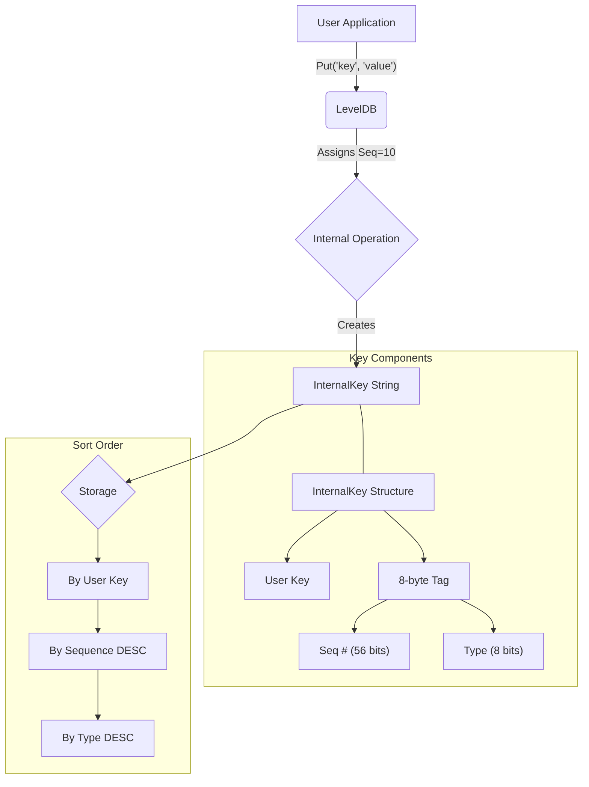

# Chapter 9: InternalKey & DBFormat - LevelDB's Internal Bookkeeping

Welcome to the final chapter of our deep dive into LevelDB's core components! In [Chapter 8: Compaction](08_compaction.md), we saw how LevelDB keeps its storage tidy by merging and rewriting [SSTables](01_table___sstable___tablecache.md) in the background. This compaction process relies heavily on being able to correctly compare different versions of the same key and discard old or deleted data.

But how does LevelDB know which version of a key is newer? If you write `("mykey", "value1")` and later `("mykey", "value2")`, how does LevelDB know that `value2` is the current one? And how does it handle `Delete("mykey")`? It can't just erase entries from immutable SSTable files.

## What's the Problem? Tracking Versions and Deletions

Imagine a simple library catalog that only lists book titles (user keys) and their shelf locations (user values).
1.  You add "Adventures of Tom Sawyer" on Shelf A. Catalog: `("Tom Sawyer", "Shelf A")`
2.  Later, you move it to Shelf B. If you just add `("Tom Sawyer", "Shelf B")`, how do you know Shelf A is wrong? The catalog now has two entries!
3.  Later still, you remove the book entirely. How do you mark this in the catalog?

Just storing the user's key and value isn't enough. LevelDB needs extra internal bookkeeping information attached to every entry to handle updates, deletions, and also [Snapshots](07_iterator.md) (reading the database as it was at a specific point in time).

## The Solution: Sequence Numbers and Value Types

LevelDB solves this by adding two extra pieces of information to every key-value pair internally:

1.  **Sequence Number:** Think of this like a **unique version number** or a **timestamp** assigned to every modification. Every time you `Put` or `Delete` data (usually as part of a [WriteBatch](05_writebatch.md)), LevelDB assigns a strictly increasing sequence number to that operation. A higher sequence number means the operation happened more recently. This number increments globally for the entire database.

2.  **Value Type:** This is a simple flag indicating whether an entry represents a **value** or a **deletion**.
    *   `kTypeValue`: Represents a regular key-value pair resulting from a `Put`.
    *   `kTypeDeletion`: Represents a "tombstone" marker indicating that a key was deleted by a `Delete` operation.

## InternalKey: The Full Story

LevelDB combines the user's key with these two extra pieces of information into a structure called an **InternalKey**.

**InternalKey = `user_key` + `sequence_number` + `value_type`**

This `InternalKey` is what LevelDB *actually* stores and sorts within the [MemTable](02_memtable.md) and [SSTables](01_table___sstable___tablecache.md). When you ask LevelDB for `Get("mykey")`, it internally searches for `InternalKey`s associated with `"mykey"` and uses the sequence numbers and value types to figure out the correct, most recent state.

## Sorting InternalKeys: The Magic Ingredient

How `InternalKey`s are sorted is crucial for LevelDB's efficiency. They are sorted based on the following rules:

1.  **User Key:** First, compare the `user_key` part using the standard comparator you configured for the database (e.g., lexicographical order). Keys `apple` come before `banana`.
2.  **Sequence Number (Descending):** If the user keys are the same, compare the `sequence_number` in **DESCENDING** order. The entry with the *highest* sequence number comes *first*.
3.  **Value Type (Descending):** If user keys and sequence numbers are the same (which shouldn't normally happen for distinct operations), compare the `value_type` in **DESCENDING** order (`kTypeValue` comes before `kTypeDeletion`).

**Why sort sequence numbers descending?** Because when LevelDB looks for a user key, it wants to find the *most recent* version first. By sorting the highest sequence number first, a simple search or iteration naturally encounters the latest state of the key immediately.

**Example:** Let's revisit our `Put`/`Put`/`Delete` example for `mykey`:
1. `Put("mykey", "v1")` -> gets Sequence = 5 -> InternalKey: `("mykey", 5, kTypeValue)`
2. `Put("mykey", "v2")` -> gets Sequence = 10 -> InternalKey: `("mykey", 10, kTypeValue)`
3. `Delete("mykey")` -> gets Sequence = 15 -> InternalKey: `("mykey", 15, kTypeDeletion)`

When these are sorted according to the rules, the order is:
1. `("mykey", 15, kTypeDeletion)` (Highest sequence)
2. `("mykey", 10, kTypeValue)`
3. `("mykey", 5, kTypeValue)` (Lowest sequence)

Now, when you call `Get("mykey")`:
*   LevelDB searches for entries matching `mykey`.
*   It finds `("mykey", 15, kTypeDeletion)` first because it sorts first.
*   It sees the `kTypeDeletion` marker and immediately knows the key is deleted, returning `NotFound` without even needing to look at the older versions (`v2` and `v1`).

**Snapshots:** Snapshots work by using a specific sequence number. If you take a snapshot at sequence 12, a `Get("mykey")` using that snapshot would ignore sequence 15. It would find `("mykey", 10, kTypeValue)` first, see it's `kTypeValue` and `sequence <= 12`, and return `"v2"`.

## The `dbformat` Module: Defining the Rules

The code that defines the `InternalKey` structure, the `ValueType` enum, sequence numbers, helper functions for manipulating them, and crucial constants is located in `dbformat.h` and `dbformat.cc`.

**1. Key Structures and Constants (`dbformat.h`)**

This header file defines the core types:

```c++
// --- File: db/dbformat.h ---

namespace leveldb {

// Value types: Deletion or Value
enum ValueType { kTypeDeletion = 0x0, kTypeValue = 0x1 };

// ValueType used for seeking. (Uses highest type value)
static const ValueType kValueTypeForSeek = kTypeValue;

// Type for sequence numbers. 56 bits available.
typedef uint64_t SequenceNumber;

// Max possible sequence number.
static const SequenceNumber kMaxSequenceNumber = ((0x1ull << 56) - 1);

// Structure to hold the parsed parts of an InternalKey
struct ParsedInternalKey {
  Slice user_key;
  SequenceNumber sequence;
  ValueType type;

  // Constructors... DebugString()...
};

// Helper class to manage the encoded string representation
class InternalKey {
 private:
  std::string rep_; // Holds the encoded key: user_key + seq/type tag
 public:
  // Constructors... DecodeFrom()... Encode()... user_key()...
  InternalKey(const Slice& user_key, SequenceNumber s, ValueType t);
};

// ... other definitions like LookupKey, InternalKeyComparator ...

} // namespace leveldb
```

**Explanation:**
*   Defines `ValueType` enum (`kTypeDeletion`, `kTypeValue`).
*   Defines `SequenceNumber` (a 64-bit integer, but only 56 bits are used, leaving 8 bits for the type).
*   `ParsedInternalKey`: A temporary struct holding the three components separately.
*   `InternalKey`: A class that usually stores the *encoded* form (as a single string) for efficiency.

**2. Encoding and Parsing (`dbformat.cc`, `dbformat.h`)**

LevelDB needs to combine the three parts (`user_key`, `sequence`, `type`) into a single `Slice` (a pointer + length, representing a string) for storage and comparison, and then parse them back out. The sequence and type are packed together into the last 8 bytes of the internal key string.

```c++
// --- File: db/dbformat.h --- (Inline functions)

// Combine sequence and type into 8 bytes (64 bits)
static uint64_t PackSequenceAndType(uint64_t seq, ValueType t) {
  // seq uses upper 56 bits, type uses lower 8 bits
  return (seq << 8) | t;
}

// Extract the user_key part from an encoded internal key
inline Slice ExtractUserKey(const Slice& internal_key) {
  assert(internal_key.size() >= 8);
  return Slice(internal_key.data(), internal_key.size() - 8); // All bytes EXCEPT the last 8
}

// --- File: db/dbformat.cc ---

// Append the encoded internal key to a string 'result'
void AppendInternalKey(std::string* result, const ParsedInternalKey& key) {
  result->append(key.user_key.data(), key.user_key.size()); // Append user key
  // Append the 8-byte packed sequence and type
  PutFixed64(result, PackSequenceAndType(key.sequence, key.type));
}

// Parse an encoded internal key 'internal_key' into 'result'
bool ParseInternalKey(const Slice& internal_key, ParsedInternalKey* result) {
  const size_t n = internal_key.size();
  if (n < 8) return false; // Must have the 8-byte trailer
  // Decode the 8-byte trailer
  uint64_t num = DecodeFixed64(internal_key.data() + n - 8);
  uint8_t c = num & 0xff; // Lower 8 bits are the type
  result->sequence = num >> 8; // Upper 56 bits are sequence
  result->type = static_cast<ValueType>(c);
  result->user_key = Slice(internal_key.data(), n - 8); // The rest is user key
  return (c <= static_cast<uint8_t>(kTypeValue)); // Basic validation
}
```

**Explanation:**
*   `PackSequenceAndType`: Shifts the sequence number left by 8 bits and combines it with the 1-byte type.
*   `AppendInternalKey`: Builds the string representation: user key bytes followed by the 8-byte packed sequence/type.
*   `ExtractUserKey`: Returns a slice pointing to the user key portion (all but the last 8 bytes).
*   `ParseInternalKey`: Does the reverse of `AppendInternalKey`, extracting the parts from the encoded slice.

**3. Comparing Internal Keys (`dbformat.cc`)**

The `InternalKeyComparator` uses the user-provided comparator for the user keys and then implements the descending sequence number logic.

```c++
// --- File: db/dbformat.cc ---

int InternalKeyComparator::Compare(const Slice& akey, const Slice& bkey) const {
  // 1. Compare user keys using the user's comparator
  int r = user_comparator_->Compare(ExtractUserKey(akey), ExtractUserKey(bkey));

  if (r == 0) {
    // User keys are equal, compare sequence numbers (descending)
    // Decode the 8-byte tag (seq+type) from the end of each key
    const uint64_t anum = DecodeFixed64(akey.data() + akey.size() - 8);
    const uint64_t bnum = DecodeFixed64(bkey.data() + bkey.size() - 8);
    // Higher sequence number should come first (negative result)
    if (anum > bnum) {
      r = -1;
    } else if (anum < bnum) {
      r = +1;
    }
    // If sequence numbers are also equal, type decides (descending,
    // but packed value comparison handles this implicitly).
  }
  return r;
}
```

**Explanation:** This function first compares user keys. If they differ, that result is returned. If they are the same, it decodes the 8-byte tag from both keys and compares them. Since a higher sequence number results in a larger packed `uint64_t` value, comparing `anum` and `bnum` directly and flipping the sign (`-1` if `anum > bnum`, `+1` if `anum < bnum`) achieves the desired descending order for sequence numbers.

**4. Seeking with LookupKey (`dbformat.h`, `dbformat.cc`)**

When you call `Seek(target_key)` on an iterator, LevelDB needs to find the internal key representing the latest version of `target_key` at or before the iterator's snapshot sequence number. Directly seeking using an internal key `(target_key, snapshot_seq, kTypeValue)` might overshoot, landing on an entry *newer* than the snapshot.

`LookupKey` creates a specially formatted key for seeking in MemTables and internal iterators.

```c++
// --- File: db/dbformat.h ---

// A helper class useful for DBImpl::Get() and Iterator::Seek()
class LookupKey {
 public:
  // Create a key for looking up user_key at snapshot 'sequence'.
  LookupKey(const Slice& user_key, SequenceNumber sequence);
  ~LookupKey();

  // Key for MemTable lookup (includes length prefix for internal key)
  Slice memtable_key() const;
  // Key for Internal Iterator lookup (user_key + seq/type tag)
  Slice internal_key() const;
  // User key part
  Slice user_key() const;

 private:
  const char* start_; // Beginning of allocated buffer
  const char* kstart_; // Beginning of user_key portion
  const char* end_;   // End of allocated buffer
  char space_[200]; // Avoid heap allocation for short keys
};

// --- File: db/dbformat.cc --- (Simplified Constructor Logic)

LookupKey::LookupKey(const Slice& user_key, SequenceNumber s) {
  size_t usize = user_key.size();
  // Need space for: internal key length, user key, 8-byte tag
  size_t needed = VarintLength(usize + 8) + usize + 8;
  char* dst = /* ... allocate space_ or new char[] ... */ ;

  start_ = dst;
  // Encode length of internal key (user_key size + 8)
  dst = EncodeVarint32(dst, usize + 8);
  kstart_ = dst; // Mark start of internal key part
  // Copy user key data
  std::memcpy(dst, user_key.data(), usize);
  dst += usize;
  // Encode the 8-byte tag: Use the target sequence 's' BUT use
  // kValueTypeForSeek (which is kTypeValue, the highest type value).
  EncodeFixed64(dst, PackSequenceAndType(s, kValueTypeForSeek));
  dst += 8;
  end_ = dst; // Mark end of buffer
}
```

**Explanation:**
*   A `LookupKey` bundles the `user_key` with the target `sequence` number.
*   Critically, when creating the 8-byte tag, it uses `kValueTypeForSeek`. Because internal keys are sorted by user key, then *descending* sequence, then *descending* type, seeking for `(user_key, sequence, kValueTypeForSeek)` ensures we find the *first* entry whose user key matches and whose sequence number is less than or equal to the target `sequence`. This correctly handles the descending sort order during seeks.

**5. Configuration Constants (`dbformat.h`)**

`dbformat.h` also defines key constants that control LevelDB's behavior, especially related to compaction triggers:

```c++
// --- File: db/dbformat.h ---

namespace config {
static const int kNumLevels = 7; // Number of levels in the LSM tree

// Level-0 compaction is started when we hit this many files.
static const int kL0_CompactionTrigger = 4;

// Soft limit on number of level-0 files. We slow down writes at this point.
static const int kL0_SlowdownWritesTrigger = 8;

// Maximum number of level-0 files. We stop writes at this point.
static const int kL0_StopWritesTrigger = 12;

// Maximum level to push a new memtable compaction to if it doesn't overlap.
static const int kMaxMemCompactLevel = 2;
// ... other constants ...
} // namespace config
```

**Explanation:** These constants define parameters like the number of levels and the file count thresholds in Level-0 that trigger compactions or slow down/stop writes. They are part of the database "format" because changing them affects performance and behavior.

**Internal Key Structure Diagram**



## Conclusion

LevelDB doesn't just store your raw keys and values. It enhances them internally by adding a **sequence number** (like a version timestamp) and a **value type** (Value or Deletion). This combined structure, the **InternalKey**, is what LevelDB actually sorts and stores in its MemTables and SSTables.

The specific way InternalKeys are sorted (user key ascending, sequence number descending) is critical for efficiently finding the latest version of a key and handling deletions and snapshots correctly. The `dbformat` module (`dbformat.h`, `dbformat.cc`) defines these internal structures, their encoding/decoding rules, the comparison logic (`InternalKeyComparator`), the special `LookupKey` for seeks, and other important constants related to the database's structure and behavior.

Understanding `InternalKey` and `dbformat` reveals the clever bookkeeping that allows LevelDB's Log-Structured Merge-Tree design to function correctly and efficiently. This chapter concludes our tour of the fundamental building blocks of LevelDB!

---

Generated by [AI Codebase Knowledge Builder](https://github.com/The-Pocket/Tutorial-Codebase-Knowledge)
