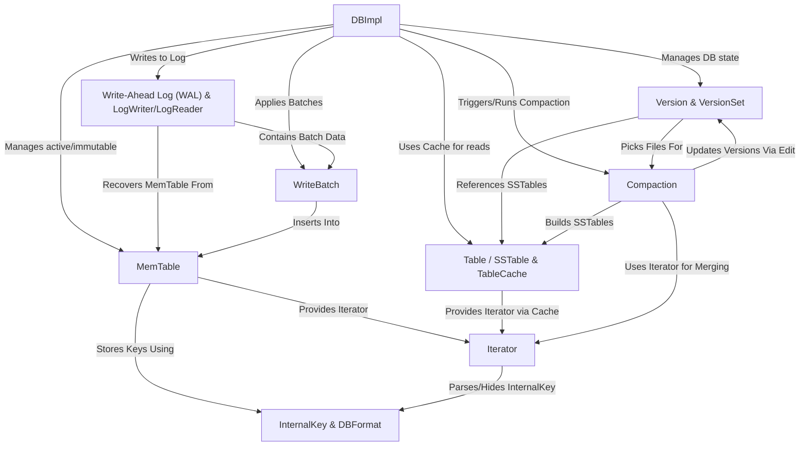

# Tutorial: LevelDB

> This tutorial is AI-generated! To learn more, check out [AI Codebase Knowledge Builder](https://github.com/The-Pocket/Tutorial-Codebase-Knowledge)

LevelDB[View Repo](https://github.com/google/leveldb/tree/main/db) is a fast *key-value storage library* written at Google.
Think of it like a simple database where you store pieces of data (values) associated with unique names (keys).
It's designed to be **very fast** for both writing new data and reading existing data, and it reliably stores everything on **disk**.
It uses a *log-structured merge-tree (LSM-tree)* design to achieve high write performance and manages data in sorted files (*SSTables*) across different levels for efficient reads and space management.

