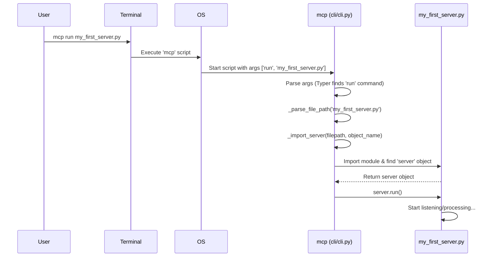

# Chapter 1: Your Control Panel - The `mcp` Command-Line Interface

Welcome to the MCP Python SDK! This is your starting point for building powerful, interactive AI tools.

Imagine you've just built an amazing new tool using the SDK – maybe a helpful assistant that can answer questions about your documents. How do you actually *run* this tool? How do you test it? How do you connect it to applications like Claude Desktop?

This is where the `mcp` command-line interface (CLI) comes in. Think of it as your **developer control panel** or **toolkit** for managing your MCP creations right from your terminal (that black window where you type commands). It helps you run, test, and integrate your MCP servers.

In this chapter, we'll explore the basic commands you'll use most often. Our main goal is to learn how to take a simple server written in a Python file and get it running.

## What is the `mcp` Command?

The `mcp` command is a tool you run in your terminal. After installing the `MCP Python SDK` (specifically with the `cli` extras, like `pip install mcp[cli]`), you gain access to this command. It provides several sub-commands to help you manage your MCP development workflow.

Let's look at the most important ones.

### Checking Your Setup: `mcp version`

First things first, let's make sure everything is installed correctly. You can check the installed version of the MCP SDK using this command:

```bash
mcp version
```

**What happens?**

This command looks up the installed `mcp` package and prints its version number.

**Example Output:**

```
MCP version 0.1.0
```

If you see a version number, you're good to go! If you get an error, double-check that you've installed the SDK correctly (`pip install mcp[cli]`).

### Running Your Server: `mcp run`

This is the command you'll use to execute your MCP server directly. Let's say you have a Python file named `my_first_server.py` that contains your server code.

**Minimal Server Example (`my_first_server.py`):**

```python
# We'll learn about FastMCP in the next chapter!
# For now, just know this creates a basic server.
from mcp.server.fastmcp import FastMCP

# Create an instance of our server
server = FastMCP(name="MyFirstServer")

# This is a standard Python check to make sure
# the script is being run directly
if __name__ == "__main__":
    # Tell the server to start running
    print("Starting MyFirstServer...")
    server.run()
    print("MyFirstServer finished.") # You might not see this if the server runs forever
```

To run this server, you would open your terminal, navigate to the directory containing `my_first_server.py`, and type:

```bash
mcp run my_first_server.py
```

**What happens?**

The `mcp run` command will:
1.  Find your `my_first_server.py` file.
2.  Look inside for a server object (it tries common names like `mcp`, `server`, or `app` by default, or you can specify one like `my_first_server.py:server`).
3.  Tell that server object to start running (by calling its `.run()` method).

Your terminal will likely show output like "Starting MyFirstServer..." and then wait for connections or instructions, depending on how the server is configured. To stop it, you usually press `Ctrl+C`.

### Developing and Inspecting: `mcp dev`

When you're building your server, you often want to see what's happening inside – what messages are being sent and received? The `mcp dev` command is perfect for this. It runs your server *and* launches the **MCP Inspector**, a web-based tool that lets you monitor and debug your server in real-time.

```bash
mcp dev my_first_server.py
```

**What happens?**

1.  Similar to `mcp run`, it finds and prepares to run your server (`my_first_server.py`).
2.  It ensures any necessary helper tools (like the Inspector itself, using `npx`) are available.
3.  It starts your server.
4.  It launches the MCP Inspector, which connects to your running server. You'll usually see a URL in your terminal that you can open in your web browser, or sometimes the Inspector might open automatically.

This is incredibly useful during development for understanding the flow of information.

*(Note: `mcp dev` might require Node.js and npx to be installed on your system to run the Inspector tool.)*

### Integrating with Apps: `mcp install`

Once your server is working, you might want to use it from another application, like the Claude Desktop app. The `mcp install` command helps you register your server with Claude so it appears in the app's list of available tools.

```bash
mcp install my_first_server.py --name "My Awesome Tool"
```

**What happens?**

1.  It finds your `my_first_server.py` file.
2.  It locates the configuration file for the Claude Desktop app on your computer.
3.  It adds an entry to that configuration file, telling Claude:
    *   The name you want to use ("My Awesome Tool").
    *   How to run your server (using a command like `uv run --with mcp mcp run /path/to/your/my_first_server.py`). `uv` is a fast tool used behind the scenes to manage the environment and dependencies needed to run your server.
    *   Optionally, any extra Python packages your server needs (`--with some_package`) or environment variables (`--env-var KEY=VALUE`).

Now, when you open Claude Desktop, "My Awesome Tool" should be available for use! This command essentially automates the process of telling Claude how to find and execute your custom server.

## How Does `mcp run` Work Under the Hood?

Let's peek behind the curtain when you execute `mcp run my_first_server.py`. It might seem like magic, but it's a well-defined sequence of steps:

1.  **You type the command:** You enter `mcp run my_first_server.py` in your terminal.
2.  **OS Executes `mcp`:** Your operating system finds the installed `mcp` script (which is part of the `MCP Python SDK`) and runs it using Python.
3.  **`Typer` Parses:** The `mcp` script uses a library called `Typer` to understand the command-line arguments. It sees `run` as the command and `my_first_server.py` as the argument.
4.  **`run` Function Called:** `Typer` directs the execution to the `run` function defined inside the SDK's `cli/cli.py` file.
5.  **Path Processing:** The `run` function calls internal helpers (like `_parse_file_path`) to find the full path to `my_first_server.py` and check if you specified a particular object within the file (e.g., `my_server.py:my_object`).
6.  **Server Import:** It then uses another helper (`_import_server`) to dynamically load the Python code from `my_first_server.py` and find the actual server object (like the `server` variable we created).
7.  **Server Execution:** Finally, it calls the `.run()` method on the imported server object. This is the signal for your server code to start doing its job – listening for connections, processing requests, etc. The specifics of `.run()` depend on the server type, like the [FastMCP Server (`FastMCP`)](02_fastmcp_server___fastmcp__.md) we'll see next.

Here's a simplified diagram of that flow:



## Diving into the Code (Briefly!)

You don't need to memorize this, but seeing snippets can help understand the structure.

**Inside `cli/cli.py` (Simplified):**

```python
# Import the Typer library for creating CLIs
import typer
# Import helpers to find/load the server code
from .helpers import _parse_file_path, _import_server # Fictional helper import

# Create the main CLI application object
app = typer.Typer(name="mcp", help="MCP development tools")

# Decorator tells Typer this function handles the 'run' command
@app.command()
def run(
    file_spec: str = typer.Argument(...), # Expects the file path argument
    # ... other options like --transport ...
) -> None:
    """Run a MCP server."""
    # 1. Find the file and specific server object (if any)
    file_path, server_object_name = _parse_file_path(file_spec)

    # 2. Load the code and get the server instance
    server = _import_server(file_path, server_object_name)

    # 3. Tell the server instance to start running
    server.run() # Additional args like transport might be passed here

# ... other commands like dev, install, version defined similarly ...

# Standard Python entry point
if __name__ == "__main__":
    app() # Start the Typer application
```

This shows how `Typer` connects your command (`mcp run`) to the `run` function, which then orchestrates finding and starting your server code.

**Inside `cli/claude.py` (Simplified `update_claude_config`):**

```python
import json
from pathlib import Path

# Helper to find where Claude stores its config
def get_claude_config_path() -> Path | None:
    # ... platform specific logic to find the path ...
    # Returns Path object like /Users/You/Library/Application Support/Claude
    pass # Implementation details skipped

def update_claude_config(file_spec: str, server_name: str, ...) -> bool:
    """Add or update a FastMCP server in Claude's configuration."""
    config_dir = get_claude_config_path()
    if not config_dir:
        print("Error: Claude config not found.")
        return False

    config_file = config_dir / "claude_desktop_config.json"

    try:
        # Read existing config or create an empty one
        config = json.loads(config_file.read_text()) if config_file.exists() else {}
        if "mcpServers" not in config:
            config["mcpServers"] = {}

        # Define how to run the server using 'uv' (a tool for running Python code)
        # This builds the command: uv run --with mcp mcp run /path/to/server.py
        run_command = ["uv", "run", "--with", "mcp", "mcp", "run", file_spec]
        # ... logic to add --with-editable or --with packages ...

        # Add the server entry to the config dictionary
        config["mcpServers"][server_name] = {
            "command": "uv",
            "args": run_command[1:], # Arguments for the uv command
            # ... potentially add 'env' dictionary here ...
        }

        # Write the updated configuration back to the file
        config_file.write_text(json.dumps(config, indent=2))
        print(f"Successfully installed {server_name} in Claude.")
        return True
    except Exception as e:
        print(f"Error updating Claude config: {e}")
        return False
```

This snippet shows the core logic of `mcp install`: find the Claude config file, construct the command needed to run *your* server using `uv` and `mcp run`, and save this information into the JSON configuration file.

## Conclusion

You've learned about the `mcp` command-line interface – your essential toolkit for managing MCP servers. You now know how to:

*   Check your installation with `mcp version`.
*   Run a server directly using `mcp run your_server.py`.
*   Run a server with a debugging inspector using `mcp dev your_server.py`.
*   Register your server with applications like Claude Desktop using `mcp install your_server.py`.

This command is your bridge between writing server code and actually using it.

In the next chapter, we'll dive into the heart of many MCP servers: the [FastMCP Server (`FastMCP`)](02_fastmcp_server___fastmcp__.md), which is the kind of object the `mcp` command typically runs.

---

Generated by [AI Codebase Knowledge Builder](https://github.com/The-Pocket/Tutorial-Codebase-Knowledge)