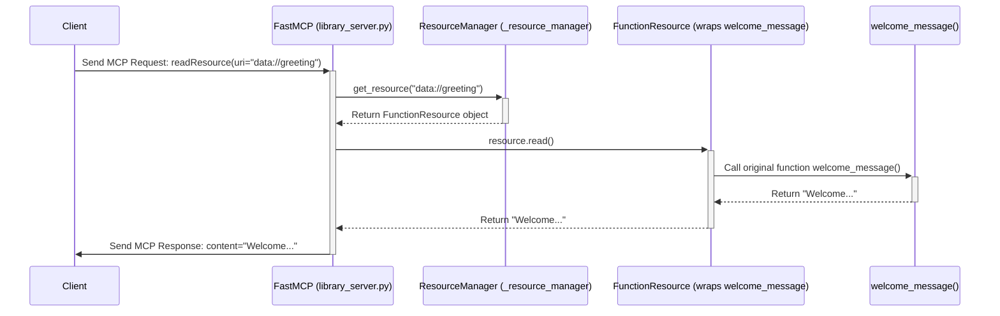

# Chapter 3: Sharing Data - FastMCP Resources (`Resource`, `ResourceManager`)

In [Chapter 2: Easier Server Building with `FastMCP`](02_fastmcp_server___fastmcp__.md), we saw how `FastMCP` and the `@server.tool()` decorator make it easy to create servers that can *perform actions* for clients, like our `echo` tool.

But what if your server just needs to share some *data*? Maybe it has a configuration file the client needs, a list of available items, or some text generated on the fly. You *could* make a tool for each piece of data, but that feels clunky. Isn't there a way for clients to just browse and read data sources directly?

Yes, there is! Welcome to **FastMCP Resources**.

## The Digital Library: Resources and the Resource Manager

Imagine your `FastMCP` server is like a **digital library**. Inside this library, you have various pieces of information:
*   Simple text notes (like a welcome message).
*   Static files (like a configuration file or a small image).
*   Information that changes (like the current time or weather).

Each piece of information in this library is called a **`Resource`**. Think of each `Resource` as a book, a document, or maybe even a live news feed within the library.

To access any item in a library, you need its unique identifier – like a call number or an ISBN. In FastMCP, resources are identified by a **URI** (Uniform Resource Identifier). This looks similar to a web URL (like `http://example.com`) but can use different schemes (like `data://`, `file://`, `weather://`). For example, a welcome message might have the URI `data://welcome_message`.

Now, how do you find out what books are in the library, or add a new one? You talk to the **librarian**. In `FastMCP`, the component that keeps track of all the available resources is called the **`ResourceManager`**.

*   **`Resource`**: A specific piece of data (static, dynamic, file) accessible via a URI. (The book)
*   **`ResourceManager`**: Manages all the `Resource` objects registered with the `FastMCP` server. (The librarian)
*   **URI**: The unique address used to find and access a `Resource`. (The call number)

Clients can ask the `ResourceManager` (via `FastMCP`) to list all available resources (`listResources`) and then request the content of a specific resource using its URI (`readResource`).

## Adding Books to the Library: Using `@server.resource()`

Just like `@server.tool()` made it easy to add actions, `FastMCP` provides a simple decorator, `@server.resource()`, to add data resources to your server's library (its `ResourceManager`).

Let's add a simple, static welcome message to our server.

**File: `library_server.py` (Version 1)**

```python
# 1. Import FastMCP
from mcp.server.fastmcp import FastMCP

# 2. Create the server instance
server = FastMCP(name="LibraryServer")

# 3. Define a function that returns our static data
def get_welcome_message() -> str:
  """Returns a simple welcome string."""
  return "Welcome to the Library Server!"

# 4. Use the @server.resource() decorator to register the function's result
#    The URI "data://greeting" will be used by clients to access this.
@server.resource(uri="data://greeting", description="A friendly greeting.")
def welcome_resource():
    # This function will be called *when a client reads* the resource.
    # It just returns the static message.
    return get_welcome_message() # Or simply: return "Welcome..."

# Standard run block
if __name__ == "__main__":
    print(f"Starting {server.name}...")
    server.run()
    print(f"{server.name} finished.")
```

*(Self-correction: The previous example was slightly complex with two functions. Let's simplify.)*

**File: `library_server.py` (Version 1 - Simpler)**

```python
# 1. Import FastMCP
from mcp.server.fastmcp import FastMCP

# 2. Create the server instance
server = FastMCP(name="LibraryServer")

# 3. Use the @server.resource() decorator directly on the function
#    that provides the data.
@server.resource(uri="data://greeting", description="A friendly greeting.")
def welcome_message() -> str:
  """
  This function is registered as the resource 'data://greeting'.
  It will be called when a client reads this resource URI.
  '-> str' indicates it returns text. FastMCP sets MIME type to text/plain.
  """
  print("Resource 'data://greeting' was read!") # Server-side log
  return "Welcome to the Library Server! Enjoy your stay."

# 4. Standard run block
if __name__ == "__main__":
    print(f"Starting {server.name}...")
    server.run() # Start listening
    print(f"{server.name} finished.")
```

**Explanation:**

1.  **`server = FastMCP(...)`**: Creates our server (the library). Inside, it creates a `ResourceManager` (the librarian).
2.  **`@server.resource(...)`**: This is our decorator "button".
    *   `uri="data://greeting"`: We assign a unique URI (call number) to this resource. The `data://` part is just a convention here, you can choose meaningful schemes.
    *   `description="..."`: A helpful description for clients browsing the library.
3.  **`def welcome_message() -> str:`**: This function provides the *content* for the resource.
    *   `-> str`: The type hint tells `FastMCP` this resource provides text data. It will automatically set the `mime_type` to `text/plain`.
    *   The function's body simply returns the string we want to share.
    *   **Important:** This function is only executed when a client actually asks to *read* the resource `data://greeting`. It's not run when the server starts.
4.  **`server.run()`**: Starts the server. The `ResourceManager` now knows about `data://greeting`.

If you run this server (`mcp run library_server.py`), a client could:
1.  Call `listResources` and see `data://greeting` in the list.
2.  Call `readResource` with the URI `data://greeting`.
3.  `FastMCP` would ask the `ResourceManager`, find the registered function (`welcome_message`), run it, get the string `"Welcome..."`, and send it back to the client.

## Dynamic Data: Resources Generated on the Fly

Resources don't have to be static text. The function you decorate can do calculations, read files, or anything else to generate the data *when it's requested*. This is great for information that changes.

Let's add a resource that tells the current time.

**File: `library_server.py` (Version 2)**

```python
import datetime # Need this module to get the current time
from mcp.server.fastmcp import FastMCP

server = FastMCP(name="LibraryServer")

@server.resource(uri="data://greeting", description="A friendly greeting.")
def welcome_message() -> str:
  print("Resource 'data://greeting' was read!")
  return "Welcome to the Library Server! Enjoy your stay."

# NEW: Add a dynamic resource for the current time
@server.resource(uri="time://current", description="The current server time.")
def current_time() -> str:
  """Returns the current time as a string."""
  now = datetime.datetime.now()
  time_str = now.strftime("%Y-%m-%d %H:%M:%S")
  print(f"Resource 'time://current' was read! Time is {time_str}")
  # The function calculates the time *each time* it's called
  return f"The current server time is: {time_str}"

# Standard run block
if __name__ == "__main__":
    print(f"Starting {server.name}...")
    server.run()
    print(f"{server.name} finished.")
```

Now, every time a client reads `time://current`, the `current_time` function will execute, get the *latest* time, format it, and return it.

## Parameterized Data: Resource Templates

What if you have data related to specific items, like weather information for different cities? You wouldn't want to create a separate resource function for every city (`weather_london`, `weather_paris`, etc.).

Resource URIs can contain parameters, indicated by curly braces `{}`. When you define a resource with a parameterized URI and a function that accepts arguments matching those parameters, `FastMCP` creates a **Resource Template**.

**File: `library_server.py` (Version 3)**

```python
import datetime
import random # To simulate getting weather data
from mcp.server.fastmcp import FastMCP

server = FastMCP(name="LibraryServer")

@server.resource(uri="data://greeting", description="A friendly greeting.")
def welcome_message() -> str:
    return "Welcome to the Library Server! Enjoy your stay."

@server.resource(uri="time://current", description="The current server time.")
def current_time() -> str:
    now = datetime.datetime.now()
    return f"The current server time is: {now.strftime('%Y-%m-%d %H:%M:%S')}"

# NEW: Add a resource template for weather
# The URI contains a parameter {city_name}
@server.resource(uri="weather://forecast/{city_name}",
                  description="Provides a dummy weather forecast.")
# The function accepts an argument matching the URI parameter
def get_weather_forecast(city_name: str) -> str:
    """Generates a fake weather forecast for the given city."""
    print(f"Resource template 'weather://forecast/{{city}}' read for city: {city_name}")
    # In a real app, you'd fetch actual weather here based on city_name
    temperature = random.randint(5, 25)
    conditions = random.choice(["Sunny", "Cloudy", "Rainy"])
    return f"Forecast for {city_name.capitalize()}: {temperature}°C, {conditions}"

# Standard run block
if __name__ == "__main__":
    print(f"Starting {server.name}...")
    server.run()
    print(f"{server.name} finished.")
```

**Explanation:**

1.  **`@server.resource(uri="weather://forecast/{city_name}", ...)`**: We define a URI with a placeholder `{city_name}`.
2.  **`def get_weather_forecast(city_name: str) -> str:`**: The function signature includes a parameter `city_name` that exactly matches the name inside the curly braces in the URI.
3.  **How it works:**
    *   When a client asks to read a URI like `weather://forecast/london`, `FastMCP` sees it matches the template.
    *   It extracts the value "london" from the URI.
    *   It calls the `get_weather_forecast` function, passing `"london"` as the `city_name` argument.
    *   The function generates the forecast for London and returns the string.
    *   If the client asks for `weather://forecast/paris`, the same function is called, but with `city_name="paris"`.

This template approach is very powerful for providing structured data without writing repetitive code. Clients would use `listResourceTemplates` to discover templates like this.

## How Resources Work Under the Hood

Using `@server.resource()` feels simple, but what's happening inside `FastMCP`?

1.  **Registration:** When Python processes your code and sees `@server.resource(uri="data://greeting")` above the `welcome_message` function, it calls an internal `server.resource()` method.
    *   This method analyzes the URI and the function.
    *   If the URI has no `{}` parameters and the function takes no arguments (or only a `Context` argument), it creates a `FunctionResource` object. This object essentially wraps your `welcome_message` function, storing its details (URI, description, the function itself).
    *   If the URI *does* have parameters matching the function's arguments (like `weather://forecast/{city_name}` and `get_weather_forecast(city_name: str)`), it creates a `ResourceTemplate` object instead.
    *   It then tells the `ResourceManager` (the librarian) to store this `FunctionResource` or `ResourceTemplate`. (This happens via `_resource_manager.add_resource` or `_resource_manager.add_template`, referencing `server/fastmcp/resources/resource_manager.py`).

2.  **Client Request (`readResource`)**:
    *   A client sends an MCP message: `{"method": "readResource", "params": {"uri": "data://greeting"}}`.
    *   `FastMCP` receives this and calls its internal `read_resource` handler (see `server/fastmcp/server.py`).
    *   The handler asks the `ResourceManager`: "Do you have a resource for the URI `data://greeting`?" (`_resource_manager.get_resource`).
    *   The `ResourceManager` checks its list of concrete resources. It finds the `FunctionResource` associated with `data://greeting`.
    *   `FastMCP` (or the `ResourceManager`) calls the `.read()` method on that `FunctionResource` object (see `server/fastmcp/resources/types.py`).
    *   The `FunctionResource.read()` method executes the original Python function you decorated (`welcome_message()`).
    *   Your function returns the string `"Welcome..."`.
    *   `FastMCP` packages this string into a valid MCP `readResource` response and sends it back to the client.

3.  **Client Request (`readResource` with Template)**:
    *   Client sends: `{"method": "readResource", "params": {"uri": "weather://forecast/london"}}`.
    *   `FastMCP` asks `ResourceManager` for `weather://forecast/london`.
    *   `ResourceManager` checks concrete resources – no match.
    *   `ResourceManager` checks its `ResourceTemplate` list. It finds the `weather://forecast/{city_name}` template matches the requested URI.
    *   It extracts the parameter `{"city_name": "london"}`.
    *   It uses the template to *dynamically create* a temporary `FunctionResource` for this specific request, configured to call `get_weather_forecast(city_name="london")`.
    *   `FastMCP` calls `.read()` on this temporary resource.
    *   The `get_weather_forecast("london")` function runs and returns the forecast string.
    *   `FastMCP` sends the result back.

**Simplified Sequence Diagram (`readResource` for `data://greeting`):**



While `@server.resource()` is the easiest way, the SDK also provides classes like `TextResource`, `BinaryResource`, `FileResource` (see `server/fastmcp/resources/types.py`) that you could potentially instantiate and add directly using `server.add_resource(MyTextResource(...))`, but the decorator handles wrapping your functions nicely.

## Conclusion

You've learned about FastMCP Resources – the way to share data from your server like items in a digital library.

*   **Resources (`Resource`)** are data sources (text, files, dynamic content) identified by **URIs**.
*   The **`ResourceManager`** keeps track of all registered resources.
*   The `@server.resource()` decorator is the easiest way to add resources by wrapping Python functions.
*   Resources can be **static** (returning the same data) or **dynamic** (generating data when read).
*   **Resource Templates** allow you to handle parameterized URIs (like `weather://forecast/{city}`) efficiently.
*   Clients use `listResources`, `listResourceTemplates`, and `readResource` to interact with your server's data library.

Resources are essential for providing context, configuration, or any other data your clients might need to consume without executing a complex action.

In the next chapter, we'll take a closer look at the other main building block we briefly saw in Chapter 2: [FastMCP Tools (`Tool`, `ToolManager`)](04_fastmcp_tools___tool____toolmanager__.md), and explore how they handle actions and inputs in more detail.

---

Generated by [AI Codebase Knowledge Builder](https://github.com/The-Pocket/Tutorial-Codebase-Knowledge)