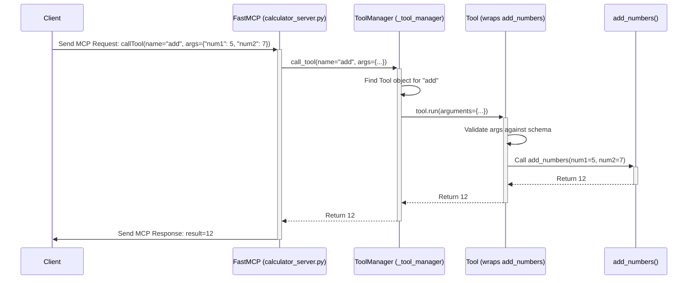

# Chapter 4: FastMCP Tools (`Tool`, `ToolManager`)

In [Chapter 3: Sharing Data - FastMCP Resources (`Resource`, `ResourceManager`)](03_fastmcp_resources___resource____resourcemanager__.md), we learned how to make data available for clients to read using `Resource` objects, like putting books in a digital library. That's great for sharing information, but what if we want the client to be able to ask the server to *do* something?

Imagine you want your server to not just provide data, but to perform calculations, interact with a database, or control some hardware. For example, maybe you want a client application (like an AI assistant) to be able to ask your server, "What's 5 plus 7?". The server needs to perform the addition and send back the result.

This is where **FastMCP Tools** come in. They allow your server to expose functions that clients can call remotely.

## The Workshop Analogy: Tools and the Foreman

Think of your `FastMCP` server as a well-equipped workshop. Inside this workshop, you have various specialized tools:
*   A drill (`Tool`)
*   A screwdriver (`Tool`)
*   A calculator (`Tool`)

Each **`Tool`** is designed for a specific job. When someone (a client) needs a job done, they don't operate the tool directly. Instead, they go to the workshop **foreman** (the **`ToolManager`**) and say:

"I need to use the `calculator` tool. Please add these numbers: `5` and `7`."

The foreman (`ToolManager`) knows exactly where the `calculator` tool is and how it works. It takes the request, operates the calculator with the provided numbers (`5`, `7`), gets the result (`12`), and gives it back to the person who asked.

*   **`Tool`**: A specific function or capability your server offers (like the calculator). It has a name and accepts specific inputs (arguments).
*   **`ToolManager`**: The internal manager within `FastMCP` that keeps track of all available `Tool` objects and handles requests to use them (the foreman). Clients interact with the `ToolManager` via `FastMCP`.

Clients can ask the `ToolManager` (via `FastMCP`) to list all available tools (`listTools`) and then request to execute a specific tool by its name, providing the necessary arguments (`callTool`).

## Adding Tools to Your Workshop: Using `@server.tool()`

Just like we used `@server.resource()` to add data "books" to our library, `FastMCP` provides the `@server.tool()` decorator to easily add action "tools" to our workshop (managed by the `ToolManager`).

Let's create a simple server with a calculator tool that can add two numbers.

**File: `calculator_server.py`**

```python
# 1. Import FastMCP
from mcp.server.fastmcp import FastMCP

# 2. Create the server instance
server = FastMCP(name="CalculatorServer")

# 3. Use the @server.tool() decorator to define our tool
@server.tool(name="add", description="Adds two numbers together.")
def add_numbers(num1: int, num2: int) -> int:
  """
  This function is registered as the 'add' tool.
  'num1: int' and 'num2: int' tell FastMCP the tool expects
  two integer arguments named 'num1' and 'num2'.
  '-> int' tells FastMCP the tool will return an integer.
  """
  print(f"Tool 'add' called with {num1} and {num2}") # Server-side log
  # 4. The function's logic performs the action
  result = num1 + num2
  print(f"Returning result: {result}")
  return result

# 5. Standard run block
if __name__ == "__main__":
    print(f"Starting {server.name}...")
    server.run() # Start listening
    print(f"{server.name} finished.")
```

**Explanation:**

1.  **`server = FastMCP(...)`**: Creates our server (the workshop). Internally, this also creates a `ToolManager` (the foreman).
2.  **`@server.tool(...)`**: This is our decorator "button" for adding tools.
    *   We use the `.tool()` method of our `server` object as a decorator.
    *   `name="add"`: We tell `FastMCP` that clients should use the name `add` to call this tool.
    *   `description="..."`: A helpful description for clients.
3.  **`def add_numbers(num1: int, num2: int) -> int:`**: This is a standard Python function.
    *   `num1: int`, `num2: int`: These **type hints** are crucial! They tell `FastMCP` what arguments the tool expects (two integers named `num1` and `num2`). `FastMCP` uses this to validate input from clients and to generate documentation about the tool.
    *   `-> int`: This type hint indicates that the function will return an integer result.
4.  **Function Body**: This contains the actual logic for our tool – adding the numbers.
5.  **`server.run()`**: Starts the server. The `ToolManager` now knows about the `add` tool.

If you run this server (`mcp run calculator_server.py`), a client could:
1.  Call `listTools` and see the `add` tool listed, along with its description and expected arguments (`num1` (int), `num2` (int)).
2.  Call `callTool` with the name `add` and arguments like `{"num1": 5, "num2": 7}`.
3.  `FastMCP` would ask the `ToolManager` to execute the `add` tool. The `ToolManager` would find your `add_numbers` function, check that the arguments match (`5` and `7` are integers), call the function, get the integer result `12`, and send it back to the client.

## How Clients Use Tools

You don't need to worry about writing client code right now, but it's helpful to understand the basic interaction:

1.  **Discovery:** The client first asks the server, "What tools do you have?" (using the MCP `listTools` method). The server, guided by its `ToolManager`, responds with a list of tools, including their names, descriptions, and what arguments they expect (based on your Python function signature and the `@server.tool` decorator).
2.  **Invocation:** The client then decides to use a specific tool. It sends a request like, "Please execute the tool named 'add' with these arguments: `num1` is `5`, `num2` is `7`." (using the MCP `callTool` method).
3.  **Execution & Response:** The server receives this request. `FastMCP` hands it off to the `ToolManager`. The `ToolManager` finds the correct Python function (`add_numbers`), validates and passes the arguments (`5`, `7`), executes the function, gets the return value (`12`), and sends this result back to the client.

## The Foreman: `ToolManager` Behind the Scenes

While you primarily interact with `@server.tool()`, the `ToolManager` is the component within `FastMCP` that does the heavy lifting for tools.

When `FastMCP` starts, it creates a `ToolManager` instance. Every time you use the `@server.tool()` decorator, you're essentially telling `FastMCP` to register that function with its `ToolManager`.

The `ToolManager`:
*   Keeps a dictionary mapping tool names (like `"add"`) to the corresponding `Tool` objects (which contain information about your function, its parameters, etc.).
*   Provides the list of tools when `FastMCP` needs to respond to a `listTools` request.
*   Looks up the correct `Tool` object when `FastMCP` receives a `callTool` request.
*   Validates the arguments provided by the client against the tool's expected parameters (using the information gathered from type hints).
*   Calls your actual Python function with the validated arguments.
*   Handles potential errors during tool execution.

You usually don't need to interact with `ToolManager` directly; `@server.tool()` is the convenient interface.

## How Tools Work Under the Hood

Let's trace the journey of our `add` tool from definition to execution.

**1. Registration (When the server code loads):**

*   Python executes your `calculator_server.py`.
*   It reaches the `@server.tool(name="add", ...)` line above `def add_numbers(...)`.
*   This calls the `server.tool()` method. Inside `FastMCP`, this ultimately calls `_tool_manager.add_tool()`.
*   The `ToolManager.add_tool` method inspects the `add_numbers` function:
    *   Gets its name (`add_numbers`, but overridden by `name="add"`).
    *   Gets its description (from the decorator or docstring).
    *   Looks at the parameters (`num1: int`, `num2: int`) and return type (`-> int`) using Python's introspection features.
    *   Uses this information to build a schema describing the expected input arguments (like a mini-form definition).
    *   Creates an internal `Tool` object containing all this information (the function itself, its name, description, argument schema).
*   The `ToolManager` stores this `Tool` object in its internal dictionary, keyed by the name `"add"`.

**2. Invocation (When a client calls the tool):**

*   A client sends an MCP message: `{"method": "callTool", "params": {"name": "add", "arguments": {"num1": 5, "num2": 7}}}`.
*   `FastMCP` receives this message and identifies it as a `callTool` request for the tool named `add`.
*   `FastMCP` calls its internal `call_tool` handler method.
*   This handler asks the `ToolManager`: "Please execute the tool named `add` with arguments `{'num1': 5, 'num2': 7}`." (calling `_tool_manager.call_tool`).
*   The `ToolManager` looks up `"add"` in its dictionary and finds the corresponding `Tool` object.
*   The `Tool` object (or the `ToolManager` using it) validates the provided arguments (`{'num1': 5, 'num2': 7}`) against the stored argument schema (checks if `num1` and `num2` are present and are integers).
*   If validation passes, the `Tool` object calls the original Python function (`add_numbers`) with the arguments unpacked: `add_numbers(num1=5, num2=7)`.
*   Your `add_numbers` function runs, calculates `12`, and returns it.
*   The `ToolManager` receives the result `12`.
*   `FastMCP` takes the result, packages it into a valid MCP `callTool` response message, and sends it back to the client.

**Simplified Sequence Diagram (`callTool` for `add`):**



**Looking at the Code (Briefly):**

You don't need to memorize this, but seeing the structure can help.

*   **Registration (`@server.tool` -> `add_tool` -> `ToolManager.add_tool`)**:
    *   In `server/fastmcp/server.py`, the `FastMCP.tool` decorator returns an inner function that calls `self.add_tool(fn, ...)`.
    *   `FastMCP.add_tool` simply calls `self._tool_manager.add_tool(fn, ...)`.

    ```python
    # Inside server/fastmcp/tools/tool_manager.py (Simplified ToolManager.add_tool)
    from .base import Tool # Tool class definition is in base.py

    class ToolManager:
        # ... (init, get_tool, list_tools) ...

        def add_tool(self, fn, name=None, description=None) -> Tool:
            # 1. Create a Tool object from the function
            tool = Tool.from_function(fn, name=name, description=description)
            # 2. Check for duplicates (optional warning)
            if tool.name in self._tools:
                # ... handle duplicate ...
                pass
            # 3. Store the Tool object in the dictionary
            self._tools[tool.name] = tool
            logger.debug(f"Registered tool: {tool.name}")
            return tool
    ```

*   **Invocation (`FastMCP.call_tool` -> `ToolManager.call_tool` -> `Tool.run`)**:
    *   In `server/fastmcp/server.py`, the `FastMCP.call_tool` method (which handles incoming `callTool` requests) calls `self._tool_manager.call_tool(name, arguments, ...)`.

    ```python
    # Inside server/fastmcp/tools/tool_manager.py (Simplified ToolManager.call_tool)
    class ToolManager:
        # ... (init, add_tool, list_tools) ...

        async def call_tool(self, name, arguments, context=None):
            # 1. Find the tool by name
            tool = self.get_tool(name)
            if not tool:
                raise ToolError(f"Unknown tool: {name}")

            # 2. Tell the Tool object to run with the arguments
            logger.debug(f"Calling tool: {name} with args: {arguments}")
            result = await tool.run(arguments, context=context)
            return result
    ```

    *   The `Tool.run` method (in `server/fastmcp/tools/base.py`) handles argument validation (using the `FuncMetadata` generated during registration) and finally calls your original Python function (`add_numbers`).

## Conclusion

You've now learned about FastMCP Tools, the way to expose actions and computations from your server for clients to execute.

*   **Tools (`Tool`)** are server-side functions callable by clients, identified by a name.
*   The **`ToolManager`** is the internal component that registers and dispatches tool calls (like a workshop foreman).
*   The **`@server.tool()`** decorator is the easy way to register a Python function as a tool.
*   **Type hints** in your function signature are essential for defining the tool's arguments and return type, enabling automatic validation and documentation.
*   Clients use `listTools` to discover tools and `callTool` to execute them.

Tools are fundamental for building interactive applications where the client needs the server to perform specific tasks beyond just retrieving data.

In the next chapter, we'll explore another powerful feature of `FastMCP` for interacting with Large Language Models: [Chapter 5: FastMCP Prompts (`Prompt`, `PromptManager`)](05_fastmcp_prompts___prompt____promptmanager__.md).

---

Generated by [AI Codebase Knowledge Builder](https://github.com/The-Pocket/Tutorial-Codebase-Knowledge)