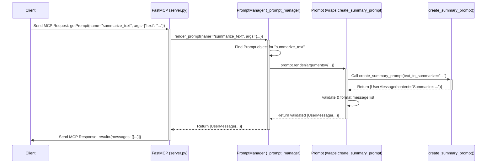

# Chapter 5: Reusable Chat Starters - FastMCP Prompts (`Prompt`, `PromptManager`)

In [Chapter 4: FastMCP Tools (`Tool`, `ToolManager`)](04_fastmcp_tools___tool____toolmanager__.md), we learned how to give our server specific *actions* it can perform, like a calculator tool. But modern AI often involves conversations, especially with Large Language Models (LLMs). How do we manage the instructions and conversation starters we send to these models?

Imagine you want to build an AI assistant tool that can summarize text. You'll need to tell the underlying LLM *what* to do (summarize) and *what* text to summarize. You might also want to provide specific instructions like "Keep the summary under 50 words." You'll probably need variations of this prompt for different tasks. Writing this message structure over and over again in your tool code would be repetitive and hard to manage.

This is where **FastMCP Prompts** come in. They provide a way to create reusable templates for generating sequences of messages, perfect for starting conversations with LLMs or structuring requests.

## The Mad Libs Analogy: Prompts and the Prompt Manager

Think of a **`Prompt`** like a **Mad Libs story template**. A Mad Libs template has a pre-written story with blanks (like `___(noun)___` or `___(verb)___`). You define the structure and the blanks.

*   **`Prompt`**: The Mad Libs template itself. It has a name (like "Vacation Story") and defined blanks. In FastMCP, the "story" is a sequence of messages (usually for an LLM), and the blanks are **`PromptArgument`** objects.
*   **`PromptArgument`**: Represents a blank in the template. It defines the name of the blank (e.g., `text_to_summarize`), maybe a description, and whether it's required.
*   **Rendering**: The act of filling in the blanks. You provide values (arguments) for the blanks (`text_to_summarize = "Once upon a time..."`), and the template generates the complete story. In FastMCP, rendering a `Prompt` with arguments produces a list of **`PromptMessage`** objects (like `UserMessage` or `AssistantMessage`). These messages have roles (`user`, `assistant`) and content, ready to be sent to an LLM.
*   **`PromptManager`**: Like a folder or binder holding all your different Mad Libs templates. It's the part of `FastMCP` that stores and helps you find and use (`render`) your defined `Prompt` templates.

Clients (like an AI application) can ask the `PromptManager` (via `FastMCP`) to list available prompt templates (`listPrompts`) and then request a specific, filled-in prompt sequence using its name and arguments (`getPrompt`).

## Creating Your First Prompt Template: Using `@server.prompt()`

Just like `@server.tool()` and `@server.resource()`, `FastMCP` provides a simple decorator, `@server.prompt()`, to easily define these message templates using Python functions.

Let's create a prompt template for our text summarization task.

**File: `summarizer_server.py`**

```python
# 1. Import FastMCP and message types
from mcp.server.fastmcp import FastMCP
from mcp.server.fastmcp.prompts import UserMessage # We'll use this

# 2. Create the server instance
server = FastMCP(name="SummarizerServer")

# 3. Use the @server.prompt() decorator to define our template
@server.prompt(name="summarize_text", description="Generates messages to ask an LLM to summarize text.")
def create_summary_prompt(text_to_summarize: str) -> list[UserMessage]:
  """
  This function defines the 'summarize_text' prompt template.
  'text_to_summarize: str' defines a required argument (a blank).
  '-> list[UserMessage]' indicates it returns a list of messages.
  """
  print(f"Rendering prompt 'summarize_text' with text: {text_to_summarize[:30]}...") # Log

  # 4. Construct the message(s) based on the arguments
  # Here, we create a single user message containing instructions and the text.
  prompt_content = f"Please summarize the following text concisely:\n\n{text_to_summarize}"

  # Return a list containing one UserMessage object
  return [UserMessage(content=prompt_content)]

# 5. Standard run block (optional: add a tool that uses this prompt later)
if __name__ == "__main__":
    print(f"Starting {server.name}...")
    server.run()
    print(f"{server.name} finished.")
```

**Explanation:**

1.  **Imports**: We import `FastMCP` and `UserMessage` (a specific type of `PromptMessage`). `AssistantMessage` is also available.
2.  **`server = FastMCP(...)`**: Creates our server. Internally, this also creates a `PromptManager`.
3.  **`@server.prompt(...)`**: This decorator registers our function as a prompt template.
    *   `name="summarize_text"`: The name clients will use to request this template.
    *   `description="..."`: A helpful description.
4.  **`def create_summary_prompt(...)`**: This Python function *builds* the message list when the prompt is rendered.
    *   `text_to_summarize: str`: The type hint defines a required `PromptArgument` named `text_to_summarize`. This is the blank in our Mad Libs.
    *   `-> list[UserMessage]`: The type hint tells `FastMCP` that this function will return a list containing `UserMessage` objects (or compatible types like plain strings or dicts that look like messages).
    *   The function body uses the input argument (`text_to_summarize`) to construct the desired message content.
    *   It returns a list containing a single `UserMessage`. You could return multiple messages (e.g., alternating user/assistant roles) to set up a conversation history.
5.  **`server.run()`**: Starts the server. The `PromptManager` now knows about the `summarize_text` prompt template.

**What happens when a client uses this prompt?**

1.  **Discovery (Optional):** A client might call `listPrompts`. The server (using `PromptManager`) would respond with information about the `summarize_text` prompt, including its name, description, and the required argument `text_to_summarize` (string).
2.  **Rendering Request:** The client wants to generate the messages for summarizing a specific text. It sends an MCP request: `getPrompt` with `name="summarize_text"` and `arguments={"text_to_summarize": "This is the text..."}`.
3.  **Server-Side Rendering:**
    *   `FastMCP` receives the request and asks its `PromptManager` to render the prompt.
    *   `PromptManager` finds the `Prompt` object associated with `summarize_text`.
    *   It calls the `render` method on the `Prompt` object, which in turn calls your Python function `create_summary_prompt(text_to_summarize="This is the text...")`.
    *   Your function runs, builds the `prompt_content` string, and returns `[UserMessage(content="Please summarize...")]`.
    *   `FastMCP` takes this list of `Message` objects.
4.  **Response:** `FastMCP` sends the generated message list back to the client in the `getPrompt` response. The client now has the structured message(s) ready to be sent to an LLM.

```json
// Example Client Request (Simplified MCP format)
{
  "method": "getPrompt",
  "params": {
    "name": "summarize_text",
    "arguments": {
      "text_to_summarize": "The quick brown fox jumps over the lazy dog."
    }
  }
}

// Example Server Response (Simplified MCP format)
{
  "result": {
    "messages": [
      {
        "role": "user",
        "content": {
          "type": "text",
          "text": "Please summarize the following text concisely:\n\nThe quick brown fox jumps over the lazy dog."
        }
      }
    ]
  }
}
```

This makes it easy for client applications to get consistently formatted prompts for various tasks without needing to know the exact text structure themselves.

## Returning Different Message Types

Your prompt function can return various things, and `FastMCP` will try to convert them into the standard `Message` format (like `UserMessage` or `AssistantMessage`):

*   **A single string:** Automatically converted to `UserMessage(content=TextContent(type="text", text=your_string))`.
*   **A `Message` object (e.g., `UserMessage`, `AssistantMessage`):** Used directly.
*   **A dictionary matching the `Message` structure:** e.g., `{"role": "user", "content": "Hello!"}`. Validated and converted.
*   **A list containing any mix of the above:** Each item is converted/validated.

```python
from mcp.server.fastmcp import FastMCP
# Import both message types
from mcp.server.fastmcp.prompts import UserMessage, AssistantMessage

server = FastMCP(name="MultiMessageServer")

@server.prompt(name="greet_user", description="Starts a simple conversation.")
def greeting_prompt(user_name: str): # -> returns list of mixed types
  """Generates a multi-turn conversation starter."""

  # We can return a list containing different types:
  return [
      # A UserMessage object
      UserMessage(f"Hello {user_name}, tell me about your day."),
      # A dictionary that looks like an AssistantMessage
      {"role": "assistant", "content": "I'm ready to listen!"},
      # A simple string (becomes a UserMessage)
      "Start whenever you're ready.",
  ]

# ... (run block) ...
```

This flexibility lets you structure complex conversational prompts easily.

## How Prompts Work Under the Hood

Using `@server.prompt()` is straightforward, but what's happening inside `FastMCP` and its `PromptManager`?

**1. Registration (When the server code loads):**

*   Python executes your `summarizer_server.py`.
*   It reaches the `@server.prompt(name="summarize_text", ...)` line above `def create_summary_prompt(...)`.
*   This calls the `server.prompt()` method (in `server/fastmcp/server.py`). This method returns a decorator function that is immediately applied to `create_summary_prompt`.
*   The decorator function calls `server.add_prompt()`.
*   `server.add_prompt()` calls `self._prompt_manager.add_prompt()`.
*   Inside `PromptManager.add_prompt` (in `server/fastmcp/prompts/manager.py`):
    *   It calls `Prompt.from_function(create_summary_prompt, name="summarize_text", ...)` (see `server/fastmcp/prompts/base.py`).
    *   `Prompt.from_function` inspects the `create_summary_prompt` function:
        *   Gets its name (`summarize_text`).
        *   Gets its description (from decorator or docstring).
        *   Looks at the parameters (`text_to_summarize: str`) using Python's introspection to determine the required `PromptArgument`s.
        *   Creates a `Prompt` object storing the function itself (`fn`), its name, description, and the list of arguments.
    *   The `PromptManager` stores this `Prompt` object in its internal dictionary, keyed by the name `"summarize_text"`.

**2. Rendering (When a client calls `getPrompt`):**

*   A client sends the MCP `getPrompt` request we saw earlier.
*   `FastMCP` receives this and calls its internal `get_prompt` handler method (defined in `server/fastmcp/server.py`).
*   This handler calls `self._prompt_manager.render_prompt("summarize_text", {"text_to_summarize": "..."})`.
*   Inside `PromptManager.render_prompt`:
    *   It looks up `"summarize_text"` in its dictionary and finds the corresponding `Prompt` object.
    *   It calls the `Prompt` object's `render` method: `prompt.render(arguments={"text_to_summarize": "..."})`.
*   Inside `Prompt.render` (in `server/fastmcp/prompts/base.py`):
    *   It validates that all required arguments (like `text_to_summarize`) were provided.
    *   It calls the original Python function stored in `prompt.fn`: `create_summary_prompt(text_to_summarize="...")`.
    *   Your function executes and returns the list `[UserMessage(...)]`.
    *   The `render` method takes this result, validates that each item is (or can be converted to) a `Message` object, and ensures the final output is a list of `Message`s.
*   The `PromptManager` receives this validated list of `Message` objects.
*   `FastMCP` takes the result, packages it into the standard MCP `GetPromptResult` format (which contains the `messages` list), and sends it back to the client.

**Simplified Sequence Diagram (`getPrompt` for `summarize_text`):**



**Looking at the Code (Briefly):**

You don't need to memorize the internal details, but seeing where things happen can clarify the process:

*   **Registration (`@server.prompt` -> `add_prompt` -> `PromptManager.add_prompt`)**:
    *   `server.py`: `FastMCP.prompt` decorator calls `self.add_prompt`.
    *   `server.py`: `FastMCP.add_prompt` calls `self._prompt_manager.add_prompt`.
    *   `manager.py`: `PromptManager.add_prompt` calls `Prompt.from_function` and stores the result.

    ```python
    # Inside server/fastmcp/prompts/manager.py (Simplified PromptManager.add_prompt)
    from .base import Prompt

    class PromptManager:
        # ... (init, get_prompt, list_prompts) ...

        def add_prompt(self, prompt: Prompt) -> Prompt:
            # Check for duplicates...
            if prompt.name in self._prompts:
                 # ... handle duplicate ...
                 pass
            # Store the Prompt object
            self._prompts[prompt.name] = prompt
            return prompt

    # Note: Prompt.from_function (in base.py) does the function inspection.
    ```

*   **Rendering (`FastMCP.get_prompt` -> `PromptManager.render_prompt` -> `Prompt.render`)**:
    *   `server.py`: `FastMCP.get_prompt` handles incoming requests and calls `self._prompt_manager.render_prompt`.

    ```python
    # Inside server/fastmcp/prompts/manager.py (Simplified PromptManager.render_prompt)
    class PromptManager:
        # ... (other methods) ...

        async def render_prompt(self, name, arguments=None):
            # 1. Find the prompt object by name
            prompt = self.get_prompt(name)
            if not prompt:
                raise ValueError(f"Unknown prompt: {name}")

            # 2. Tell the Prompt object to render itself
            return await prompt.render(arguments)
    ```

    *   `base.py`: `Prompt.render` validates arguments and calls the stored function (`self.fn`). It then processes the function's return value into a list of `Message` objects.

    ```python
    # Inside server/fastmcp/prompts/base.py (Simplified Prompt.render)
    class Prompt:
        # ... (init, from_function, PromptArgument) ...

        async def render(self, arguments=None):
            # Validate required arguments...
            # ...

            try:
                # Call the original decorated function
                result = self.fn(**(arguments or {}))
                if inspect.iscoroutine(result): # Handle async functions
                    result = await result

                # Convert result to list of Message objects
                # (Handles strings, dicts, Message objects, lists)
                messages: list[Message] = []
                # ... (conversion logic using message_validator) ...
                return messages
            except Exception as e:
                raise ValueError(f"Error rendering prompt {self.name}: {e}")
    ```

## Conclusion

You've learned about FastMCP Prompts, a powerful way to manage reusable message templates, especially useful for interacting with language models.

*   **Prompts (`Prompt`)** are like Mad Libs templates for creating sequences of `UserMessage`s and `AssistantMessage`s.
*   They use **`PromptArgument`**s to define the "blanks" that need filling.
*   The **`PromptManager`** keeps track of all defined prompts.
*   The **`@server.prompt()`** decorator provides an easy way to define a prompt template using a Python function. The function's parameters become arguments, and its return value (string, dict, Message object, or list thereof) defines the generated message sequence.
*   Clients use `listPrompts` to discover templates and `getPrompt` to render a specific template with arguments, receiving the generated messages back.

Prompts help keep your LLM interaction logic organized, reusable, and separate from your main tool code.

In the next chapter, we'll explore a concept that ties tools, resources, and potentially prompts together during a request: [Chapter 6: FastMCP Context (`Context`)](06_fastmcp_context___context__.md). This allows your tools and resources to access server capabilities like logging and progress reporting.

---

Generated by [AI Codebase Knowledge Builder](https://github.com/The-Pocket/Tutorial-Codebase-Knowledge)