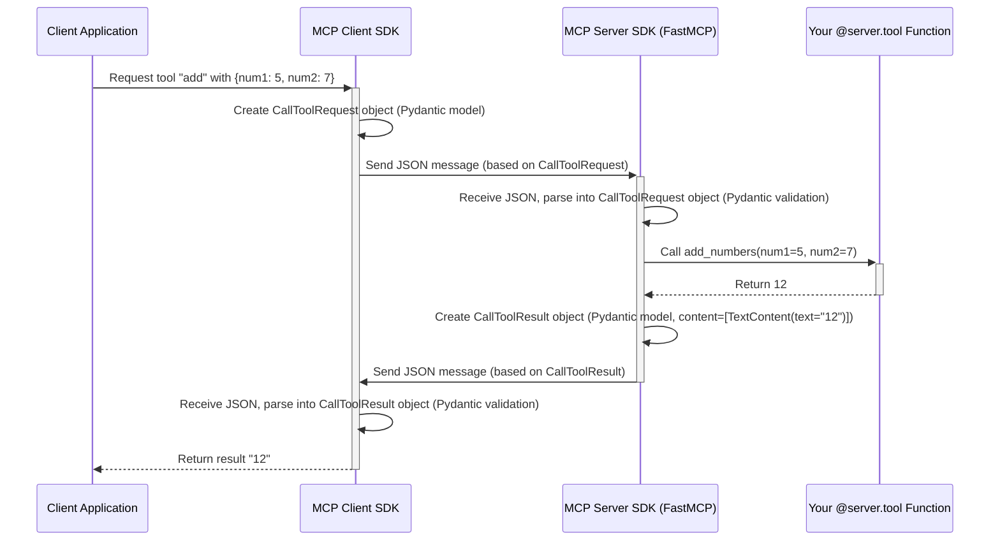

# Chapter 7: MCP Protocol Types - The Standard Language

In the previous chapter, [Chapter 6: Talking Back - FastMCP Context (`Context`)](06_fastmcp_context___context__.md), we saw how the `Context` object gives our tools and resources a "backstage pass" to send logs, report progress, and access other server features during a request. We've built up a good understanding of how `FastMCP` helps us create powerful servers with tools ([Chapter 4](04_fastmcp_tools___tool____toolmanager__.md)), resources ([Chapter 3](03_fastmcp_resources___resource____resourcemanager__.md)), and prompts ([Chapter 5](05_fastmcp_prompts___prompt____promptmanager__.md)).

But have you ever wondered *how* the client and server actually talk to each other under the hood? When your tool function uses `ctx.report_progress()`, how does that message get sent? When a client asks to call a tool, what does that request *look like* electronically?

Imagine trying to send mail internationally. If everyone used different envelope sizes, address formats, and languages, it would be chaos! Postal services rely on standards. Similarly, for a client (like a chatbot interface) and your MCP server (like your `CalculatorServer`) to communicate reliably, they need a **standard language** and **standard formats** for their messages.

This is where **MCP Protocol Types** come in. They are the fundamental, standardized data structures – the "digital forms" or "letter formats" – defined by the Model Context Protocol (MCP) specification itself.

## What are MCP Protocol Types?

Think of MCP Protocol Types as the official **blueprints** for all the different kinds of messages that can be sent between an MCP client and server. They define precisely what information should be included in each type of message.

These types cover all the interactions we've implicitly seen:

*   **Requests:** Messages asking the other side to do something (e.g., "Initialize our connection", "List the available tools", "Read this resource", "Call that tool").
*   **Responses:** Messages sent back after a request, containing either the result or an error (e.g., "Here are the tools", "Here is the resource content", "Here is the result of the tool call", "Sorry, an error occurred").
*   **Notifications:** Messages sent one-way, just to inform the other side about something without expecting a direct reply (e.g., "Initialization is complete", "Here's a progress update", "Here's a log message").
*   **Errors:** A specific kind of response indicating something went wrong with a request.

These types have specific names defined in the `MCP Python SDK`, usually found in the `mcp.types` module. You'll see names that clearly indicate their purpose:

*   `InitializeRequest`: The "form" a client sends to start communication.
*   `InitializeResult`: The "form" a server sends back confirming initialization.
*   `ListToolsResult`: The "form" containing the list of tools sent by the server.
*   `CallToolRequest`: The "form" a client uses to ask the server to run a tool.
*   `CallToolResult`: The "form" the server sends back with the tool's output.
*   `ProgressNotification`: The "form" used to send progress updates (like when we used `ctx.report_progress`).
*   `JSONRPCError`: The standard "form" for reporting errors.

These are just a few examples; the MCP specification defines many such types to cover all standard interactions.

## Why Standardized Types? Meet Pydantic

Why go to the trouble of defining all these specific types? Why not just send messages like "Hey server, run the add tool with 5 and 7"?

Without standards, communication quickly breaks down:
*   Did the client send integers or strings for the numbers?
*   Did the server send the result back as a number or text?
*   How does the client know if the server understood the request or if an error happened?

Standardized types solve these problems by ensuring both the client and server agree on the exact structure and data types for every message.

The `MCP Python SDK` uses a popular Python library called **Pydantic** to define and manage these protocol types. Think of Pydantic as both the **form designer** and the **quality control inspector**:

1.  **Definition:** Pydantic allows the SDK developers to define each protocol type (like `CallToolRequest`) using simple Python classes with type hints. This creates a clear, code-based blueprint for each "form".
2.  **Validation:** When your server receives a message, Pydantic automatically checks if it perfectly matches the expected structure defined by the corresponding protocol type. Does the `CallToolRequest` actually have a `name` field that's a string? Does it have an `arguments` field that's a dictionary? If not, Pydantic raises an error immediately, preventing bad data from causing problems later. It does the same when your server sends messages back.
3.  **Type Safety & Developer Experience:** Because the types are clearly defined, your code editor can help you! It knows what fields exist on an `InitializeResult` object, reducing typos and making development faster and less error-prone.

Pydantic makes the communication reliable and robust by enforcing the MCP standard for every message.

## Examples in Action: Connecting High-Level to Low-Level

While `FastMCP` does a great job hiding these low-level details, let's peek behind the curtain and see how our previous examples relate to these protocol types.

**Scenario 1: Client Listing Tools**

1.  A client wants to know what tools your `CalculatorServer` offers.
2.  Client sends a message. Under the hood, this message is structured according to the `JSONRPCRequest` format, specifying the method `tools/list`.
3.  Your `FastMCP` server receives this raw message. Pydantic validates it.
4.  `FastMCP` understands it's a request for `tools/list` and asks the `ToolManager` ([Chapter 4](04_fastmcp_tools___tool____toolmanager__.md)) for the list of tools.
5.  The `ToolManager` provides the tool information (name, description, input schema).
6.  `FastMCP` takes this information and constructs a `ListToolsResult` object. This object is a Pydantic model defined in `mcp.types`.

    ```python
    # Simplified example of creating a ListToolsResult object
    # (FastMCP does this automatically for you!)
    from mcp.types import ListToolsResult, Tool

    # ToolManager gathered this info from your @server.tool decorator
    add_tool_info = Tool(
        name="add",
        description="Adds two numbers together.",
        inputSchema={ # JSON Schema describing expected input
            "type": "object",
            "properties": {
                "num1": {"type": "integer"},
                "num2": {"type": "integer"}
            },
            "required": ["num1", "num2"]
        }
    )

    # FastMCP creates the result object
    result_data = ListToolsResult(
        tools=[add_tool_info]
        # nextCursor would be set if paginating
    )

    # This result_data object is then packaged into a
    # standard JSONRPCResponse and sent to the client.
    print(result_data.model_dump_json(indent=2)) # See its JSON form
    ```

    **Example Output (JSON representation):**
    ```json
    {
      "_meta": null,
      "nextCursor": null,
      "tools": [
        {
          "name": "add",
          "description": "Adds two numbers together.",
          "inputSchema": {
            "type": "object",
            "properties": {
              "num1": {
                "type": "integer"
              },
              "num2": {
                "type": "integer"
              }
            },
            "required": [
              "num1",
              "num2"
            ]
          }
        }
      ]
    }
    ```
    This structured JSON, based on the `ListToolsResult` model, is what gets sent back to the client.

**Scenario 2: Reporting Progress with `Context`**

1.  Your tool function calls `await ctx.report_progress(step, total_steps)` ([Chapter 6](06_fastmcp_context___context__.md)).
2.  The `Context` object uses the provided `step` and `total_steps` values.
3.  It looks up the unique `progressToken` associated with the original request that started this tool call.
4.  It creates a `ProgressNotificationParams` object containing the token and progress values.
5.  It wraps this in a `ProgressNotification` object.

    ```python
    # Simplified example of creating a ProgressNotification
    # (Context object does this for you!)
    from mcp.types import ProgressNotification, ProgressNotificationParams

    # Context gets these values
    token_from_request = "client_progress_token_123"
    current_step = 2
    total_steps = 5
    progress_value = current_step / total_steps # 0.4

    # Context creates the notification object
    notification_data = ProgressNotification(
        method="notifications/progress", # Standard MCP method name
        params=ProgressNotificationParams(
            progressToken=token_from_request,
            progress=progress_value,
            total=float(total_steps)
        )
    )

    # This notification_data is then packaged into a
    # JSONRPCNotification message and sent to the client.
    print(notification_data.model_dump_json(indent=2))
    ```

    **Example Output (JSON representation):**
    ```json
    {
      "method": "notifications/progress",
      "params": {
        "_meta": null,
        "progressToken": "client_progress_token_123",
        "progress": 0.4,
        "total": 5.0
      }
    }
    ```
    This structured JSON notification, based on the `ProgressNotification` model, is sent to the client to update its UI.

## Do I Need to Use These Directly?

Probably not, especially when you're starting out and using `FastMCP`!

The beauty of `FastMCP` and its decorators (`@server.tool`, `@server.resource`) and helpers (`Context`) is that they **abstract away** these low-level protocol types. You work with regular Python functions, arguments, and return values, and `FastMCP` handles the conversion to and from the appropriate MCP Protocol Types automatically using Pydantic.

However, understanding that these types exist is valuable:

*   **Debugging:** If you encounter communication errors, the error messages might refer to fields within these specific types (e.g., "Invalid params in CallToolRequest"). Knowing the structure helps diagnose the problem.
*   **Advanced Use:** If you ever need to build a custom MCP client, or interact with an MCP server without using the `MCP Python SDK`'s client helpers, you'll need to construct and parse these types yourself.
*   **Understanding the Protocol:** Reading the official MCP specification or the SDK's `mcp/types.py` file gives you the ground truth about how communication works.

Think of it like driving a car. You mostly use the steering wheel, pedals, and shifter (like `FastMCP` abstractions). You don't usually interact directly with the engine pistons or fuel injectors (like MCP Protocol Types). But knowing they exist helps you understand how the car works and what might be wrong if it breaks down.

## Under the Hood: Messages in Transit

Let's visualize where these types fit into a simple `callTool` interaction.



This shows that the `CallToolRequest` and `CallToolResult` (which are MCP Protocol Types defined as Pydantic models in `mcp/types.py`) are the actual structures being serialized into JSON messages for transmission and parsed back upon receipt.

You can find the definitions for all these types within the SDK:

**Inside `mcp/types.py` (Example Snippet):**

```python
# This file defines all the standard MCP types using Pydantic

from pydantic import BaseModel, Field
from typing import Literal, Any

# Define the base for parameters of progress notifications
class ProgressNotificationParams(NotificationParams):
    """Parameters for progress notifications."""
    progressToken: ProgressToken # Defined elsewhere as str | int
    progress: float
    total: float | None = None
    model_config = ConfigDict(extra="allow")

# Define the notification itself, using the params above
class ProgressNotification(
    Notification[ProgressNotificationParams, Literal["notifications/progress"]]
):
    """
    An out-of-band notification used to inform the receiver of a progress update...
    """
    method: Literal["notifications/progress"]
    params: ProgressNotificationParams

# --- Other definitions like Tool, Resource, CallToolRequest etc. ---
```
This snippet shows how Pydantic `BaseModel` is used with standard Python type hints (`float`, `str | int`, `Literal["..."]`) to define the structure and expected data types for the `ProgressNotification`.

## Conclusion

You've learned about MCP Protocol Types – the standardized "digital forms" that define the structure of all communication (requests, responses, notifications, errors) between MCP clients and servers.

*   They are defined by the **MCP specification**.
*   The `MCP Python SDK` uses **Pydantic** models (`mcp/types.py`) to represent these types, providing clear definitions and automatic validation for reliable communication.
*   Examples include `InitializeRequest`, `ListToolsResult`, `CallToolRequest`, `ProgressNotification`, and `JSONRPCError`.
*   While **`FastMCP` largely hides these details**, understanding them provides valuable context for debugging and appreciating the underlying communication mechanics.

These types form the bedrock of MCP communication. Now that we understand the messages themselves, we can look at how connections are managed over time. In the next chapter, we'll explore how the SDK manages the ongoing conversation between a client and server using [Chapter 8: Client/Server Sessions (`ClientSession`, `ServerSession`)](08_client_server_sessions___clientsession____serversession__.md).

---

Generated by [AI Codebase Knowledge Builder](https://github.com/The-Pocket/Tutorial-Codebase-Knowledge)