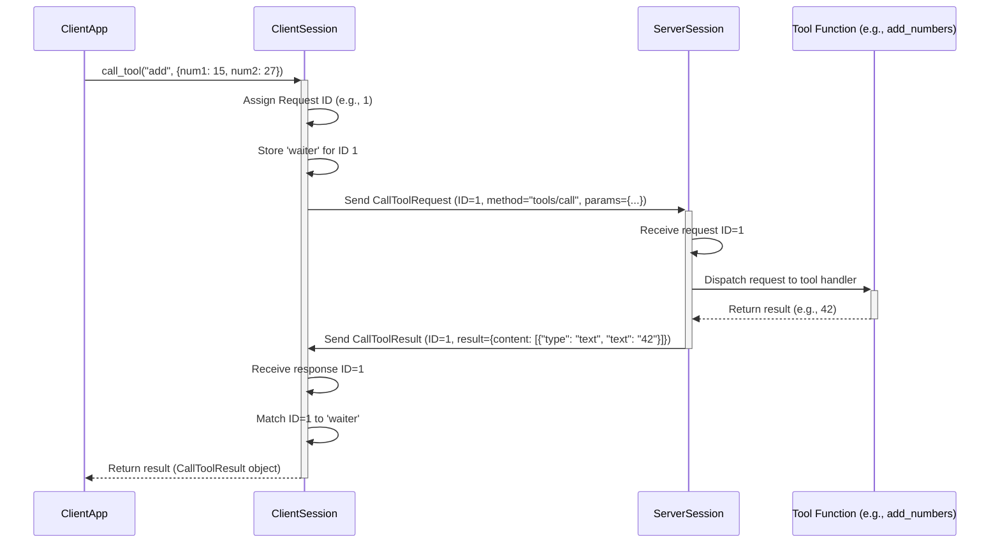

# Chapter 8: Client/Server Sessions (`ClientSession`, `ServerSession`)

Welcome back! In [Chapter 7: MCP Protocol Types](07_mcp_protocol_types.md), we learned about the standardized "digital forms" – the Pydantic models – that define the structure of messages exchanged between an MCP client and server. We saw examples like `CallToolRequest` and `ProgressNotification`.

But knowing the *format* of a letter isn't enough. How does a specific conversation between one client and one server actually happen over time? How does the server know which incoming response belongs to which outgoing request it sent earlier? How is the initial connection "hello" handled?

Imagine you call a large company's support line. You don't just shout into the void; you get connected to a specific operator who handles *your* call from start to finish. This operator keeps track of your requests, finds the answers, and manages the connection until you hang up.

In the `MCP Python SDK`, this "phone line operator" role is played by **Session** objects: `ClientSession` and `ServerSession`.

## What's a Session? The Dedicated Conversation Line

A **Session** object (`ClientSession` or `ServerSession`) manages the state and lifecycle of a **single, ongoing connection** between one MCP client and one MCP server. Think of it as establishing a dedicated phone line for one specific conversation.

This "operator" handles several crucial tasks for that single connection:

1.  **Initialization:** Manages the initial "handshake" where the client and server introduce themselves, agree on the protocol version, and share their capabilities (like saying "Hello, I can do X, Y, and Z").
2.  **Sending & Receiving:** Handles the low-level details of sending outgoing messages (requests, notifications) and receiving incoming messages over the communication channel (like Stdio, WebSockets, etc., which we'll cover in [Chapter 9: Communication Transports](09_communication_transports__stdio__sse__websocket__memory_.md)).
3.  **Request/Response Matching:** When you send a request, it gets a unique ID. When a response comes back later with that same ID, the Session makes sure it's delivered to the part of the code that's waiting for *that specific* answer. It's like the operator remembering who asked which question.
4.  **State Management:** Keeps track of whether the connection is initializing, active, or closed.
5.  **Lifecycle:** Manages the setup and eventual teardown (hang-up) of the connection.

## Two Sides of the Coin: `ClientSession` vs. `ServerSession`

Why are there two types of sessions? Because the client and server have different roles in the conversation:

*   **`ClientSession`**: Represents the *client's* end of the connection. It's primarily responsible for:
    *   *Initiating* the connection and the handshake (`initialize` request).
    *   *Sending* requests to the server (like `callTool`, `readResource`, `getPrompt`).
    *   *Receiving* responses and notifications *from* the server.
    *   Handling server-initiated requests (like asking the client to generate text if the client has that capability).

*   **`ServerSession`**: Represents the *server's* end of the connection. It's primarily responsible for:
    *   *Responding* to the client's `initialize` request.
    *   *Receiving* requests *from* the client.
    *   *Sending* responses and notifications *back* to the client (like tool results, resource content, log messages, progress updates).
    *   Handling client-initiated notifications (like `initialized`).

They use the same underlying mechanisms but have different methods tailored to their role (e.g., `ClientSession` has `call_tool`, `ServerSession` has `send_log_message`).

## How `FastMCP` Uses `ServerSession` (Behind the Scenes)

If you're building a server using `FastMCP` (as we did in chapters [2](02_fastmcp_server___fastmcp__.md) through [6](06_fastmcp_context___context__.md)), you generally **don't interact with `ServerSession` directly**.

When a client connects to your `FastMCP` server:
1.  The underlying transport layer (e.g., Stdio handler) accepts the connection.
2.  `FastMCP` (or its underlying `MCPServer`) automatically creates a `ServerSession` object specifically for that new client connection.
3.  This `ServerSession` handles the initialization handshake with the client.
4.  When the client sends a request (like `callTool`), the `ServerSession` receives it, identifies it, and passes it to the appropriate `FastMCP` handler (which might involve the `ToolManager`).
5.  When your tool function uses `ctx.info()` or `ctx.report_progress()` ([Chapter 6: FastMCP Context (`Context`)](06_fastmcp_context___context__.md)), the `Context` object talks to its associated `ServerSession` to actually send the `LoggingMessageNotification` or `ProgressNotification` back to the client.
6.  The `ServerSession` manages this connection until the client disconnects.

So, `ServerSession` is the hidden engine powering the communication for each connected client in a `FastMCP` server. You benefit from its work without needing to manage it manually.

## When Might You Use `ClientSession`?

You would typically use `ClientSession` if you were writing a standalone Python application that needs to *connect to* and *interact with* an existing MCP server (which might be one you built with `FastMCP` or someone else's).

**Example Scenario: A Simple Client**

*(This is conceptual; we won't build a full client here.)*

Imagine you write a script that needs to ask our `CalculatorServer` ([Chapter 4](04_fastmcp_tools___tool____toolmanager__.md)) to add two numbers.

```python
# --- Conceptual Client Code ---
import anyio
from mcp.client.session import ClientSession
# Assume we have transport streams (read_stream, write_stream)
# connected to the CalculatorServer (more in Chapter 9)

async def run_client():
    # 1. Create a ClientSession using the transport streams
    async with ClientSession(read_stream, write_stream) as session:
        try:
            # 2. Perform the initialization handshake
            init_result = await session.initialize()
            print(f"Connected to: {init_result.serverInfo.name}")

            # 3. Send a 'callTool' request using the session
            tool_result = await session.call_tool(
                name="add",
                arguments={"num1": 15, "num2": 27}
            )

            # 4. Process the result (session handled matching response)
            # Assuming the result is simple text content
            if tool_result.content and tool_result.content[0].type == 'text':
               print(f"Server calculated: {tool_result.content[0].text}") # Expected: 42

        except Exception as e:
            print(f"An error occurred: {e}")

# In a real script, you'd set up the transport and run this async function
# anyio.run(run_client)
```

In this scenario:
1.  We create the `ClientSession`.
2.  We explicitly call `session.initialize()` to start the conversation.
3.  We use `session.call_tool()` to send the request. The `ClientSession` assigns an ID, sends the message, and waits for the specific response with that ID.
4.  The result comes back directly from the `call_tool` method.

## How Sessions Work Under the Hood: The Operator's Workflow

Let's trace the lifecycle and the request/response matching managed by a session. We'll use our phone operator analogy.

1.  **Connection Established:** A communication channel (like Stdio or WebSocket, see [Chapter 9](09_communication_transports__stdio__sse__websocket__memory_.md)) is opened between the client and server.
2.  **Session Creation:** A `ClientSession` is created on the client side, and a `ServerSession` on the server side, both linked to this channel.
3.  **Initialization (Handshake):**
    *   `ClientSession` sends an `InitializeRequest` (like calling and saying "Hi, I'm ClientApp v1.0, I support MCP v0.3, can we talk?"). It assigns this request ID 0.
    *   `ServerSession` receives ID 0. It knows this is the `initialize` method. It checks the protocol version, stores the client's capabilities, and prepares its own info.
    *   `ServerSession` sends back an `InitializeResult` linked to ID 0 (like "Yes, I'm CalculatorServer v1.1, I also support v0.3, here are my capabilities...").
    *   `ClientSession` receives the response for ID 0. It checks the server's info and considers the handshake successful.
    *   `ClientSession` sends an `InitializedNotification` (just saying "Okay, great!").
    *   `ServerSession` receives this notification and marks the session as fully initialized. The line is now open for regular business.
4.  **Client Sends Request:**
    *   `ClientSession` wants to call the `add` tool. It calls `session.call_tool("add", {...})`.
    *   The `ClientSession` assigns a *new* unique ID (e.g., ID 1) to this request.
    *   It stores a "waiting placeholder" (an `anyio` event or future) associated with ID 1.
    *   It sends the `CallToolRequest` message with ID 1 over the channel.
5.  **Server Processes Request:**
    *   `ServerSession` receives the message with ID 1.
    *   It sees it's a `callTool` request for `add`.
    *   It passes the request details to the `FastMCP` handler (which uses the `ToolManager`).
    *   The tool function `add_numbers(15, 27)` runs and returns `42`.
    *   `FastMCP` gets the result.
6.  **Server Sends Response:**
    *   `ServerSession` constructs a `CallToolResult` containing `42`.
    *   It sends this result back over the channel, making sure to include the *original* request ID (ID 1).
7.  **Client Receives Response:**
    *   `ClientSession` receives the message with ID 1.
    *   It looks up ID 1 in its "waiting placeholders".
    *   It finds the placeholder created in step 4 and delivers the received `CallToolResult` to it.
    *   The code that was waiting on `session.call_tool(...)` now receives the result (`42`) and continues execution.
8.  **Notifications (Example: Progress):**
    *   If the server tool called `ctx.report_progress(...)`, the `Context` tells the `ServerSession`.
    *   `ServerSession` constructs a `ProgressNotification` (which doesn't have a request ID, as it's not a response).
    *   `ServerSession` sends the notification.
    *   `ClientSession` receives the notification. It sees it's not a response to a specific request. It might trigger a callback or event handler registered in the client application to update a progress bar.
9.  **Hang-up:** When the connection closes (client exits, server shuts down, network error), the sessions clean up their resources.

**Simplified Sequence Diagram (Client Calls Tool):**



This flow highlights how the session objects act as intermediaries, managing IDs and matching responses back to their original requests.

## Diving into the Code (Briefly!)

You typically won't call these methods directly when using `FastMCP` for servers, but seeing the structure helps understand the session's role. These snippets are heavily simplified.

**Base Class (`shared/session.py`):**

Both `ClientSession` and `ServerSession` inherit from `BaseSession`, which contains the core logic for sending/receiving and request/response matching.

```python
# Simplified from shared/session.py
import anyio
from mcp.types import JSONRPCRequest, JSONRPCResponse, JSONRPCError, ErrorData

class BaseSession:
    def __init__(self, read_stream, write_stream, ...):
        self._read_stream = read_stream
        self._write_stream = write_stream
        self._response_streams = {} # Stores 'waiters' for responses, keyed by request ID
        self._request_id_counter = 0
        # ... other setup ...

    async def send_request(self, request, result_type):
        # 1. Get a new unique ID
        request_id = self._request_id_counter
        self._request_id_counter += 1

        # 2. Create a 'waiter' (memory stream) to receive the response
        response_receiver, response_sender = anyio.create_memory_object_stream(1)
        self._response_streams[request_id] = response_sender

        # 3. Format the request with the ID
        jsonrpc_request = JSONRPCRequest(id=request_id, **request.model_dump())

        # 4. Send it over the write stream
        await self._write_stream.send(JSONRPCMessage(jsonrpc_request))

        # 5. Wait for the response to arrive on the 'waiter' stream
        response_or_error = await response_receiver.receive() # Timeout logic omitted

        # 6. Process response/error and return result
        if isinstance(response_or_error, JSONRPCError):
            raise McpError(response_or_error.error)
        else:
            return result_type.model_validate(response_or_error.result)

    async def _receive_loop(self):
        # Runs in the background, reading from the read_stream
        async for message in self._read_stream:
            if isinstance(message.root, (JSONRPCResponse, JSONRPCError)):
                # It's a response or error for a request we sent
                request_id = message.root.id
                # Find the matching 'waiter' stream
                response_sender = self._response_streams.pop(request_id, None)
                if response_sender:
                    # Send the response back to the waiting send_request call
                    await response_sender.send(message.root)
                else:
                    print(f"Warning: Received response for unknown request ID {request_id}")
            elif isinstance(message.root, JSONRPCRequest):
                # It's a new request *from* the other side
                # Subclasses (Client/ServerSession) handle this differently
                await self._handle_incoming_request(message.root)
            elif isinstance(message.root, JSONRPCNotification):
                 # It's a notification *from* the other side
                 await self._handle_incoming_notification(message.root)
```

This shows the core `send_request` logic (assign ID, store waiter, send, wait) and the `_receive_loop` logic (read message, if response -> find waiter, if request/notification -> handle).

**Server Session (`server/session.py`):**

Adds server-specific logic, like handling the `initialize` request and sending server-to-client notifications.

```python
# Simplified from server/session.py
from mcp.types import InitializeRequest, InitializeResult, InitializedNotification

class ServerSession(BaseSession):
    # ... (init with server info, capabilities) ...
    _initialization_state = InitializationState.NotInitialized
    _client_params = None # Stores client info after initialization

    async def _handle_incoming_request(self, request: JSONRPCRequest):
        # Server specifically handles 'initialize' request first
        if request.method == "initialize":
            # ... (validate request, store client capabilities in self._client_params) ...
            self._initialization_state = InitializationState.Initializing
            init_result = InitializeResult(...) # Build result with server info
            # Respond directly using the base class's internal send method
            await self._send_response(request.id, ServerResult(init_result))
        elif self._initialization_state == InitializationState.Initialized:
            # For other requests, pass them to the main server logic
            # (e.g., to FastMCP's request router) via an internal queue
            await self._pass_request_to_server_handler(request)
        else:
            # Error: Request received before initialization complete
            error = ErrorData(code=..., message="Server not initialized")
            await self._send_response(request.id, error)

    async def _handle_incoming_notification(self, notification: JSONRPCNotification):
        if notification.method == "initialized":
             self._initialization_state = InitializationState.Initialized
             print("ServerSession: Client initialization complete.")
        elif self._initialization_state == InitializationState.Initialized:
            # Pass other notifications to server logic if needed
            pass
        else:
             # Ignore notifications before initialized, or log warning
             pass

    async def send_log_message(self, level, data, logger=None):
        # Helper method to send a specific notification type
        log_notification = LoggingMessageNotification(...)
        await self.send_notification(ServerNotification(log_notification))

    # ... other methods like send_progress_notification, send_resource_updated ...
```

This highlights how `ServerSession` intercepts the `initialize` request and the `initialized` notification to manage the connection state before passing other messages to the main server logic.

## Conclusion

You've now explored `ClientSession` and `ServerSession`, the dedicated operators managing individual communication lines between MCP clients and servers.

*   A **Session** handles the lifecycle of a single connection.
*   It manages the **initialization handshake**.
*   It reliably **sends and receives** messages (requests, responses, notifications).
*   Crucially, it **matches incoming responses to outgoing requests** using unique IDs.
*   **`ClientSession`** is used by clients to initiate connections and send requests *to* servers.
*   **`ServerSession`** is used by servers to handle connections and respond *to* clients.
*   Frameworks like **`FastMCP` manage `ServerSession` automatically** for you; interaction often happens indirectly via the `Context` object.

Sessions provide the robust foundation for the request-response patterns and asynchronous notifications that make MCP communication work.

In the final chapter of this foundational series, we'll look at the different ways these sessions can actually transmit their messages back and forth: the various [Chapter 9: Communication Transports (Stdio, SSE, WebSocket, Memory)](09_communication_transports__stdio__sse__websocket__memory_.md).

---

Generated by [AI Codebase Knowledge Builder](https://github.com/The-Pocket/Tutorial-Codebase-Knowledge)