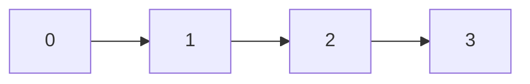
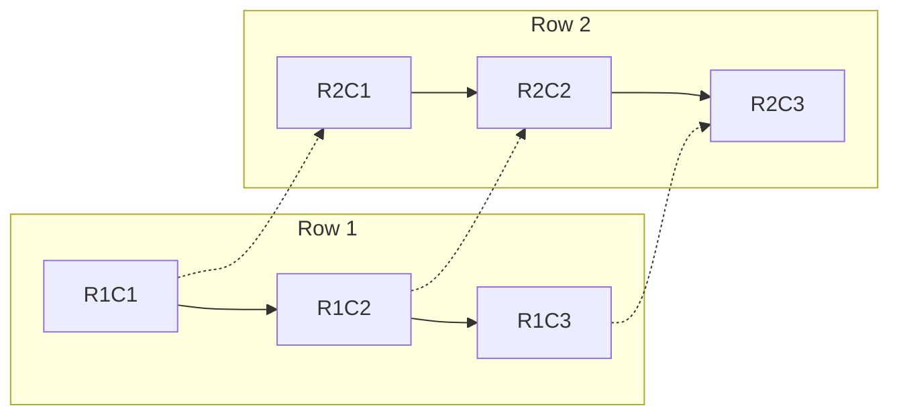
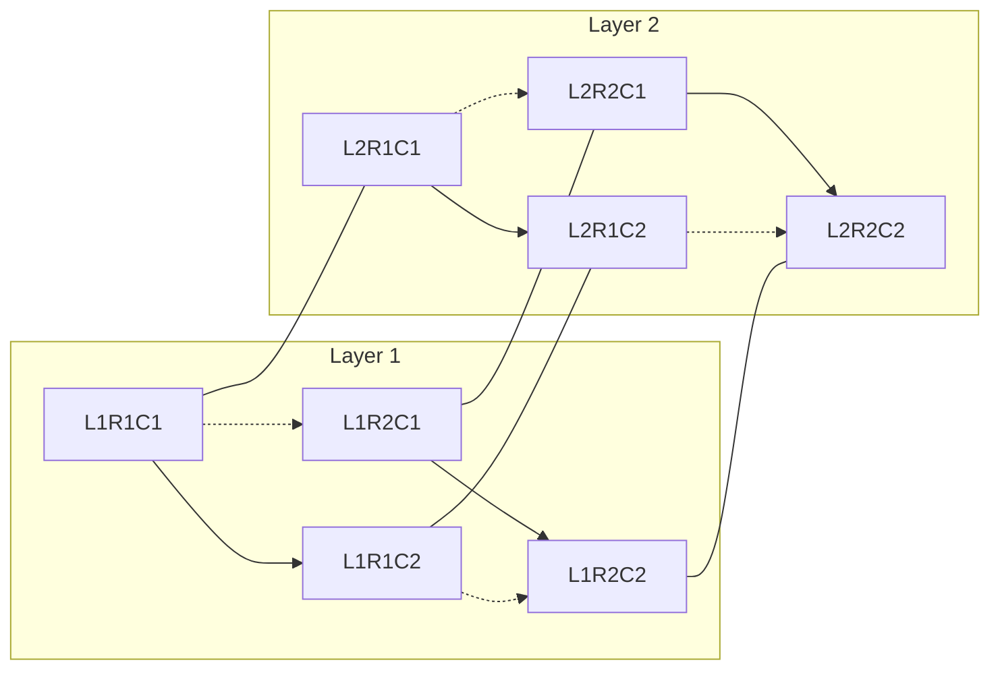
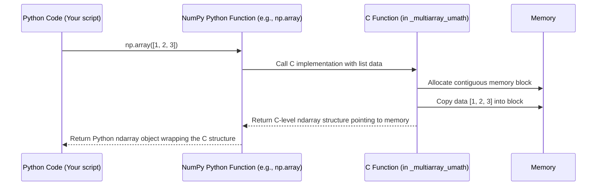

# Chapter 1: ndarray (N-dimensional array)

Welcome to the NumPy Core tutorial! If you're interested in how NumPy works under the hood, you're in the right place. NumPy is the foundation for scientific computing in Python, and its core strength comes from a special object called the `ndarray`.

Imagine you have a huge list of numbers, maybe temperatures recorded every second for a year, or the pixel values of a large image. Doing math with standard Python lists can be quite slow for these large datasets. This is the problem NumPy, and specifically the `ndarray`, is designed to solve.

## What is an ndarray?

Think of an `ndarray` (which stands for N-dimensional array) as a powerful grid or table designed to hold items **of the same type**, usually numbers (like integers or decimals). It's the fundamental building block of NumPy.

*   **Grid:** It can be a simple list (1-dimension), a table with rows and columns (2-dimensions), or even have more dimensions (3D, 4D, ... N-D).
*   **Same Type:** This is key! Unlike Python lists that can hold anything (numbers, strings, objects), NumPy arrays require all elements to be of the *same data type* (e.g., all 32-bit integers or all 64-bit floating-point numbers). This restriction allows NumPy to store and operate on the data extremely efficiently. We'll explore data types more in [Chapter 2: dtype (Data Type Object)](02_dtype__data_type_object_.md).

Analogy: Think of a Python list as a drawer where you can throw anything in – socks, books, tools. An `ndarray` is like a specialized toolbox or an egg carton – designed to hold only specific things (only tools, only eggs) in an organized way. This organization makes it much faster to work with.

Here's a quick peek at what different dimensional arrays look like conceptually:








## Why ndarrays? The Magic of Vectorization

Let's say you have two lists of numbers and you want to add them element by element. In standard Python, you'd use a loop:

```python
# Using standard Python lists
list1 = [1, 2, 3, 4]
list2 = [5, 6, 7, 8]
result = []
for i in range(len(list1)):
  result.append(list1[i] + list2[i])

print(result)
# Output: [6, 8, 10, 12]
```
This works, but for millions of numbers, this Python loop becomes slow.

Now, see how you do it with NumPy ndarrays:

```python
import numpy as np # Standard way to import NumPy

array1 = np.array([1, 2, 3, 4])
array2 = np.array([5, 6, 7, 8])

# Add the arrays directly!
result_array = array1 + array2

print(result_array)
# Output: [ 6  8 10 12]
```
Notice how we just used `+` directly on the arrays? This is called **vectorization**. You write the operation as if you're working on single values, but NumPy applies it to *all* elements automatically.

**Why is this better?**

1.  **Speed:** The looping happens behind the scenes in highly optimized C code, which is *much* faster than a Python loop.
2.  **Readability:** The code is cleaner and looks more like standard mathematical notation.

This ability to perform operations on entire arrays at once is a core reason why NumPy is so powerful and widely used.

## Creating Your First ndarrays

Let's create some arrays. First, we always import NumPy, usually as `np`:

```python
import numpy as np
```

**1. From Python Lists:** The most common way is using `np.array()`:

```python
# Create a 1-dimensional array (vector)
my_list = [10, 20, 30]
arr1d = np.array(my_list)
print(arr1d)
# Output: [10 20 30]

# Create a 2-dimensional array (matrix/table)
my_nested_list = [[1, 2, 3], [4, 5, 6]]
arr2d = np.array(my_nested_list)
print(arr2d)
# Output:
# [[1 2 3]
#  [4 5 6]]
```
`np.array()` takes your list (or list of lists) and converts it into an ndarray. NumPy tries to figure out the best data type automatically.

**2. Arrays of Zeros or Ones:** Often useful as placeholders.

```python
# Create an array of shape (2, 3) filled with zeros
zeros_arr = np.zeros((2, 3))
print(zeros_arr)
# Output:
# [[0. 0. 0.]
#  [0. 0. 0.]]

# Create an array of shape (3,) filled with ones
ones_arr = np.ones(3)
print(ones_arr)
# Output: [1. 1. 1.]
```
Notice we pass a tuple like `(2, 3)` to specify the desired shape. By default, these are filled with floating-point numbers.

**3. Using `np.arange`:** Similar to Python's `range`.

```python
# Create an array with numbers from 0 up to (but not including) 5
range_arr = np.arange(5)
print(range_arr)
# Output: [0 1 2 3 4]
```

There are many other ways to create arrays, but these are fundamental.

## Exploring Your ndarray: Basic Attributes

Once you have an array, you can easily check its properties:

```python
arr = np.array([[1.0, 2.0, 3.0], [4.0, 5.0, 6.0]])

# 1. Shape: The size of each dimension
print(f"Shape: {arr.shape}")
# Output: Shape: (2, 3)  (2 rows, 3 columns)

# 2. Number of Dimensions (ndim): How many axes it has
print(f"Dimensions: {arr.ndim}")
# Output: Dimensions: 2

# 3. Size: Total number of elements
print(f"Size: {arr.size}")
# Output: Size: 6

# 4. Data Type (dtype): The type of elements in the array
print(f"Data Type: {arr.dtype}")
# Output: Data Type: float64
```
These attributes are crucial for understanding the structure of your data. The `dtype` tells you what kind of data is stored (e.g., `int32`, `float64`, `bool`). We'll dive much deeper into this in [Chapter 2: dtype (Data Type Object)](02_dtype__data_type_object_.md).

## A Glimpse Under the Hood

So, how does NumPy achieve its speed? The `ndarray` you manipulate in Python is actually a clever wrapper around a highly efficient data structure implemented in the **C programming language**.

When you perform an operation like `array1 + array2`, Python doesn't slowly loop through the elements. Instead, NumPy:

1.  Checks if the operation is valid (e.g., arrays are compatible).
2.  Hands off the arrays and the operation (`+` in this case) to its underlying C code.
3.  The C code, which is pre-compiled and highly optimized for your processor, performs the addition very rapidly across the entire block of memory holding the array data.
4.  The result (another block of memory) is then wrapped back into a new Python `ndarray` object for you to use.

Here's a simplified view of what happens when you call `np.array()`:



The core implementation lives within compiled C extension modules, primarily `_multiarray_umath`. Python files like `numpy/core/multiarray.py` and `numpy/core/numeric.py` provide the convenient Python functions (`np.array`, `np.zeros`, etc.) that eventually call this fast C code. You can see how `numeric.py` imports functions from `multiarray`:

```python
# From numpy/core/numeric.py - Simplified
from . import multiarray
from .multiarray import (
    arange, array, asarray, asanyarray, # <-- Python functions defined here
    empty, empty_like, zeros # <-- More functions
    # ... many others ...
)

# The `array` function seen in multiarray.py is often a wrapper
# that calls the actual C implementation.
```
This setup gives you the ease of Python with the speed of C. The `ndarray` object itself stores metadata (like shape, dtype, strides) and a pointer to the actual raw data block in memory. We will see more details about the Python modules involved in [Chapter 6: multiarray Module](06_multiarray_module.md) and [Chapter 7: umath Module](07_umath_module.md).

## Conclusion

You've met the `ndarray`, the heart of NumPy! You learned:

*   It's a powerful, efficient grid for storing elements of the **same type**.
*   It enables **vectorization**, allowing fast operations on entire arrays without explicit Python loops.
*   How to create basic arrays using `np.array`, `np.zeros`, `np.ones`, and `np.arange`.
*   How to check key properties like `shape`, `ndim`, `size`, and `dtype`.
*   That the speed comes from an underlying **C implementation**.

The `ndarray` is the container. Now, let's look more closely at *what* it contains – the different types of data it can hold.

Ready to learn about data types? Let's move on to [Chapter 2: dtype (Data Type Object)](02_dtype__data_type_object_.md).

---

Generated by [AI Codebase Knowledge Builder](https://github.com/The-Pocket/Tutorial-Codebase-Knowledge)
