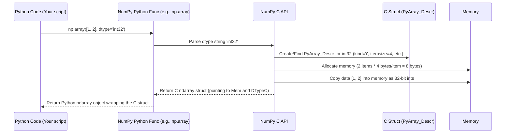

# Chapter 2: dtype (Data Type Object)

In [Chapter 1: ndarray (N-dimensional array)](01_ndarray__n_dimensional_array_.md), we learned that NumPy's `ndarray` is a powerful grid designed to hold items **of the same type**. This "same type" requirement is fundamental to NumPy's speed and efficiency. But how does NumPy know *what kind* of data it's storing? That's where the `dtype` comes in!

## What Problem Does `dtype` Solve?

Imagine you have a list of numbers in Python: `[1, 2, 3]`. Are these small integers? Big integers? Numbers with decimal points? Python figures this out on the fly, which is flexible but can be slow for large datasets.

NumPy needs to be much faster. To achieve speed, it needs to know *exactly* what kind of data is in an array *before* doing any calculations. Is it a tiny integer that fits in 1 byte? A standard integer using 4 bytes? A decimal number needing 8 bytes?

Knowing the exact type and size allows NumPy to:
1.  **Allocate Memory Efficiently:** If you have a million small integers, NumPy can reserve exactly the right amount of memory, not wasting space.
2.  **Perform Fast Math:** NumPy can use highly optimized, low-level C or Fortran code that works directly with specific number types (like 32-bit integers or 64-bit floats). These low-level operations are much faster than Python's flexible number handling.

Think of it like packing boxes. If you know you're only packing small screws (like `int8`), you can use small, efficiently packed boxes. If you're packing large bolts (`int64`), you need bigger boxes. If you just have a mixed bag (like a Python list), you need a much larger, less efficient container to hold everything. The `dtype` is the label on the box telling NumPy exactly what's inside.

## What is a `dtype` (Data Type Object)?

A `dtype` is a special **object** in NumPy that describes the **type** and **size** of data stored in an `ndarray`. Every `ndarray` has a `dtype` associated with it.

It's like specifying the "column type" in a database or spreadsheet. If you set a column to "Integer", you expect only whole numbers in that column. If you set it to "Decimal", you expect numbers with potential decimal points. Similarly, the `dtype` ensures all elements in a NumPy array are consistent.

Let's see it in action. Remember from Chapter 1 how we could check the attributes of an array?

```python
import numpy as np

# Create an array of integers
int_array = np.array([1, 2, 3])
print(f"Integer array: {int_array}")
print(f"Data type: {int_array.dtype}")

# Create an array of floating-point numbers (decimals)
float_array = np.array([1.0, 2.5, 3.14])
print(f"\nFloat array: {float_array}")
print(f"Data type: {float_array.dtype}")

# Create an array of booleans (True/False)
bool_array = np.array([True, False, True])
print(f"\nBoolean array: {bool_array}")
print(f"Data type: {bool_array.dtype}")
```

**Output:**

```
Integer array: [1 2 3]
Data type: int64

Float array: [1.   2.5  3.14]
Data type: float64

Boolean array: [ True False  True]
Data type: bool
```

Look at the `Data type:` lines.
*   For `int_array`, NumPy chose `int64`. This means each element is a 64-bit signed integer (a whole number that can be positive or negative, stored using 64 bits or 8 bytes). The `64` tells us the size.
*   For `float_array`, NumPy chose `float64`. Each element is a 64-bit floating-point number (a number with a potential decimal point, following the standard IEEE 754 format, stored using 64 bits or 8 bytes).
*   For `bool_array`, NumPy chose `bool`. Each element is a boolean value (True or False), typically stored using 1 byte.

The `dtype` object holds this crucial information.

## Specifying the `dtype`

NumPy usually makes a good guess about the `dtype` when you create an array from a list. But sometimes you need to be explicit, especially if you want to save memory or ensure a specific precision.

You can specify the `dtype` when creating an array using the `dtype` argument:

```python
import numpy as np

# Create an array, specifying 32-bit integers
arr_i32 = np.array([1, 2, 3], dtype=np.int32)
print(f"Array: {arr_i32}")
print(f"Data type: {arr_i32.dtype}")
print(f"Bytes per element: {arr_i32.itemsize}") # itemsize shows bytes

# Create an array, specifying 32-bit floats
arr_f32 = np.array([1, 2, 3], dtype=np.float32)
print(f"\nArray: {arr_f32}") # Notice the decimal points now!
print(f"Data type: {arr_f32.dtype}")
print(f"Bytes per element: {arr_f32.itemsize}")

# Create an array using string codes for dtype
arr_f64_str = np.array([4, 5, 6], dtype='float64') # Equivalent to np.float64
print(f"\nArray: {arr_f64_str}")
print(f"Data type: {arr_f64_str.dtype}")
print(f"Bytes per element: {arr_f64_str.itemsize}")
```

**Output:**

```
Array: [1 2 3]
Data type: int32
Bytes per element: 4

Array: [1. 2. 3.]
Data type: float32
Bytes per element: 4

Array: [4. 5. 6.]
Data type: float64
Bytes per element: 8
```

Notice a few things:
1.  We used `np.int32` and `np.float32` to explicitly ask for 32-bit types.
2.  The `.itemsize` attribute shows how many *bytes* each element takes. `int32` and `float32` use 4 bytes, while `float64` uses 8 bytes. Choosing `int32` instead of the default `int64` uses half the memory!
3.  You can use string codes like `'float64'` (or `'f8'`) instead of the type object `np.float64`.

### Common Data Type Codes

NumPy offers various ways to specify dtypes. Here are the most common:

| Type Category      | NumPy Type Objects         | String Codes (Common) | Description                       |
| :----------------- | :------------------------- | :-------------------- | :-------------------------------- |
| **Boolean**        | `np.bool_`                 | `'?'` or `'bool'`     | True / False                      |
| **Signed Integer** | `np.int8`, `np.int16`, `np.int32`, `np.int64` | `'i1'`, `'i2'`, `'i4'`, `'i8'` | Whole numbers (positive/negative) |
| **Unsigned Int**   | `np.uint8`, `np.uint16`, `np.uint32`, `np.uint64` | `'u1'`, `'u2'`, `'u4'`, `'u8'` | Whole numbers (non-negative)    |
| **Floating Point** | `np.float16`, `np.float32`, `np.float64` | `'f2'`, `'f4'`, `'f8'`     | Decimal numbers                   |
| **Complex Float**  | `np.complex64`, `np.complex128` | `'c8'`, `'c16'`    | Complex numbers (real+imaginary)  |
| **String (Fixed)** | `np.bytes_`                | `'S'` + number        | Fixed-length byte strings         |
| **Unicode (Fixed)**| `np.str_`                  | `'U'` + number        | Fixed-length unicode strings      |
| **Object**         | `np.object_`               | `'O'`                 | Python objects                    |
| **Datetime**       | `np.datetime64`            | `'M8'` + unit         | Date and time values              |
| **Timedelta**      | `np.timedelta64`           | `'m8'` + unit         | Time durations                    |

*   The numbers in the string codes (`i4`, `f8`, `u2`) usually represent the number of **bytes**. So `i4` = 4-byte integer (`int32`), `f8` = 8-byte float (`float64`).
*   `'S'` and `'U'` often need a number after them (e.g., `'S10'`, `'U25'`) to specify the maximum length of the string.
*   `'M8'` and `'m8'` usually have a unit like `[D]` for day or `[s]` for second (e.g., `'M8[D]'`). We'll explore numeric types more in [Chapter 4: Numeric Types (`numerictypes`)](04_numeric_types___numerictypes__.md).

Using explicit dtypes is important when:
*   You need to control memory usage (e.g., using `int8` if your numbers are always small).
*   You are reading data from a file that has a specific binary format.
*   You need a specific precision for calculations.

## A Glimpse Under the Hood

How does NumPy manage this `dtype` information internally?

The Python `dtype` object you interact with (like `arr.dtype`) is essentially a wrapper around more detailed information stored in a C structure within NumPy's core. This C structure (often referred to as `PyArray_Descr`) contains everything NumPy needs to know to interpret the raw bytes in the `ndarray`'s memory block:

1.  **Type Kind:** Is it an integer, float, boolean, string, etc.? (Represented by a character like `'i'`, `'f'`, `'b'`, `'S'`).
2.  **Item Size:** How many bytes does one element occupy? (e.g., 1, 2, 4, 8).
3.  **Byte Order:** How are multi-byte numbers stored? (Little-endian `<` or Big-endian `>`. Important for reading files created on different types of computers).
4.  **Element Type:** A pointer to the specific C-level functions that know how to operate on this data type.
5.  **Fields (for Structured Types):** If it's a structured dtype (like a C struct or a database row), information about the names, dtypes, and offsets of each field.
6.  **Subarray (for Nested Types):** Information if the dtype itself represents an array.

When you create an array or perform an operation:



The `dtype` is created or retrieved *once* and then referenced by potentially many arrays. This C-level description allows NumPy's core functions, especially the [ufunc (Universal Function)](03_ufunc__universal_function_.md)s we'll see next, to work directly on the raw memory with maximum efficiency.

The Python code in `numpy/core/_dtype.py` helps manage the creation and representation (like the nice string output you see when you `print(arr.dtype)`) of these `dtype` objects in Python. For instance, functions like `_kind_name`, `__str__`, and `__repr__` in `_dtype.py` are used to generate the user-friendly names and representations based on the underlying C structure's information. The `_dtype_ctypes.py` file helps bridge the gap between NumPy dtypes and Python's built-in `ctypes` module, allowing interoperability.

## Beyond Simple Numbers: Structured Data and Byte Order

`dtype`s can do more than just describe simple numbers:

*   **Structured Arrays:** You can define a `dtype` that represents a mix of types, like a row in a table or a C struct. This is useful for representing structured data efficiently.
    ```python
    # Define a structured dtype: a name (up to 10 chars) and an age (4-byte int)
    person_dtype = np.dtype([('name', 'S10'), ('age', 'i4')])
    people = np.array([('Alice', 30), ('Bob', 25)], dtype=person_dtype)

    print(people)
    print(people.dtype)
    print(people[0]['name']) # Access fields by name
    ```
    **Output:**
    ```
    [(b'Alice', 30) (b'Bob', 25)]
    [('name', 'S10'), ('age', '<i4')]
    b'Alice'
    ```
*   **Byte Order:** Computers can store multi-byte numbers in different ways ("endianness"). `dtype`s can specify byte order (`<` for little-endian, `>` for big-endian) which is crucial for reading binary data correctly across different systems. Notice the `'<i4'` in the output above – the `<` indicates little-endian, which is common on x86 processors.

## Conclusion

You've now learned about the `dtype` object, the crucial piece of metadata that tells NumPy *what kind* of data is stored in an `ndarray`. You saw:

*   `dtype` describes the **type** and **size** of array elements.
*   It's essential for NumPy's **memory efficiency** and **computational speed**.
*   How to **inspect** (`arr.dtype`) and **specify** (`dtype=...`) data types using type objects (`np.int32`) or string codes (`'i4'`).
*   That the Python `dtype` object represents lower-level C information (`PyArray_Descr`) used for efficient operations.
*   `dtype`s can also handle more complex scenarios like **structured data** and **byte order**.

Understanding `dtype`s is key to understanding how NumPy manages data efficiently. With the container (`ndarray`) and its contents (`dtype`) defined, we can now explore how NumPy performs fast calculations on these arrays.

Next up, we'll dive into the workhorses of NumPy's element-wise computations: [Chapter 3: ufunc (Universal Function)](03_ufunc__universal_function_.md).

---

Generated by [AI Codebase Knowledge Builder](https://github.com/The-Pocket/Tutorial-Codebase-Knowledge)