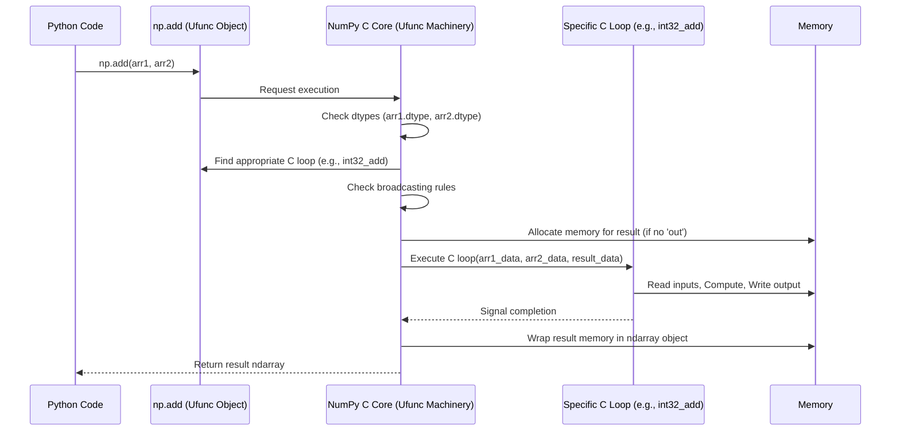

# Chapter 3: ufunc (Universal Function)

Welcome back! In [Chapter 1: ndarray (N-dimensional array)](01_ndarray__n_dimensional_array_.md), we met the `ndarray`, NumPy's powerful container for numerical data. In [Chapter 2: dtype (Data Type Object)](02_dtype__data_type_object_.md), we learned how `dtype`s specify the exact *kind* of data stored within those arrays.

Now, let's tackle a fundamental question: How does NumPy actually *perform calculations* on these arrays so quickly? If you have two large arrays, `a` and `b`, why is `a + b` massively faster than using a Python `for` loop? The answer lies in a special type of function: the **ufunc**.

## What Problem Do ufuncs Solve? Speeding Up Element-wise Math

Imagine you have temperature readings from a sensor stored in a NumPy array, and you need to convert them from Celsius to Fahrenheit. The formula is `F = C * 9/5 + 32`.

With standard Python lists, you'd loop through each temperature:

```python
# Celsius temperatures in a Python list
celsius_list = [0.0, 10.0, 20.0, 30.0, 100.0]
fahrenheit_list = []

# Python loop for conversion
for temp_c in celsius_list:
  temp_f = temp_c * (9/5) + 32
  fahrenheit_list.append(temp_f)

print(fahrenheit_list)
# Output: [32.0, 50.0, 68.0, 86.0, 212.0]
```
This works, but as we saw in Chapter 1, Python loops are relatively slow, especially for millions of data points.

NumPy offers a much faster way using its `ndarray` and vectorized operations:

```python
import numpy as np

# Celsius temperatures in a NumPy array
celsius_array = np.array([0.0, 10.0, 20.0, 30.0, 100.0])

# NumPy vectorized conversion - NO explicit Python loop!
fahrenheit_array = celsius_array * (9/5) + 32

print(fahrenheit_array)
# Output: [ 32.  50.  68.  86. 212.]
```
Look how clean that is! We just wrote the math formula directly using the array. But *how* does NumPy execute `*`, `/`, and `+` so efficiently on *every element* without a visible loop? This magic is powered by ufuncs.

## What is a ufunc (Universal Function)?

A **ufunc** (Universal Function) is a special type of function in NumPy designed to operate on `ndarray`s **element by element**. Think of them as super-powered mathematical functions specifically built for NumPy arrays.

Examples include `np.add`, `np.subtract`, `np.multiply`, `np.sin`, `np.cos`, `np.exp`, `np.sqrt`, `np.maximum`, `np.equal`, and many more.

**Key Features:**

1.  **Element-wise Operation:** A ufunc applies the same operation independently to each element of the input array(s). When you do `np.add(a, b)`, it conceptually does `result[0] = a[0] + b[0]`, `result[1] = a[1] + b[1]`, and so on for all elements.
2.  **Speed (Optimized C Loops):** This is the secret sauce! Ufuncs don't actually perform the element-wise operation using slow Python loops. Instead, they execute highly optimized, pre-compiled **C loops** under the hood. This C code can work directly with the raw data buffers of the arrays (remember, ndarrays store data contiguously), making the computations extremely fast.
    *   **Analogy:** Imagine you need to staple 1000 documents. A Python loop is like picking up the stapler, stapling one document, putting the stapler down, picking it up again, stapling the next... A ufunc is like using an industrial stapling machine that processes the entire stack almost instantly.
3.  **Broadcasting Support:** Ufuncs automatically handle operations between arrays of different, but compatible, shapes. For example, you can add a single number (a scalar) to every element of an array, or add a 1D array to each row of a 2D array. The ufunc "stretches" or "broadcasts" the smaller array to match the shape of the larger one during the calculation. (We won't dive deep into broadcasting rules here, just know that ufuncs enable it).
4.  **Type Casting:** Ufuncs can intelligently handle inputs with different [Chapter 2: dtype (Data Type Object)](02_dtype__data_type_object_.md)s. For instance, if you add an `int32` array and a `float64` array, the ufunc might decide to convert the integers to `float64` before performing the addition to avoid losing precision, returning a `float64` array. This happens according to well-defined casting rules.
5.  **Optional Output Arrays (`out` argument):** You can tell a ufunc to place its result into an *existing* array instead of creating a new one. This can save memory, especially when working with very large arrays or inside loops.

## Using ufuncs

You use ufuncs just like regular Python functions, but you pass NumPy arrays as arguments. Many common mathematical operators (`+`, `-`, `*`, `/`, `**`, `==`, `<`, etc.) also call ufuncs behind the scenes when used with NumPy arrays.

```python
import numpy as np

a = np.array([1, 2, 3, 4])
b = np.array([5, 0, 7, 2])

# Using the ufunc directly
c = np.add(a, b)
print(f"np.add(a, b)  = {c}")
# Output: np.add(a, b)  = [ 6  2 10  6]

# Using the corresponding operator (which calls np.add internally)
d = a + b
print(f"a + b         = {d}")
# Output: a + b         = [ 6  2 10  6]

# Other examples
print(f"np.maximum(a, b) = {np.maximum(a, b)}") # Element-wise maximum
# Output: np.maximum(a, b) = [5 2 7 4]

print(f"np.sin(a)      = {np.sin(a)}") # Element-wise sine
# Output: np.sin(a)      = [ 0.84147098  0.90929743  0.14112001 -0.7568025 ]
```

**Using the `out` Argument:**

Let's pre-allocate an array and tell the ufunc to use it for the result.

```python
import numpy as np

a = np.arange(5)       # [0 1 2 3 4]
b = np.arange(5, 10)   # [5 6 7 8 9]

# Create an empty array with the same shape and type
result = np.empty_like(a)

# Perform addition, storing the result in the 'result' array
np.add(a, b, out=result)

print(f"a = {a}")
print(f"b = {b}")
print(f"result (after np.add(a, b, out=result)) = {result}")
# Output:
# a = [0 1 2 3 4]
# b = [5 6 7 8 9]
# result (after np.add(a, b, out=result)) = [ 5  7  9 11 13]
```
Instead of creating a *new* array for the sum, `np.add` placed the values directly into `result`.

## A Glimpse Under the Hood

So, what happens internally when you call, say, `np.add(array1, array2)`?

1.  **Identify Ufunc:** NumPy recognizes `np.add` as a specific ufunc object. This object holds metadata about the operation (like its name, number of inputs/outputs, identity element if any, etc.).
2.  **Check Dtypes:** NumPy inspects the `dtype` of `array1` and `array2` (e.g., `int32`, `float64`). This uses the `dtype` information we learned about in [Chapter 2: dtype (Data Type Object)](02_dtype__data_type_object_.md).
3.  **Find the Loop:** The ufunc object contains an internal table (a list of "loops"). Each loop is a specific, pre-compiled C function designed to handle a particular combination of input/output `dtype`s (e.g., `int32 + int32 -> int32`, `float32 + float32 -> float32`, `int32 + float64 -> float64`). NumPy searches this table to find the most appropriate C function based on the input dtypes and casting rules. It might need to select a loop that involves converting one or both inputs to a common, safer type (type casting).
4.  **Check Broadcasting:** NumPy checks if the shapes of `array1` and `array2` are compatible according to broadcasting rules. If they are compatible but different, it calculates how to "stretch" the smaller array's dimensions virtually.
5.  **Allocate Output:** If the `out` argument wasn't provided, NumPy allocates a new block of memory for the result array, determining its shape (based on broadcasting) and `dtype` (based on the chosen loop).
6.  **Execute C Loop:** NumPy calls the selected C function. This function iterates through the elements of the input arrays (using pointers to their raw memory locations, respecting broadcasting rules) and performs the addition, storing the result in the output array's memory. This loop is *very* fast because it's simple, compiled C code operating on primitive types.
7.  **Return ndarray:** NumPy wraps the output memory block (either the newly allocated one or the one provided via `out`) into a new Python `ndarray` object ([Chapter 1: ndarray (N-dimensional array)](01_ndarray__n_dimensional_array_.md)) with the correct `shape`, `dtype`, etc., and returns it to your Python code.

Here's a simplified sequence diagram:



**Where is the Code?**

*   The ufunc objects themselves are typically defined in C, often generated by helper scripts like `numpy/core/code_generators/generate_umath.py`. This script reads definitions (like those in the `defdict` variable within the script) specifying the ufunc's name, inputs, outputs, and the C functions to use for different type combinations.
    ```python
    # Snippet from generate_umath.py's defdict for 'add'
    'add':
        Ufunc(2, 1, Zero, # nin=2, nout=1, identity=0
              docstrings.get('numpy._core.umath.add'),
              'PyUFunc_AdditionTypeResolver', # Function for type resolution
              TD('?', cfunc_alias='logical_or', ...), # Loop for bools
              TD(no_bool_times_obj, dispatch=[...]), # Loops for numeric types
              # ... loops for datetime, object ...
              indexed=intfltcmplx # Types supporting indexed access
              ),
    ```
*   The Python functions you call (like `numpy.add`) are often thin wrappers defined in places like `numpy/core/umath.py` or `numpy/core/numeric.py`. These Python functions essentially just retrieve the corresponding C ufunc object and trigger its execution mechanism.
*   The core C machinery for handling ufunc dispatch (finding the right loop), broadcasting, and executing the loops resides within the compiled `_multiarray_umath` C extension module. We'll touch upon these modules in [Chapter 6: multiarray Module](06_multiarray_module.md) and [Chapter 7: umath Module](07_umath_module.md).
*   Helper Python modules like `numpy/core/_methods.py` provide Python implementations for array methods (like `.sum()`, `.mean()`, `.max()`) which often leverage the underlying ufunc's reduction capabilities.
*   Error handling during ufunc execution (e.g., division by zero, invalid operations) can be configured using functions like `seterr` defined in `numpy/core/_ufunc_config.py`, and specific exception types like `UFuncTypeError` from `numpy/core/_exceptions.py` might be raised if things go wrong (e.g., no suitable loop found for the input types).

## Conclusion

Ufuncs are the powerhouses behind NumPy's speed for element-wise operations. You've learned:

*   They perform operations **element by element** on arrays.
*   Their speed comes from executing optimized **C loops**, avoiding slow Python loops.
*   They support **broadcasting** (handling compatible shapes) and **type casting** (handling different dtypes).
*   You can use them directly (`np.add(a, b)`) or often via operators (`a + b`).
*   The `out` argument allows reusing existing arrays, saving memory.
*   Internally, NumPy finds the right C loop based on input dtypes, handles broadcasting, executes the loop, and returns a new ndarray.

Now that we understand how basic element-wise operations work, let's delve deeper into the different kinds of numbers NumPy works with.

Next up: [Chapter 4: Numeric Types (`numerictypes`)](04_numeric_types___numerictypes__.md).

---

Generated by [AI Codebase Knowledge Builder](https://github.com/The-Pocket/Tutorial-Codebase-Knowledge)