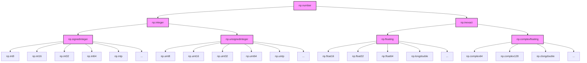
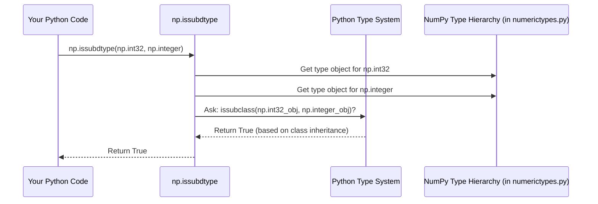

# Chapter 4: Numeric Types (`numerictypes`)

Hello again! In [Chapter 3: ufunc (Universal Function)](03_ufunc__universal_function_.md), we saw how NumPy uses universal functions (`ufuncs`) to perform fast calculations on arrays. We learned that these `ufuncs` operate element by element and can handle different data types using optimized C loops.

But what exactly *are* all the different data types that NumPy knows about? We touched on `dtype` objects in [Chapter 2: dtype (Data Type Object)](02_dtype__data_type_object_.md), which *describe* the type of data in an array (like '64-bit integer' or '32-bit float'). Now, we'll look at the actual **types themselves** – the specific building blocks like `numpy.int32`, `numpy.float64`, etc., and how they relate to each other. This collection and classification system is handled within the `numerictypes` concept in NumPy's core.

## What Problem Do `numerictypes` Solve? Organizing the Data Ingredients

Imagine you're organizing a huge pantry. You have different kinds of items: grains, spices, canned goods, etc. Within grains, you have rice, oats, quinoa. Within rice, you might have basmati, jasmine, brown rice.

NumPy's data types are similar. It has many specific types of numbers (`int8`, `int16`, `int32`, `int64`, `float16`, `float32`, `float64`, etc.) and other kinds of data (`bool`, `complex`, `datetime`). Just having a list of all these types isn't very organized.

We need a system to:
1.  **Define** each specific type precisely (e.g., what exactly is `np.int32`?).
2.  **Group** similar types together (e.g., all integers, all floating-point numbers).
3.  **Establish relationships** between types (e.g., know that an `int32` *is a kind of* `integer`, which *is a kind of* `number`).
4.  Provide convenient **shortcuts or aliases** (e.g., maybe `np.double` is just another name for `np.float64`).

The `numerictypes` concept in NumPy provides this structured catalog or "family tree" for all its scalar data types. It helps NumPy (and you!) understand how different data types are related, which is crucial for operations like choosing the right `ufunc` loop or deciding the output type of a calculation (type promotion).

## What are Numeric Types (`numerictypes`)?

In NumPy, `numerictypes` refers to the collection of **scalar type objects** themselves (like the Python classes `numpy.int32`, `numpy.float64`, `numpy.bool_`) and the **hierarchy** that organizes them.

Think back to the `dtype` object from Chapter 2. The `dtype` object *describes* the data type of an array. The actual type it's describing *is* one of these numeric types (or more accurately, a scalar type, since it includes non-numbers like `bool_` and `str_`).

```python
import numpy as np

# Create an array of 32-bit integers
arr = np.array([10, 20, 30], dtype=np.int32)

# The dtype object describes the type
print(f"Array's dtype object: {arr.dtype}")
# Output: Array's dtype object: int32

# The actual Python type of elements (if accessed individually)
# and the type referred to by the dtype object's `.type` attribute
print(f"The element type class: {arr.dtype.type}")
# Output: The element type class: <class 'numpy.int32'>

# This <class 'numpy.int32'> is one of NumPy's scalar types
# managed under the numerictypes concept.
```

So, `numerictypes` defines the actual classes like `np.int32`, `np.float64`, `np.integer`, `np.floating`, etc., that form the basis of NumPy's type system.

## The Type Hierarchy: A Family Tree

NumPy organizes its scalar types into a hierarchy, much like biological classification (Kingdom > Phylum > Class > Order...). This helps group related types.

At the top is `np.generic`, the base class for all NumPy scalars. Below that, major branches include `np.number`, `np.flexible`, `np.bool_`, etc.

Here's a simplified view of the *numeric* part of the hierarchy:



*   **Abstract Types:** Boxes like `np.number`, `np.integer`, `np.floating` represent *categories* or abstract base classes. You usually don't create arrays directly of type `np.integer`, but you can use these categories to check if a specific type belongs to that group.
*   **Concrete Types:** Boxes like `np.int32`, `np.float64`, `np.complex128` are the specific, concrete types that you typically use to create arrays. They inherit from the abstract types. For example, `np.int32` is a subclass of `np.signedinteger`, which is a subclass of `np.integer`, which is a subclass of `np.number`.

You can check these relationships using `np.issubdtype` or Python's built-in `issubclass`:

```python
import numpy as np

# Is np.int32 a kind of integer?
print(f"issubdtype(np.int32, np.integer): {np.issubdtype(np.int32, np.integer)}")
# Output: issubdtype(np.int32, np.integer): True

# Is np.float64 a kind of integer?
print(f"issubdtype(np.float64, np.integer): {np.issubdtype(np.float64, np.integer)}")
# Output: issubdtype(np.float64, np.integer): False

# Is np.float64 a kind of number?
print(f"issubdtype(np.float64, np.number): {np.issubdtype(np.float64, np.number)}")
# Output: issubdtype(np.float64, np.number): True

# Using issubclass directly on the types also works
print(f"issubclass(np.int32, np.integer): {issubclass(np.int32, np.integer)}")
# Output: issubclass(np.int32, np.integer): True
```
This hierarchy is useful for understanding how NumPy treats different types, especially during calculations where types might need to be promoted (e.g., adding an `int32` and a `float64` usually results in a `float64`).

## Common Types and Aliases

While NumPy defines many specific types (like `np.int8`, `np.uint16`, `np.float16`), you'll most often encounter these:

*   **Integers:** `np.int32`, `np.int64` (default on 64-bit systems is usually `np.int64`)
*   **Unsigned Integers:** `np.uint8` (common for images), `np.uint32`, `np.uint64`
*   **Floats:** `np.float32` (single precision), `np.float64` (double precision, usually the default)
*   **Complex:** `np.complex64`, `np.complex128`
*   **Boolean:** `np.bool_` (True/False)

NumPy also provides several **aliases** or alternative names for convenience or historical reasons. Some common ones:

*   `np.byte` is an alias for `np.int8`
*   `np.short` is an alias for `np.int16`
*   `np.intc` often corresponds to the C `int` type (usually `np.int32` or `np.int64`)
*   `np.int_` is the default integer type (often `np.int64` on 64-bit systems, `np.int32` on 32-bit systems). Platform dependent!
*   `np.single` is an alias for `np.float32`
*   `np.double` or `np.float_` is an alias for `np.float64` (matches Python's `float`)
*   `np.longdouble` corresponds to the C `long double` (size varies by platform)
*   `np.csingle` is an alias for `np.complex64`
*   `np.cdouble` or `np.complex_` is an alias for `np.complex128` (matches Python's `complex`)

You can usually use the specific name (like `np.float64`) or an alias (like `np.double`) interchangeably when specifying a `dtype`.

```python
import numpy as np

# Using the specific name
arr_f64 = np.array([1.0, 2.0], dtype=np.float64)
print(f"Type using np.float64: {arr_f64.dtype}")
# Output: Type using np.float64: float64

# Using an alias
arr_double = np.array([1.0, 2.0], dtype=np.double)
print(f"Type using np.double: {arr_double.dtype}")
# Output: Type using np.double: float64

# They refer to the same underlying type
print(f"Is np.float64 the same as np.double? {np.float64 is np.double}")
# Output: Is np.float64 the same as np.double? True
```

## A Glimpse Under the Hood

How does NumPy define all these types and their relationships? It's mostly done in Python code within the `numpy.core` submodule.

1.  **Base C Types:** The fundamental types (like a 32-bit integer, a 64-bit float) are ultimately implemented in C as part of the [multiarray Module](06_multiarray_module.md).
2.  **Python Class Definitions:** Python classes are defined for each scalar type (e.g., `class int32(signedinteger): ...`) in modules like `numpy/core/numerictypes.py`. These classes inherit from each other to create the hierarchy (e.g., `int32` inherits from `signedinteger`, which inherits from `integer`, etc.).
3.  **Type Aliases:** Files like `numpy/core/_type_aliases.py` set up dictionaries (`sctypeDict`, `allTypes`) that map various names (including aliases like "double" or "int_") to the actual type objects (like `np.float64` or `np.intp`). This allows you to use different names when creating `dtype` objects.
4.  **Registration:** The Python number types are also registered with Python's abstract base classes (`numbers.Integral`, `numbers.Real`, etc.) in `numerictypes.py` to improve interoperability with standard Python type checking.
5.  **Documentation Generation:** Helper scripts like `numpy/core/_add_newdocs_scalars.py` use the type information and aliases to automatically generate parts of the documentation strings you see when you type `help(np.int32)`, making sure the aliases and platform specifics are correctly listed.

When you use a function like `np.issubdtype(np.int32, np.integer)`:



Essentially, `np.issubdtype` leverages Python's standard `issubclass` mechanism, applied to the hierarchy of type classes defined within `numerictypes`. The `_type_aliases.py` file plays a crucial role in making sure that string names or alias names used in `dtype` specifications resolve to the correct underlying type object before such checks happen.

```python
# Simplified view from numpy/core/_type_aliases.py

# ... (definitions of actual types like np.int8, np.float64) ...

allTypes = {
    'int8': np.int8,
    'int16': np.int16,
    # ...
    'float64': np.float64,
    # ...
    'signedinteger': np.signedinteger, # Abstract type
    'integer': np.integer,           # Abstract type
    'number': np.number,             # Abstract type
    # ... etc
}

_aliases = {
    'double': 'float64', # "double" maps to the key "float64"
    'int_': 'intp',      # "int_" maps to the key "intp" (platform dependent type)
    # ... etc
}

sctypeDict = {} # Dictionary mapping names/aliases to types
# Populate sctypeDict using allTypes and _aliases
# ... (code to merge these dictionaries) ...

# When you do np.dtype('double'), NumPy uses sctypeDict (or similar logic)
# to find that 'double' means np.float64.
```

This setup provides a flexible and organized way to manage NumPy's rich set of data types.

## Conclusion

You've now explored the world of NumPy's `numerictypes`! You learned:

*   `numerictypes` define the actual scalar **type objects** (like `np.int32`) and their **relationships**.
*   They form a **hierarchy** (like a family tree) with abstract categories (e.g., `np.integer`) and concrete types (e.g., `np.int32`).
*   This hierarchy helps NumPy understand how types relate, useful for calculations and type checking (`np.issubdtype`).
*   NumPy provides many convenient **aliases** (e.g., `np.double` for `np.float64`).
*   The types, hierarchy, and aliases are managed within Python code in `numpy.core`, primarily `numerictypes.py` and `_type_aliases.py`.

Understanding this catalog of types helps clarify why NumPy behaves the way it does when mixing different kinds of numbers.

Now that we know about the arrays, their data types, the functions that operate on them, and the specific numeric types available, how does NumPy *show* us the results?

Let's move on to how NumPy displays arrays: [Chapter 5: Array Printing (`arrayprint`)](05_array_printing___arrayprint__.md).

---

Generated by [AI Codebase Knowledge Builder](https://github.com/The-Pocket/Tutorial-Codebase-Knowledge)